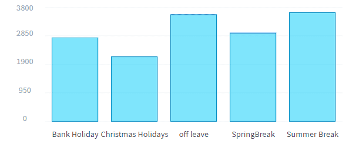
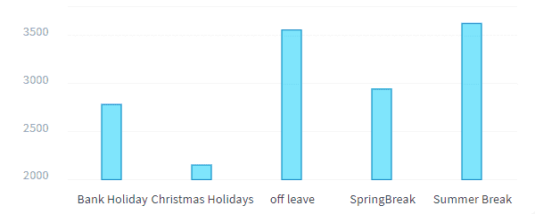
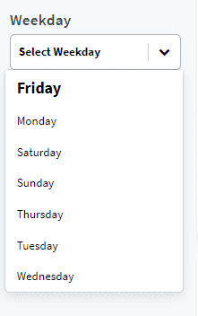

# Create and edit components

In this tutorial, you will learn how to create and edit your first charts, and add them to your dashboards.

* [Create and edit a chart component](en/getting-further/app-dev/component?id=create-and-edit-a-chart-component)
  * [Add a component](en/getting-further/app-dev/component?id=add-a-component)
  * [Edit a chart](en/getting-further/app-dev/component?id=customize-a-chart)
* [Create and edit a dynamic parameter](en/getting-further/app-dev/component?id=create-and-edit-a-dynamic-parameter)

---
## Create and edit a chart component
### Add a component

You can easily add a new component to your Rides Analytics dashboard.
To do so, append this json object to the array *items* in `rides-analytics.json`

```json
{
  "type":"panel",
  "id":"rides-holidays-container",
  "sizeX":37,
  "sizeY":64,
  "row":191,
  "col":38,
  "items":[
    {
      "type":"chart",
      "chart":{
        "id":"chart-6930201",
        "component":"recharts.bar",
        "request":{
          "data":{
            "fields":{
              "avg_rides_per_day_per_station":[
                "select"
              ]
            }
          },
          "scale":{
            "fields":[
              "cat_holiday"
            ]
          }
        },
        "options":{

        }
      },
      "sizeX":100,
      "sizeY":54,
      "row":6,
      "col":0
    },
    {
      "type":"html",
      "content":"Rides variability on Holidays",
      "customclass":"chart-title",
      "sizeX":100,
      "sizeY":5,
      "row":0,
      "col":0
    }
  ]
}
```

This json defines a panel that contains 2 items, the **chart** itself and **its title**.  

A **chart** is a special item that needs a request to work. Once the chart component is loaded, the request is performed and the result is displayed differently according to the chart's type.  
The request has the same format as the [Analytics Manager's queries](/en/product/am/queries/visual). You can also create your request in the Analytics Manager and put the request id instead of the request itself. In this case, you will have to replace `request` by `requestId` in the json above.  

The type of the chart is defined with the `component` key. There are many types of charts available natively in Data Platform, but you can also create your own components, we will show you how to achieve this in the next part of this guide.  
In this example, we've defined a new bar chart using the [recharts](https://recharts.org/en-US/) library. The request computes the average number of rides per day for each holiday.  

Initially, your chart looks like this:



### Customize a chart

Since this chart is made with the recharts library, there are many properties that you can change. 

> The full list is available in [Recharts Bar documentation page](https://recharts.org/en-US/api/BarChart). 
 
To pass these properties from your chart configuration json, you simply have to edit the `options` key relative to this chart.  
For example, to change the size of the bars, add a `barSize` property in the `options` as below:

```json
"options": {
  "barSize": 20
}
```

You can also customize the axes by adding the `xAxis` or  `yAxis` property. You can then pass the properties available in [Recharts Axis documentation page](https://recharts.org/en-US/api/XAxis)  
For example, change the domain and scale of your YAxis:

```json
"options": {
  "barSize": 20,
  "yAxis": {
    "domain": [
      2000,
      3800
    ],
    "scale": "linear"
  }
}
```

After these few changes, your chart looks now like this:



Let's backtrack a minute to the chart configuration file in order to explain the **title configuration**.  
This component is also natively available with Data Platform. It allows you to write HTML code in the `content` property. It will be wrapped in a div. You can associate a custom class to this div by using the `customclass` property.

The html code associated to the json defined above is:

```html
<div class="html chart-title">Rides variability on Holidays</div>
```

?>➡️ Learn more about custom charts in the [**Technical Guide**](en/technical/sdk/app/custom-chart)!

---
## Create and edit a dynamic parameter

A dynamic parameter allows the user to interact with one or more charts by changing their requests on the fly.  

To create a new dynamic parameter, open `config/menus/sidebar.json` and add the following json object to the *containers* object, right above the *footer* item.

```json
  {
    "id": "dyn-weekday",
    "items": [
      {
        "type": "html",
        "content": "Weekday",
        "customclass": "dyn-title"
      },
      {
        "type": "dynamic-parameter",
        "dynamic-parameter": {
          "type": "filter",
          "id": "dynamic-weekday",
          "dictionary": "week_day",
          "component": "selectbox",
          "placeholder": "Select Weekday",
          "multi": true
        },
        "style": {
          "paddingBottom": "10px"
        }
      }
    ]
  }
```

This json defines a dynamic parameter that allows you to filter chart requests by one or more week days.

It follows the same logic as the one followed by charts.

Here, we detail a bit this configuration:
- `type`: indicates how the dynamic parameter will be used, as a filter in this case. It means that any chart associated with this dynamic parameter will see its results be filtered to display only those matching the selected weekdays.
- `dictionary`: sets the field linked to this dynamic-parameter.  
- `component`: sets the component that this dynamic-parameter is associated with, in here, the *selectbox* component.
- `id`: serves to reference this object inside the platform and is commonly used to link this dynamic parameter to charts.
- `placeholder`: specific to the *selectbox* component, specifies the text displayed inside the selectbox by default. 
- `multi`: specific to the *selectbox* component, it's a boolean property that allows selecting several options when set to true.

After copy-pasting the json object above defining this dynamic parameter, your new component should now appear in the sidebar:



To actually use this newly created dynamic-parameter, you have to link it to a chart. 
You can do this by editing the charts configuration.

- Open `config/dashboards/rides-analytics.json`
- In the json object defining the **rides history chart**, append `"dynamic-weekday"` to the dynamic-parameters array.
- Reload your page, your dynamic parameter is now linked to the rides history chart. 
- Select a day to filter the chart by weekday and watch it refresh with new data.

?>➡️ Learn more about dynamic parameters in the [**Technical Guide**](en/technical/sdk/app/dynamic_parameters/index)!

Congratulations! 🎊 🎉 

You have learned how to use existing components. You are now ready to take on [creating your own custom components and use them to make unique dynamic parameters and charts!](/en/getting-further/app-dev/extension.md)
