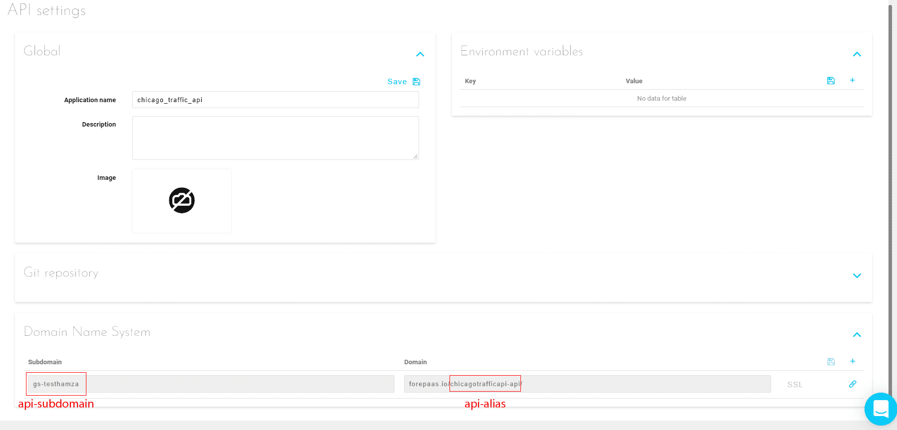
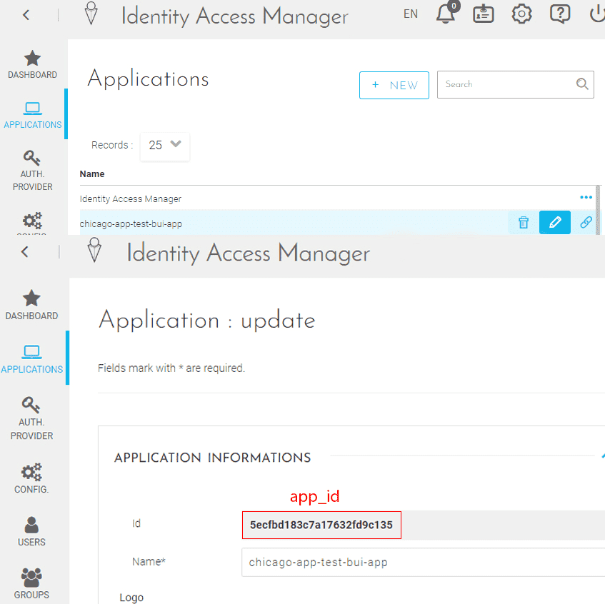
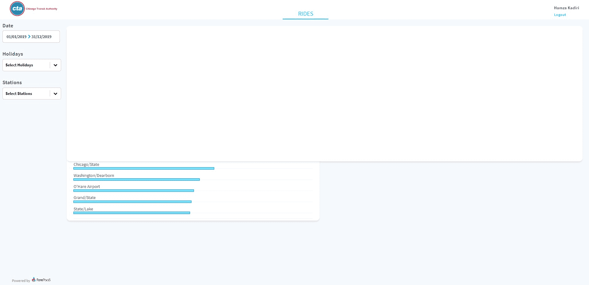
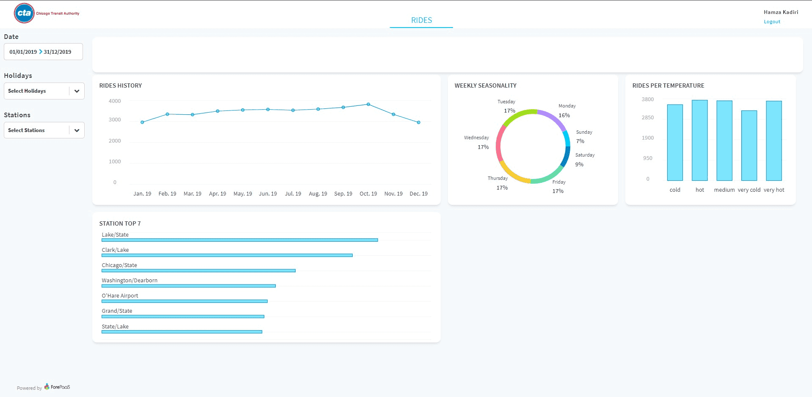
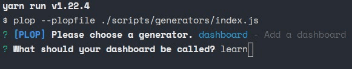
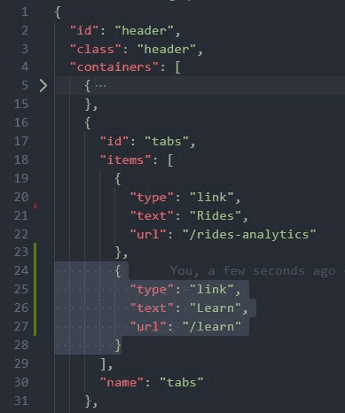
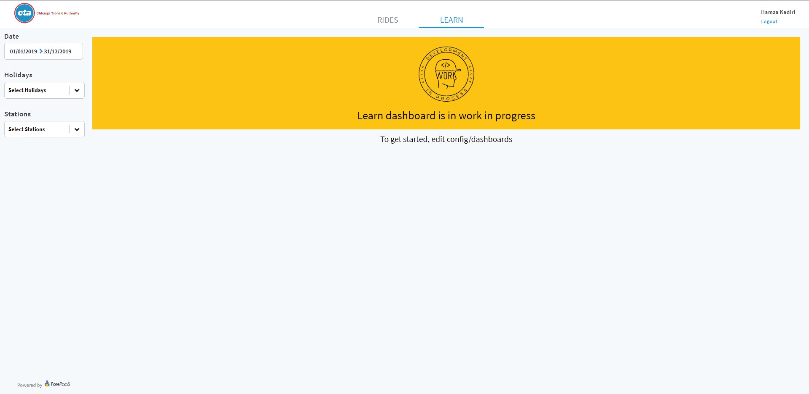

# Discover the app configuration files

It's time to start coding! In this guide, you'll learn the following:

* [Understand application files](#understand-the-app-files)
  * [Understand app architecture](#understand-the-app-architecture)
  * [Understand configuration files](#understand-the-configuration-files)
* [Edit the application](#edit-the-configuration-files)
  * [Overwrite the global configuration file](#overwrite-the-global-configuration-file)
  * [Edit an existing dashboard](#edit-a-dashboard)
  * [Create a new dashboard](#generate-a-dashboard)
* [Add the cat_holiday attribute to your API](#add-the-cat_holiday-attribute-to-your-api)

---
## Understand the app files
### Understand the app architecture

You have now a complete application. Your app tree should look like this:

```bash
├── config
├── node_modules
├── forepaas
├── public
├── scripts
└── src
```

Let's clarify the content of each directory:

- `config`: Here is where most of magic happens. In this folder, you can define and update your configuration files for dashboards, menus, styles, translations etc... The most important file here is `global.json`, it allows you to declare and use all of these configuration files. (explained right after)
- `forepaas`: This is the equivalent of `node_modules` for the platform. It contains all the basic components needed to embed your application to Data Platform. All the packages listed in /forepaas.json are installed here.
- `node_modules` : The node_modules folder contains libraries downloaded from npm. It is based on /package.json.
- `public`: This folder contains all the static files (fonts, icons, images...). You can access a file stored in this folder through this url `/assets/{subfolder}/{name}.{extension}`.  
  For example, the url to access `favicon.png` (and display it in a `` tag) located in `assets/img` is `/assets/img/favicon.png
- `scripts`: This folder contains some useful scripts that you can use to generate components, dashboards or zip this Project to upload it easily on the platform.
- `src`: In this folder, you can create or update your own custom components and services. We will teach you how to do it in the next steps of this tutorial.

### Understand the configuration files  

The global configuration file is `global.json`.

This file represents the entry point of your application.  
It is where you declare your environment variables, routes, dashboards, and many more important fields.

Open `global.json` located in the `config` folder.  
Initially, it looks like this:


```json
{
  "authentication": "{{ENV.CAM_URL}}",
  "api": "{{ENV.API_URL}}",
  "application_name": "{{ENV.APP_NAME || 'ForePaaS'}}",
  "debug": "{{ENV.DEBUG}}",
  "loader": "spinner",
  "lang": "fr",
  "version": 3,
  "storage": {
    "type": "sessionStorage"
  },
  "root": "/rides-analytics",
  "menu": [
    "file://config/menus/header.json",
    "file://config/menus/sidebar.json"
  ],
  "dashboarding": {
    "/rides-analytics": "file://config/dashboards/rides-analytics.json"
  },
  "style": "file://config/style.json",
  "reportings": "file://config/reportings.json",
  "i18n": {
    "en": "file://config/i18n/en.json"
  },
  "formatter": "file://config/formatter.json"
}
```

Let's explain the most important fields below :

- `authentication` : refers to the authentication url, it should have this shape: `https://{api-subdomain}.eu.dataplatform.ovh.net/cam?app_id={app_id}`.  
By default it is defined as an environment variable. It is important to keep it this way to deploy your app on production. Please refer to this [part](#overwrite-the-global-configuration-file-for-local-use) to understand how to overwrite this field for local development purposes.
- `api` : Same as above, but, refers to the api URL, it should have this shape: `https://{api-subdomain}.eu.dataplatform.ovh.net/{api-alias}`.
- `application_name` : Your application title
- `root` : The root path of your application.
- `menu` : An array containing your menus configuration files.  
The header and the sidebar are already defined by default.
- `dashboarding` : An object to define your dashboards. The attribute is the dashboard url, and the value is the dashboard configuration file.
- `style` : The style configuration file. It allows you to style the components.
Some components are already styled there.
- `i18n` : An object to define all your supported languages. The attribute is the language alias, and the value is the translation configuration file associated to the language.
- `formatter` : The formatter configuration file. It allows you to format the data, round numbers, add units, etc...  
Some fields are already formatted by default.


---
## Edit the configuration files

Now that you are more familiar with app architecture, you can finally edit the app!

### Overwrite the global configuration file

The first step is to link your local application to the authentication service and to the API created previously on your Project.
Since we only need these changes to happen locally, we don't want to directly edit `global.json`. We will create another file `global-override.json` to override it instead.

- Create `global-override.json` in the `config` folder
- Copy and paste this json into your new file:

```json
{
    "authentication": "https://{api-subdomain}.eu.dataplatform.ovh.net/cam?app_id={app_id}",
    "api": "https://{api-subdomain}.eu.dataplatform.ovh.net/{api-alias}"
}
```

There are three variables that you need to replace:

- `{api-subdomain}` : Log into the platform, go to your API settings, this variable is referred to as the "Subdomain" in the Domain Name System panel
- `{api-alias}` : This variable can be extracted from the "Domain" by removing `eu.dataplatform.ovh.net/`



- `app_id` : Go to the Identity Access Manager page. In the Application tab, go to edit your app. This variable is referred to as "Id" in the application information.



!> Remember that it is necessary to modify authentication privileges to allow to fetch your online data from your local build. Do it by adding your local host (*http://localhost:3333* by default) to the CORS origin in [*Identity Access Manager*](/en/product/iam/index) > *Settings* > *CORS origin* > *Add*.

Save all files. The locally running app now displays exactly what you had at the end of the Getting Started guide. 🤓

### Edit a dashboard

As you saw in `config.json`, your application already has a dashboard called `rides-analytics`.

In this part, you will see how to edit the dashboard configuration file to change the layout and the positions of the elements.

Let's start by opening `rides-analytics.json` in `config/dashboards`.
You will first create a panel and control the height, the width and the position of an item.

To create a panel, append these few lines to the end of the array `items`
It will be a placeholder for your future search bar, so let's make `search-bar` its id.

```json
{
    "type": "panel",
    "id" : "search-bar",
    "sizeX": 100,
    "sizeY": 100,
    "row": 0,
    "col": 0,
    "items": []
}
```

- *type:* Represents the item's type. It can be a component provided by the Platform by default or a specific component.
- *id:* The id of your item.
- *size X:* Represents the width of the item. The value must be between 0 and 100 as it represents a percentage of the containing item's width.
- *size Y:* Represents the height of the item.
- *row:* Represents the row offset.
- *col:* Represents the column offset.

After adding the panel, the application looks like this:



Now, edit the panel to reduce its height by changing the value of *sizeY* to 19.  
After that, move **all the other panels** to the bottom by changing the value of *row* for each of them. Add 20 to the current value to push down the other panels.  

Don't worry if you get confused, we provide you with the `rides-analytics.json` file as it should be after these changes.

<details><summary>rides-analytics.json</summary>
<p>

```json
{
  "name": "Rides analytics",
  "width": 100,
  "height": 100,
  "margin": [
    10,
    10
  ],
  "description": "",
  "items": [
    {
      "type": "panel",
      "id" : "rides-history-container",
      "sizeX": 49,
      "sizeY": 70,
      "row": 20,
      "col": 0,
      "items": [
        {
          "type": "html",
          "content": "Rides history",
          "customclass": "chart-title"
        },
        {
          "type": "chart",
          "chart": {
            "id": "chart-4992931",
            "component": "recharts.line",
            "request": {
              "data": {
                "fields": {
                  "avg_rides_per_day_per_station": [
                    "select"
                  ]
                }
              },
              "scale": {
                "fields": [
                  "yearmonth"
                ]
              },
              "filter": {},
              "order": {}
            },
            "options": {
              "xAxis": {
                "type": "category"
              }
            },
            "dynamic-parameters": [
              "dynamic-date",
              "dynamic-holidays",
              "dynamic-stations"
            ]
          },
          "sizeX": 100,
          "sizeY": 55,
          "col": 0,
          "row": 9
        }
      ]
    },
    {
      "type": "panel",
      "id" : "weekly-seasonality-container",
      "sizeX": 24,
      "sizeY": 70,
      "row": 20,
      "col": 50,
      "items": [
        {
          "type": "chart",
          "chart": {
            "id": "chart-3259339",
            "component": "recharts.donut",
            "request": {
              "data": {
                "fields": {
                  "avg_rides_per_day_per_station": [
                    "select"
                  ]
                }
              },
              "scale": {
                "fields": [
                  "week_day"
                ]
              }
            },
            "options": {}
          },
          "sizeX": 100,
          "sizeY": 60,
          "row": 5,
          "col": 0
        },
        {
          "type": "html",
          "content": "Weekly seasonality",
          "customclass": "chart-title",
          "sizeX": 93,
          "sizeY": 12,
          "row": 0,
          "col": 0
        }
      ]
    },
    {
      "type": "panel",
      "id" : "top-stations-container",
      "sizeX": 49,
      "sizeY": 70,
      "row": 94,
      "col": 0,
      "items": [
        {
          "type": "chart",
          "chart": {
            "id": "chart-7843335",
            "component": "recharts.bar-horizontal",
            "options": {},
            "request": {
              "data": {
                "limit": 7,
                "fields": {
                  "rides": [
                      "sum"
                  ]
                }
              },
              "scale": {
                "fields": [
                  "station_name"
                ]
              },
              "filter": {},
              "order": {
                "rides": "desc"
              }
            }
          },
          "sizeX": 100,
          "sizeY": 60,
          "row": 6,
          "col": 0
        },
        {
          "type": "html",
          "content": "Station top 7",
          "customclass": "chart-title",
          "sizeX": 100,
          "sizeY": 5,
          "row": 0,
          "col": 0
        }
      ]
    },
    {
      "type": "panel",
      "id" : "rides-temperature-container",
      "sizeX": 24,
      "sizeY": 70,
      "row": 20,
      "col": 75,
      "items": [
        {
          "type": "chart",
          "chart": {
            "id": "chart-6930201",
            "component": "recharts.bar",
            "request": {
              "data": {
                "fields": {
                  "avg_rides_per_day_per_station": [
                    "select"
                  ]
                }
              },
              "scale": {
                "fields": [
                  "cat_temperature"
                ]
              }
            },
            "options": {}
          },
          "sizeX": 100,
          "sizeY": 54,
          "row": 8,
          "col": 0
        },
        {
          "type": "html",
          "content": "Rides per Temperature",
          "customclass": "chart-title",
          "sizeX": 100,
          "sizeY": 8,
          "row": 0,
          "col": 0
        }
      ]
    },
    {
      "type": "panel",
      "id" : "search-bar",
      "sizeX": 100,
      "sizeY": 19,
      "row": 0,
      "col": 0,
      "items": [
      ]
    }
  ],
  "url": "/rides-analytics",
  "path": "",
  "tags": []
}
```

</p>
</details>



While we're at it, let's add another panel as a placeholder for a custom interactive map.  

Either do the adequate edits by yourself or replace your `rides-analytics.json` with the one provided below.

<details><summary>rides-analytics.json</summary>
<p>

```json
{
  "name": "Rides analytics",
  "width": 100,
  "height": 100,
  "margin": [
    10,
    10
  ],
  "description": "",
  "items": [
    {
      "type": "panel",
      "id": "search-bar",
      "sizeX": 100,
      "sizeY": 19,
      "col": 0,
      "row": 0,
      "items": []
    },
    {
      "type": "panel",
      "id": "custom-map",
      "sizeX": 75,
      "sizeY": 99,
      "row": 20,
      "col": 0,
      "items": []
    },
    {
      "type": "panel",
      "id": "top-stations-container",
      "sizeX": 24,
      "sizeY": 99,
      "row": 20,
      "col": 76,
      "items": [
        {
          "type": "chart",
          "chart": {
            "id": "chart-7843335",
            "component": "recharts.bar-horizontal",
            "options": {},
            "request": {
              "data": {
                "limit": 7,
                "fields": {
                  "rides": [
                      "sum"
                  ]
                }
              },
              "scale": {
                "fields": [
                  "station_name"
                ]
              },
              "filter": {},
              "order": {
                "rides": "desc"
              }
            }
          },
          "sizeX": 100,
          "sizeY": 86,
          "row": 6,
          "col": 0
        },
        {
          "type": "html",
          "content": "Station top 7",
          "customclass": "chart-title",
          "sizeX": 100,
          "sizeY": 5,
          "row": 0,
          "col": 0
        }
      ]
    },
    {
      "type": "panel",
      "id": "rides-history-container",
      "sizeX": 75,
      "sizeY": 70,
      "row": 120,
      "col": 0,
      "items": [
        {
          "type": "html",
          "content": "Rides history",
          "customclass": "chart-title"
        },
        {
          "type": "chart",
          "chart": {
            "id": "chart-4992931",
            "component": "recharts.line",
            "request": {
              "data": {
                "fields": {
                  "avg_rides_per_day_per_station": [
                    "select"
                  ]
                }
              },
              "scale": {
                "fields": [
                  "yearmonth"
                ]
              },
              "filter": {},
              "order": {}
            },
            "options": {
              "xAxis": {
                "type": "category"
              }
            },
            "dynamic-parameters": [
              "dynamic-date",
              "dynamic-holidays",
              "dynamic-stations"
            ]
          },
          "sizeX": 100,
          "sizeY": 55,
          "col": 0,
          "row": 9
        }
      ]
    },
    {
      "type": "panel",
      "id": "weekly-seasonality-container",
      "sizeX": 24,
      "sizeY": 135,
      "row": 120,
      "col": 76,
      "items": [
        {
          "type": "chart",
          "chart": {
            "id": "chart-3259339",
            "component": "recharts.donut",
            "request": {
              "data": {
                "fields": {
                  "avg_rides_per_day_per_station": [
                    "select"
                  ]
                }
              },
              "scale": {
                "fields": [
                  "week_day"
                ]
              }
            },
            "options": {}
          },
          "sizeX": 103,
          "sizeY": 61,
          "row": 29,
          "col": 0
        },
        {
          "type": "html",
          "content": "Weekly seasonality",
          "customclass": "chart-title",
          "sizeX": 93,
          "sizeY": 12,
          "row": 0,
          "col": 0
        }
      ]
    },
    {
      "type": "panel",
      "id": "rides-temperature-container",
      "sizeX": 37,
      "sizeY": 64,
      "row": 191,
      "col": 0,
      "items": [
        {
          "type": "chart",
          "chart": {
            "id": "chart-6930201",
            "component": "recharts.bar",
            "request": {
              "data": {
                "fields": {
                  "avg_rides_per_day_per_station": [
                    "select"
                  ]
                }
              },
              "scale": {
                "fields": [
                  "cat_temperature"
                ]
              }
            },
            "options": {}
          },
          "sizeX": 100,
          "sizeY": 54,
          "row": 6,
          "col": 0
        },
        {
          "type": "html",
          "content": "Rides per Temperature",
          "customclass": "chart-title",
          "sizeX": 100,
          "sizeY": 8,
          "row": 0,
          "col": 0
        }
      ]
    }
  ],
  "url": "/rides-analytics",
  "path": "",
  "tags": []
}
```

</p>
</details>

Congratulations! The layout of your rides analytics page is now ready!

Now we'll learn how to add a new dashboard to our application.

### Generate a dashboard

To generate a new dashboard, create a new json file in `config/dashboards`.  
You can speed up the process by using our script

```bash
yarn generate
```

Using the arrow keys choose **dashboard**, then type the name of your new dashboard ("learn" in this case)



To link your dashboard to your app, edit `global.json` by adding a new entry in the *dashboarding* section.

```json
"/learn": "file://config/dashboards/learn.json"
```

The key represents the url path of your new dashboard.  
The value represents the path to the .json file associated with this dashboard.

Your new dashboard page should now be accessible here: [localhost:3333/#/learn](localhost:3333/#/learn)

As a last step, let's add a new link tab next to "Rides" in the header.

To do so, go to `config/menus/header.json` and add this entry in the *items* array of the *tabs* container right below the "Rides" item:

```json
{
  "type": "link",
  "text": "Learn",
  "url": "/learn"
}
```





---
## Add the cat_holiday attribute to your API

You may notice that the **Rides variability on Holidays** chart isn't displayed correctly. That is the case because, if you followed the [Getting Started guide](en/getting-started/app-init/index), you have no exposed query relating holidays to the number of rides.

In the app template provided to you, that query is named *cat_holiday*. We encourage you to try to understand why this problem appears by looking into the *rides_analytics.json* file for mentions of the query name.

To address this, you have to:
- Add a string attribute named *cat_holiday* to the Mart table *dataset_history*.
- Build the *dataset_history* table and generate the respective DPE Action again.
- In the DPE, change the table's Aggregate Action to correct create the *cat_holiday* attribute with the code below.

```SQL
CASE 
WHEN chicago_calendar_full.christmas_holidays=1 THEN 'Christmas Holidays'
WHEN chicago_calendar_full.summer_holidays=1 THEN 'Summer Break'
WHEN chicago_calendar_full.spring_holidays=1 THEN 'SpringBreak'
WHEN chicago_calendar_full.public_holiday=1 THEN 'Bank Holiday'
WHEN chicago_calendar_full.autumn_holidays=1 THEN 'Fall Holidays'
WHEN chicago_calendar_full.sport_holidays=1 THEN 'Sport Holidays'
ELSE 'off leave'
END
 ```

- Run the respective workflow again.
- Flush the cache in the API Manager component.

Now, just rerun your app and the **Rides variability on Holidays** chart should be looking good.

---
## You're making good progress!

You are now familiar with the app architecture and how to work on it locally.  
Let's introduce the topic of the next page: customizing your application. There are several ways you can use to style your components:

- Use [style templates](/en/technical/sdk/app/charts/template): It allows you to define templates which will be applied by default.
- Style at the component level: The style will be only applied to a specific component. You can achieve this by passing some props when declaring a chart or a dynamic parameter.  
Example: Go to `config/dashboards/rides-analytics.json` and see the options field inside the line chart inside *rides-history-container* panel.
- Style at the module level (for dynamic parameter only): The style will be applied to all the dynamic parameter of this type.
Example: properties passed inside `select-box` in `style.json`

> **Note**: We recommend you use [style templates](/en/technical/sdk/app/charts/template) for charts and `style.json` for dynamic parameters.

> **Deprecated for chart**:
- Style at the module level (eg. recharts): The style will be applied to all the components of the module.  
Example: properties passed inside `recharts` in `style.json`
- Style at the component type level (eg. recharts-bar): The style will be applied to all the components that share the specified component type  
Example: properties passed inside `recharts-bar` in `style.json`

Ready to take on this challenge? 🧗🏽‍♂️ Let's learn how to create and edit charts!


?> ➡️ [Edit and create custom charts](/en/getting-further/app-dev/component.md)