# Add custom components

With the React framework, you can **create your own components** from scratch. These components can be used for two things: [dynamic parameters](en/getting-further/app-dev/extension?id=use-a-custom-component-as-a-dynamic-parameter) and [charts](en/getting-further/app-dev/extension?id=use-a-custom-component-as-a-chart).

In this guide, you will go through the following:

* [The dynamic parameter use case](en/getting-further/app-dev/extension?id=use-a-custom-component-as-a-dynamic-parameter)
  * [Create a component](en/getting-further/app-dev/extension?id=generate-a-component)
  * [Edit a component](en/getting-further/app-dev/extension?id=edit-a-component)
  * [Create a second dynamic parameter](en/getting-further/app-dev/extension?id=adding-a-search-bar)
* [The chart use case](en/getting-further/app-dev/extension?id=use-a-custom-component-as-a-chart)
* [Publish your local app on Data Platform](en/getting-further/app-dev/extension?id=publish-your-app-on-data-platform)
  * [Using a zip file](en/getting-further/app-dev/extension?id=import-your-app-as-a-zip-file)
  * [Using git](en/getting-further/app-dev/extension?id=connect-your-app-to-a-git-repository)

?> At any point, feel free to refer to the [**Technical Guide**](en/technical/sdk/app/custom-component) 🔧 to learn more about custom components!

---
## Use a custom component as a dynamic parameter

### Generate a component

Let's see how to create a custom component and how to use it as a dynamic parameter.

As an example, we will show step-by-step you how to create this checkbox group component:

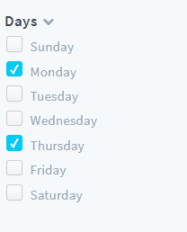

To generate a component, you can use our pre-build script by running the command below:

```bash
yarn generate
```

Select the **component** generator, name it `DynamicParameterCheckbox` and answer "No" to the last question as shown below:

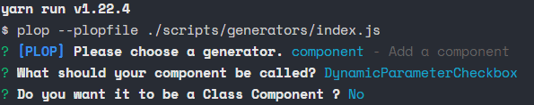

!> It is important that your component name starts with **DynamicParameter** to register it as a dynamic parameter

This script generates a folder in `src/components` containing three files :

- `DynamicParameterCheckbox.jsx`
- `DynamicParameterCheckbox.less`
- `index.js`

### Declare a component

Before you start working on the component itself let's take a minute to see how to declare it and use it.

Follow these steps to declare the new component:

- Go to `src/components/index.js`
- Import the component by adding this line at the top of the file :

  ```js
  import DynamicParameterCheckbox from "./DynamicParameterCheckbox";
  ```

- Declare it by adding its name to the components object

  ```js
    components: {
        ...
        DynamicParameterCheckbox
  },
  ```

You can now call this component in your configuration files by specifying its **alias**. To obtain a component alias, transform its name from camelCase to kebab-case (`DynamicParameterCheckbox` becomes `dynamic-parameter-checkbox`), then remove "dynamic-parameter" and/or "chart" from it.  

Here, the component's alias is `checkbox`. Now go to `config/menus/sidebar.json` and change the *component* property of *dynamic-weekday* to `"checkbox"` (i.e. the alias).

Go to your application page, notice that **the dynamic-weekday component has changed**.

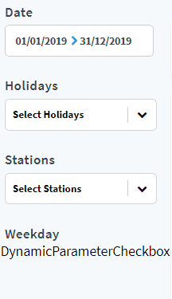

Don't worry if it doesn't work right now, its behavior will be set in the next section.

### Edit a component

The framework used in this guide is going to be React. 

> We will guide you step by step to make your components, but if you are having any trouble because you are not familiar with this framework you can check the documentation [here](https://reactjs.org/docs/getting-started.html). 🆘  
Also, since we are working with functional components, we will use one of latest features available, **React Hooks**. You can check this [page](https://reactjs.org/docs/hooks-intro.html) for more information.

Let's start editing `DynamicParameterCheckbox.jsx`

Since this component is declared as a dynamic-parameter, some props are already automatically passed to it by Platforms data flow logic. These props can be logged when the component renders the first time, by making use of the [useEffect](https://reactjs.org/docs/hooks-reference.html#useeffect) hook.

Start by importing `useEffect` and `useState` (you will need this one later) by changing the first line of the file:

```js
import React, { useEffect, useState } from "react";
```

Then add `props` to the arguments of the functional component:

```jsx
const DynamicParameterCheckbox = (props) => {
```

Finally, add the useEffect hook inside this function right before the return statement.

Your functional component should be defined as below:

```jsx
const DynamicParameterCheckbox = props => {
  useEffect(() => {
    console.log(props);
  }, []);

  return <div>DynamicParameterCheckbox</div>;
};
```

Open your browser's console panel, you should be able to see the props.

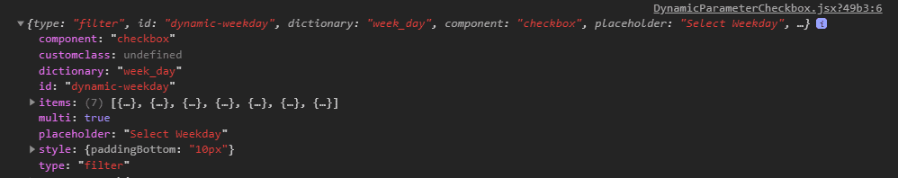

As you can see, most of these props are passed in `sidebar.json` when defining the dynamic-parameter.  
The only exception is `items` which is the result of an internal request querying the field specified in `dictionary` (`week_day` in this case)

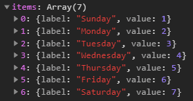

Now let's create the checkboxes.

To achieve this, you will need to install a small package: `react-checkbox-group`. Do so by running:

```bash
yarn add react-checkbox-group
```

This package allows you to use a checkbox group component. You can now import it by adding this line at the top of the file:

```js
import CheckboxGroup from "react-checkbox-group";
```

Add a boolean variable `expanded` to the component state to be able to display or hide the `CheckboxGroup` with a little arrow icon:

```js
const DynamicParameterCheckbox = (props) => {
  const [expanded, setExpanded] = useState(true)
  ...
```

Change the function return statement like this:

```jsx
<div>
  <div className="dyn-title checkbox-header">
    {props.title}
    <i
      onClick={() => setExpanded(!expanded)}
      className={`fa fa-chevron-${expanded ? "down" : "right"} expand-icon`}
    />
  </div>
  {expanded && (
    <CheckboxGroup name="options">
      {Checkbox => (
        <React.Fragment>
          {props.items.map(option => (
            <div key={option.value}>
              <label className="dyn-checkbox-container" htmlFor={option.value}>
                <Checkbox
                  className="dyn-checkbox"
                  id={option.value}
                  value={option.value}
                />
                <span className="dyn-checkbox-label">{option.label}</span>
              </label>
            </div>
          ))}
        </React.Fragment>
      )}
    </CheckboxGroup>
  )}
</div>
```

The title section is using *props.title*. This means that you need to pass a `title` prop in **dynamic-weekday** definition in `config/menus/sidebar.json`, as shown below: (the HTML element has also been removed since it's now redundant)

```json
{
  "id": "dyn-weekday",
  "items": [
    {
      "type": "dynamic-parameter",
      "dynamic-parameter": {
        "type": "filter",
        "id": "dynamic-weekday",
        "dictionary": "week_day",
        "component": "checkbox",
        "title": "Days"
      },
      "style": {
        "paddingBottom": "10px"
      }
    }
  ]
}
```

Finally, style your component by changing `DynamicParameterCheckbox.less`, using the code snippet below.

<details><summary>DynamicParameterCheckbox.less</summary>
<p>

```less
// DynamicParameterCheckbox stylesheet

@import "../../styles/_variables.less";

.checkbox-header {
  display: flex;
  flex-direction: row;
  align-items: center;
}

.dyn-checkbox-container {
  display: flex;
  align-items: flex-end;
  margin: 3px;
}

.dyn-checkbox {
  -webkit-appearance: none;
  background-color: #fafafa;
  border: 1px solid #cacece;
  box-shadow: 0 1px 2px rgba(0, 0, 0, 0.05), inset 0px -15px 10px -12px rgba(0, 0, 0, 0.05);
  padding: 7px;
  border-radius: 3px;
  display: inline-block;
  position: relative;
}

.dyn-checkbox:hover {
  cursor: pointer;
  box-shadow: 0 1px 2px @primary-color, inset 0px 1px 3px @primary-color;
  border: 1px solid @primary-color;
}

.dyn-checkbox:active,
.dyn-checkbox:checked:active {
  box-shadow: 0 1px 2px @primary-color, inset 0px 1px 3px @primary-color;
}

.dyn-checkbox:checked {
  background-color: @primary-color;
  border: 1px solid @primary-color;
  box-shadow: 0 1px 2px @primary-color, inset 0px -15px 10px -12px
      @primary-color, inset 15px 10px -12px @primary-color;
  color: white;
}

.dyn-checkbox:checked:after {
  content: "\2714";
  font-size: 12px;
  position: absolute;
  top: -1px;
  left: 2px;
  color: white;
}

.dyn-checkbox-label {
  cursor: pointer;
  font-family: "Source Sans Pro";
  font-size: 14px;
  letter-spacing: 0;
  color: #97a7b7;
  line-height: 17px;
  margin-left: 5px;
}

.fa.expand-icon {
  color: #97a7b7;
  font-size: 12px;
  cursor: pointer;
  margin-left: 5px;
}

.fa.expand-icon:hover {
  color: #3e4550;
  cursor: pointer;
}
```

</p>
</details>

Your dynamic-parameter looks good now, but it's not working properly yet.

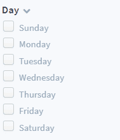

There is a problem, you cannot check any box!  

The reason is that you need to bind CheckboxGroup to our dynamic-parameter component. To do so, you have to add an array to the state of your component. It will keep track of the selected options, so name it `selectedOptions`:

```javascript
const DynamicParameterCheckbox = (props) => {
  const [expanded, setExpanded] = useState(true)
  const [selectedOptions, setSelectedOptions] = useState([])
  ...
```

Add a function `onChange` to update the array you have just defined:

```javascript
const onChange = options => {
  setSelectedOptions(options);
};
```

Finally, you need to add the two properties (`onChange` and `value`, an array containing `selectedOptions`) to CheckboxGroup. Bind them by changing the return statement:

```js
return (
  ...
  <CheckboxGroup name='options' value={selectedOptions} onChange={onChange}>
  ...
```
Almost there! 🚴‍♂️

The last step is to bind this dynamic-parameter to the [redux global store](https://redux.js.org/api/store) to allow it to affect charts requests. Add these lines to the imports at the top of the file:

```js
import { connect } from "react-redux";
import { set } from "forepaas/store/querystring/action";
```

Then connect this component to the global store by **replacing** the last line of the file:

```javascript
export default connect(state => ({ querystring: state.querystring }))(
  DynamicParameterCheckbox
);
```

Inside your `DynamicParameterCheckbox` functional component, create a helper function `updateModel` to dispatch your actions to the global store:

```js
const updateModel = model => {
  if (props.id) {
    let value = model.map(item => (item && item.value ? item.value : item));
    props.dispatch(set(props.id, value.length ? value : null));
  }
};
```

Then, update your `onChange` function to call `updateModel`:

```js
const onChange = options => {
  setSelectedOptions(options);
  updateModel(options);
};
```

Your dynamic parameter is now connected to the global store. You can make sure of this because the charts connected to `dynamic-weekday` are affected by this dynamic parameter.

To ensure the dynamic parameter state is loaded when the page is refreshed, just change the `useEffect` hook like this:

```js
useEffect(() => {
  const selectedOptions = props.querystring[props.id] || [];
  setSelectedOptions(selectedOptions);
}, [props.items]);
```

Congratulations! You've made your first custom dynamic parameter.  
If you got lost 😪along the way, no worries. You can find the final code [here](https://github.com/forepaas/getting-started/tree/release/advanced/src/components/DynamicParameterCheckbox).


### Adding a search bar
Let's add a second dynamic parameter to be able to filter by station.

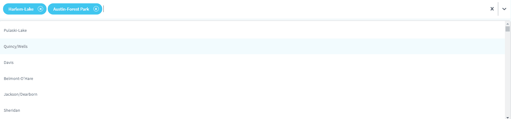

Generate a new component:

```bash
yarn generate
```

Select the **component** generator. Name it `DynamicParameterAutocompleteBox` and answer "No" to the last question.

Change the content of the newly generated .jsx file to this:

<details><summary>DynamicParameterAutocompleteBox.jsx</summary>
<p>

```jsx
import React, { useState, useEffect } from "react";
import { connect } from "react-redux";
import Select from "react-select";
import { set } from "forepaas/store/querystring/action";

const searchIcon = () => ({
  alignItems: "center",
  display: "flex",
  ":before": {
    fontFamily: "FontAwesome",
    content: '"\f002"',
    marginRight: 8
  }
});

const customStyles = {
  control: (base, state) => ({
    ...base,
    height: "57px",
    borderWidth: "0px",
    boxShadow: "5px 5px -2px rgba(0, 0, 0, 0.1)"
  }),
  option: (base, state) => ({
    ...base,
    color: state.theme.colors.neutral50,
    fontSize: "13px",
    height: "48px",
    display: "flex",
    alignItems: "center",
    fontWeight: 500,
    letterSpacing: 0
  }),
  menu: (base, state) => ({
    ...base,
    zIndex: 2000
  }),
  multiValue: (base, state) => ({
    ...base,
    borderRadius: "21px",
    backgroundColor: state.theme.colors.primary75,
    color: state.theme.colors.neutral0,
    height: "34px",
    alignItems: "center"
  }),
  multiValueLabel: (base, state) => ({
    ...base,
    color: state.theme.colors.neutral0,
    display: "flex",
    alignItems: "center",
    marginLeft: "10px",
    fontWeight: 600,
    letterSpacing: 0
  }),
  placeholder: (base, state) => ({
    ...base,
    color: state.theme.colors.neutral20,
    fontSize: "14px",
    ...searchIcon()
  }),
  multiValueRemove: (base, state) => {
    return {
      ...base,
      color: state.theme.colors.neutral0,
      borderRadius: "10px",
      padding: "0px",
      margin: "10px",
      border: `1px solid ${state.theme.colors.neutral0}`,
      ":hover": {
        backgroundColor: state.theme.colors.neutral0,
        color: state.theme.colors.primary75,
        cursor: "pointer"
      }
    };
  }
};

const DynamicParameterAutocompleteBox = ({ items, ...props }) => {
  const [selectedOptions, setSelectedOptions] = useState([]);

  const customTheme = theme => ({
    ...theme,
    colors: {
      ...theme.colors,
      primary: props.primaryColor || "#00CCF9",
      primary25: props.primary25Color || "rgba(16,182,233,0.06)",
      primary50: props.primary50Color || "rgba(16,182,233,0.20)",
      primary75: props.primary75Color || "rgba(16,182,233,0.8)",
      neutral20: props.placeholderColor || "#97A7B7",
      neutral50: props.menuColor || "#485465"
    }
  });

  useEffect(() => {
    const selectedValues = props.querystring[props.id] || [];
    const mappedOptions = items.filter(item =>
      selectedValues.includes(item.value)
    );
    setSelectedOptions(mappedOptions);
  }, [items]);

  const updateModel = model => {
    if (props.id) {
      let selectedValues =
        model && model.length
          ? model.map(item => (item && item.value ? item.value : item))
          : [];
      props.dispatch(
        set(props.id, selectedValues.length ? selectedValues : null)
      );
    }
  };

  const onChange = options => {
    setSelectedOptions(options);
    updateModel(options);
  };

  return (
    <Select
      value={selectedOptions}
      styles={customStyles}
      theme={customTheme}
      options={items}
      isMulti={props.isMulti}
      placeholder={props.placeholder}
      onChange={onChange}
    />
  );
};

export default connect(state => ({ querystring: state.querystring }))(
  DynamicParameterAutocompleteBox
);
```

</p>
</details>

[Declare it](#declare-a-component) in `src/components/index.js`
by importing your new component and adding it to the `components` object defined in the file.

Go to `config/dashboards/rides-analytics.json`, look for the panel whose id is `search-bar` and **replace it with a dynamic-parameter** as such:

```json
{
  "type": "dynamic-parameter",
  "id": "search-bar",
  "dynamic-parameter": {
    "type": "filter",
    "id": "dynamic-stations",
    "component": "autocomplete-box",
    "placeholder": "Search for a station",
    "isMulti": true,
    "dictionary": "station_id"
  },
  "sizeX": 100,
  "sizeY": 19,
  "col": 0,
  "row": 0,
  "items": []
}
```

Finally, remove the whole *dyn-stations* object from `config/menus/sidebar.json`, as it is redundant with the new search bar.

---
## Use a custom component as a chart

In this section, you will learn how to create a custom component and how to use it as a chart.

As an example, you will create an interactive map component using [react-leaflet](https://react-leaflet.js.org/) library. The final result will look like this:

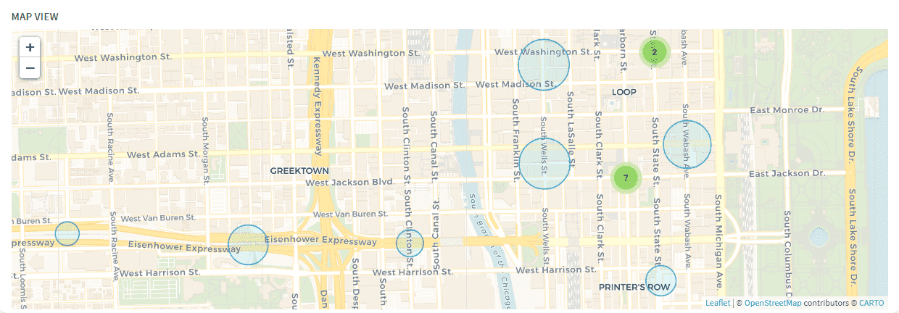

Let's start by creating the component using the script as usual.

```bash
yarn generate
```

Select the **component** generator, name it `ChartMap` and answer "No" to the last question.

!> It is important that your chart component name starts with 'Chart', so it is recognized and registered properly.

[Declare it](#declare-a-component) in `src/components/index.js`.

You can now use it in your analytics dashboard. Go to `rides-analytics.json`, and add the new chart and its title to the `custom-map` panel:

```json
{
  "type": "panel",
  "id": "custom-map",
  "sizeX": 75,
  "sizeY": 99,
  "row": 20,
  "col": 0,
  "items": [
    {
      "type": "html",
      "content": "Map view",
      "customclass": "chart-title",
      "sizeX": 100,
      "sizeY": 5
    },
    {
      "type": "chart",
      "chart": {
        "id": "chart-map",
        "component": "map",
        "dynamic-parameters": [
          "dynamic-date",
          "dynamic-holidays",
          "dynamic-stations",
          "dynamic-weekday"
        ],
        "request": {
          "data": {
            "fields": {
              "rides": ["avg"]
            }
          },
          "scale": {
            "fields": ["station_id", "station_name", "lat", "lng"]
          },
          "filter": {},
          "order": {}
        }
      },
      "sizeX": 100,
      "sizeY": 88,
      "row": 6,
      "col": 0
    }
  ]
}
```

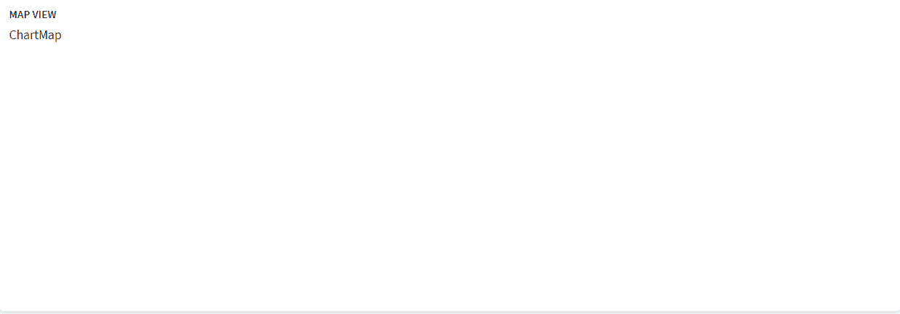

Like dynamic-parameters, charts also automatically receive some properties when they are mounted. Let's see what they look like.

As usual, import `useEffect` and `useState` by **changing the first line** of the `ChartMap.jsx` file:

```jsx
import React, { useEffect, useState } from "react";
```

Then add `props` to the arguments of the functional component:

```jsx
const ChartMap = (props) => {
```

Finally, add a useEffect hook inside this function right before the return statement.

Your final functional component should look like this:

```jsx
const ChartMap = props => {
  useEffect(() => {
    console.log(props);
  }, []);
  return <div>ChartMap</div>;
};
```

Open your browser's console panel, you should be able to see the props passed to this component.

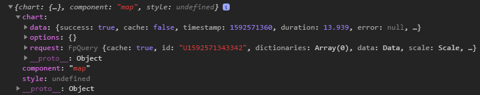

Most of these props come from the chart definition in `config/dashboards/rides-analytics.json`.  
The exception is `data` which is a JSON representing the result of the request associated with the chart. This JSON is meant to be as generic as possible, so it can be a bit tedious to manipulate.

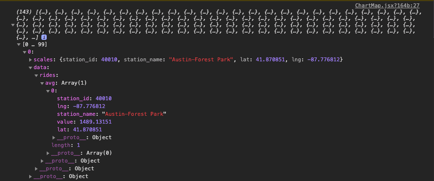

In this example -- and in most cases -- the JSON object is too complex so we use this helper function to flatten it and make it way easier to handle:

```jsx
const flattenChartResults = results => {
  let flattenedChartResults = [];
  results.forEach(result => {
    let fieldEntries = [];
    Object.entries(result.data).forEach(([fieldName, computeModes]) => {
      Object.entries(computeModes).forEach(([computeModeName, rows]) => {
        computeModeName === "select"
          ? fieldEntries.push([computeModeName, rows[0].value])
          : fieldEntries.push([
              `${fieldName}_${computeModeName}`,
              rows[0].value
            ]);
      });
    });
    let flattenedObject = {
      ...result.scales,
      ...Object.fromEntries(fieldEntries)
    };
    flattenedChartResults.push(flattenedObject);
  });
  return flattenedChartResults;
};
```

Copy and paste the code snippet above between imports and ChartMap, then update your useEffect hook content to visualize the new flattened results:

```jsx
useEffect(() => {
  const results = flattenChartResults(props.chart.data.results);
  console.log(results);
}, [props.chart.data.results]);
```

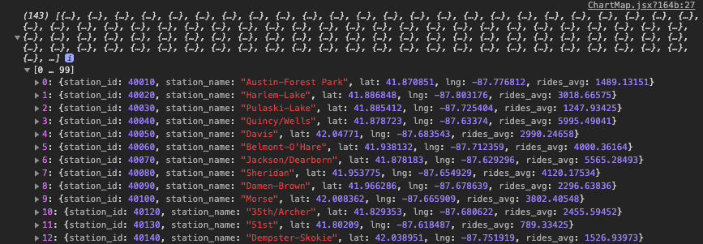

To display these results on the map, you need to store this data in the component's state. Declare an array inside the `ChartMap` component like this:

```jsx
const ChartMap = (props) => {
  const [stations, setStations] = useState([])
  ...
```

Update useEffect to change this array instead of logging the results:

```js
useEffect(() => {
  const results = flattenChartResults(props.chart.data.results);
  setStations(results);
}, [props.chart.data.results]);
```

Now that you've prepared the data, let's see now how to make the map. You will need to install `react-leaflet`, `leaflet` and `react-leaflet-markercluster`:

```bash
yarn add react-leaflet leaflet react-leaflet-markercluster
```

If you run into issues installing these packages, it may due to incompatibility between versions. To solve it, use the command below (adjusts the versions):

```bash
yarn add react-leaflet@2.7.0 leaflet@1.6.0 react-leaflet-markercluster@2.0.0
```

Now import react-leaflet components by adding this line to the top of your file:

```js
import {
  Map as LeafletMap,
  CircleMarker,
  Popup,
  TileLayer
} from "react-leaflet";
```

Go to `ChartMap.less` and change the stylesheet using the code snippet below:

<details><summary>ChartMap.less</summary>
<p>

```less
// ChartMap stylesheet
@import "~leaflet/dist/leaflet.css";
@import "~react-leaflet-markercluster/dist/styles.min.css";

.leaflet-container {
  height: 100%;
}

.leaflet-popup-content-wrapper,
.leaflet-popup-tip {
  opacity: 0.85;
  background-color: #3e4550;
  box-shadow: inset 0 -3px 0 0 rgba(0, 0, 0, 0.13);
  color: #fff;
}

.leaflet-popup-content-wrapper {
  text-align: center;
  border-radius: 1px;
}

.popup-title {
  letter-spacing: 0;
  font-size: 13px;
}

.popup-value {
  font-size: 13px;
  font-weight: 600;
}
```

</p>
</details>

Go back to `ChartMap.jsx` and define your default map parameters (center, zoom, minZoom) right below your state:

```jsx
const center = [41.89, -87.6297982];
const zoom = 14;
const minZoom = 7;
```

Change your function return statement to display an empty map centered on Chicago:

```jsx
return (
  <LeafletMap center={center} zoom={zoom} minZoom={minZoom}>
    <TileLayer
      attribution='&copy; <a href="https://www.openstreetmap.org/copyright">OpenStreetMap</a> contributors &copy; <a href="https://carto.com/attributions">CARTO</a>'
      url="https://{s}.basemaps.cartocdn.com/rastertiles/voyager/{z}/{x}/{y}{r}.png"
    />
  </LeafletMap>
);
```

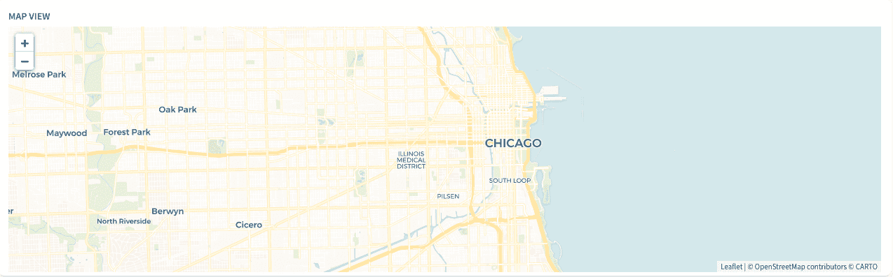

Now add circle markers inside `LeafletMap` right below the `TileLayer` to represent stations:

```jsx
{
  stations.map(station => (
    <CircleMarker
      key={station.station_id}
      center={[station.lat, station.lng]}
    />
  ));
}
```

> You can customize your circle markers by adding some props to control their size, their weight, their color, etc. You can find the complete documentation [here](https://leafletjs.com/reference-1.6.0.html#circlemarker)

Below a code snippet changing the circles' color and making their size proportional to the rides.

```jsx
<CircleMarker
  key={station.station_id}
  center={[station.lat, station.lng]}
  radius={Math.max(
    10 + (station.rides_avg / 1000) * Math.log(zoom),
    ((2 * station.rides_avg) / 1000) * Math.log(zoom)
  )}
  color={"#0089C0"}
  weight={1}
  fillColor={"rgba(0,204,249,0.5)"}
/>
```

Next, add a popup to display the station name and the number of rides associated to it when clicking a circle.

Add it inside `CircleMarker` as shown below:

```jsx
<CircleMarker
  key={station.station_id}
  center={[station.lat, station.lng]}
  radius={Math.max(
    10 + (station.rides_avg / 1000) * Math.log(zoom),
    ((2 * station.rides_avg) / 1000) * Math.log(zoom)
  )}
  color={"#0089C0"}
  weight={1}
  fillColor={"rgba(0,204,249,0.5)"}
>
  <Popup closeButton={false} position={[station.lat, station.lng]}>
    <div className="popup-title">{station.station_name}</div>
    <div className="popup-value">{station.rides_avg}</div>
  </Popup>
</CircleMarker>
```

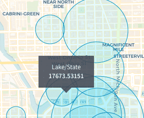

You can make the average number of rides follow the formatting rules specified in `config/formatter.json` for `rides` by using `FpMeasure`.

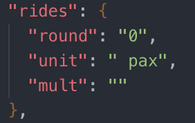

Import FpMeasure:

```js
import { FpMeasure } from "forepaas/formatter";
```

Change the popup value:

```jsx
<div className="popup-value">
  {new FpMeasure("rides").setValue(station.rides_avg).toString()}
</div>
```

If you play a little with your map, you will notice that it keeps reloading when you change your dynamic parameters. You can disable this behavior by adding a `noReload` property into your chart configuration options in `config/dashboards/rides-analytics.json`:

```json
"chart": {
  "id": "chart-map",
  "component": "map",
  "noReload": true,
  "dynamic-parameters": [
    ...
  ],
  "request": {
    ...
  }
},
```

Reorganize your circles by clusters to avoid overlapping, it's pretty straightforward thanks to the `react-leaflet-markercluster` library.

Import the MarkerClusterGroup component:

```js
import MarkerClusterGroup from "react-leaflet-markercluster";
```

Then **wrap your circle markers** in `MarkerClusterGroup` like this:

```jsx
<MarkerClusterGroup showCoverageOnHover={false}>
  {stations.map(station => (
    <CircleMarker
      ...
    </CircleMarker>
  ))}
</MarkerClusterGroup>
```

You have created your first custom component! Good job!  
If you got lost, don't worry. You can find the final code [here](https://github.com/forepaas/getting-started/tree/release/advanced/src/components/ChartMap).

?>➡️ Learn more about creating your custom components in the [**Technical Guide**](en/technical/sdk/app/custom-component)!

---
## Publish your local app on Data Platform

Now that you've completed your app locally, it's time to plug it into the platform.  
You can either do it by [uploading the app as a zip file](#import-your-app-as-a-zip-file), or by [connecting it to a git repository](#connect-your-app-to-a-git-repository).

### Import your app as a zip file

First, you need to export your app as a zip. Your zipped file should not contain the following folders: `node_modules`, `forepaas`, `webpack`, `.git`.

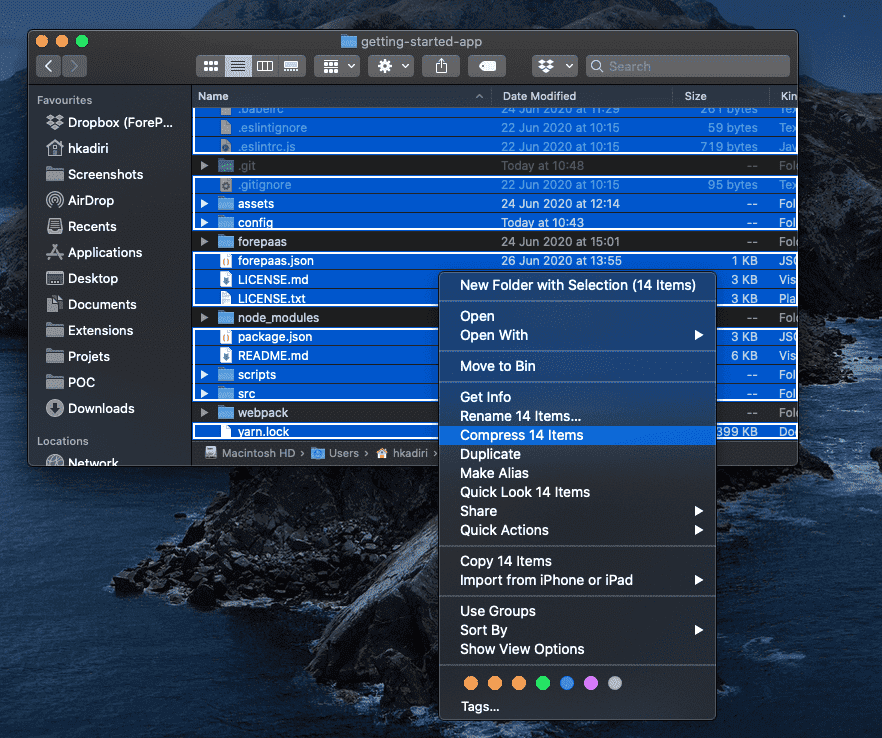

You can also use our pre-build script to zip your app, to generate a zip file ready to be uploaded to your DataPlant, simply run this command.

```bash
yarn zip
```

A zip file with the same name as your application folder will be generated.

Then, you can either create a new application using this .zip file by following [these steps](/en/getting-started/app-init/app-manager?id=build-and-deploy-a-front-end-application) or you can edit an existing application and upload the zip file to create a new version of your application:

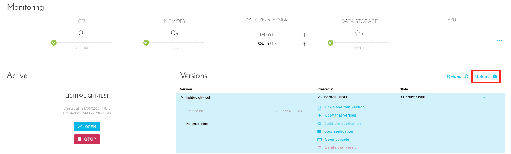

### Connect your app to a git repository

To link a git repository to the platform, please follow this [guide](/en/product/app-manager/settings/git-integration).

Once your app is uploaded, build it then deploy it.

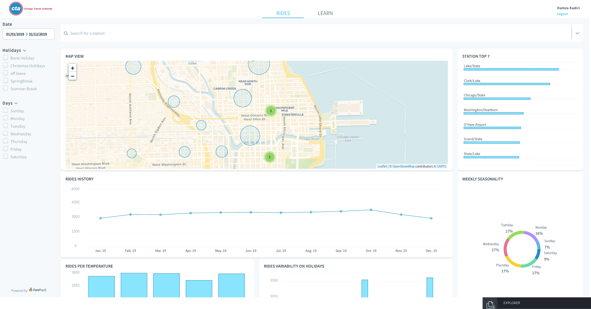

<p><span style="color:black; font-size:20px;"><b> Congrats!</b></span></p>

Your fancy app is now deployed on Data Platform!  

You might now want to run some basic analytics on it. The next and final guide of this series will show you how to do that with Google Analytics.

?>➡️ [**Install web analytics tools**](/en/getting-further/app-dev/monitor)