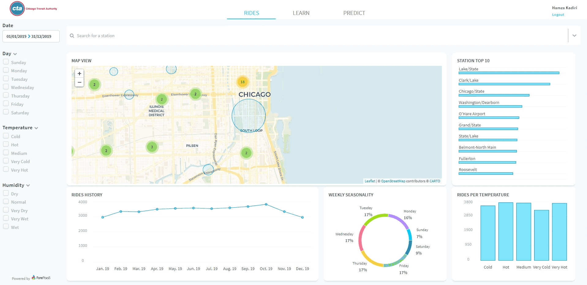

# Develop your own application

In this advanced step-by-step guide, you will learn how to make your own custom application components, whether charts and dynamic filters, customize them, embed them in the platform and much more.

Here, you will continue the development of the application you created in the [first part of the Getting Started Guide](en/getting-started/app-init/index).

⛳️ The goal? Provide you with all the tools to create custom code based off the API references & boilerplates provided.

!> This is an advanced guide aimed at developers, front-end engineers, or application architects. We recommend being familiar with basic front-end development concepts.

Below is a **quick preview of what we will be able to achieve by the end of this guide**. As you can see you'll add a custom map component, more complex filter options & cleaner styling for all other charts.

---

## Let's get rolling! 

👉Here are the steps that you'll need to follow:

   
1

   <a class="landing-link" href="/#/en/getting-further/app-dev/build.md">
      
      

         <h2>Build</h2>
         
How to build, deploy & manage versions using external code

      

   </a>

   
2

   <a class="landing-link" href="/#/en/getting-further/app-dev/config.md">
      
      

         <h2>Configure</h2>
         
Understand app architecture and configuration files

      

   </a>

   
3

   <a class="landing-link" href="/#/en/getting-further/app-dev/component.md">
      
      

         <h2>Customize</h2>
         
Create, edit and customize charts styles using existing components

      

   </a>

   
4

   <a class="landing-link" href="#/en/getting-further/app-dev/extension.md">
      
      

         <h2>Extend</h2>
         
Add custom components (or extensions) as dynamic parameters and charts

      

   </a>

