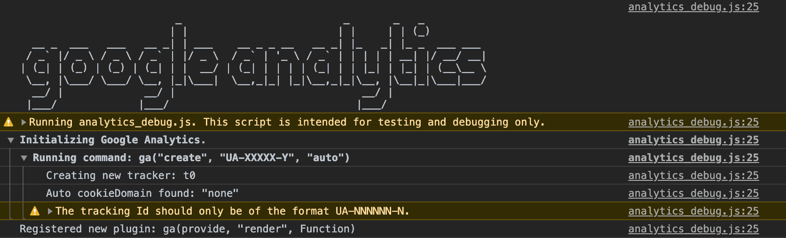
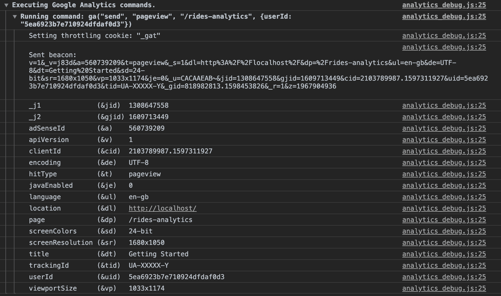

# Monitor your app with Web Analytics 

!> The following tutorial contains outdated content from Google Analytics and as such may not be possible to complete.

In this part, we will show you how to **track and analyze** your application **traffic** using a service such as [Google Analytics](https://analytics.google.com/analytics/web/).

> This guide will mainly focus on Google Analytics, but these instructions are applicable to most web analytics tools.

* [Add the web analytics tag to your application](en/getting-further/app-dev/monitor?id=Add-the-web-analytics-tag-to-your-application)
* [Setup event tracking](en/getting-further/app-dev/monitor?id=setup-event-tracking)
  * [Page view event](en/getting-further/app-dev/monitor?id=trigger-an-event-when-a-page-is-viewed)
  * [Button click event](en/getting-further/app-dev/monitor?id=trigger-an-event-when-a-button-is-clicked)


---
## Add the web analytics tag to your application

First of all, you need to add a tag to your application. This is generally done in your `index.html`.
However, you might need to use some environment variables (for example, if you have different accounts for development and production). In this case, create a `initAnalytics.jsx` file in `src/helpers` containing the following code:

```jsx
/* eslint-disable */

import FpSdk from 'forepaas/sdk';

export const initAnalytics = () => {
  const environment = FpSdk.config.environment;
  (function (i, s, o, g, r, a, m) {
    i['GoogleAnalyticsObject'] = r;
    (i[r] =
      i[r] ||
      function () {
        (i[r].q = i[r].q || []).push(arguments)
      }),
    (i[r].l = 1 * new Date());
    (a = s.createElement(o)), (m = s.getElementsByTagName(o)[0])
    a.async = 1
    a.src = g
    m.parentNode.insertBefore(a, m)
  })(
    window,
    document,
    'script',
    `https://www.google-analytics.com/analytics${
      environment === 'development' ? '_debug' : ''
    }.js`,
    'ga'
  )

  ga('create', 'UA-XXXXX-Y', 'auto')
};

export default initAnalytics
```

As you can see, the loaded analytics script is different depending on the *environment* variable. You can set this variable in `global.json`.

Now go to `src/index.jsx`, import this new helper function then call it when starting the application:

```jsx
...
import initAnalytics from 'src/helpers/initAnalytics.jsx'
...
FpSdk.start()
  .then(() => {
    initAnalytics()
    authentication.init()
    templates.init()
    return components.init()
  })
  .then(() => {
    render(<AppTemplate />, document.getElementById('root'))
  })
```

In `config/global.json`, set your environment variable to development to make sure that the script is called.
```json
{ ...
  "environment": "development",
  ...
}
```

Open your browser's console, you should be able to see that the script analytics_debug.js is called:



Now let's move on and learn how to send different events to your analytics service.

---
## Setup event tracking

In this section, you will see how to track two types of interactions users can have with your application:
* **Pageview events** each time a user loads a new page (i.e. a dashboard) 
* Events each time a **button is clicked**

### Trigger an event when a page is viewed

To send a pageview event, you need to overwrite the dashboard's default behavior when it's loaded. To achieve this, you will use **templates**.

Generate a new template file by creating a new file in `src/templates`.

If you have used the boilerplate provided at the very beginning of this guide, you can do it by typing:

```bash
yarn generate
```

Otherwise, just create a file called `analytics.jsx` in `src/templates`

Initially, your analytics template should look like this.

```jsx
import FpDashboard from 'forepaas/dashboarding/templates/default.jsx'
import FpSdk from 'forepaas/sdk'

class AnalyticsDashboard extends FpDashboard {
}

export default AnalyticsDashboard
```

To be able to use this dashboard, you need to declare it first, as it's the case for custom components.

Go to `src/templates/index.js`and import our new template :

```jsx
import analytics from './analytics.jsx'
```

Then add it to the "templates" object :

```jsx
templates: {
    ...
    analytics
  },
```


Now let's go back to your analytics template and overwrite the `componentDidMount` method to send "pageview" event to your web analytics service.

```jsx
class AnalyticsDashboard extends FpDashboard {
  componentDidMount () {
    super.componentDidMount()
    const clientSession = JSON.parse(localStorage.getItem('client-authority-manager-session'))
    const userId = clientSession['uid']
    window.ga('send', 'pageview', this.props.match.path, { userId })
  }
}
```

Finally, bind the dashboard to this new template by **adding a template key** to your dashboard configuration file: 

Go to `config/rides-analytics.json`

```json
{
  "name": "Rides analytics",
  "width": 100,
  "height": 100,
  "margin": [
    10,
    10
  ],
  "template" : "analytics",
    ...
}
```

Thanks to the debug mode, you can see that your userId and your page has been correctly sent to your web analytics service.




### Trigger an event when a button is clicked

In this part, you will see how to send an event to your web analytics service when a button is clicked by a user. For this purpose, you will need to create a new component called `AnalyticsButton` that extends `FpButton`

To do so, create and declare a new component called AnalyticsButton as explained [here](/en/getting-further/app-dev/extension?id=generate-a-component) and [here](/en/getting-further/app-dev/extension?id=declare-a-component).

Your `AnalyticsButton` component should extend the button component you are already using. In this example, you will extend `FpButton` which is the button provided by default in your app.

Hence, `AnalyticsButton.jsx` should look like this:

```jsx
import FpButton from 'forepaas/core-ui/button'
class AnalyticsButton extends FpButton {
}
export default AnalyticsButton
```

The next step is to activate the button's behavior on click. To do so, add the `handleClick` method as below:

```jsx
class AnalyticsButton extends FpButton {
    handleClick (e) {
        const clientSession = JSON.parse(localStorage.getItem('client-authority-manager-session'))
        const userId = clientSession['uid']
        ga('send', 'event', 'Button', 'Click', { userId })
        super.handleClick(e)
    }
}
```

Finally, to actually use this new component, go to your dashboard configuration file and replace `button` by `analytics-button` where needed.

Congratulations! You have learned how to overwrite existing components and templates for Analytics purposes.

---
<p><span style="color:red; font-size:20px;"><b> Congrats! 🎉🎊</b></span></p>

**You've completed the Getting Further guide on application development!** You're now ready to build your dashboards exactly as you want them, using your own customized components.


