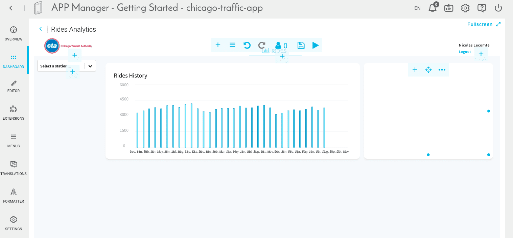

# Customize your first application further

In this tutorial you'll discover advanced features of the App Manager to **customize the visual aspects** of a simple application. 

?> This tutorial contains extended content for the *Getting Started* section called [Build and deploy a front-end application](/en/getting-started/app-init/app-manager).

---
## Prerequisites
This tutorial assumes that you have been through **all five sections** of the [Getting Started tutorial](/en/getting-started/app-init/index). Your Data Processing Engine, your Lakehouse Manager, your Analytics Manager have been configured as described in their respective pages, and you have deployed an API as well as an APP which you are going to customize.

You will go through the following steps:

- [Create a more advanced chart](/en/getting-further/app-manager/index?id=create-a-more-advanced-chart)
- [Customize further](/en/getting-further/app-manager/index?id=customizing-further)
    - [Units](/en/getting-further/app-manager/index?id=units)
    - [Labels](/en/getting-further/app-manager/index?id=labels)
- [Rebuild and deploy a new version of your app](/en/getting-further/app-manager/index?id=rebuild-and-deploy-the-new-version-of-your-app)

---
## Create a more advanced chart

First, let's discover one more chart type: a horizontal bar chart to show the top 7 stations in terms of total traffic.

Instead of choosing a query that has already been prepared in the Analytics Manager, you can also **create new queries on the fly** when creating a chart. To do this, shrink down the first panel and **create** a second one next to it.

Inside the second panel, click on the ➕icon and select **HTML**. Name it *Top 7 Stations* with style **H1**.

Inside the second panel, click on the ➕icon and select Chart. Pick the *Recharts - Bar Horizontal* type.

In the Request tab, choose the _Request_ mode and enter *rides* as data (Sum and Descending) and *station_name* as scale.

One last step! Queries can be fully customized using the advanced JSON editor. More specifically, you need to add a custom parameter to **limit the number** of stations to 7. To do that, head to the advanced mode of your query as shown below and simply add `"limit":7,` below line 2 in the "data" JSON object:

So far, your dashboard should look something like this. Don't forget to **save** 💾.

---
## Customizing further

There is a lot that you can do in the App Manager to design your app exactly the way you want it.

### Units

Click on the **play** button at the top of the dashboard to switch to read-only mode. Hover over the bars of the *Top 7 stations* chart. 

These units could be formatted in millions for better clarity. To do that, go to the **Formatter** tab. A measure called *RIDES* was already added by choosing the Getting Started template.

> More generally, if you need to add a new measure, it must have the **same name as the attribute** that you are trying to format.

As for the formatting parameters, enter *Mpax* for unit, *0* for round (to display integers), and *0.000001* for multiplicator (to display millions).

> Don't worry about saving, the Formatter works in autosave mode.

Here's the result:

---
## Rebuild and deploy the new version of your app

You're almost finished! Just one last step! Let's publish the recent changes to the dashboard in production. To do this, don't forget to save 💾 and then go back to the **Overview** tab of the Application Manager. You should first **Stop** the currently deployed application. As soon as it has shut down, click on **Build**, and then **Deploy**.

> The **build** process usually takes a couple of minutes. If you're curious of what is going on or if the build fails: open the log console by expanding the version panel and inspect the logs. Feel free to send logs to our support team 💁💁‍♂️if you're not sure how to troubleshoot it yourself!

Your app is **live** and can now be accessed online!  
The link can be obtained in the Overview tab by clicking on **Open**.

You can now kick back, relax and have a look at your figures. ☕

---

<b> Congrats! 🎉🎊</b>

**You've completed the Advanced application builder tutorial!**. You are now ready to build complex data applications on the Platform.

Obviously, you can come back to this tutorial at any time! We encourage you to check out the rest of the documentation to dive deeper into a specific component of the product when needed.

Also, don't hesitate to **get in touch** if you need anything, our support & product team is dedicated to helping you deliver faster any AI applications your have in mind.

###  Need help? 🆘

> If you are logging-in with an OVHcloud account, you can create a ticket to raise an incident or if you need support at the [OVHcloud Help Centre](https://help.ovhcloud.com/csm/fr-home?id=csm_index). Additionally, you can ask for support by reaching out to us on the Data Platform Channel within the [Discord Server](https://discord.com/channels/850031577277792286/1163465539981672559). There is a step-by-step guide in the [support](/en/support/index.md).

---

Do you want to learn how to deep-dive in the code and truly customize your apps the way you want it? We have got just the right tutorial for you!

{Customize your apps even further 📊}(#/en/getting-further/app-dev/index)
