# OVHcloud API: Billing Data Analysis Configuration

This guide provides step-by-step instructions on configuring multiple endpoints for the OVHcloud Billing API. You'll learn how to retrieve billing data and integrate it into your applications for accurate and streamlined financial tracking.

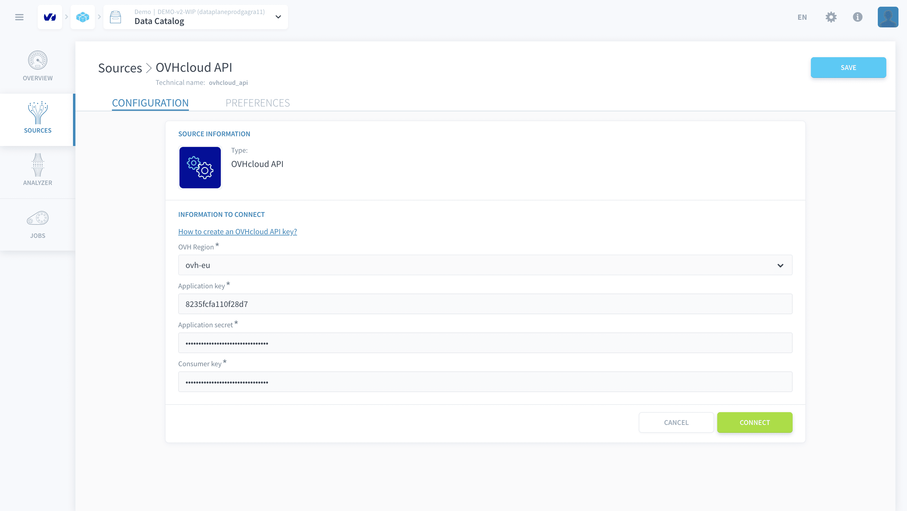

---

- [Overview](#overview)
- [Prerequisites](#prerequisites)
- [Step-by-Step Billing Endpoint Configuration](#step-by-step-billing-endpoint-configuration)
  - [Initialize API Connection](#1-initialize-api-connection)
  - [Define the first Billing Endpoint](#2-Define-the-first-Billing-Endpoint)
  - [Configure Detailed Bill Endpoint](#3-configure-detailed-bill-endpoint)
  - [Metadata Extraction](#4-metadata-extraction)
  - [Organize your data](#5-Organize-your-data)
  - [Make queries in the Analytics Manager](#5-Make-queries-in-the-Analytics-Manager)
- [Conclusion](#conclusion)

---

## Overview

The OVHcloud API supports multiple endpoint configurations, allowing you to fetch and integrate data from interconnected resources. This guide provides a comprehensive walkthrough for configuring and utilizing the OVHcloud Billing API endpoints. By following these steps, you'll be able to programmatically retrieve, process, and analyze your billing information efficiently.

---

## Prerequisites

Before beginning, ensure you have:

- An active OVHcloud account with billing access
- API credentials, specifically:
  - Application Key (App Key)
  - Application Secret (App Secret)
  - Consumer Key
- Access to the OVHcloud API Developer Portal
- Basic understanding of API endpoint interactions

---

## Step-by-Step Billing Endpoint Configuration

## 1. Initialize API Connection

Configure your OVHcloud API connection by following the authentication setup process detailed in the OVHcloud API Connector Documentation. This involves obtaining and securely inputting your Application Key, Application Secret, and Consumer Key through the connector's user interface. For comprehensive instructions on acquiring and setting up these credentials, consult the [API Connection Details]() section in the connector documentation.


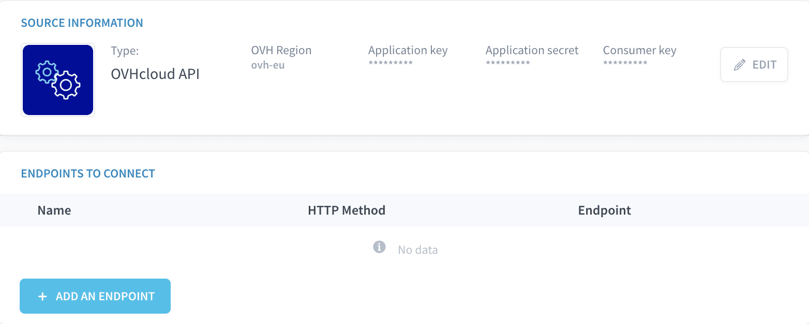

## 2. Define the first Billing Endpoint 

### Retrieve Account Bills

- Endpoint: `/me/bill`
- Purpose: Fetch a list of all billing records for your account

Steps:
1. Select "Add New Endpoint" in the connector
2. Enter `/me/bill` as the endpoint path
3. Configure query parameters (e.g., filtering by year) - for this example we have used key:`date.from` and value:`2023`, to get the records of the year 2025 only
4. Make sure that endpoint has a unique name `bills_from_2023`
5. Click "Confirm" and "Save"

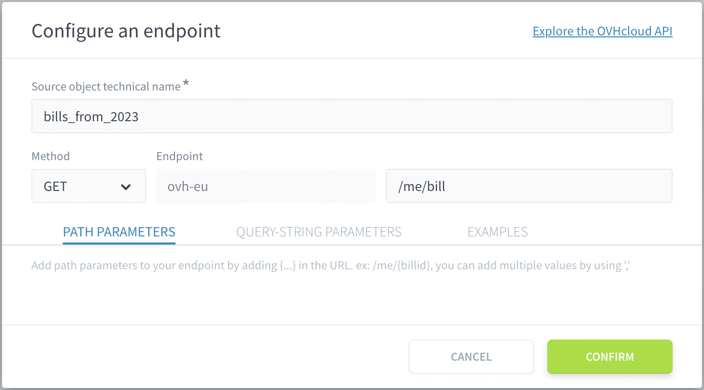
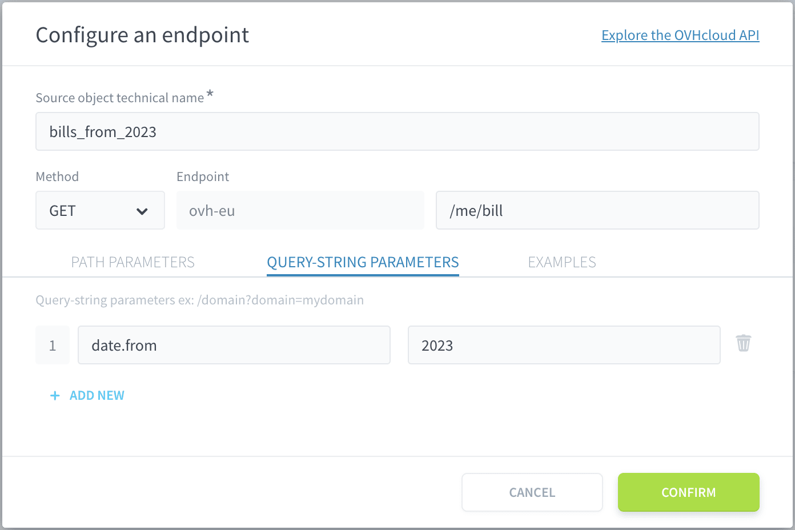


?> We can include an additional step to confirm whether the connected endpoint is correct. While this step is not mandatory, it can be helpful the first time to get an idea of the data you are looking for.

### Validate Endpoint Data

1. Navigate to the Analyzer tab
2. Extract metadata for the new endpoint
3. Verify bill records are correctly retrieved

## 3. Configure Detailed Bill Endpoint

- Endpoint: `/me/bill/{billId}`
- Purpose: Fetch detailed information for a specific bill

Steps:
1. Click "Add Endpoint"
2. Enter `/me/bill/{billId}` as the endpoint path
3. Configure multiple endpoint selection
4. Link to the previous bills endpoint
5. Select `{billId}` as the path parameter
6. Make sure that endpoint has a unique name `bill_details_from_2023`
7. Save the configuration

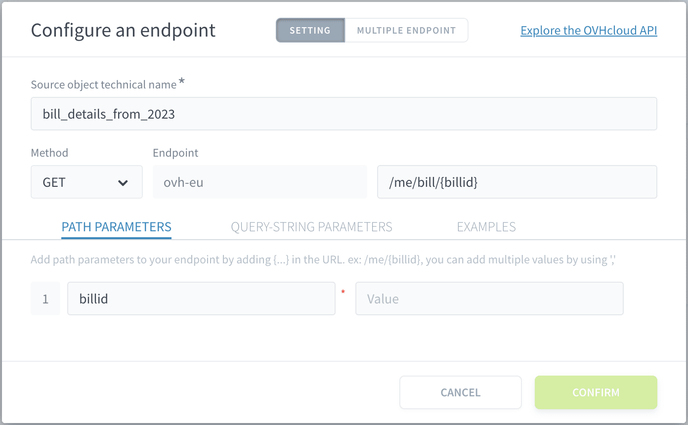

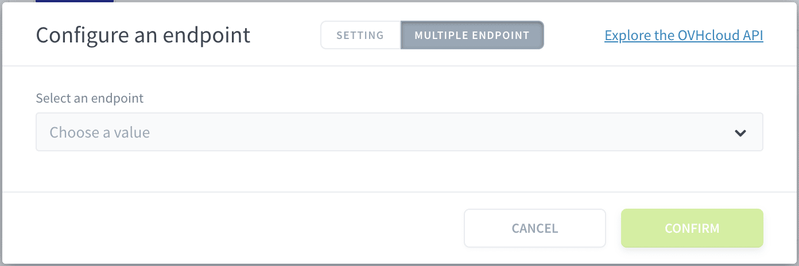

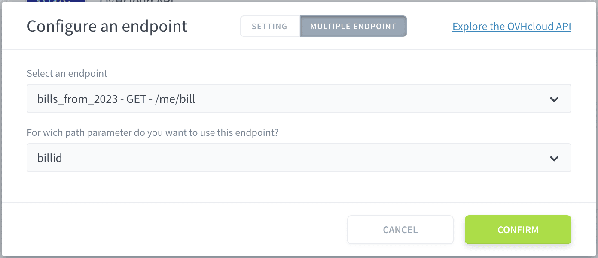

?> Use unique endpoint names to simplify source management. This will be useful for step 4. building a table.

Returning to the main modal by clicking on the Settings tab, you'll notice that the path parameter and endpoint fields are now non-editable. This is because their values are being derived from another endpoint. If you need to make changes, simply go back to the multiple endpoints section and select 'No multiple endpoint' from the endpoint selection dropdown.

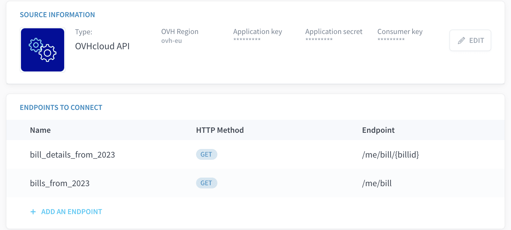

!> **Note**: Currently, only one path parameter can be dynamically selected. Manual entry might be required for complex endpoints with multiple path parameters.

## 4. Metadata extraction

With the endpoints now established, navigate to the analyzer tool within the Data Catalog. Once there, select the two endpoints you have recently configured. Allow some time for the system to initiate and complete the processing jobs associated with these endpoints. 

!> The duration of this process may vary depending on the complexity of the tasks and the volume of data being processed.

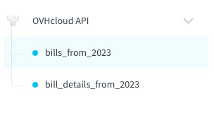

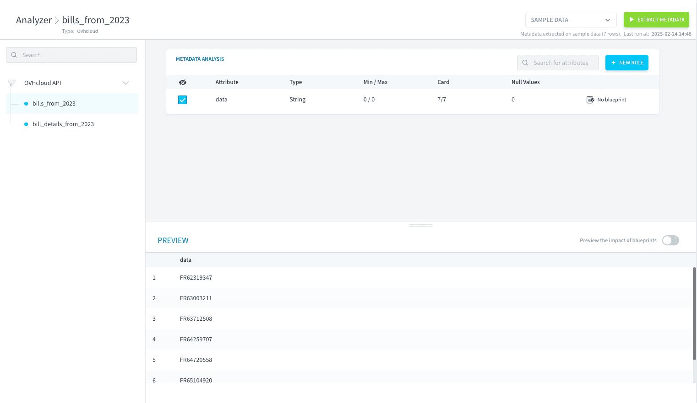

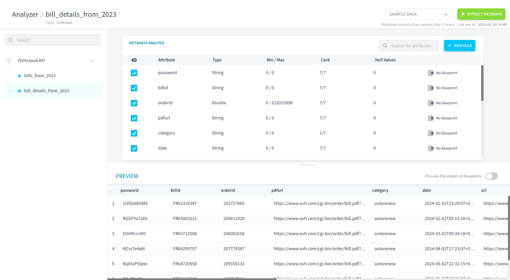

## 5. Organize your data

With the data extraction process now complete, and all necessary information gathered, we can proceed to construct the table. This table will be populated using the `bill_details_from_2023` data source, ensuring that the table accurately reflects the information contained within that source.

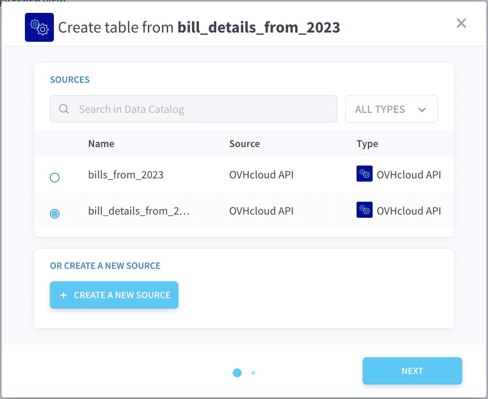

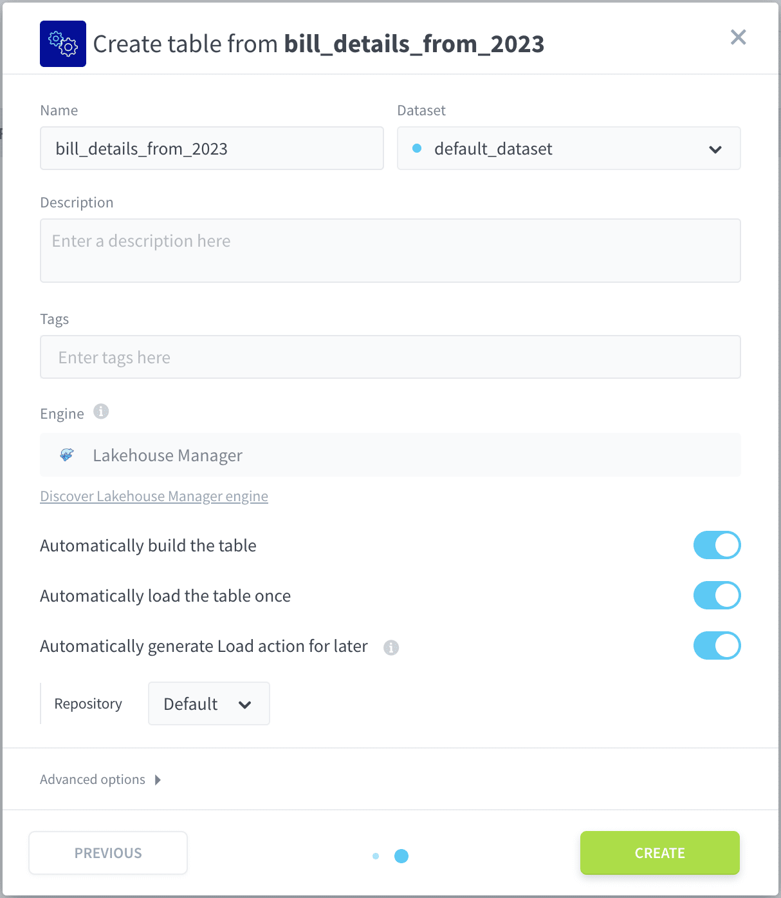

To enhance data exploration, create a virtual attribute. For detailed instructions, see our tutorial:, click [here](/en/getting-started/app-init/lhm?id=add-relevant-metrics-with-virtual-attributes).

Create a virtual attribute with the following parameters:


| Attribute Name              | SQL                                                                 |
| :--------------------------: | :------------------------------------------------------------------ |
| **billing_month** | format_datetime(CAST(REPLACE(date, 'T', ' ') AS timestamp), 'MM MMMM') |

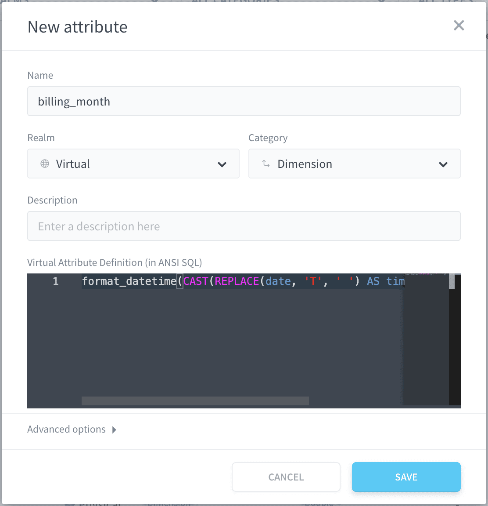

> This query formats a date and time value to display the month number and full month name (e.g., "10 October"). It first replaces the "T" separator in the date string with a space, converts it to a timestamp, and then uses a formatting function to extract the desired month information.

To verify the integrity of your data, you can visit the explorer section of the Lakehouse Manager. This will allow you to examine the table you have just created and confirm that all the data has been loaded successfully.

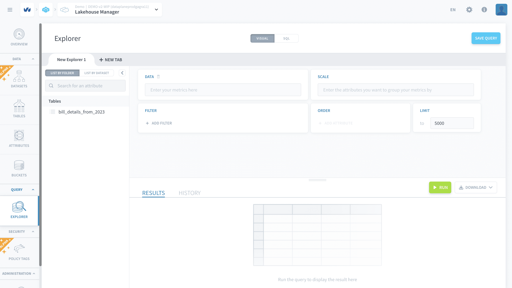

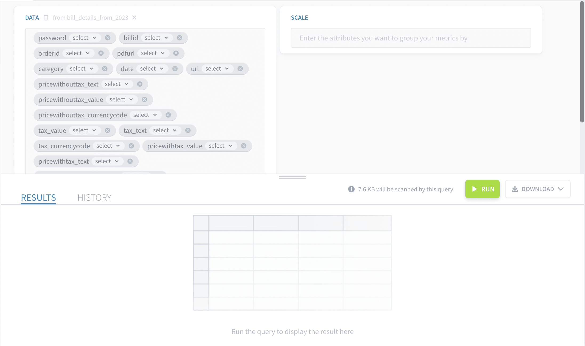

## 6. Make queries in the Analytics Manager

To effectively manage and gain insights from your billing data, use the Analytics Manager to analyze billing data structures, perform data transformations, and create custom views and reports. 

Create custom views and reports to visualize and summarize your billing data, including dashboards, charts, and reports that highlight key trends and patterns.

### Examples of Analytics Manager Queries

This section provides examples of queries you can use with the Analytics Manager to analyze billing data. Before you begin, it's recommended that you review the [Getting Started Guide](/en/getting-started/app-init/query-builder) (Step 4) to learn how to create queries and the [Product Documentation](/en/product/am/queries/index) for the Analytics Manager to understand its setup and features.

All of the following query examples can be created using either the visual builder or SQL. The SQL version will be provided at the end of each example.

Here are 5 examples of queries that could be useful for analyzing billing data:


1.  **Total Number of Invoices:**

* Select *billid* with compute mode **count_distinct**.

    ```sql
    SELECT
        product_name,
        SUM(revenue) AS total_revenue
    FROM
        billing_data
    GROUP BY
        product_name
    ORDER BY
        total_revenue DESC;
    ```

    *   This query calculates the total revenue generated by each product, allowing you to identify your top-performing products.

2.  **Count of Order per Month:**

    ```sql
    SELECT
        DATE_TRUNC('month', billing_date) AS month,
        SUM(revenue) AS mrr
    FROM
        billing_data
    WHERE
        billing_type = 'recurring' -- Assuming a field to identify recurring charges
    GROUP BY
        month
    ORDER BY
        month;
    ```

    *   This query calculates the MRR over time, which is a key metric for subscription-based businesses.  Adjust the `billing_type` filter if your data uses a different field to identify recurring revenue.

3.  **Monthly Billing Trends:**

    ```sql
    SELECT
        DATE_TRUNC('month', billing_date) AS month,
        SUM(revenue) / COUNT(DISTINCT user_id) AS arpu
    FROM
        billing_data
    GROUP BY
        month
    ORDER BY
        month;
    ```

    *   This query calculates the ARPU, which helps you understand how much revenue you're generating per user.

4.  **Breakdown of Billing Categories:**

    ```sql
    -- This is a simplified example.  Churn analysis often requires more complex logic.
    SELECT
        DATE_TRUNC('month', billing_date) AS month,
        COUNT(DISTINCT user_id) AS total_users,
        COUNT(DISTINCT CASE WHEN is_active = FALSE THEN user_id END) AS churned_users, -- Assuming a field 'is_active'
        (COUNT(DISTINCT CASE WHEN is_active = FALSE THEN user_id END) * 100.0) / COUNT(DISTINCT user_id) AS churn_rate
    FROM
        billing_data
    GROUP BY
        month
    ORDER BY
        month;
    ```

    *   This query provides a basic churn rate calculation.  You'll likely need to adapt this based on how you track user activity and churn in your data.  The `is_active` field is just an example; replace it with the appropriate field in your data.

5.  **Highest and Lowest Invoice:**

    ```sql
    SELECT
        payment_method,
        SUM(revenue) AS total_revenue
    FROM
        billing_data
    GROUP BY
        payment_method
    ORDER BY
        total_revenue DESC;
    ```

    *   This query helps you understand which payment methods are most popular and generate the most revenue.

6.  **Top Spenders:**

    ```sql
    SELECT
        user_id,
        SUM(revenue) AS total_spent
    FROM
        billing_data
    GROUP BY
        user_id
    ORDER BY
        total_spent DESC
    LIMIT 10; -- Show the top 10 spenders
    ```

    *   This query identifies your top-spending users, which can be useful for customer relationship management and targeted marketing.


---
## Conclusion

By following these steps, you can effectively configure and utilize the OVHcloud Billing API endpoint to retrieve, process, and analyze billing information programmatically.

---
##  Need help? 🆘

> If you are logging-in with an OVHcloud account, you can create a ticket to raise an incident or if you need support at the [OVHcloud Help Centre](https://help.ovhcloud.com/csm/fr-home?id=csm_index). Additionally, you can ask for support by reaching out to us on the Data Platform Channel within the [Discord Server](https://discord.com/channels/850031577277792286/1163465539981672559). There is a step-by-step guide in the [support](/en/support/index.md).
