# Create and Build your data models - External Datasets

This tutorial will help you in using the **Lakehouse Manager** for the second step and the **data processing engine** for the third step of the *getting started tutorial* with the *External Datasets*.

In this tutorial, you will go through the following steps:
* [Organize your data in tables](#organize-your-data-in-tables)
  * [Create your primary schema](#create-your-primary-schema)
  * [Create an aggregate table](#create-your-aggregate-mart-table)
  * [Finalize the build](#finalize-the-build)
  * [Add virtual attributes](#add-relevant-metrics-with-virtual-attributes)  
* [Actions](#actions)
 * [Create more actions](#create-more-actions)
* [Workflows](#workflows)
* [Jobs](#jobs)

---
## Organize your data in tables
### Create your primary schema
#### Add tables to the data model

!> You need to make sure that you have created an external dataset before proceeding. The steps to create an external dataset can be found [here](en/product/lakehouse-manager/datasets/index?id=external-dataset).

Once that your metadata has been extracted, it's time to head to the Tables dashboard. This is where you will **build a unified and queryable view of all your data**.

The empty Tables page should look like this. 

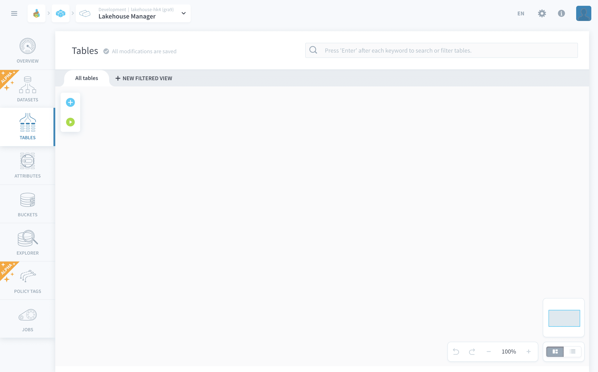

The *All tables* tab is where you have access to the entirety of your data. The *New View* tab allows you to create views of only a part of your data in order to collaborate better in large teams. Since this is a simple tutorial, you should work in the *All tables* tab.

Now let’s concentrate on creating your primary tables and their attributes.

First, hover your cursor over the blue ➕ icon on the left-hand side of the screen. This will reveal the create options :

* Upload a file
* Create from Data Catalog source
* Create an empty tables

> For the purpose of this tutorial, we shall proceed with **Create from a Data Catalog source.** 

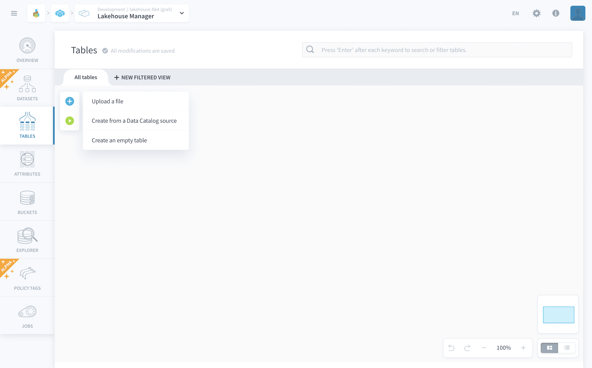

Once you click on *create from a data catalog source*, you will be shown a list of sources from the the previous step. Click on source you want to add and proceed further by clicking on *Next*. Here we can choose the one of the external datasets you have created. No need to change any of the other default settings here.

?> The options *Build the table, load the table once, and generate Load action for later* can be disabled and each step can be done individually as well. This can be explored in detail [here]

Press **Create** and proceed to repeat the same with the second table as well.

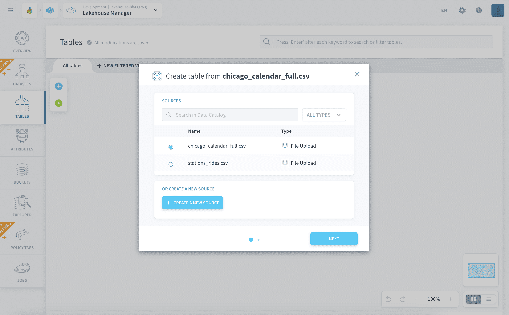

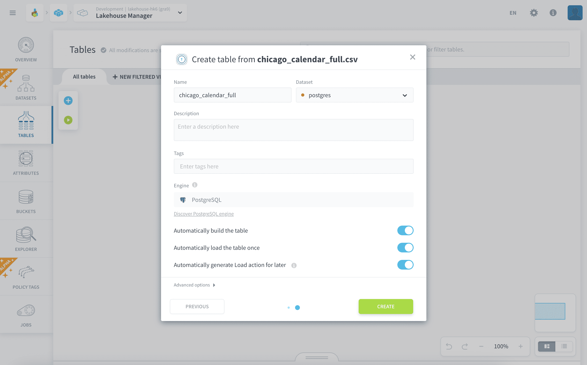

?> Note that each time you make a change on the Tables page, your visual configuration is **automatically saved**.

At this stage, your Tables page should look like this.

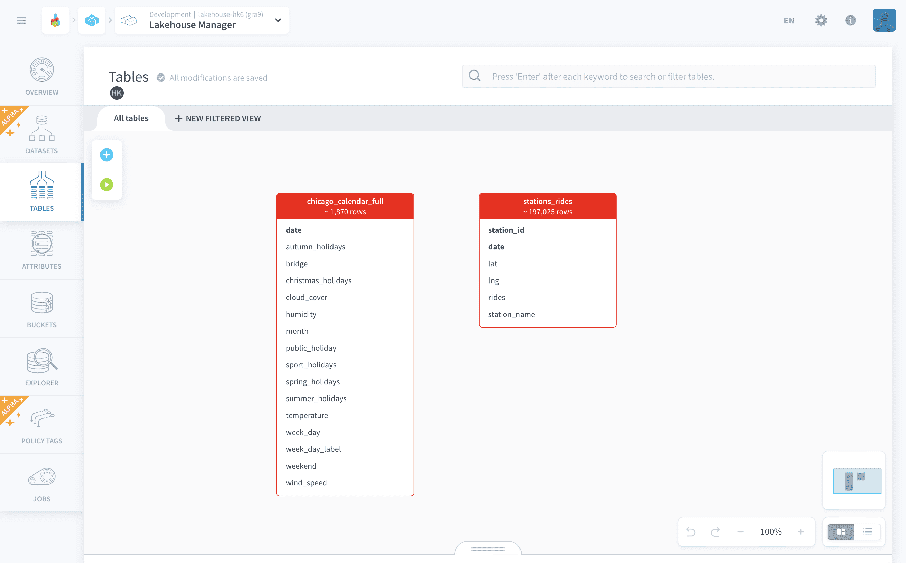

You may notice that some attributes in your tables are written **in bold**. The platform has automatically detected that they were **primary keys**, i.e. the attribute (or set of attributes) used to uniquely identify each data row in the table. 

> You can manually change the primary keys for any table by hovering your mouse cursor over the attribute and clicking on the **star** ⭐ icon.

!> You may notice that while using *External Datasets* some attributes in your tables are written **in bold**. The Platform has automatically detected that they were **primary keys**, i.e. the attribute (or set of attributes) used to uniquely identify each data row in the table. **The Lakehouse Manager Engine** is more big data engine, and by default the concept of primary keys do not exist. Hence you will not be seeing any attributes **in bold**.

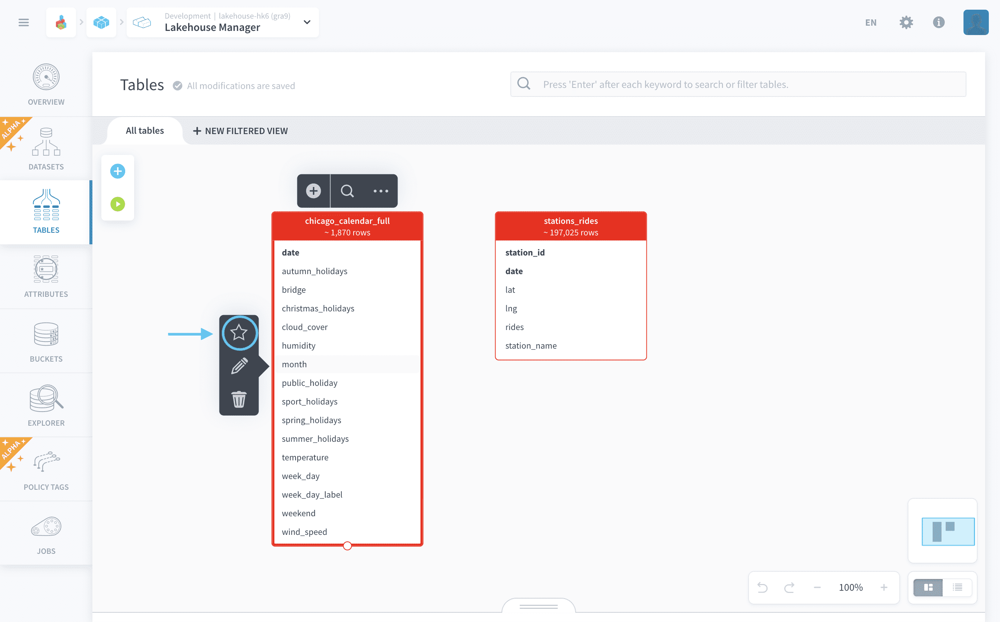

?> Note that the Platform uses the metadata information captured in the Analyzer step to automatically create tables and assign attribute names & types. The source files provided are good to go, however in a real Project you should use the Analyzer to check the data sources, before dragging and dropping them in the Tables page.

#### Join tables together

You need to tell the Lakehouse Manager how your tables relate to each other. 

You will join tables that relate to each other in a parent/ child relationship. A **parent** is a table that has detailed information about a particular subject: for example, the weather in Chicago at a certain date. A **child** table references multiple parent tables. Another way to look at it is that a child table inherits values from the parent table (just like children in real life, except that a child can have more than two parents!)

The table *stations_rides* is a child table. It contains ridership information by date and train station. But it does not have detailed information about the days. Both your tables have *date* as a primary key. So, if you link the *chicago_calendar_full* parent table to the *stations_rides* child table, you will automatically have added weather information to your ridership, for each day of the year. 

First, click once on *chicago_calendar_full* parent table to select it, then click on the white circle at the bottom of the table:

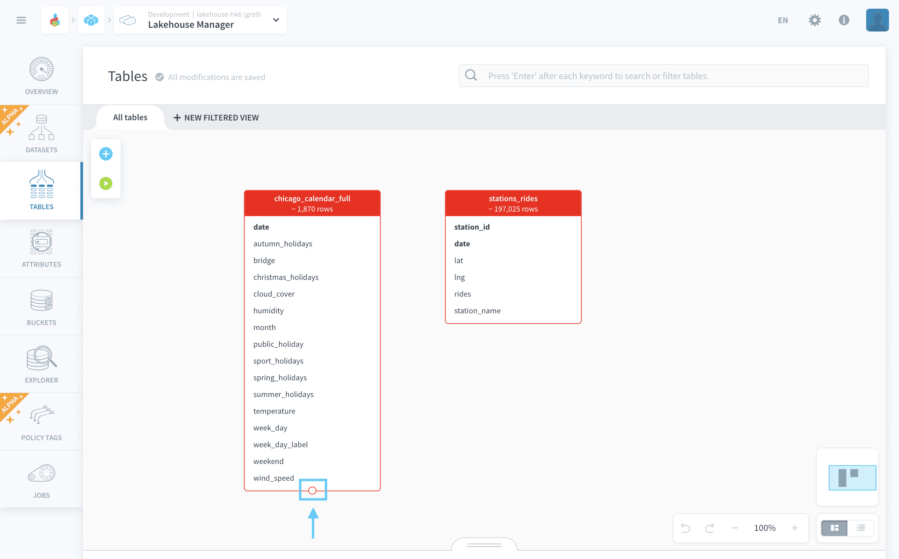

Simply drag the arrow to the child table *stations_rides* and drop/unclick. Your screen should be like this:


### Create your aggregate Mart table 

Now, you will aggregate all important data from the sources (namely rides, dates and temperatures) into one table that will be used in the final application. In the Platform, tables that are derived from primary sources (*Prim* tables) are of type *Mart*. 

To create your first *Mart* table, click on the blue ➕ icon. Select *Create an empty table*, and you will be shown a new table configuration where set its type as *Mart*, set a name (*dataset_history* for example) and save it.

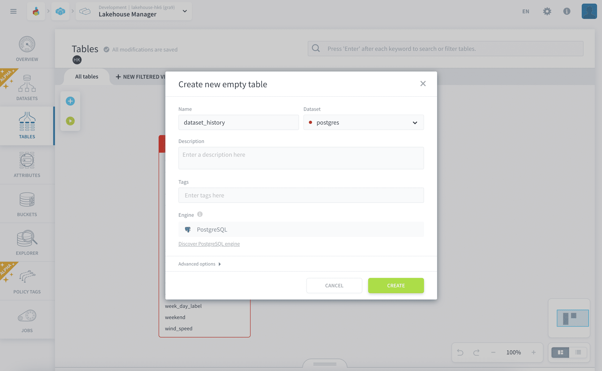

Then, drag and drop *date* and *station_id* from the Prim table *stations_rides* into the Mart table *dataset_history* and set these attributes as primary keys.

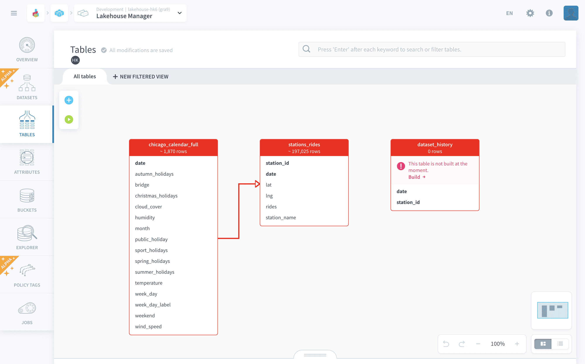

Move the attributes below to *dataset_history* and do not set them as keys (since they are simple data of each row and are not unique):

|        Original table           | Attributes to drag-and-drop      |
| :------------------------------: | -------------------------- | 
|    **stations_rides**       |  *lat* / *lng*  / *rides* / *station_name*   | 
|    **chicago_calendar_full**     |  *month* / *temperature* / *week_day* / *week_day_label* / *weekend* /     |


Finally, you will need to create one new attribute to help translate numerical temperature data into understandable categories (cold, hot, ..).

Start by clicking on the ➕ icon that appears at the top of the table *dataset_history* when you click on it. You can then create or edit an attribute inside a table.

Define the attribute as such:

|                Attribute name               | Type               | Nature                  | 
| :------------------------------: | ----------- | ------------------- |
|  **cat_temperature**            | String                             | Dimension                     |

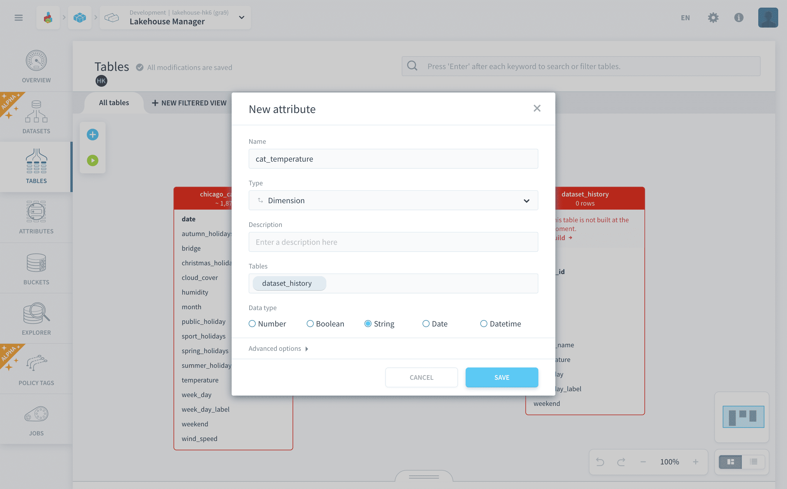

> For the moment, this attribute is not physically specified but don't worry! It will be done soon in another component: the Data Processing Engine.

[Learn more about Tables](en/product/lakehouse-manager/tables/index)

### Finalize the build

!> One last quick check ✋! Make sure to **double-check that your data model looks exactly like the one in the screenshots** before moving to the next step. If some attributes are missing you will get stuck in later steps of the tutorial.

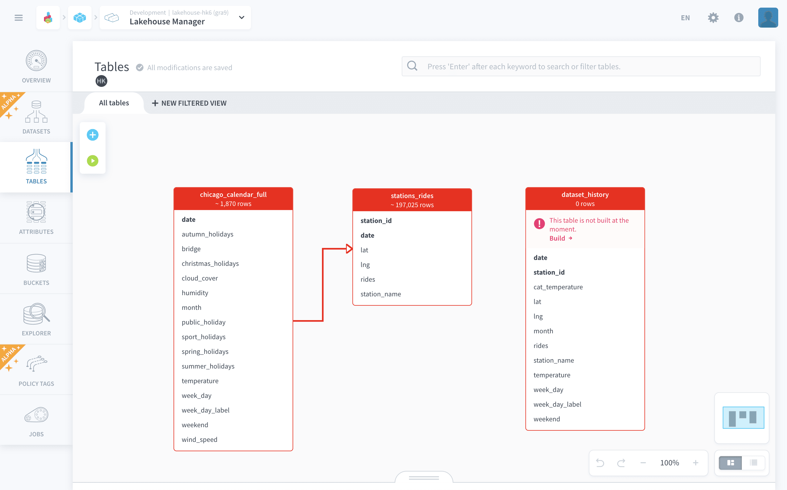

Now, click on the *Build* icon (under the blue ➕ icon) to effectively create/update the tables and attributes in your [storage engine](/en/product/dataplant/storage-engine/index). This still doesn't load the data into the tables (which will be done in the next article), it simply applies the logical schema to tables and attributes in your underlying storage engine.

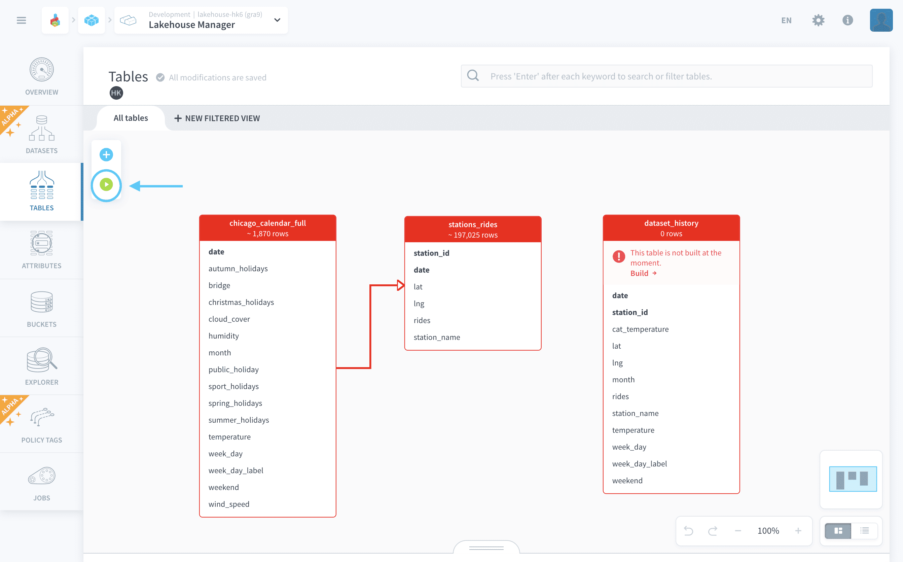

?> While the visual logical schema of the data is automatically saved, changes to your tables won't be visible in the rest of the Platform as long as they are not built.

The build task for this tutorial shouldn't take more than a few minutes to run. Once it is done, you can move on.

### Add relevant metrics with Virtual Attributes

Before moving on to the physical processing (ETL/ELT) of the data into this model, let's prepare additional metrics for analytics later on. The final application that you are building following this tutorial includes a chart with the **number of rides per day on a given station**: 

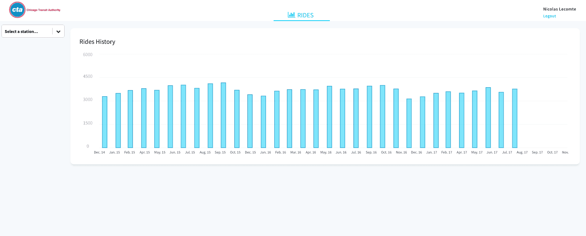

However, you do not have the necessary data to build that chart directly on the primary sources. You will need a metric that gives you the average number of rides per day for a given station and that can be used in queries and dashboards. 

But how do you compute it using the platform? One way to do this is to create a **virtual attribute**. Virtual attributes allow you to calculate SQL formulas that will be **computed on the fly** and won't be stored in the database. They can be used in a query or a chart in your final dashboard.

> 💡 Adding or editing virtual attributes does not require rebuilding the schema.  

Switch to the **Attributes** page. This page lists all physical and virtual attributes in your data model, and the lineage in your Project.

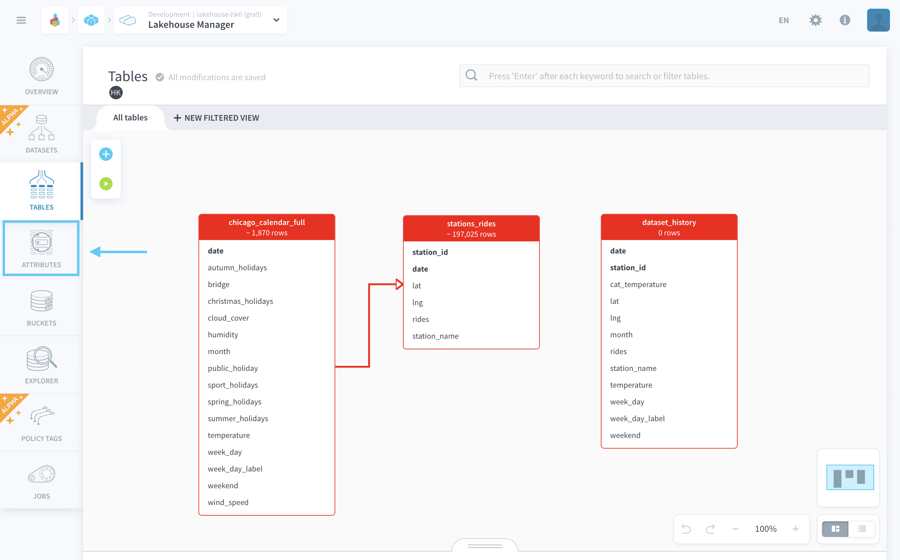

Click on the *New Attribute* button to create a virtual attribute. 

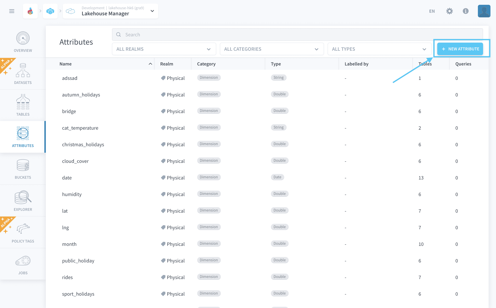

In the creation window, make sure to select *Virtual* as the realm.

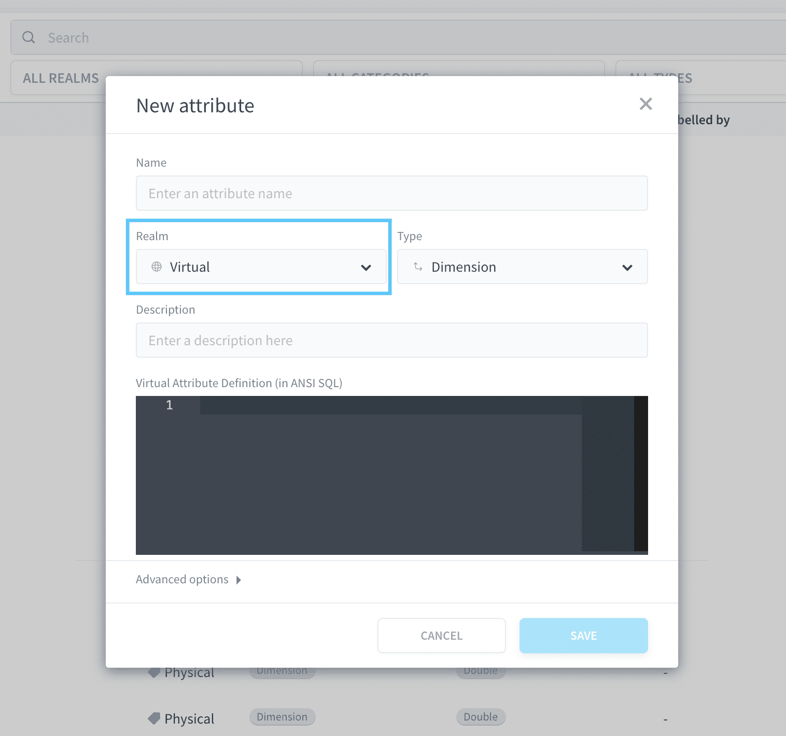

Now add these two attributes and their respective SQL code:

|              Attribute name               | SQL              | 
| :------------------------------: | -------------------------- | 
|           **avg_rides_per_day_per_station**     | SUM(rides)/COUNT(DISTINCT CONCAT(CAST(date AS VARCHAR), CAST(station_id AS VARCHAR)))                |
|             **yearmonth**           | SUBSTR(CAST(date as VARCHAR),1,7) | 

The **yearmonth** attribute gives you the year and month in the format *yyyy-mm*. You will use it later.

?> Notice how you just used two different methods to generate new attributes/metrics from imported data: **adding an attribute to a Mart table** and **virtual attributes**.  
🔘 Adding a new physical attribute takes up storage and requires you to physically define them in the Data Processing Engine, but this makes them more rigorous as their specifications can then be edited without changing the whole data model. New physical attributes can also be used as [indexes](/en/product/data-manager/tables/table_interactions?id=labeling-and-indexing).  
🔘 Virtual attributes are a quick win but can become hard to manage if you need to modify them when scaling. 

---
## Actions
An [action](/en/product/dpe/actions/index) consists of a unitary physical operation on the data. Actions can be organized in stages in order to produce automated data processing pipelines called [workflows](/en/product/dpe/workflows/index).

Click on the **Actions** menu of your Data Processing Engine. You should see the two *Load* actions that were[ automatically generated in the previous step](/en/getting-started/app-init/lhm?id=organize-your-data-in-tables): 

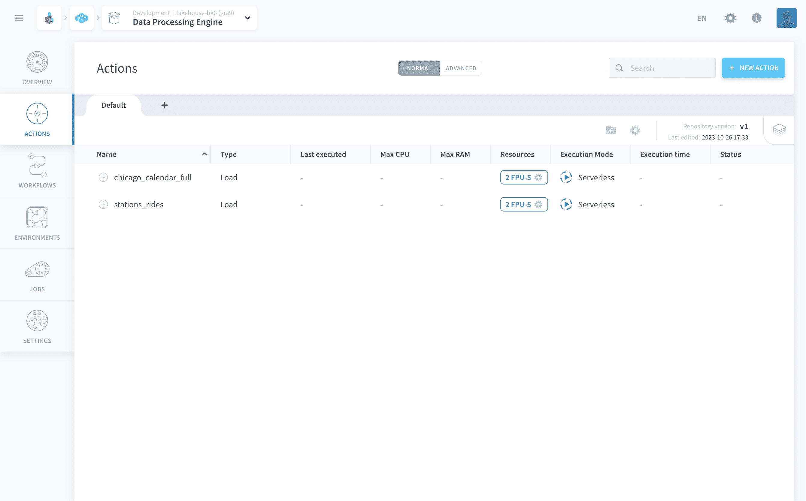

These Load actions will physically extract the data from your sources and load it into your data warehouse, following the schema made in the Lakehouse Manager.

### Create more actions

?> Our Marketplace gives you access to a dozen of curated actions to kick-start your data processing Projects: *load* actions, *aggregate* actions, *delete* actions, etc. If you cannot find what you need in the catalog, you can always resort to a *custom* action that allows you to **run any piece of Python 3+ code** as part of your data pipelines.  
[Learn more about custom actions](/en/product/dpe/actions/custom/index).

For this tutorial, you will create an action used to aggregate your data into the *dataset_history* table you created in the previous part.

Click on **New action** and select the *Aggregate action* template from the the Platform Store.

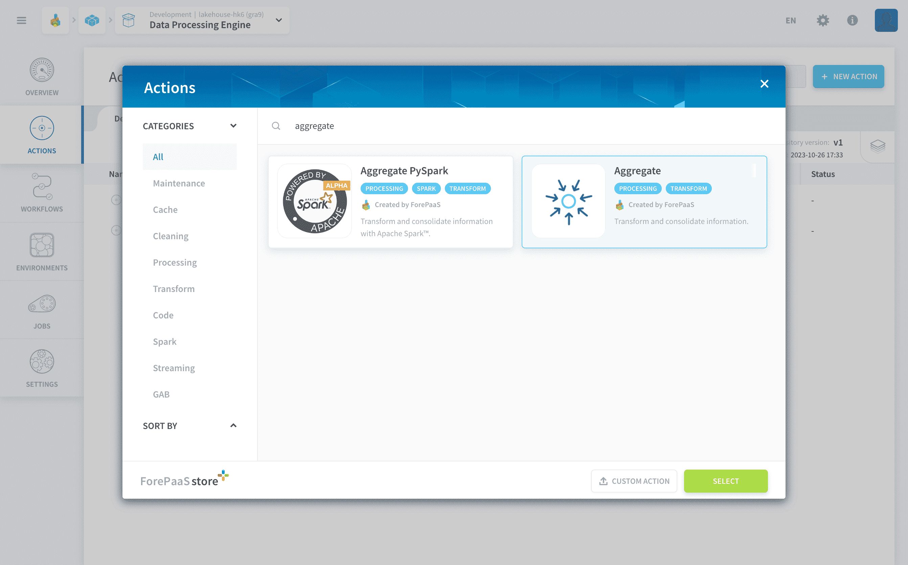

There will be 2 simple steps to configure the aggregate action:
* **(1)** Select a source table : *stations_rides*
* **(2)** Select the destination table: *dataset_history* 

After a couple of seconds, the Data Processing Engine will automatically find all the join conditions required, and map attributes.

Change the join condition to an *INNER join* using the dropdown menu. This will ensure that you do not have any null fields in the records of your dataset_history table. 

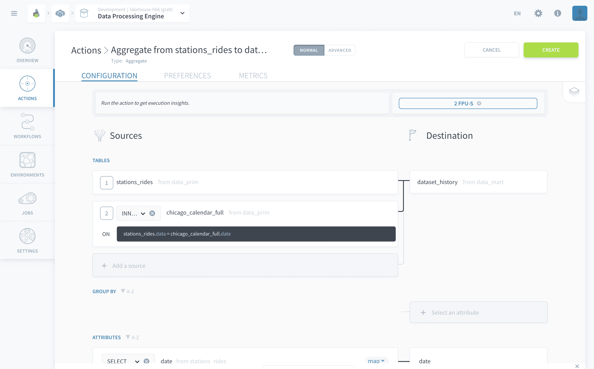

Attributes have been mapped automatically. Find the attribute *rides*, which is the metric you are looking to aggregate, and switch it to a **SUM** function. Everywhere else, leave the **MAX** function as it is: most DBMS require you to apply an aggregate clause to attributes that aren't part of the *GROUP BY* clause.

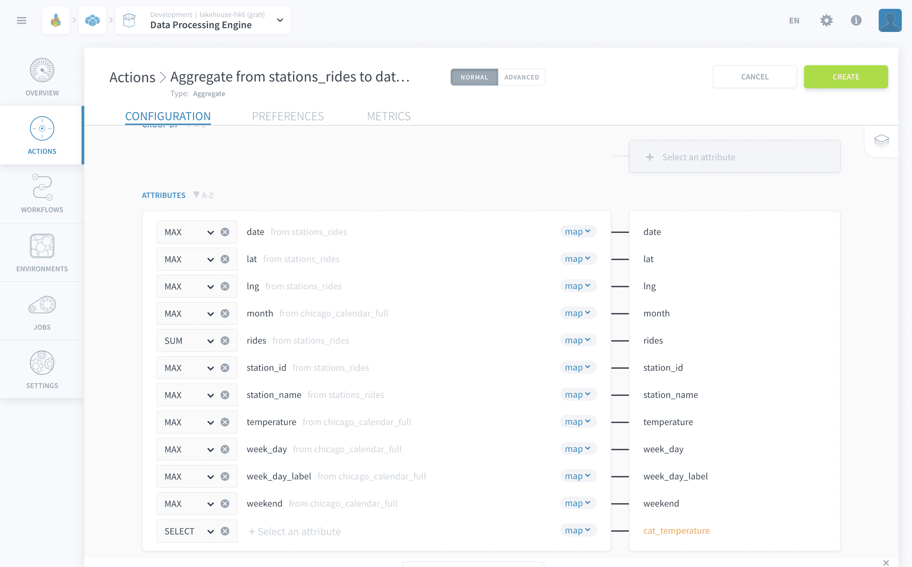

Finally, let's define the categorical attribute *cat_temperature* that you created earlier. Click on the **< map >** (short for "mapping") option in blue option dropdown as shown below and switch it to **< sql >**. 

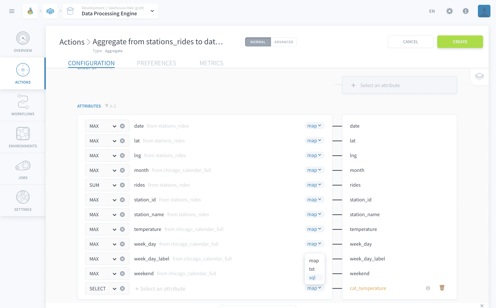

Simply copy-paste the SQL command below:

```
CASE 
WHEN MAX(chicago_calendar_full.temperature)<40 THEN 'very cold'
WHEN MAX(chicago_calendar_full.temperature)<48 THEN 'cold'
WHEN MAX(chicago_calendar_full.temperature)<55 THEN 'medium'
WHEN MAX(chicago_calendar_full.temperature)<62 THEN 'hot'
ELSE 'very hot'
END
```

!> **Leaving a destination attribute unmapped in the Aggregate action configuration will trigger an error when the action is launched**. If you'd rather leave the destination field empty, make sure to simply remove it from the list of mapped attributes.

{Learn more about Aggregate actions}(#/en/product/dpe/actions/aggregate/index.md)

Click on **Create** at the top-right.

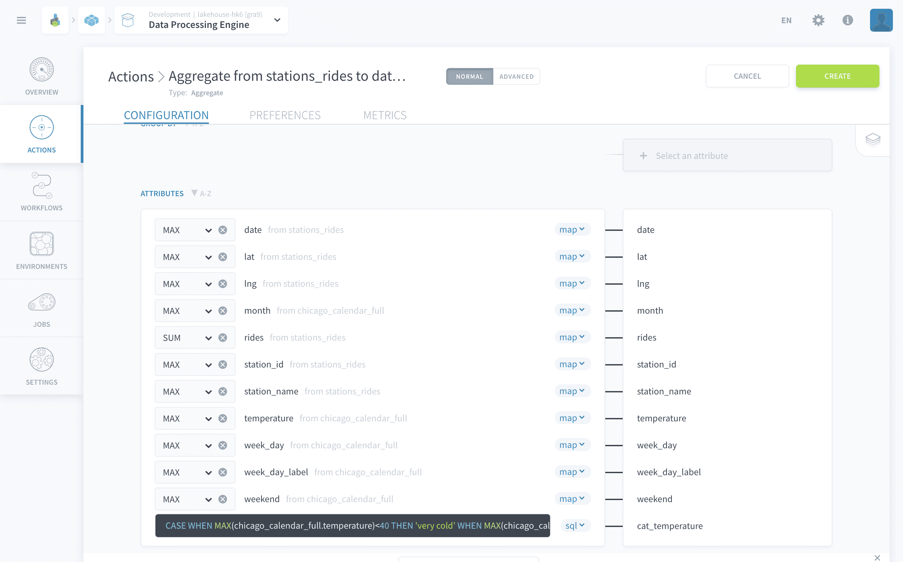

Good job 💪! **You've now successfully generated all the actions** required for this tutorial. 

?> Of course, your real-life Project will probably have more than 3 actions. You can organize your actions in folders and rename them if needed. You can also use more than one repository, especially if you are working in collaboration with teammates. Repositories of actions can be versioned and also synced with external Git repositories. Check-out the [dedicated product documentation](/en/product/dpe/actions/index?id=manage-actions) page to learn more about how to do that!

{Learn more about Actions in the Product Documentation}(#/en/product/dpe/actions/index)

---
## Workflows
Workflows are like a movie script to put your actions into... action. 🎬    

Within a workflow, actions are organized in sequential stages. Within a stage, all actions will be run in parallel while stages will always run one after the other. The same action can be used multiple times in the same workflow. A workflow, just like an action, can either be launched manually, set up to run on a schedule or triggered through an API call.

> Note that it is important to remember that **stages are run one after the other** in the order you planned them while **actions contained in a stage are all run all at the same time** regardless of the order. In short, the order of the actions inside a stage does not matter while the stages’ order inside a workflow does. 

To create your first workflow, you'll need to head to the *Workflow* tab and click on **New Workflow**. Head to preferences or double-click on the header name to set a new name *Import Chicago Data*. 

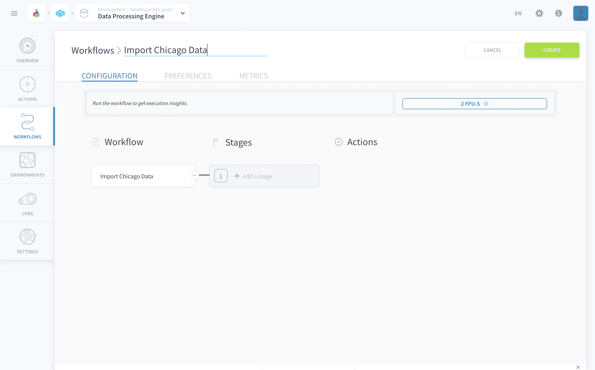

Let's start by defining two different stages by clicking on **Add a stage**. Then, add actions in each stage using the dropdown search selector following the screenshot provided as a guide for each stage.

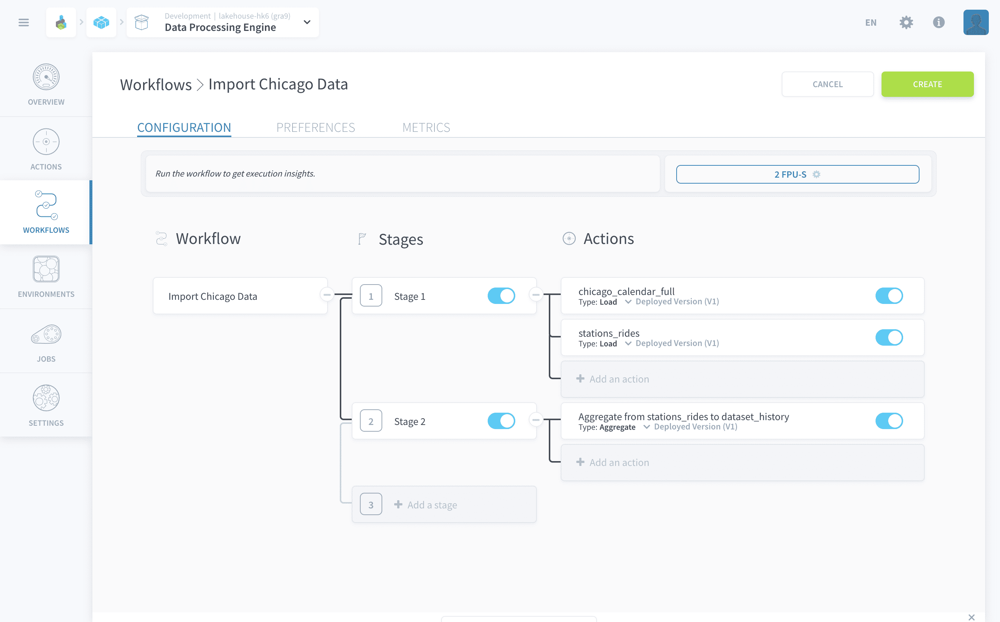

After creating the workflow (**create**), press **Play**.

> Please note that workflows might take a few minutes ⏳ to run when you launch them for the first time. The total time should not exceed 10 minutes - if it does, please reach out to our support team.

While the workflow is running, something you can do is **schedule it to run daily** using a trigger.

Head to the *Preferences* tab of your workflows and scroll to the Triggers widget on the bottom left side. Click **+Add**. 

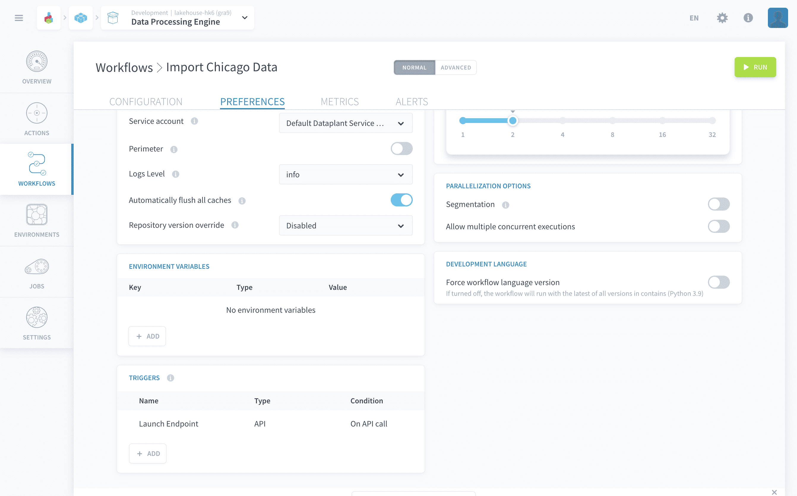

Select the trigger type as *CRON* and mode as *Simple*. Navigate to the **Daily** tab and in the list of options select *Every 1 day(s)* as shown in the picture below:

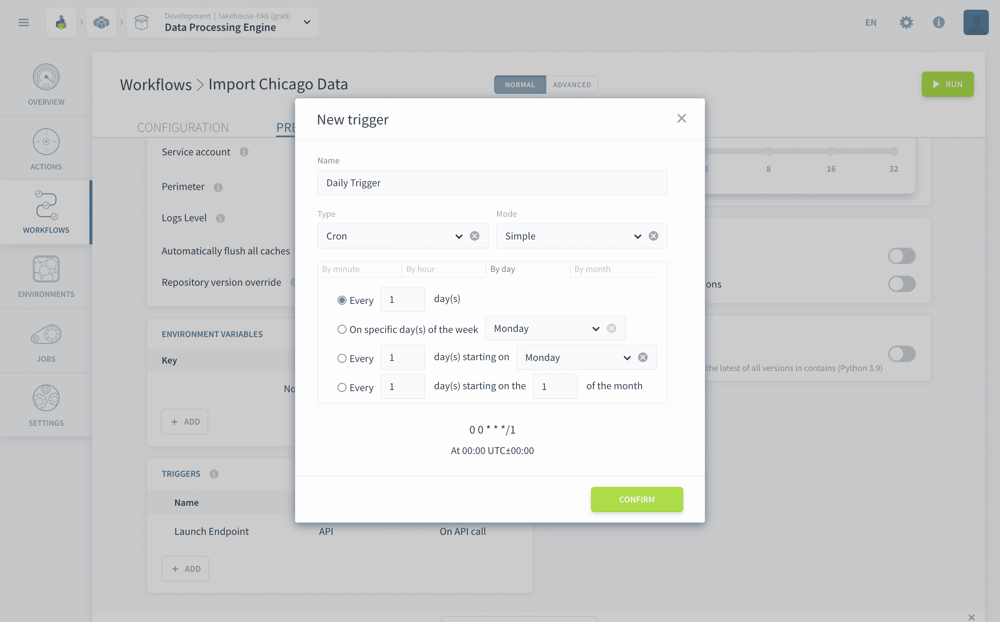

Hit the **Confirm** button to create the new trigger event with the name of your choice and it will append it below the *Launch Endpoint* present by default in the Trigger event table.

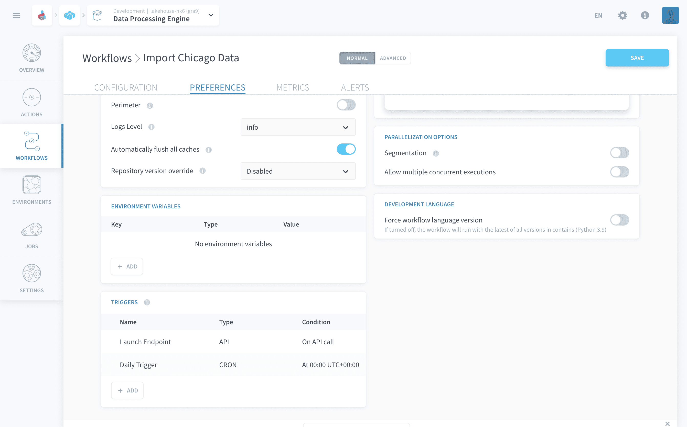

?> There is a lot more you can configure in a workflow's preferences. Namely, you can [scale horizontally and vertically](/en/product/dpe/jobs/resources) any processing job, use [workload segmentation](/en/getting-further/segmentation/index) to accelerate the data processing and even save all these configurations for repeated use thanks to [environments](/en/product/dpe/environments/index).  
[Learn more about configuring the execution preferences.](/en/product/dpe/actions/settings/index)

!> Make sure to click on the **Save** button on the top right of the screen whenever you make a modification to your workflows. Actions are stored in repositories which can be versioned which is not the case for workflows or environments. *Autosave* is therefore disabled for both workflows & environments.


---
## Jobs

To wrap up this section, here are a few words about the last tab of the Data Processing Engine component: jobs.

The Jobs tab summarizes **all executions triggered in the Data Processing Engine** and includes advanced metrics reports. Jobs are listed under three main categories: running, queued and past executions. Having a look at the last jobs executed, you can verify the status of the workflow you just launched. 

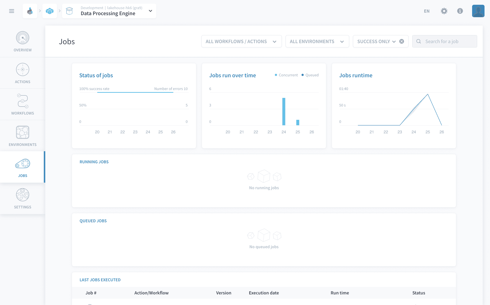

---

You now have completed the Data Engineering section of the *Getting Started* tutorial 🌟 
 
A good way to make sure your data properly loaded is to go back to the [Lakehouse Manager](en/product/lakehouse-manager/index) and look at the number of rows loaded into the table. Just open the **list view mode** and check the *rows* column, if the field has a number (indicating how many rows have been loaded) then everything worked well.

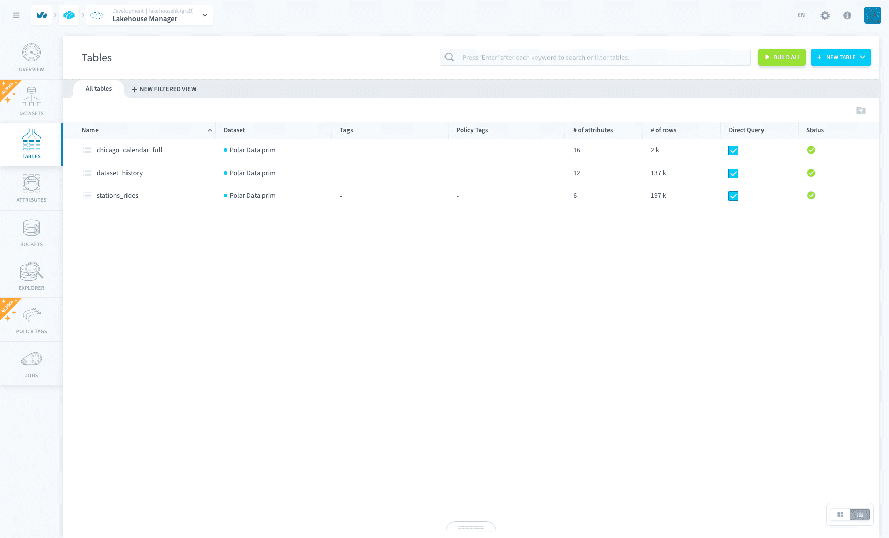

If you want to continue with the getting started tutorial, you can proceed directly to [step-4: the Analytics Manager](/en/getting-started/app-init/query-builder)

---
## Need help? 🆘

> If you are logging-in with an OVHcloud account, you can create a ticket to raise an incident or if you need support at the [OVHcloud Help Centre](https://help.ovhcloud.com/csm/fr-home?id=csm_index). Additionally, you can ask for support by reaching out to us on the Data Platform Channel within the [Discord Server](https://discord.com/channels/850031577277792286/1163465539981672559). There is a step-by-step guide in the [support](/en/support/index.md).