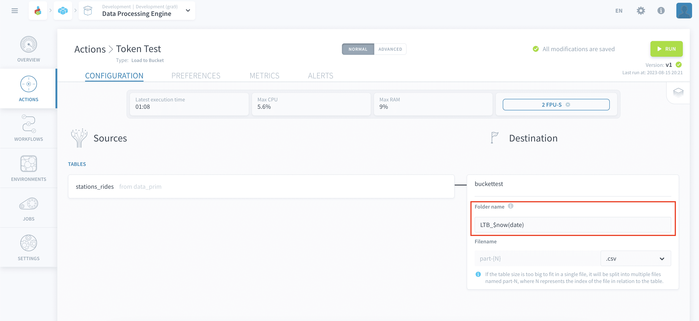
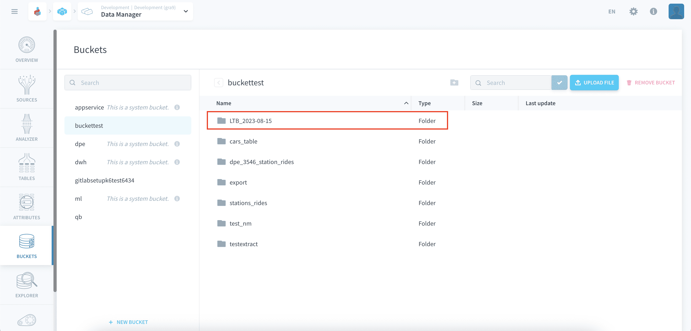
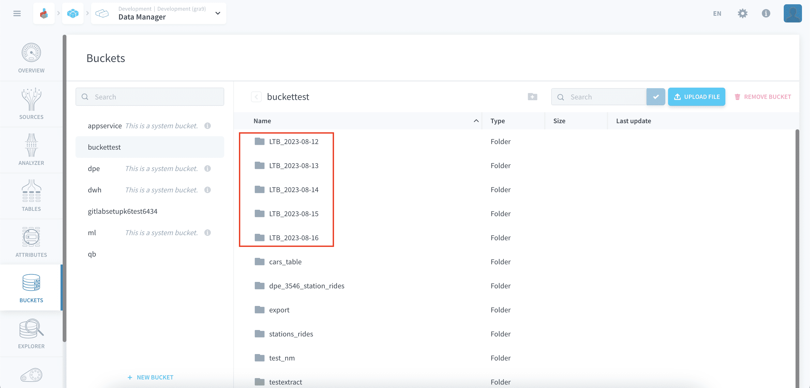

# Export folders with a custom date

This tutorial demonstrates how to add a custom date to your folder names during the creation of the [Data Processing Actions](/en/product/dpe/actions/index.md).

?> **Note:** This functionality is only available to the following actions: *Load to Bucket*, *MySQL to Parquet*, and *PostgreSQL to Parquet*.

* [Introduction](#introduction)
  * [Requirements](#requirements)
  * [Concepts overview](#concepts-overview)
* [Use the $now token](#use-the-now-token)
* [Examples](#examples)

---

## Introduction

### Requirements

To follow this tutorial, you need to be familiar with the [Data Processing Engine](/en/product/dpe/index.md) and you should preferably have done the [Getting Started guide](/en/getting-started/index). The essential is that you know what [Actions](/en/product/dpe/actions/index.md) are for and how to use them.

### Concepts Overview

When you create actions, you have the choice to name your folder which will hold your exported files. The *$now* token enables you to give custom dates easily using a few basic patterns as part of the folder name.

There are 4 patterns available on the ForePaaS Platform:

- **$now(date)**
- **$now(datetime)**
- **$now(timestamp):** Timestamp will be printed in [UNIX epoch time](https://en.wikipedia.org/wiki/Unix_time)
- **$now(*insert sequence here*):** Create custom date sequences with the available [format codes](https://docs.python.org/3/library/datetime.html#strftime-and-strptime-format-codes).

Now let's see how all of this works in practice!

---
## Use the $now token

For this tutorial we shall only explore how to use the *$now* token. To know how to create and run *Actions*, there is an in depth documentation on [Actions](/en/product/dpe/actions/index.md) available.

For the ease of understanding we will choose to create an action - *Load to Bucket*, which is meant to run daily for the foreseeable future - Which will in turn lead to folders being generated on a daily basis. To help sort and easily access the correct folder, the **$now** token can be used.

At the stage where the option to input the name for the folder becomes available, You can use the *$now* token like shown in the example below.

On the picture below, you can see that the folder has been successfully generated in the *bucket* with the naming schema we expected. It is not necessary to have additional text in the folder name like used in the example, the token can be used independently as well.

bFor the scenario mentioned above, here is an example of how the *bucket* will look with the folders generated over the past few days. It becomes easy to quickly identify the folder created on a certain date.

## Examples

Here are some more examples of how the folder name will appear with different use cases:

- **$now(date):** 2023-08-15
- **$now(datetime):** 2023-08-15_20-51-04 
- **$now(timestamp):** 1692132664 *(Unix epoch time)*
- **$now(%a-%d-%b-%Y_%H-%M%):** Tue-15-Aug-2023_20-53

> Since folder names shouldn't have special characters like *colon*, *slash*, *asterisk*, etc. the *dash* character is used for the time and date format. 

---
## Need help? 🆘

> If you are logging-in with an OVHcloud account, you can create a ticket to raise an incident or if you need support at the [OVHcloud Help Centre](https://help.ovhcloud.com/csm/fr-home?id=csm_index). Additionally, you can ask for support by reaching out to us on the Data Platform Channel within the [Discord Server](https://discord.com/channels/850031577277792286/1163465539981672559). There is a step-by-step guide in the [support](/en/support/index.md).