# Export or import a Project's configuration

It is possible to **export and/or import your Projects' configurations** for each component. Configurations are a bundle of files (usually JSON & code files) that contain all the information about how a certain component was set up in your Project. This is particularly useful when you're trying to reuse a set of actions or queries from one Project to another.

* [How to easily get a temporary access token](#getting-a-temporary-access-token)
* [How to export/import a configuration with an API call?](#how-to-exportimport-a-configuration-with-an-api-call)
* [What are the different export/import API calls?](#exportimport-api-calls-per-component)
  * [Data Catalog and Lakehouse Manager](#data-catalog-and-lakehouse-manager)
  * [Data Processing Engine](#data-processing-engine)
  * [Analytics Manager](#analytics-manager)
  * [Identity Access Manager](#identity-access-manager---iam)
* [How to export configurations in a reusable template](#creating-reusable-project-templates)

> 💡 We recommend using a API development tool like [Postman](https://www.postman.com/) or [Insomnia](https://insomnia.rest/) to run cURL calls. This particular guide uses [Insomnia](https://insomnia.rest/), a free & secure program to test API calls.

---

## Getting a temporary access token

To run all import and export scripts you will need a **temporary access token**. 

To get an access token easily, start by logging-in to the platform via the interface,  and **open any component**, like here the Data Processing Engine. Right-click on your screen and select **Inspect**.

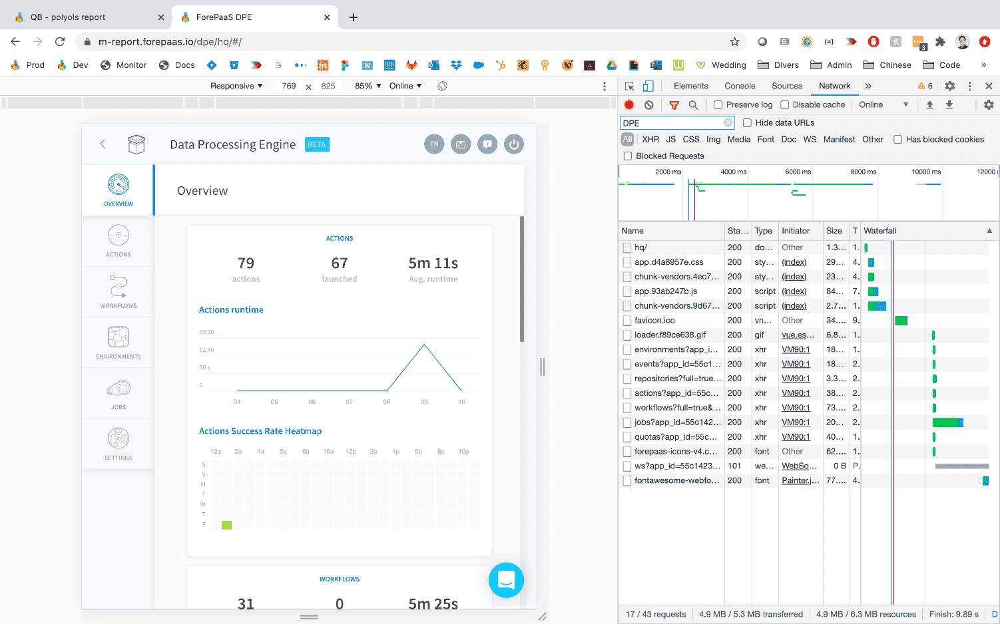

This will open your browser’s console window: **navigate to the Network tab**. If no calls are visible, simply *press F5 or refresh your page*. You should see a list of calls available like in the screenshot above. 

Right-click on the one starting with “workflows” or “actions”, navigate to the option **Copy** and select **Copy as cURL**. You have now copied a cURL call which already contains your secret access token to your clipboard.

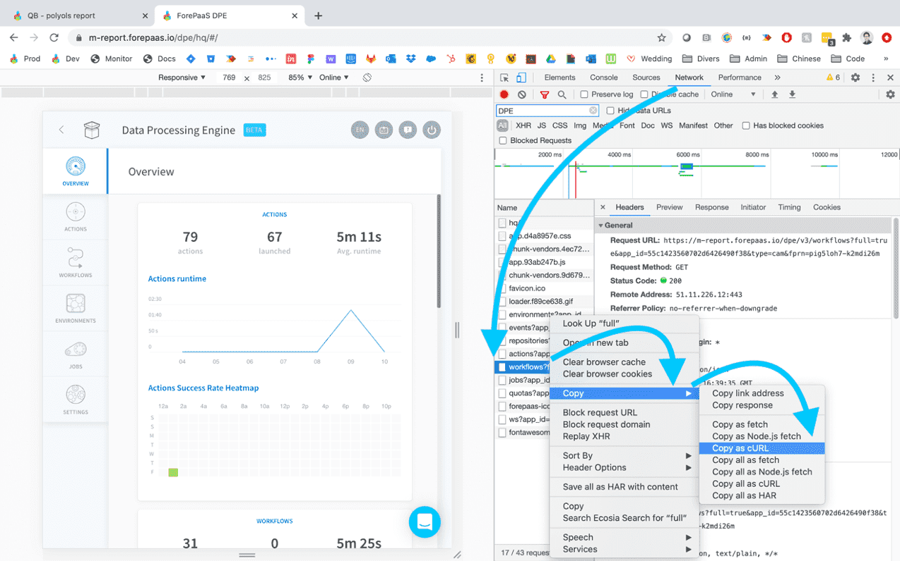

Now open Insomnia and paste the cURL inside the main header at the top of the window (on the right side of the Insomnia title next to the *Get* dropdown button):

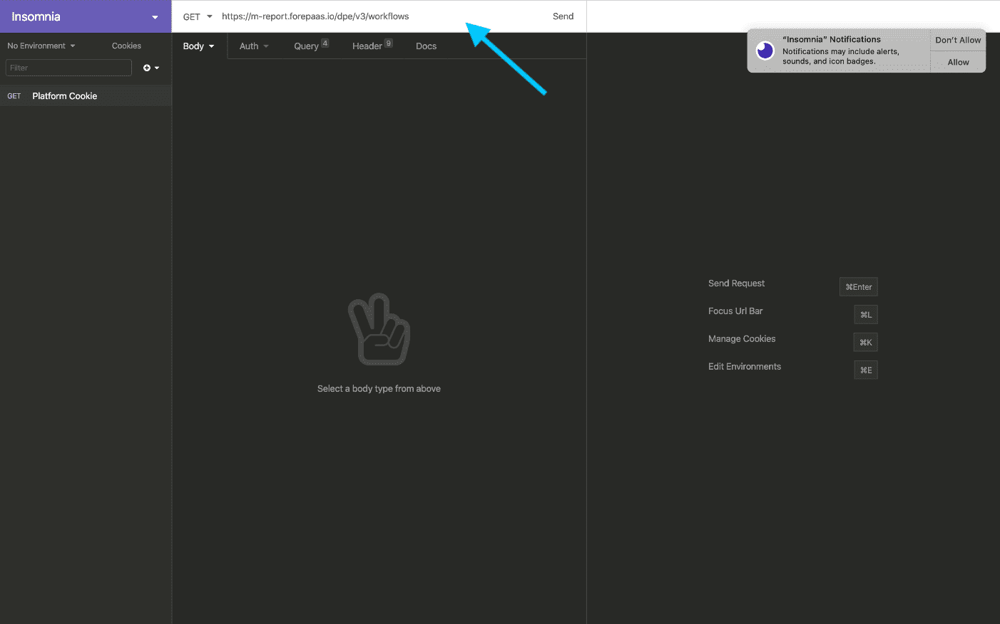

When you copy-paste the cURL, Insomnia will **automatically detect all the parameters of the call and fill the form** for you. The only thing left for you to do is simply to change the main API call,  instead of the one that you’ve just copy-pasted, and keeping the same list of *Header* parameters. 

---
## How to export/import a configuration with an API call

This section will demonstrate how to use an API call to export or import the configuration of a specific component in your Project. 

?> The detailed [list of calls per component](#exportimport-api-calls-per-component) is available in the next section. 

As a general rule make sure to:
* use a *GET* method when doing an *Export* 📤 call
* use a *POST* method when doing an *Import* 📥 call

The following example will go through the whole procedure to export and then import the configuration for the Data Processing Engine. 

### How to export a configuration

First, *export the configuration* by copy-pasting the [corresponding URL](#exportimport-api-calls-per-component), change to *GET* and click on *Send*.  
If the call is successful you will see on the right side the *TGZ* file in the return response which you can download on your local machine. You can see on the screenshot below that the *TGZ* (tar gzipped) file is not readable because its compressed.

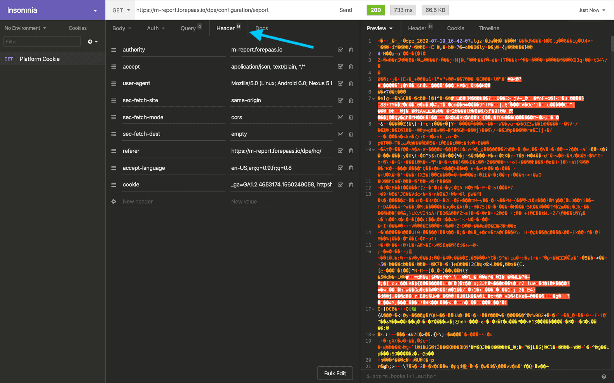


### How to import a configuration

Now, let's **import the same TGZ file** which contains the Data Processing Engine's configuration. Change the *GET* method to *POST* and change the *Body* type to *Multipart Form* like shown on the screenshot below. 

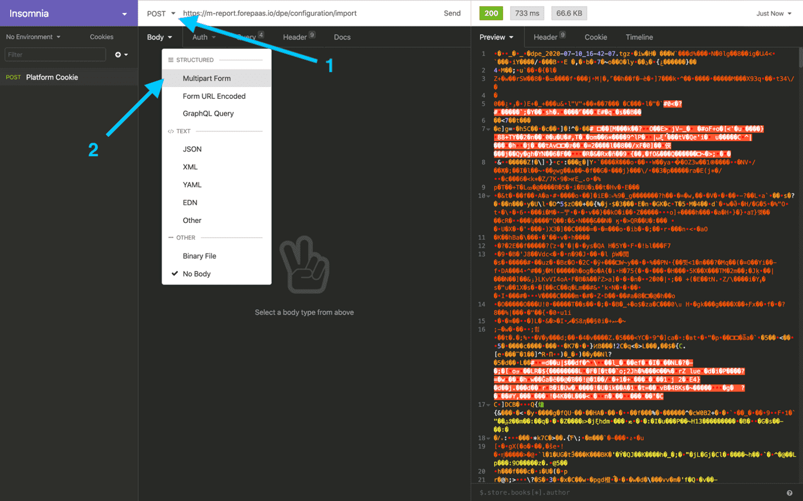

By choosing the *Multipart Form* you have the option to add parameters in the body and in particular load the *TGZ* file that you exported earlier as part of the request. 

In the first input, type in `archive`, and on the dropdown arrow next to value select the *File* option. This will let you select directly a file from your computer to load.

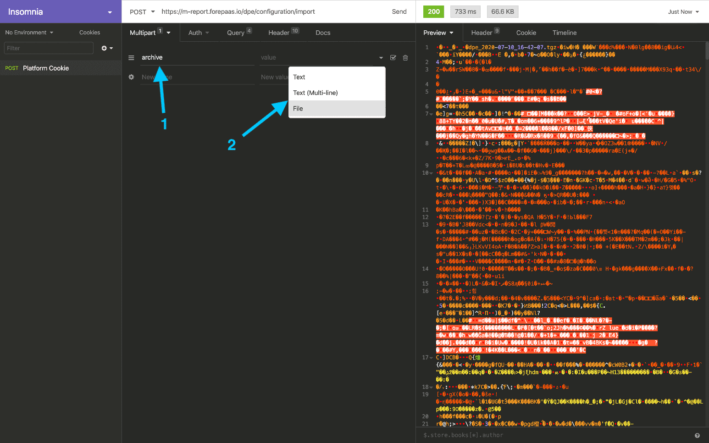

Select the *TGZ* file you want to load into your Project:

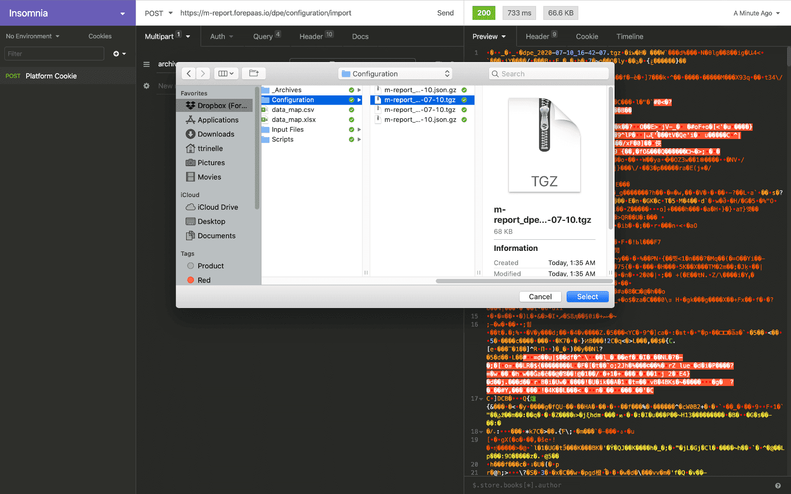

Press **Send** 📨

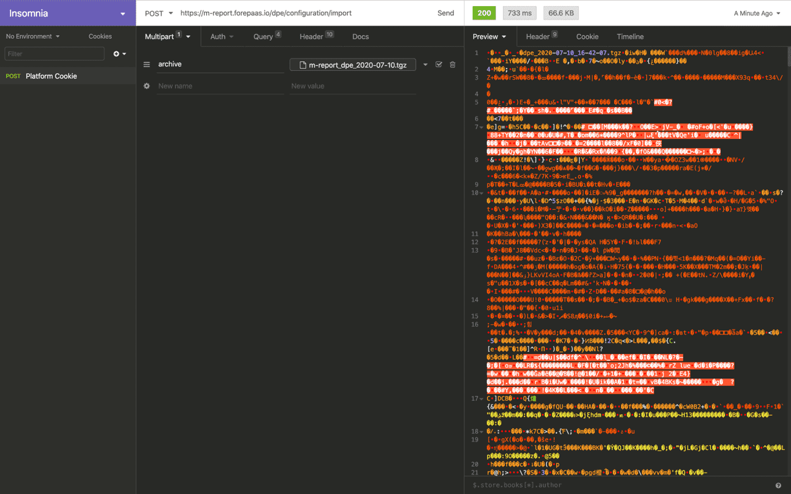

That’s it! Now refresh your Project page and you should see all the component configuration updated.

---

## Export/Import API calls per component

Here are listed the various API calls to export/import the configuration of each component in your Project.
  
  * [Data Catalog and Lakehouse Manager](#data-catalog-and-lakehouse-manager)
  * [Data Processing Engine](#data-processing-engine)
  * [Analytics Manager](#analytics-manager)
  * [Machine Learning Manager](#machine-learning-manager---only-available-on-legacy-forepaas-platform) - *Only available on Legacy ForePaaS Platform*
  * [Identity Access Manager](#identity-access-manager---iam)

As a general rule, make sure to:
* use a *GET* method when doing an *Export* 📤 call
* use a *POST* method when doing an *Import* 📥 call

!> Don't forget to change `datademo` with your Project name and access token with its actual value. You can find the [slugified](https://en.wikipedia.org/wiki/Clean_URL#Slug) version of your Project name in the [Control Center](/en/product/cc/index).

### Data Catalog and Lakehouse Manager

#### Export

```bash
curl --url 'https://datademo.eu.dataplatform.ovh.net/dwh/v4/configuration/export' \
 --request GET \
 --header 'Authorization: Bearer TOKEN' \
 --output dwh-settings.tgz
```

#### Import

```bash
curl --url 'https://datademo.eu.dataplatform.ovh.net/dwh/v4/configuration/import' \
 --request POST \
 --header 'Authorization: Bearer TOKEN' \
 --form archive=@dwh-settings.tgz
```

---
### Data Processing Engine

#### Export

```bash
curl --url 'https://datademo.eu.dataplatform.ovh.net/dpe/v3/configuration/export' \
     --request GET \
     --header 'Authorization: Bearer TOKEN' \
     --output dpe-settings.tgz
```

*Query parameters*:

| Parameter | Description |
| :-------  | :---------- |
| `filters` | The type of resources you want to extract (actions, workflows or environments), and the resources you want to export by name. By default all resource types will be exported. Example: `filters : {"action" : ["action1", "action2"]}` |


> It is also possible to call */dpe/configuration/export* as *POST* and pass `filters` in a JSON object.
```bash
curl --url 'https://datademo.eu.dataplatform.ovh.net/dpe/v3/configuration/export' \
     --request POST \
     --header 'Authorization: Bearer TOKEN' \
     --header 'Content-Type: application/json' \  
     --data '{"filters":{"action" : ["action1", "action2"]}}'
     --output dpe-settings.tgz
```


#### Import

```bash
curl --url 'https://datademo.eu.dataplatform.ovh.net/dpe/v3/configuration/import' \
 --request POST \
 --header 'Authorization: Bearer TOKEN' \
 --form archive=@dpe-setting.tgz
```

*Query Parameters*:

| Parameter | Description |
| :-------  | :---------- |
| `sourceType` | Can be *tgz* (default) or *url*  |
| `sourceParam` | When using *sourceType=url* , the URL the archive to import |
| `response` | By default, DPE import is asynchronous. Set to *true* to make it synchronous |

*Body parameters*

| Parameters | Description |
| :--------- | :---------- |
| `sourceParam` | When using *sourceType=url* , the URL the archive to import |
| `archive` | The archive containing your configurations if *sourceType=tgz* |

---
### Analytics Manager

#### Export

```bash
curl --url 'https://datademo.eu.dataplatform.ovh.net/query-admin/v3/configuration/export' \
 --request GET \
 --header 'Authorization: Bearer TOKEN' \
 --output am-settings.tgz
```

#### Import

```bash
curl --url 'https://datademo.eu.dataplatform.ovh.net/query-admin/v3/configuration/import' \
 --request POST \
 --header 'Authorization: Bearer TOKEN' \
 --form archive=@am-settings.tgz
```

---
### Identity Access Manager - IAM

#### Export

```bash
curl --globoff --url 'https://datademo.eu.dataplatform.ovh.net/iam/v4/backup/export?filters[applications]=true&filters[configuration]=true&filters[groups]=true&filters[mails]=true&filters[roles]=true&filters[authentication_providers]=true&filters[users]=true&filters[service_accounts]=true' \
 --request GET \
 --header 'Authorization: Bearer TOKEN' \
 --output iam-settings.json
```
The response is a complete JSON of all configurations of the IAM (format .json). 
It is possible to **select subsets of the configuration** using `filters[]` in the *Query parameters*.

#### Import

!> **Please make caution when importing IAM configuration** as it will: **reset Project's private key**, **reset current sessions**, **all passwords** (using Project Auth Provider), and **all API Key / Secret Key**. 
This will **remove existing configurations, applications, users, groups, etc**. 
This is done on the basis of the configuration imported, so it may concern only a **configuration subset** selected when exporting.

```bash
curl --url 'https://datademo.eu.dataplatform.ovh.net/iam/v4/backup/import' \
 --request POST \
 --header 'Authorization: Bearer TOKEN' \
 --header "Content-Type: application/json" 
 --data @iam-settings.json
```

The JSON to import is directly in the *Body* part.

---
## Creating reusable Project templates

!> This feature is temporarily unavailable. Please reach out to our support if you need help with exporting a Project template.

If you don't feel like doing API calls, you can also store the configuration of a Project as a **reusable template** in the interface. The template can then be used when [creating a new Project](/en/product/project/project_creation.md), for instance, if you want to deploy one Project per Project (e.g. construction sites, stores, or power plants, etc...).

To export a Project's configuration to the internal ForePaaS marketplace, open the Project you'd like to export and click on the gear ⚙️ icon in the header.

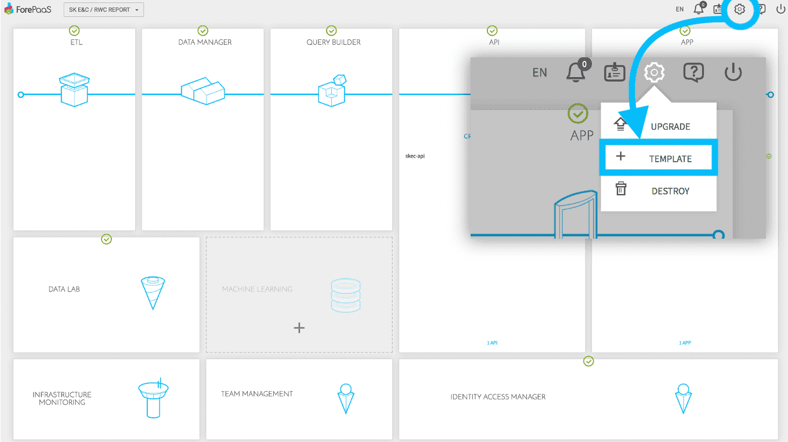

Give a name to your template and choose whether you want to keep the template *private*:
* A *private* template will only be available inside your organization.
* A *public* template will be available by everyone on ForePaaS when creating a new Project.

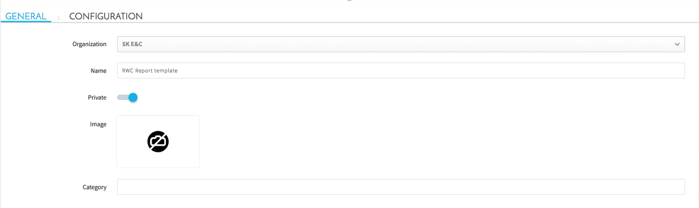

Under the *configuration* tab you can select which components' configuration you would like to save in your template. You may want to keep for instance the DPE actions, workflows and the Data Manager's data model without exporting the application.

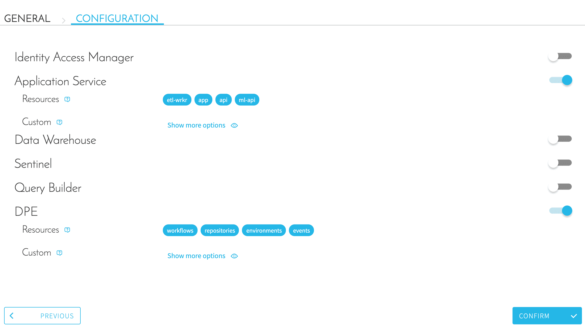

**Press confirm** and that's it! You're good to go, you will now be able to access your template when creating a new Project.

---

## Not finding what you're looking for? 🔍

> If you are logging-in with an OVHcloud account, you can create a ticket to raise an incident or if you need support at the [OVHcloud Help Centre](https://help.ovhcloud.com/csm/fr-home?id=csm_index). Additionally, you can ask for support by reaching out to us on the Data Platform Channel within the [Discord Server](https://discord.com/channels/850031577277792286/1163465539981672559). There is a step-by-step guide in the [support](/en/support/index.md).