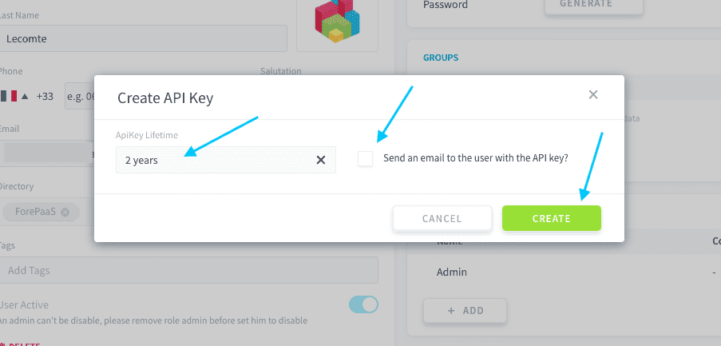
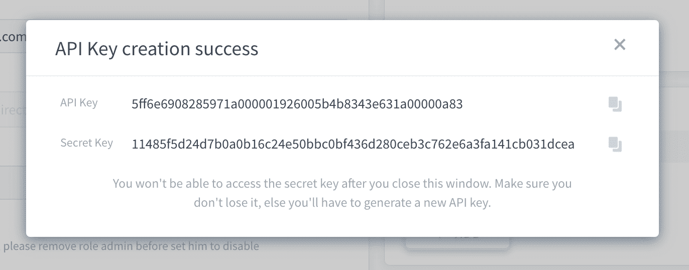

# Generate API and secret keys for a user / service account

If you want to connect to the Data Platform from outside of the platform, you will need to generate **API and secret keys** to authenticate. The *API key* is the public key associated to the user who is connecting to an API. The *secret key* is the private key known only to the user. The combination of the two is used to authenticate, through the generation of temporary [authentication tokens](#generate-an-authentication-token).

API and secret keys can be generated per [user](/en/product/iam/users/users) or [service account](/en/product/iam/users/service-accounts).

* [Generate new API/secret keys](#generate-a-new-set-of-api-and-secret-keys)
  * [For a user](#for-a-user)
  * [For a service account](#for-a-service-account)
* [Generate an authentication token](#generate-an-authentication-token)

---
## Generate a new set of API and secret keys
### For a user

Navigate to the **Users** tab of the Identity Access Manager. Search for the user for which you want to generate API & Secret keys, using the search bar on the top right if needed. Edit the user.


In the user's settings, scroll down to the **API Access** panel and click on *Add access*.


Select the lifetime of the keys (i.e. the expiration date from today) and whether you want to send an email to the user with the API & secret key information. Then press **Create**.

> 💡 The *Default* value can be changed in your Identity Access Manager settings.



A new window will open with the API and secret key values.

!> After closing the window, there is no way to view the secret key again. Make sure you keep a record a the keys either by sending an email to the user or storing them in your code.



To delete a key, hover over the key that you would like to delete and click on the **trash** 🗑️ icon. Once the key is deleted, the credentials for the keys will become inactive and cannot be use to authenticate anymore.


### For a service account

Navigate to the **Service Accounts** tab of the Identity Access Manager. Search for the service account for which you want to generate API & Secret keys, using the search bar on the top-right if needed.


In the service account settings, locate the **API Access** panel and click on *Add access*.


After that, the [process is the same as for users](#for-a-user). Note that if you want to send an email with a record of the API and secret keys, you need to fill in an email address for the service account.


---
## Generate an authentication token

### Generation scripts

Once you've created API & secret keys, you need to generate a dynamic authentication token in order to authenticate to ForePaaS via an API endpoint. Authentication tokens are only active for a short time: this duration can be configured in your IAM settings.


To generate a token, simply run the command samples below.

<!-- tabs:start -->
#### **cURL**
```bash
curl --request POST \
  --url https://{project_subdomain}.eu.dataplatform.ovh.net/iam/login \
  --header 'Content-Type: application/json' \
  --data '{
    "auth_mode": "apikey",
    "apikey": "",
    "secretkey": ""
  }'
```

#### **Python 3+**
```python
import requests

url = "https://{project_subdomain}.eu.dataplatform.ovh.net/iam/login"

payload = {
  "auth_mode": "apikey",
  "apikey": "",
  "secretkey": ""
}

response = requests.request("POST", url, data=payload)

print(response.text)
```
<!-- tabs:end -->

!> Make to update the **{project_subdomain}** else your calls won't go through.  
[How to find your Project subdomain.](/en/product/project/config-ids?id=project-subdomain)


---
##  Need help? 🆘

> If you are logging-in with an OVHcloud account, you can create a ticket to raise an incident or if you need support at the [OVHcloud Help Centre](https://help.ovhcloud.com/csm/fr-home?id=csm_index). Additionally, you can ask for support by reaching out to us on the Data Platform Channel within the [Discord Server](https://discord.com/channels/850031577277792286/1163465539981672559). There is a step-by-step guide in the [support](/en/support/index.md).