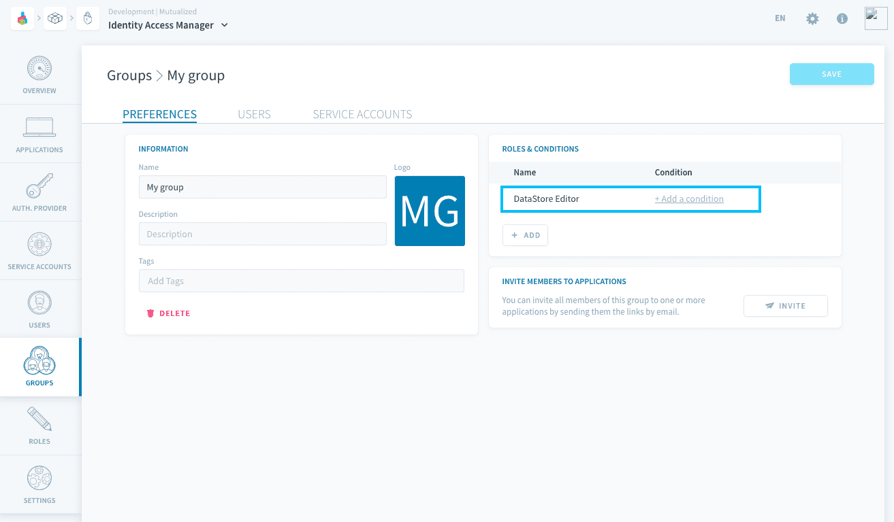
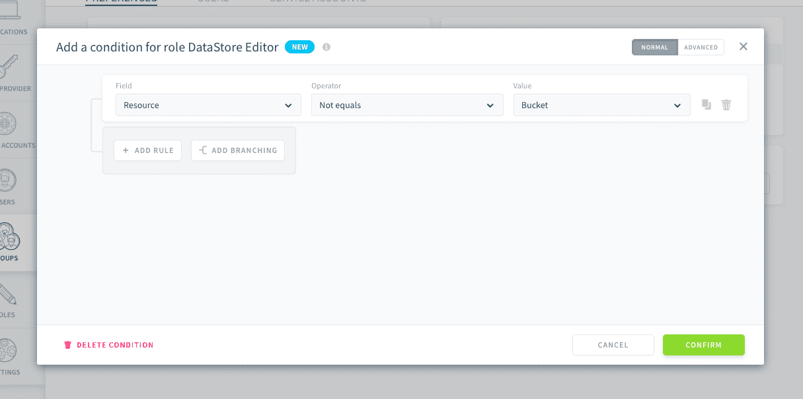
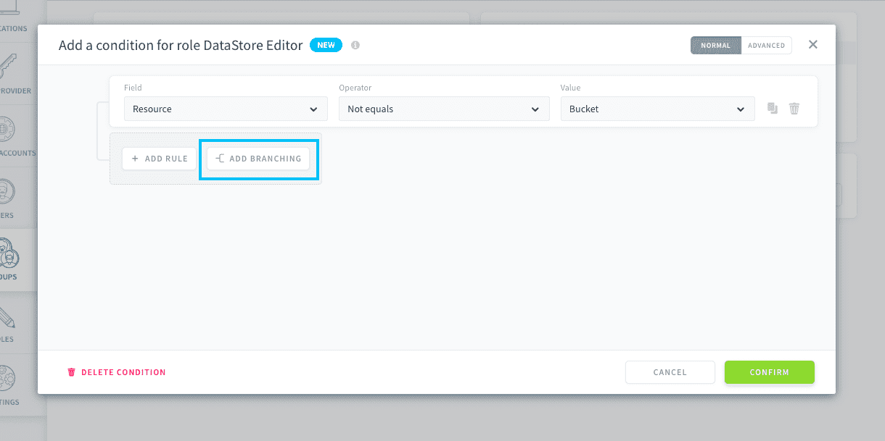
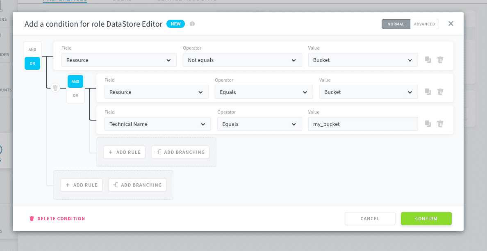
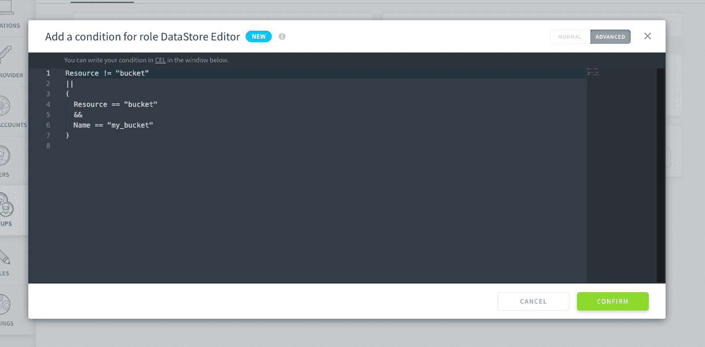

# How to set a role condition on a specific bucket

The Data Platform [Identity Access Manager (IAM)](/en/product/iam/index) allows you to set fine-grained conditions in your Project:
- on resources properties
- on users properties
- on data, through Advanced Data Access Control

The purpose of this tutorial is to show how to give users in your Project restricted access to only the [Lakehouse Manager bucket](/en/product/lakehouse-manager/buckets/index) called *my_bucket*.

--- 
## Requirements

You will need:
- an [IAM role](/en/product/iam/users/roles) that grants access to the resource `bucket` (such as the default "DataStore Editor" role)


---
## Tutorial

To restrict access to specific [buckets in your Lakehouse Manager](/en/product/lakehouse-manager/buckets/index), you must set a condition on the ***technical name*** when binding a role granting access to *Data Store buckets*.

> Data Store is the original name of the buckets on Data Platform.

[Bind](/en/product/iam/users/roles?id=bind-a-role-to-a-user-service-account-or-group) such a role to the group/user of your choice.

Then, add a [condition](/en/product/iam/users/roles?id=set-up-a-condition-on-a-role-binding) to the role binding. 



The condition must be set on the *technical name* of the resource, which intuitively would look like the following:

```cel
Name == "my_bucket"
```

However, just adding this condition would filter **the entire role** to the resources called "my_bucket", including resources that are not buckets (like queries, dashboards, pipelines, etc..). In other words, if your role gives access to any other resource, they will be filtered just like buckets.

Consequently, it is recommended to set conditions as follows.


### Using the visual builder

If your initial role grants access to other resources, it is important to start by adding a first **rule** which will allow access to all resources that are not buckets which are planned by the role.

> Through conditions, you cannot give access to resources/actions that were not initially permitted by the role. Conditions can only filter a role further.

- Field: *Resource*
- Operator: *Not equals*
- Value: *Bucket*



Then, add a **branching** with an *OR* operator. 



In the branching, add two rules linked by an *AND* operator.

First rule:
- Field: *Resource*
- Operator: *Equals*
- Value: *Bucket*

Second rule:
- Field: *Technical name*
- Operator: *Equals*
- Value: *my_bucket*



Press **Confirm**. The user/group will now have access only to the bucket "my_bucket", and access to all other resources contained in the role.

> This branching system can also be used to restrict *write*/*delete* access to only some objects (for example, the ones that have the tag "dev") while allowing *read* access to the remaining objects.


### Using the CEL editor

In CEL, the condition would be the following:

```cel
Resource != "bucket"
||
(
  Resource == "bucket"
  &&
  Name == "my_bucket"
)
```




---
<p><span style="color:blue; font-size:20px;"><b> More! </b></span></p>

Did you like this tutorial? Want more? Don't worry we got you covered, you can deep dive into the customization capabilities of the Identity Access Manager in our documentation!

{Learn more about roles and conditions}(#/en/product/iam/users/roles)

Also, don't hesitate to **get in touch** if you need anything, our support & product team is dedicated to helping you deliver faster any AI applications you have in mind.

> If you are logging-in with an OVHcloud account, you can create a ticket to raise an incident or if you need support at the [OVHcloud Help Centre](https://help.ovhcloud.com/csm/fr-home?id=csm_index). Additionally, you can ask for support by reaching out to us on the Data Platform Channel within the [Discord Server](https://discord.com/channels/850031577277792286/1163465539981672559). There is a step-by-step guide in the [support](/en/support/index.md).
