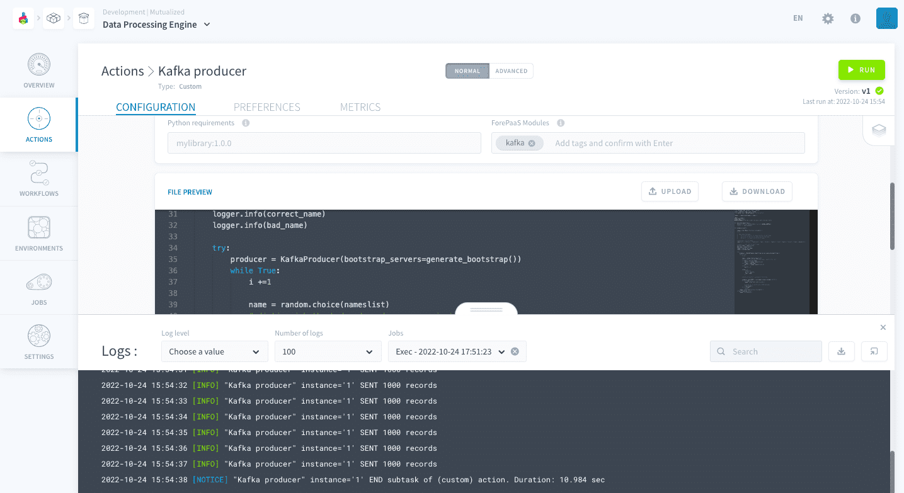
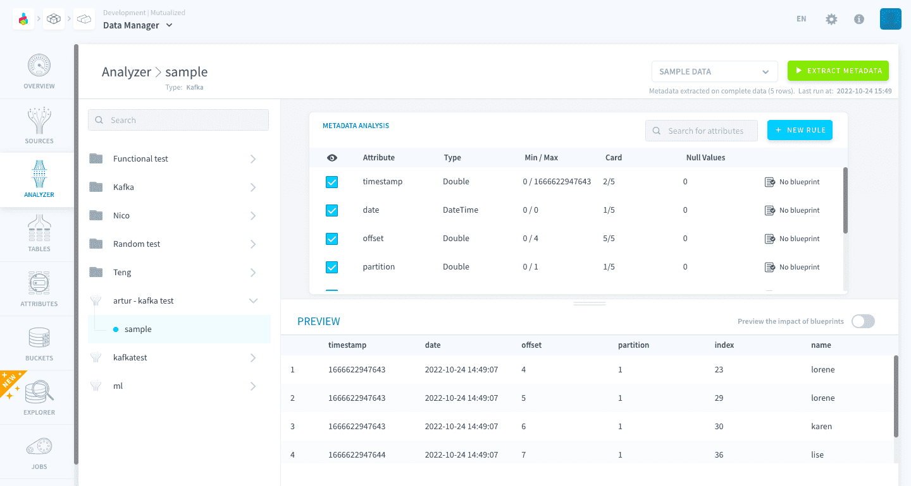
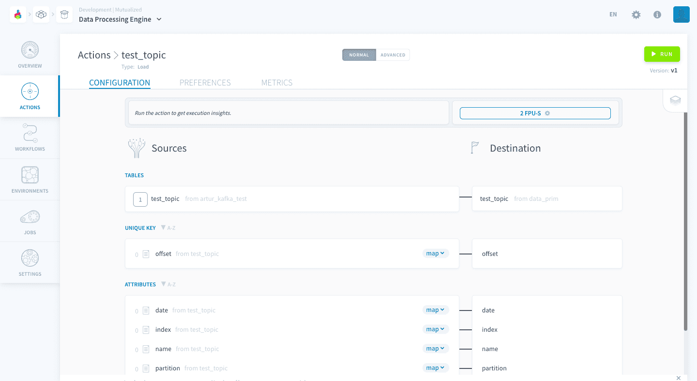
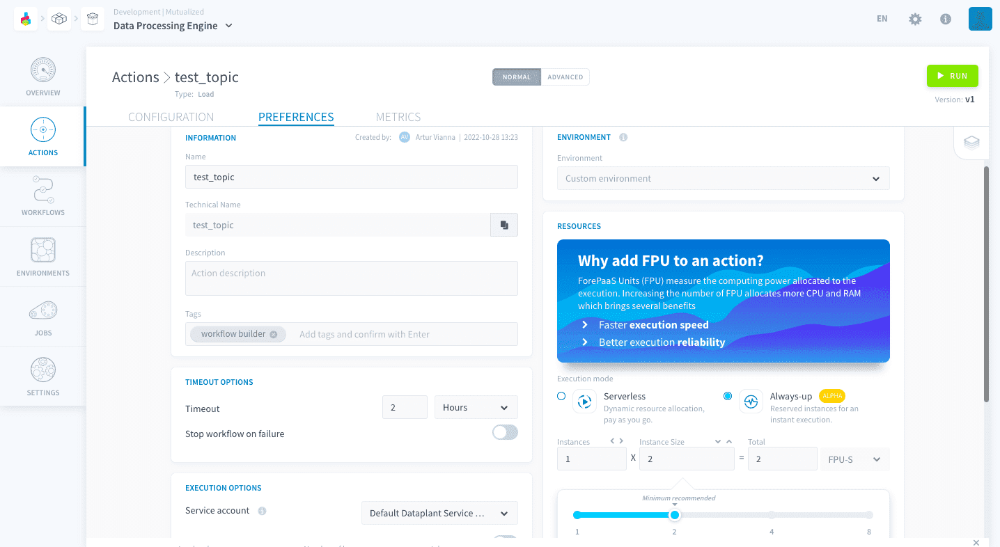
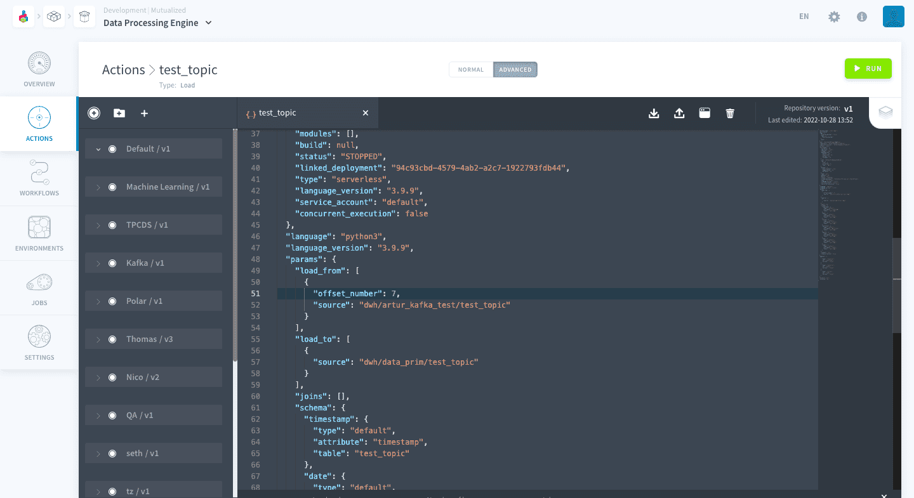

# Stream data from Apache Kafka to the Platform

This tutorial demonstrates how to use the data from an Apache Kafka Broker in the platform.  
The first section is dedicated to creating some test data on your Kafka server. If you already have messages on your Broker, you can skip this step. 

* [Introduction](#introduction)
  * [Requirements](#requirements)
  * [Concepts overview](#concepts-overview)
* [Setting-up test data (optional)](#setting-up-test-data-optional)
* [Connecting your Kafka server to Data Platform](#connecting-your-kafka-server-to-data-platform)
  * [Configure your Kafka connection](#configure-your-kafka-connection)
  * [Configure your schema](#configure-your-schema)
* [Loading your data into Data Platform](#loading-your-data-into-data-platform)
  * [Configuring the Load Action](#configuring-the-load-action)
  * [Execution modes](#execution-modes)
  * [Automatic segmentation](#automatic-segmentation)
  * [Custom offset](#custom-offset)

---
## Introduction

### Requirements
To follow this tutorial, you need to have a Kafka Broker up-and-running. The sample code provided was written for a server that did not require any particular authentication (i.e. anyone with the IP address can read messages). If your Kafka server has its authentication configured differently, you need to adapt the code used here to deal with that.

Additionally, we recommend having done at least the [first Getting Started tutorial](/en/getting-started/app-init/index2) before doing this one. Here we assume you are comfortable using Data Platform and familiar with the main components of the platform.


### Concepts overview
Data Platform integrates to Apache Kafka through the [Kafka Connector in the Data Catalog](/en/product/data-catalog/sources/connectors/kafka/index.md). This connector allows to retrieve data from one or more topics in the same server to Data Platform.  

Typically, data is then ingested into [Lakehouse Manager](/en/product/lakehouse-manager/index) tables. One [table](/en/product/lakehouse-manager/tables/index) will store data from one topic and **each message in a topic becomes a line** of data in the corresponding table. 

?> **About nested fields...** currently Data Platform only supports JSON-formatted messages without nesting. Therefore only fields that are at the root level of the JSON representation are taken into account. 

Once you've configured your connection to Kafka topics in [Data Catalog](/en/product/data-catalog/sources/connectors/kafka/index.md) and setup your Lakehouse Manager tables, you will need to **load the data** from the topics to the tables by launching a [Load action](/en/product/dpe/actions/load/index) using [Data Processing Engine](/en/product/dpe/index.md). 

After loading the data, your messages will be automatically loaded into Lakehouse Manager tables as long as your action is running. Please note that your actions will be executed in [Serverless execution mode](/en/product/dpe/actions/settings/index?id=serverless) by default, which has a timeout. That is why we recommend you to use the [Always-up execution mode](/en/product/dpe/actions/settings/index?id=always-up) if you are using the [Kafka Connector](/en/product/data-catalog/sources/connectors/kafka/index.md).

Now let's see how all of this works in practice!


---
## Setting up test data (optional)

To send messages to your Kafka broker for test purposes, you can configure a Producer in Data Platform using a [DPE Custom Action](/en/product/dpe/actions/custom/index). Create a Custom Action in the Data Processing Engine, select *start with a boilerplate* and replace the boilerplate code by the one below (a simple name guessing game):

``` python
from forepaas.dwh.connect import connect
import logging, time, json, random
from kafka import KafkaProducer # kafka-python

logger = logging.getLogger(__name__)

TOPIC = "sample"
#   The next two lines MUST be replaced by your own Kafka address and port
KAFKA_PORT="9092"
KAFKA_ADDRESS=["10.152.1.186","10.152.1.187","10.152.7.65"]

def generate_bootstrap():
    servers = [f"{x}:{KAFKA_PORT}" for x in KAFKA_ADDRESS]
    return ",".join(servers)

def customfunc(event):
    logger.info("Begin function customfunc")
    i = 0

    #  Name guessing game: 
    #   - Win 5 to 15 points for guessing the correct name
    #   - Lose 5 to 15 points for guessing the bad name
    #   - No points for guessing the other names

    # generates list of names
    nameslist = ["helene", "francoise", "lea", "lorene", "claire", "lise", "karen", "elise", "elia", "annabele"]

    # select a "bad" and "correct" name
    correct_name = nameslist[0]
    bad_name = nameslist[1]
    logger.info("Correct name:" + correct_name)
    logger.info("Bad name:" + bad_name)

    try:
        producer = KafkaProducer(bootstrap_servers=generate_bootstrap())
        while True:
            i +=1

            name = random.choice(nameslist)
            # distinguish the bad and good names, against the rest
            if name == correct_name:
                points = random.randint(5,15)
            elif name == bad_name:
                points = random.randint(-15,-5)
            else:
                points = 0

            value = {
                "index":i,
                "points":points,
                "name":name,
                }

            # Kafka connection, and publish to broker

            producer.send(TOPIC, json.dumps(value).encode("utf-8"))
            if i % 1000 == 0:
                logger.info("SENT 1000 records")

                # Sleep for 1 second every 1000 messages
                time.sleep(1)
            if i ==10000:
                return
        logger.info("END function customfunc")
    except Exception as err:
        logger.critical(err)
```

The code above represents a name guessing game, it will simply send a messages 
representing guesses. Each message contains an index, a name (the guess) and the points gained for the guess. Once 10 0000 messages have been sent, the action will stop and you should have some messages in your Broker.

!> Do not forget to add the ```kafka``` module to the Python dependencies of your Custom action.

Now, run the action to populate your topic with the test data and stop the action running once a few thousand records have been sent. 



---
## Connecting your Kafka server to Data Platform
### Configure your Kafka connection
The first thing to do is configure your connection to a Kafka server and choose a topic to read data from. If you need help, you can check our dedicated [Apache Kafka Connector article](en/product/data-catalog/sources/connectors/kafka/index.md).

### Configure your schema
Now that your connection and topic are properly configured, you are ready to access your messages. To do it, you need to go to the [Analyzer](/en/product/data-catalog/analyzer/index.md) tab and **extract the metadata** of the topic in your connection. 

The connection will appear on the left sidebar and the topic will be displayed upon clicking on the connection. Select the topic and click on the *Extract metadata* button.



After the metadata extraction, the messages will appear in the preview panel where each line corresponds to a message. Check the boxes on the metadata panel to configure which fields of the message will be included when you use your message in Data Platform.

?> You may notice that there are **additional fields** in your message. The timestamp, date as well as the offset are given by the Broker and correspond to your messages arrival timestamp, arrival date and topic offset respectively. They can be useful for some use cases but, if you don't want to include them in your data Project, simply uncheck them in the Metadata panel and they will be ignored by the rest of the platform.

### Create and build your table
Before loading your data into Data Platform, you need to create and build the table that will store it. If you are not familiar with these concepts you can check our [Tables article](/en/product/lakehouse-manager/tables/index.md). You will probably want to read the [Create a new table](/en/product/lakehouse-manager/tables/canvas_view?id=create-a-new-table) and [Build all tables](/en/product/lakehouse-manager/tables/canvas_view?id=build-all-tables) sections.

---
## Loading your data into Data Platform

### Configuring the Load Action
In comparison to other connectors, there are a few differences when creating a [Load Action](/en/product/dpe/actions/load/index.md) with a streaming source such as Apache Kafka.  

To get started, select the table related to your topic as *Source* when configuring the action (if you already generated the action while creating the table then you will not need to select the table).



### Execution modes
When running a [Load Action](/en/product/dpe/actions/load/index.md) connected to a Kafka source we strongly recommend you to select the [Always-up execution mode](/en/product/dpe/actions/settings/index?id=always-up). 



Regardless of the Execution Mode you use, your action will run until some data arrives. Once it does, it will be loaded into Data Platform.

If you are using the [Serverless execution mode](/en/product/dpe/actions/settings/index?id=serverless), the action will stop running once [timeout](/en/product/dpe/actions/settings/index?id=timeout-options) is reached (by default 2 hours). Given that new data can arrive anytime in your Kafka Broker, this means that you need to re-run this action after it stopped if you want to keep feeding data from your Kafka to Data Platform. That is why **we recommend the use of the [Always-up execution mode](/en/product/dpe/actions/settings/index?id=always-up)**, specially for production environments. 

?> If you don't want to use the [Always-up execution mode](/en/product/dpe/actions/settings/index?id=always-up), you can alternatively set [Time-based triggers](/en/product/dpe/actions/settings/index?id=time-based-trigger) to automatically run your action according to preset time interval.

### Automatic segmentation
When using a Kafka connector, you can benefit from a faster execution time by using the [Automatic Segmentation](/en/product/dpe/actions/settings/segmentation?id=_7-automatic-segmentation) feature. This option is available in the [Preferences of your action](/en/product/dpe/actions/settings/index), use it for heavy workloads!

### Custom offset
One other option available to you is to start reading your messages from a custom offset instead of [configuring your topics](/en/product/data-catalog/sources/connectors/kafka/index?id=configuring-your-topics) to reading from the earliest or latest message. 

To override the *Latest* or *Earliest* offset policy you configured on your topic and start reading messages from a defined offset you have to use the Actions' [Advanced mode](/en/product/dpe/actions/index?id=advanced-mode). Simply add a field inside the ```paras.load_from``` field as the following example (starts reading from offset 7):
```json
"params": {
    "load_from": [
      {
        "offset_number": 7,
        ...
      }
    ],
...
```



?> Note that this will override the *Latest* or *Earliest* offset policy you configured on your topic.

### Technical considerations
Another consideration you should be aware of is that, if you are on *Earliest* mode and you change your destination table after reading the earliest messages, upon a running the Load action again, all messages in the topic will be read again.

This happens because the offset of the last message consumed by Data Platform is stored in the metadata of the destination table of the Data Platform database. If you use a new destination table, the offset will start back from the earliest.


---
##  Need help? 🆘

> If you are logging-in with an OVHcloud account, you can create a ticket to raise an incident or if you need support at the [OVHcloud Help Centre](https://help.ovhcloud.com/csm/fr-home?id=csm_index). Additionally, you can ask for support by reaching out to us on the Data Platform Channel within the [Discord Server](https://discord.com/channels/850031577277792286/1163465539981672559). There is a step-by-step guide in the [support](/en/support/index.md).