# Create a machine learning pipeline using a custom Scikit Learn script

>**Please note:** this tutorial is using the [Machine Learning Manager](en/product/ml/index.md) service that is only available on the *Legacy ForePaaS Platform*. This service is not available on OVHcloud Data Platform.

This tutorial will show you how to use [custom estimators](/en/product/ml/pipelines/configure/training/custom-estimator) in your machine learning [pipelines](/en/product/ml/pipelines/index).

Contrary to [standard estimators](/en/product/ml/pipelines/configure/training/standard-estimator), custom estimators let you upload any piece of Python 3+ code to be executed as a training script in your pipelines. The following tutorial will show examples of an estimator from the [Scikit Learn](https://scikit-learn.org/) framework. 

?> This tutorial also makes use of functions from the [ForePaaS' SDK](/en/technical/sdk/dpe/index), which empower you with the tools to connect to the rest of your data Project on ForePaaS.

---
## Pre-requisites

!> If you haven't been through our [Getting Started tutorial for the Machine Learning Manager](/en/getting-started/ml/index), please go through the following pre-requisites.

Before going through this tutorial: 

* Download [this zip](https://www.dropbox.com/s/ebiforzq20tjos0/ml-data-csv.zip?dl=1) containing the two data files necessary for this guide: *ml_dataset.csv* and *ml_sample.csv*.
* Load the files into your [Data Catalog](/en/product/data-catalog/index):
  * Load them into the **Sources tab** of your Data Catalog.
  * Extract their metadata in the **Analyzer**.
* Build the data models in the [Lakehouse Manager](/en/product/lakehouse-manager/index)
  * Add both tables (respectively naming them *ml_dataset* and *ml_sample*) to your **Tables tab**.
  * Don't forget to enable the corresponding Load actions.
  * Make sure *date* and *station_id* are set as primary keys for both.
  * Save and Build your model by clicking on the **Play** icon
* Process the physical data in your [Data Processing Engine](/en/product/dpe/index) (DPE):
  * Open your DPE and head to the **Workflows tab**.
  * Create a workflow containing both newly created Load actions.
  * Run the workflow and wait a few minutes for the job to be completed.
  * Head back to the Lakehouse Manager, in the list view of the **Tables tab**, and make sure that both tables are filled with data (# of rows is greater than 0).

You're all set! The sample data model you just created will be used by the machine learning model you are about to build.

Ready? Go! 🏃

* [Create a new pipeline](/en/getting-further/ml/custom-sklearn?id=create-a-new-pipeline)
* [Upload a custom training script](/en/getting-further/ml/custom-sklearn?id=upload-a-custom-training-script)
* [Enter custom hyper-parameters](/en/getting-further/ml/custom-sklearn?id=enter-custom-hyper-parameters)

---
## Create a new pipeline

Open the **Machine Learning Manager**. On the welcome page, click on **New Project** and select *Pipeline*.

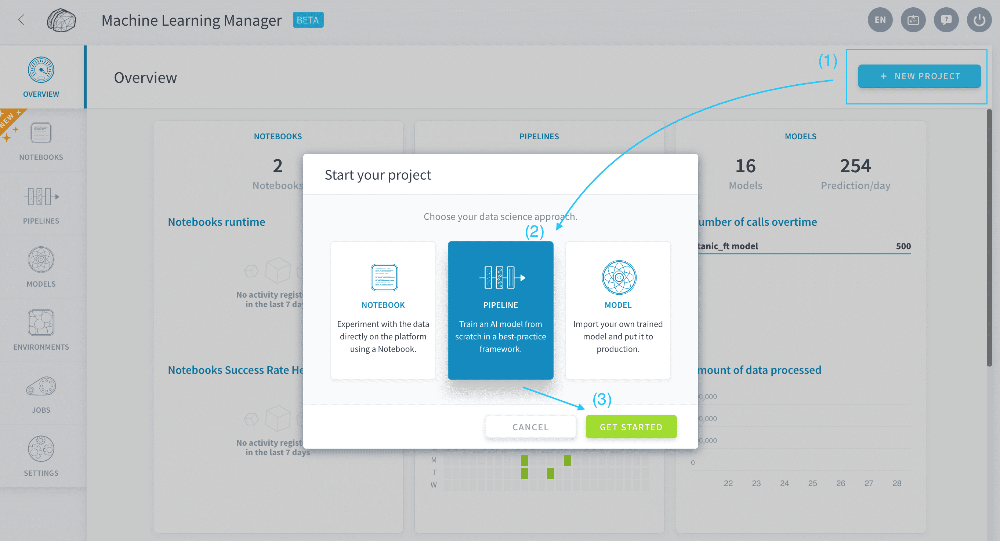

You just created a new ML pipeline on ForePaaS. Open the **Dataset** panel.

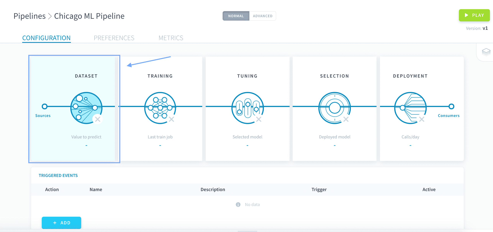

Configure the Data Preparation step of the pipeline [as shown in the Getting Started tutorial **here**](/en/getting-started/ml/dataset?id=prepare-your-datasets), using *ml_dataset* as your input table. Don't forget to remove redundant variables.

Once your screen looks like the screenshot below, click on **Training** to move on to the training procedure.

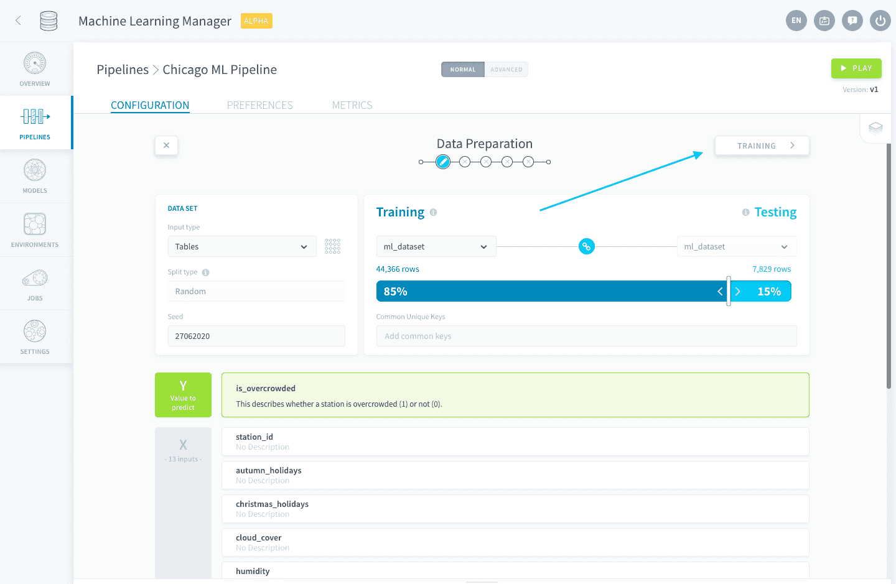


---
## Upload a custom training script

Select **Custom Estimator**. This will let you customize the training procedure for your pipeline.

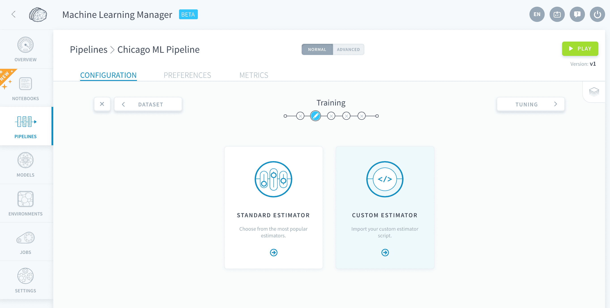

You then need to specify the framework for your pipeline. Select *Custom Scikit Learn*.

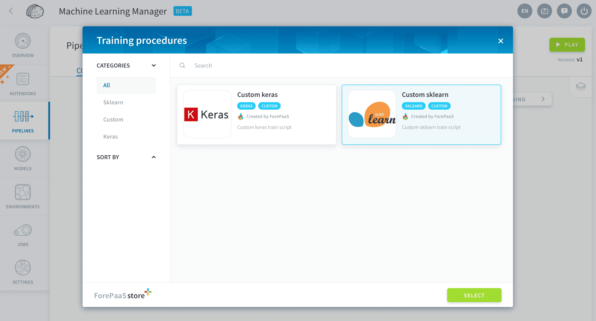

This framework allows you to upload a Python *.py* file containing an estimator compatible with the Scikit Learn library. The supported libraries typically include (but aren't restricted to): Scikit Learn, XGBoost, lightgbm, ...

?> When you select this framework, some packages are imported by default in the pipeline's environment: scikit-learn and the libraries that come out of the box with [ForePaaS' SDK](/en/technical/sdk/dpe/index).

You must now upload a training script in the box below:

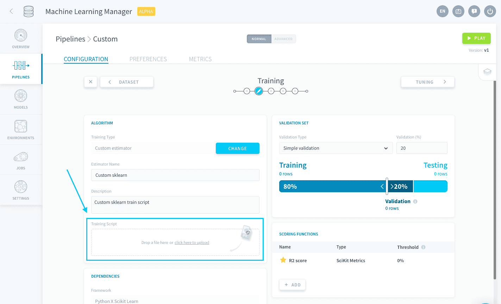

Below is a sample custom estimator, including feature engineering that was tailor-made for the *ml_dataset* example. Following a [scikit-learn example](https://scikit-learn.org/stable/auto_examples/compose/plot_column_transformer_mixed_types.html) and using `sklearn.pipeline`, the script includes:
* use [ForePaaS' SDK functions](/en/product/ml/pipelines/configure/training/custom-estimator?id=common-features-from-sdk) to retrieve:
  * your train and test datasets (configured previously)
  * your validation configuration (left to the default 80%/20% in the interface)
  * and the hyper-parameters grid (that you will register later on)
* scaling of numerical variables
* basic processing (one-hot encoding) of some categorical variables
* fitting a *RandomForestClassifier* estimator with hyper-parameter tuning and validation

```py
import numpy as np

from sklearn.compose import ColumnTransformer
from sklearn.pipeline import Pipeline
from sklearn.impute import SimpleImputer
from sklearn.preprocessing import StandardScaler, OneHotEncoder

from sklearn.ensemble import RandomForestClassifier
from sklearn.model_selection import GridSearchCV
from sklearn.metrics import make_scorer

from forepaas.core.settings import ML_CONFIG
from forepaas.ml import get_train_dataset, get_hyper_parameters, get_train_scoring_function


def my_random_forest(event):
    # Retrieve train dataset. No need to split it since it will be done by cross validation
    x, y = get_train_dataset()

    # Retrieve validation settings.
    cv = ML_CONFIG["train"]["execution_options"]["cross_validation"]
    if not cv:
        cv = get_shuffle_split(x, y)

    # Retrieve scoring function used for the validation score, and make it compatible with scikit's gridSearchCV
    scoring_function = get_train_scoring_function()
    scoring = make_scorer(scoring_function["func"])

    # Retrieve hyper parameters.
    hyper_parameters = get_hyper_parameters()

    # Set Column Transformers
    numeric_features = ['cloud_cover','humidity','temperature','wind_speed']
    numeric_transformer = Pipeline(steps=[
        ('imputer', SimpleImputer(strategy='median')),
        ('scaler', StandardScaler())])

    categorical_features = ['station_id','month','week_day']
    categorical_transformer = OneHotEncoder(handle_unknown='ignore')

    preprocessor = ColumnTransformer(
        transformers=[
            ('num', numeric_transformer, numeric_features),
            ('cat', categorical_transformer, categorical_features)])

    # Append classifier to preprocessing pipeline.
    # Now we have a full prediction pipeline.
    clf = Pipeline(steps=[('preprocessor', preprocessor),
                      ('classifier', RandomForestClassifier())])
    # Start grid search with cross validation
    grid_search = GridSearchCV(clf, hyper_parameters, scoring=scoring, cv=cv, return_train_score=True)
    grid_search.fit(x, y)
    return grid_search


def get_shuffle_split(x, y):
    from sklearn.model_selection import ShuffleSplit

    ratio = ML_CONFIG["train"]["ratio"]

    rs = ShuffleSplit(n_splits=1, test_size=ratio)
    return rs.split(x)
```

Save the above snippet as a *.py* file and upload it in your ForePaaS pipeline.


When a [Training job is launched](/en/product/ml/pipelines/execute/index.md?id=training-jobs), this *.py* file is the file that will be executed. It contains a function that has `event` as its first argument and returns a fitted estimator based on the training dataset.

This function's name, here `my_random_forest`, must be written down in the *function name* box.

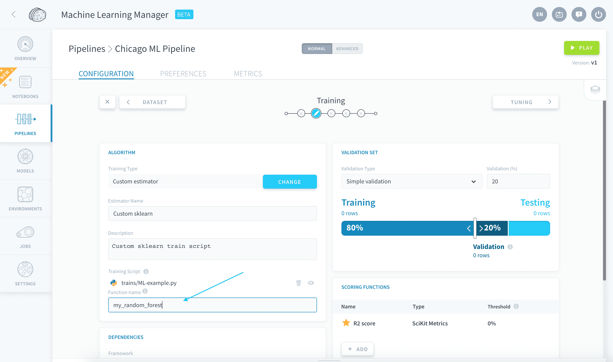

Leave the validation configuration as it is by default: the validation set is a random extract of 20% of the training set.


Now the last step is for you to specify a grid of hyper-parameters to optimize on.

---
## Enter custom hyper-parameters

Move on to the **tuning** step of the pipeline.

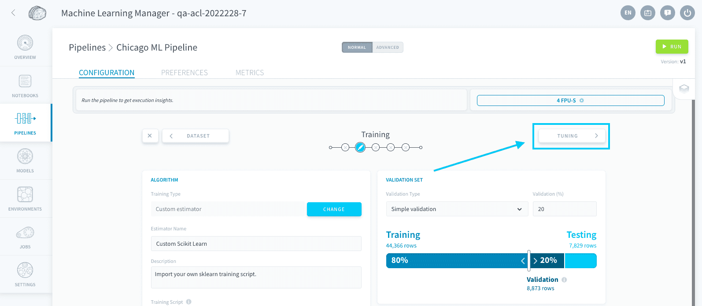

If you were using a **standard** Scikit Learn estimator, this page would be pre-populated with all the hyper-parameters for the estimator and their default value. However, since you are using a custom script, this hyper-parameter tuning studio **turns into a registry of key-value objects that you can pass on to your training script**.

?> If you don't change anything here, running the pipeline will train the Scikit Learn model using the default value for all its hyper-parameters. 

Create a new hyper-parameter by clicking on **Add**.

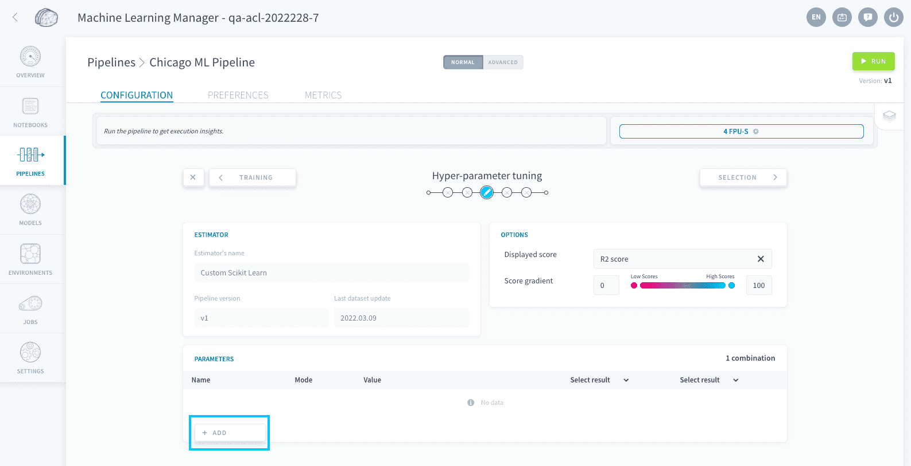

The code snippet previously used for the training script encapsulates the `RandomForestClassifier()` inside of a `Pipeline` object, in the *classifier* step. For this reason, all the parameters that you want to pass on to the RandomForestClassifier should start with *nameOfTheStepInSklearnPipeline__* (double underscore).

In this case, if you want to add a grid search on the hyper-parameter `n_estimators`, name it *classifier__n_estimators*.

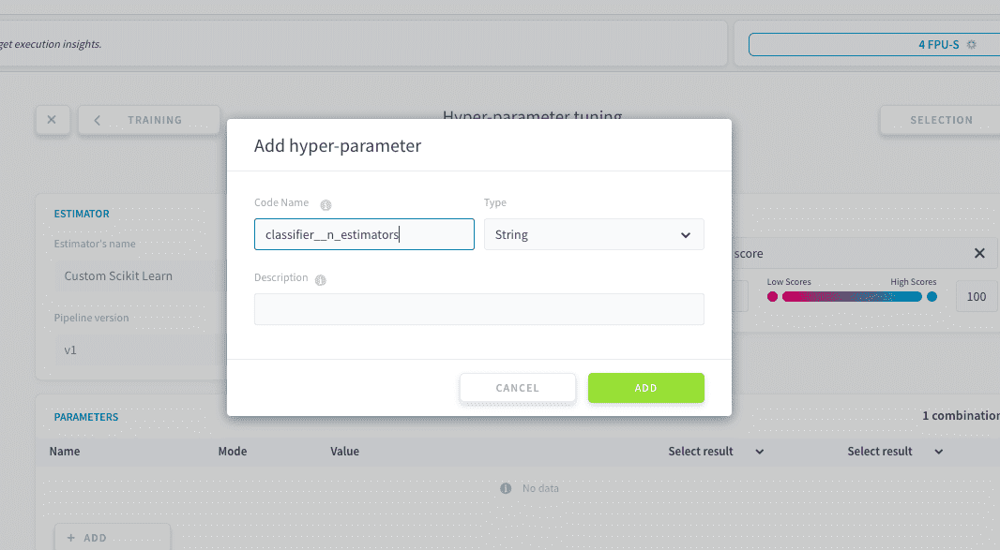

Make sure to switch its type to *Number*.

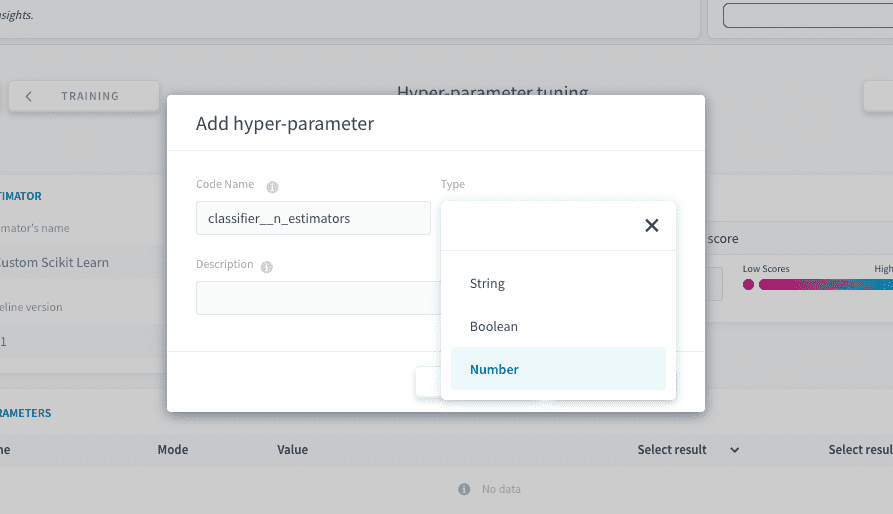

Now, switch the mode to **Multiple**. Remove the empty option, and add a few values, pressing Enter between each: *5*, *10*, *50*, *100*, *500*, *1000*.

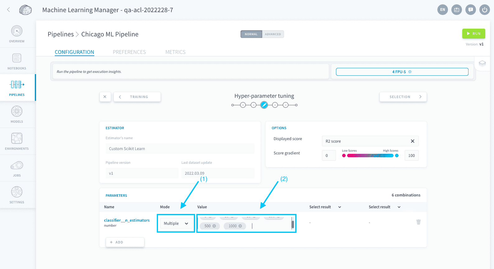

Now, it is time to run your ForePaaS pipeline. Press **Play** at the top-right, and [play all steps](/en/product/ml/pipelines/execute/index). 

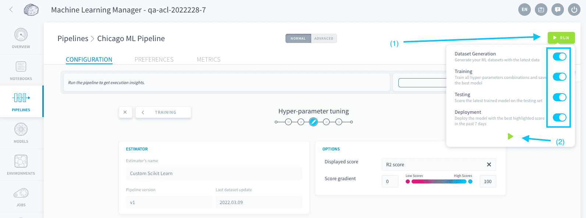

Your ForePaaS pipeline is going to train 6 different combinations, keep the model with the best score on the validation set, score it on the testing set, then deploy it (served by a model API). This can take up to 10 minutes.

Move to the model selection step to view your deployed model when your pipeline execution is finished.

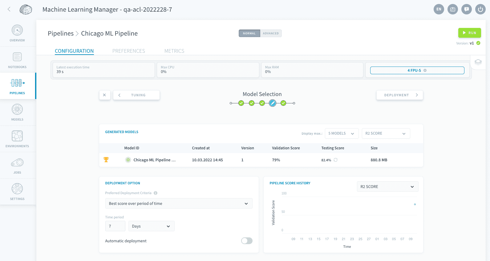

That's it! Your custom ML model is live and accessible by your users. You can add [consumers](/en/product/ml/pipelines/configure/deployment/index) on the model API to use the model for live or batch predictions. You can also add [triggers](/en/product/ml/pipelines/execute/triggers) to automatically retrain/redeploy. 

---

<p><span style="color:red; font-size:20px;"><b> Congrats! 🎉🎊</b></span></p>

**You've completed this ForePaaS Getting Further tutorial!** You're now ready to build your own custom machine learning pipelines.

> Please take 3 min ⌛to fill in [this short survey](https://forms.office.com/Pages/ResponsePage.aspx?id=nDWzgpGTfE2g8oFnUal2QTTUCIkDw9dBkuMh8LM8xBBUOVpZT1RUMFBRUk5BWjNLSzBCNVhDSVgyNS4u). It will help us understand 🧐 what worked well and what didn't in your experience, in order to make this tutorial even better.


Obviously, you can come back to this tutorial at any time! We encourage you to check out the rest of the documentation to dive deeper into a specific component of the product when needed.


---

<p><span style="color:blue; font-size:20px;"><b> More! </b></span></p>

Did you like this tutorial? Want more? Don't worry we got you covered, you can deep dive into the customization capabilities of the Machine Learning Manager in our documentation!

{Learn more about custom estimators}(#/en/product/ml/pipelines/configure/training/custom-estimator)

Also, don't hesitate to **get in touch** if you need anything, our support & product team is dedicated to helping you deliver faster any AI applications you have in mind.

{Give your opinion on the roadmap 🚀}(https://hq.forepaas.io/#/features)


