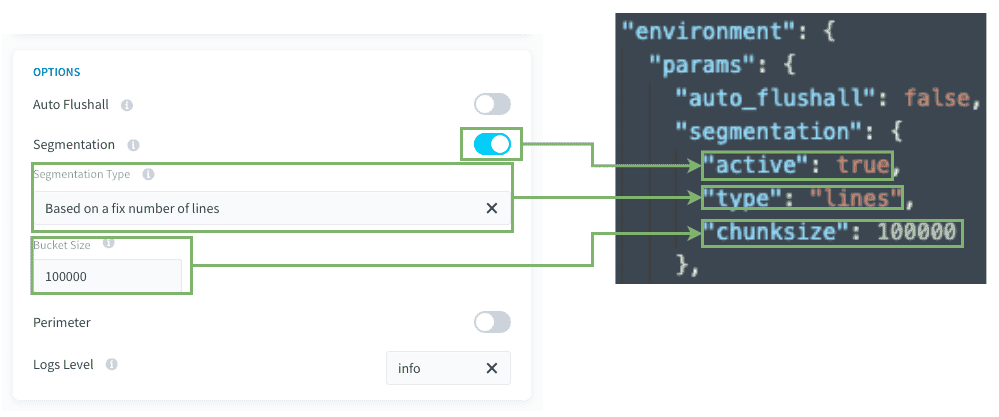
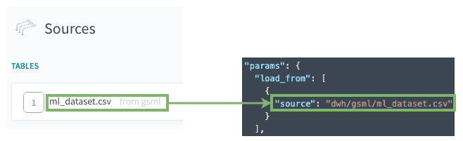
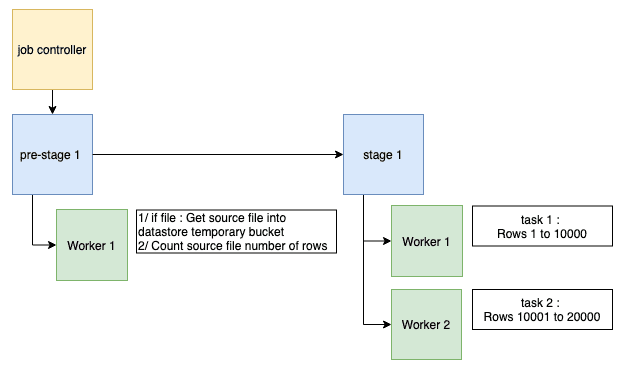

# Discover segmentation by chunking source rows

Sometimes, a CSV file might be huge to absorb. In this case you can choose to segment on the number of rows to improve total load speed. 

- [Prerequisites](/en/getting-further/segmentation/chunk-source?id=prerequisites)
- [How to use this type of segmentation](/en/getting-further/segmentation/chunk-source?id=how-to-use-this-type-of-segmentation)
- [How does it work behind the scenes](/en/getting-further/segmentation/chunk-source?id=how-does-it-work-behind-the-scenes)

---
## Prerequisites

Before using this segmentation type, some points **must be checked**: 

### 1. Avoid generating too many tasks in the same stage. 

To ensure the Data Processing Engine (DPE) performs well, we advise against having stages with more than 500 tasks. 

This is not a hard limit but performance degradations can be observed with increasing number of tasks above 500.
In order to reduce the number of tasks, you can set a higher bucket size, so that each task will manage more rows. (meaning less tasks at the end).

Keep in mind that for each task, the source CSV file will be uploaded again from a datastore temporary bucket into each worker. so if your csv file is huge, you might want to keep the number of tasks low. **Ideally the number of tasks should be the number of workers the job possesses.**

### 2. Is there enough CPU on the destination database? 
 
* Keep in mind that `insert` operations are CPU intensive for your DBMS.
* For example, if your database has only 1 CPU, it's probably a bad idea to set 6 workers to insert simultaneously against the DBMS instance...

> General Rule: 1 CPU should be available for each worker running simultaneously. 

### Compatibility

| Action Types | Source Types |
|          ---        |          ---          |
| <ul><li>Load</li><li>Custom</li></ul> | <ul>**File Formats**: CSV</ul><ul>**Databases**: MySQL, PostgreSQL, SQLServer, Impala, Hive, BiqQuery, ElasticSearch, Cassandra, Redshift, Oracle, SQLServer</ul> |

---
## How to use this type of segmentation?

Here is a quick view between the visible mode and the advanced JSON mode.

  

**Bucket size / Chunksize:** Set how many rows will be absorbed for each task.
 

### Load actions
The [Load action source](/en/product/dpe/actions/load/index) will be the base of the segmentation.

  

### Custom actions 
Make sure that the key `params.load_from[0].source` indicates the address of the source: 
*dwh/SOURCE_NAME/FILE_NAME* or *TABLE_NAME*

> Please check the previous screenshot for an example of the advanced JSON mode.

---
## How does it work behind the scenes?

If your action has a segmentation **Based on a fixed number of lines**,
when executing the action, or the action in a workflow, it will execute:
1. A hidden pre-stage that gets the CSV source file, count its number of rows, then put it in an object-store temporary bucket.
2. The Job Controller splits the action into multiple tasks, each with a different row chunk to ingest.
1. Then each **worker** executes **each task one by one**.  

---
## Need help? 🆘

> If you are logging-in with an OVHcloud account, you can create a ticket to raise an incident or if you need support at the [OVHcloud Help Centre](https://help.ovhcloud.com/csm/fr-home?id=csm_index). Additionally, you can ask for support by reaching out to us on the Data Platform Channel within the [Discord Server](https://discord.com/channels/850031577277792286/1163465539981672559). There is a step-by-step guide in the [support](/en/support/index.md).