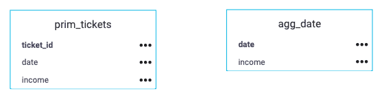
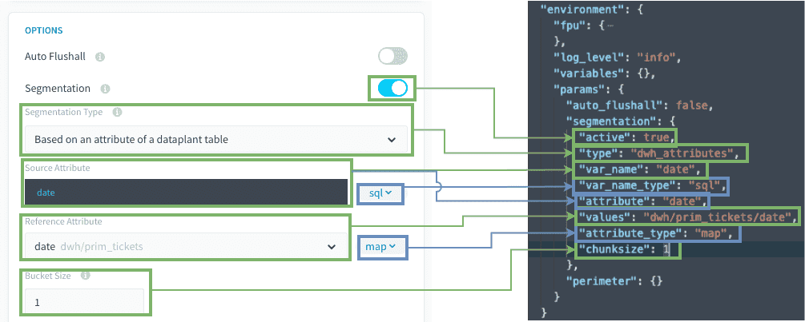
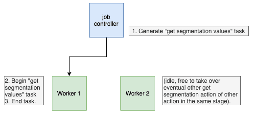
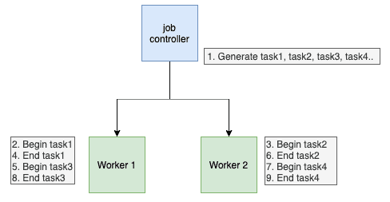
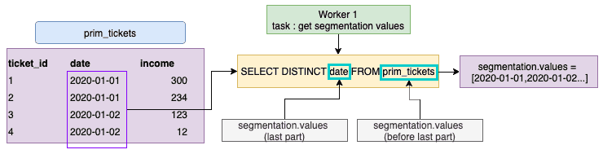
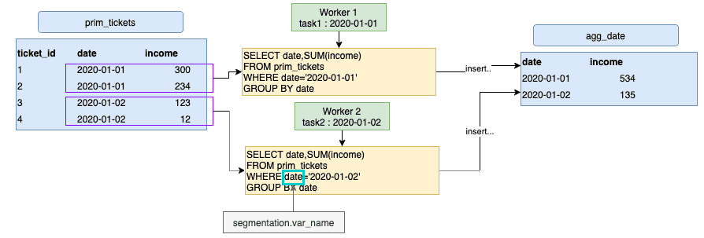

# Discover segmentation "Based on an attribute of a Project table"

Your action will be split into multiple tasks, each task will manage a smaller set of values coming from a **chosen attribute from a [given table from the Lakehouse Manager](/en/product/lakehouse-manager/tables/index)**. 

> You can find the actual product documentation page for segmentation, detailing the feature's behavior and specifications [on that page](/en/product/dpe/actions/settings/segmentation.md). 

- [Prerequisites](/en/getting-further/segmentation/dwh-attributes?id=prerequisites)
- [How to use this type of segmentation](/en/getting-further/segmentation/dwh-attributes?id=how-to-use-this-type-of-segmentation)
- [How does it work behind the scenes](/en/getting-further/segmentation/dwh-attributes?id=how-does-it-work-behind-the-scenes)

---
## Prerequisites

Before using this segmentation type, some points **must be checked**. 

### 1. Is the `var_name` attribute indexed in the source table ?
If not, the extraction query will be much slower.

### 2. Is there enough CPU on the source and destination databases? 
 
* Keep in mind that `select` and `insert` operations are CPU intensive.
* For example, if your database has only 1 CPU, it's probably a bad idea to set 6 workers to select and insert simultaneously against the DBMS instance...

> General Rule: 1 CPU should be available for each worker running simultaneously. 

### 3. Avoid generating too many tasks in the same stage. 

To ensure the Data Processing Engine (DPE) performs well, we advise against having stages with more than 500 tasks. 

This is not a hard limit but performance degradations can be observed with increasing number of tasks above 500.
In order to reduce the number of tasks, you can set a higher bucket size, so that each task will manage more values (meaning less tasks at the end).


---
## How to use this type of segmentation?

For the example, let's use an `aggregate` action on the following `prim_ticket` table, in order to aggregate all tickets income per `date`, and insert the result in the table agg_date.
  

To optimize execution time of this action, the workload will be split into multiple tasks based upon each date value.


### Understanding advanced parameters

Before going further, here is how the *Preferences* tab matches with the JSON fields in *Advanced mode*.  
For the sake of clarity, we will use the **technical JSON names** below.


> Please note that the blue squares are only used by the UI for clarity. The green parameters are the ones used by the DPE.

**Source's attribute / var_name:** SQL attribute that will be used for the filtering of the source.

**Reference Attribute / Values:** The address from where the set of values is taken.
must be formatted as **"dwh/TABLE_NAME/ATTRIBUTE_NAME"** if from a prim or mart table.
or **"dwh/SOURCE_NAME/TABLE_NAME/ATTRIBUTE_NAME"** if from a source.

**Bucket size / Chunksize:** Number of values to be filtered for each task.


### Choosing the right segmentation attribute

Choosing the right attribute for the segmentation is the key for a successful and fast data pipeline. The characteristics of a good segmentation attribute are: 

#### 1. Cardinality 
The cardinality of the attribute should not be too high regarding the number of rows of the source table. 

> You can check out the cardinality with a simple [COUNT DISTINCT query](/en/product/am/queries/visual?id=aggregation-functions) in the [Analytics Manager](/en/product/am/index).

#### 2. Rows distribution 
Ideally, distribution of the number of rows for each value should be approximately equal.

#### 3. The values should not be long text... 
...or it can overload the job controller.

#### 4. For `aggregate`, `diff` and `delete_diff` actions

!> The segmentation attribute must be part of the **primary key** of the **destination table**.  
If not, you will have eventually incomplete data for each groups.

For example, if you use segmentation over `ticket_id` while aggregating per `date`, task1 will insert the first ticket income, then task2 will update the income with ticket 2 that occurred within the same date...

#### 5. Good candidates tips

* The attribute that describes the date of your facts is often a good candidate :
  * it is often in the primary key of your aggregate tables
  * it may have a low to middle cardinality
  * it may have a pretty good distribution of rows over time.
* Attributes that are part of your main referential tables can be good candidates too.


### Other tips

#### 1. You can use SQL formulas 

For `segmentation.values` (in the attribute last part) and for `segmentation.var_name`, you can use SQL formulas, as long as they are compatible with your DBMS. Please note that the DBMS can change over time and so you might have to recheck and correct those SQL formulas if you decide to use them.

For instance, you may have :
```json
"segmentation": 
{
   "active": true,
   "type": "dwh_attributes",
   "values": "dwh/data_prim/prim_tickets/DATE(datetime)",
   "var_name": "DATE(datetime)",
   "chunksize": 1
 }
```

#### 2. `segmentation.values` table can be different than the source table

If your set of `segmentation.values` is contained in another table than your source table, you can indicate a table that is not the same as the source table used in the action.  
This can be useful to narrow down some elements and not recalculate your whole table each time.

For instance, `segmentation.values` could come from a referential table, or a temporary table, to manage only the data that just came in.


---
## How does it work behind the scenes?

If your action has a segmentation **Based on an attribute of a Project table**,
when executing the action, or the action in a workflow, it will execute:
1. A hidden pre-stage gets all the distinct values from the `table/attribute` given in `segmentation.values` field.
  
1. The Job Controller splits the action into multiple tasks, each with a different value (or set of values, depending on the `chunksize` configuration) amongst values found in step 1. 
1. Then each **worker** executes **each task one by one**.  
This means that there is no issue for having hundreds of tasks, your action will be parallelized regarding the number of workers.  


### Technical explanations

Let's review exactly how each part of the segmentation configuration is used.
With the following segmentation configuration:

```json
{
    "segmentation": {
        "active": true,
        "type": "dwh_attributes",
        "values": "dwh/data_prim/prim_tickets/date",
        "var_name": "date",
        "chunksize": 1
    }
}
```

1. The pre-stage task gets all the distinct `date` values from `prim_ticket` and replaces the `segmentation.values` address by the actual values.  
Please note how the `segmentation.values` address is built.  
This address may be different from the actual `source table` selected in the action.

2. The Job Controller creates tasks according to the length of `segmentation.values` and the `chunksize` (number of values that each task should handle)
3. Each worker handles the tasks one by one, here is an example with an aggregate action.
Of note; `segmentation.var_name` is used as the attribute to filter in the WHERE clause for the extraction query. So, it may be different from the one used in `segmentation.values`.




---
## Need help? 🆘

> If you are logging-in with an OVHcloud account, you can create a ticket to raise an incident or if you need support at the [OVHcloud Help Centre](https://help.ovhcloud.com/csm/fr-home?id=csm_index). Additionally, you can ask for support by reaching out to us on the Data Platform Channel within the [Discord Server](https://discord.com/channels/850031577277792286/1163465539981672559). There is a step-by-step guide in the [support](/en/support/index.md).