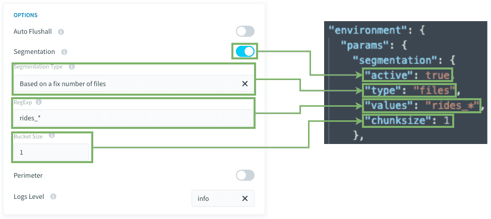
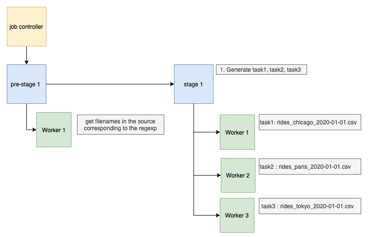

# Discover segmentation over a set of files

For sources with the same structure in a distant source folder, this segmentation mode allows the Data Processing Engine (DPE) to automatically find all files in a folder, then create tasks with a specific number of files. It will replace the source file in “load_from.source” actions for each files. 

Example: Every day, there will be new file(s) coming in the source. you need your load action to absorb all those files incoming, not knowing in advanced their exact name.

- rides_chicago_2020-01-01.csv
- rides_paris_2020-01-01.csv
- rides_tokyo_2020-01-01.csv

Each task will manage different files, allowing for parallelization of work amongst different workers.

- [Prerequisites](/en/getting-further/segmentation/files?id=prerequisites)
- [How to use this type of segmentation](/en/getting-further/segmentation/files?id=how-to-use-this-type-of-segmentation)
- [How does it work behind the scenes](/en/getting-further/segmentation/files?id=how-does-it-work-behind-the-scenes)

---
## Prerequisites

Before using this segmentation type, some points **must be checked**: 

- All the files must have the same format and structure
- All files must be in the same folder
 - If other files with different structures are present in the folder, the files must have specific naming such as it can be filtered out by a RegExp.
- All the attributes/columns present in the schema, and also in each file, must:
 - Be present (except for semi-structured formats such as XML or JSON: they will be replaced by NULL values if not present) ;
 - have the same type or structure. (example: datetime structures)

### Compatibility
This segmentation option is only compatible with the following actions and sources:

| Action Types | Source Types |
|          ---        |          ---          |
| <ul><li>Load</li><li>Custom</li></ul> | <ul><li>S3 (file upload, datastore, AWS, etc..)</li><li>FTP</li><li>SFTP</li></ul> |

---
## How to use this type of segmentation?

To configure this segmentation option select *Based on files* in the "Segmentation Type" dropdown.

**RegExp / Values:** You can set a regexp to identify the filenames you want to get. the star (\*) character permit to search for any characters (it will be replaced in the regexp by: .\* ).
It can be a list of RegExps as well. or a hard-coded list of precise filenames.

**Bucket size / Chunksize:**  Set how many files will be absorbed for each task. 
it is recommended to set this value to 1, unless you have hundreds of files, you will want to put a higher number of files for each task to keep the number of tasks reasonable (under 100 tasks). 

### Blueprints rules and mapping

In the [Data Catalog](/en/product/data-catalog/index), you will need to [analyze](/en/product/data-catalog/analyzer/index) one file that will serve as the blueprint for all the other files.
It's important that you keep the definition of this file in the data catalog to keep the [blueprint rules](/en/product/data-catalog/analyzer/add-blueprint-rules). 

In the DPE, creating the [Load action](/en/product/dpe/actions/load/index), you will use the analyzed file as a source.
In doing so, all the loaded files will have the same blueprint rules applied.

---
## How does it work behind the scenes?

If your action has a segmentation **Based on an fixed number of files**,
when executing the action, either on its own or via a workflow, it will execute:
1. A hidden pre-stage gets all the filenames in your source corresponding to the RegExp set in the configuration.
  
1. The Job Controller splits the action into multiple tasks, each with a different value (or set of values, depending on the `chunksize` configuration) amongst filenames found in step 1. 
1. Then each **worker** executes **each task one by one**.  
This means that there is no issue for having hundreds of tasks, your action will be parallelized regarding the number of workers.  

---
## Need help? 🆘

> If you are logging-in with an OVHcloud account, you can create a ticket to raise an incident or if you need support at the [OVHcloud Help Centre](https://help.ovhcloud.com/csm/fr-home?id=csm_index). Additionally, you can ask for support by reaching out to us on the Data Platform Channel within the [Discord Server](https://discord.com/channels/850031577277792286/1163465539981672559). There is a step-by-step guide in the [support](/en/support/index.md).