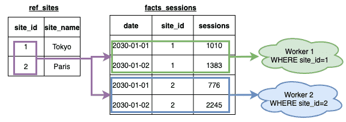
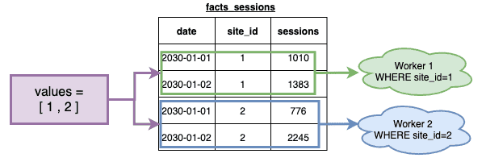
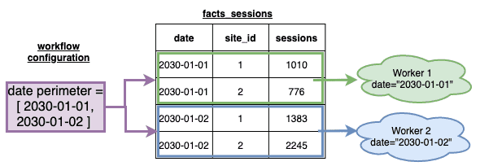
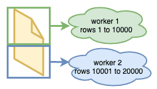
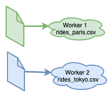
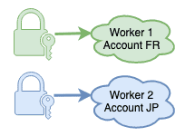

# Apply segmentation to your jobs

[Segmentation](en/product/dpe/actions/settings/segmentation) will allow you to unleash the Data Processing Engine's power of scalability. When executed, your [actions](/en/product/dpe/actions/index) will be **split into multiple tasks**, each task will manage a smaller dataset.

?> With great power comes with great responsibility: segmentation options should be configured carefully. Depending on your segmentation choices, your action may be much faster... or much slower.  

There are several ways to configure segmentation depending on the action and/or the type of source you are using. Take note of the specific configuration details in each of the corresponding chapters below:

- [Based on the values of an attribute of a reference table](/en/getting-further/segmentation/index?id=segmentation-over-the-values-of-a-table-attribute)
- [Based on the values in a predefined set](/en/getting-further/segmentation/index?id=segmentation-over-a-predefined-set-of-values)
- [Based on the date perimeter of the workflow](/en/getting-further/segmentation/index?id=segmentation-over-the-date-perimeter-set-in-the-workflow)
- [Based on a fix number of lines](/en/getting-further/segmentation/index?id=segmentation-by-chunking-a-source)
- [Based on files](/en/getting-further/segmentation/index?id=segmentation-over-same-structured-files)
- [Based on the source's accounts](/en/getting-further/segmentation/index?id=segmentation-over-source-accounts)

---
## Segmentation over the values of a table attribute

{Learn how to use segmentation over the values of a table attribute}(#/en/getting-further/segmentation/dwh-attributes)

---
## Segmentation over a predefined set of values

{Learn how to use segmentation over a predefined set of values}(#/en/getting-further/segmentation/predefined-set.md)

---
## Segmentation over the date perimeter set in the workflow

{Learn how to use segmentation over the date perimeter set in the workflow}(#/en/getting-further/segmentation/workflow-dates.md)

---
## Segmentation by chunking a source
 

{Learn how to use segmentation by chunking a source}(#/en/getting-further/segmentation/chunk-source)

---
## Segmentation over same structured files  

{Learn how to use segmentation over same structured files}(#/en/getting-further/segmentation/files)

---
## Segmentation over source accounts 

{Learn how to use segmentation over source accounts}(#/en/getting-further/segmentation/accounts)

---
## Need help? 🆘

> If you are logging-in with an OVHcloud account, you can create a ticket to raise an incident or if you need support at the [OVHcloud Help Centre](https://help.ovhcloud.com/csm/fr-home?id=csm_index). Additionally, you can ask for support by reaching out to us on the Data Platform Channel within the [Discord Server](https://discord.com/channels/850031577277792286/1163465539981672559). There is a step-by-step guide in the [support](/en/support/index.md).