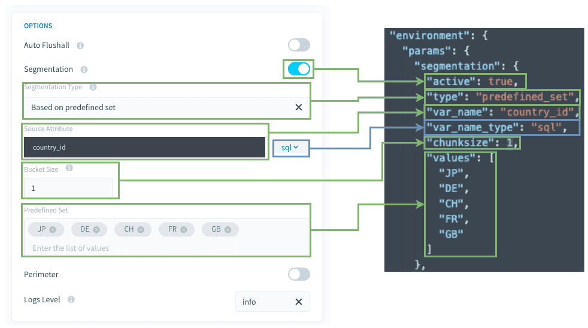

# Discover segmentation based on a predefined set of values

Your actions can be executed on a set of values of your choice while segmenting on them at the same time.

Examples of usage : 
- Segmenting on a precise preset of shopping sites or items
- Applying a business rule A to subset of data A with aggregate action A, and a business rule B to a subset of data B in an aggregate action B. 

> You can find the actual product documentation page for segmentation, detailing the feature's behavior and specifications [on that page](/en/product/dpe/actions/settings/segmentation.md). 

- [Prerequisites](/en/getting-further/segmentation/predefined-set?id=prerequisites)
- [How to use this type of segmentation](/en/getting-further/segmentation/predefined-set?id=how-to-use-this-type-of-segmentation)
- [How does it work behind the scenes](/en/getting-further/segmentation/predefined-set?id=how-does-it-work-behind-the-scenes)


---
## Prerequisites

Before using this segmentation type, some points **must be checked**: 

### 1. Is the `var_name` attribute indexed in the source table?
If not, the extraction query will be much slower.

### 2. Is there enough CPU on the source and destination databases? 
 
* Keep in mind that `select` and `insert` operations are CPU intensive.
* For example, if your database has only 1 CPU, it's probably a bad idea to set 6 workers to select and insert simultaneously against the DBMS instance...

> General Rule: 1 CPU should be available for each worker running simultaneously. 

### 3. Avoid generating too much tasks in the same stage. 

To ensure the Data Processing Engine (DPE) performs well, we advise against having stages with more than 500 tasks. 

This is not a hard limit but performance degradations can be observed with increasing number of tasks above 500.
In order to reduce the number of tasks, you can set a higher bucket size, so that each task will manage more values. (meaning less tasks at the end).

### Compatibility

This segmentation option is only compatible with the following actions and sources:

| Action Types | Source Types |
|          ---        |          ---          |
| <ul><li>Load</li><li>Aggregate</li><li>Diff</li><li>Delete_Diff</li><li>Delete</li><li>Custom</li></ul> | <ul>**Databases**: MySQL, PostgreSQL, SQLServer, Impala, Hive, BiqQuery, ElasticSearch, Cassandra, Redshi


---
## How to use this type of segmentation?

Here is a quick view between the visible mode and the advanced JSON mode.

 

**Source's attribute / var_name:** SQL attribute that will be used for the filtering of the source.

**Bucket size / Chunksize:** Number of values to be filtered for each task.

**Predefined set / values:** Set of hard-coded values to filter from.


### Other tips
#### 1. You can use SQL formulas 

For `segmentation.var_name` (in the attribute last part), you can use SQL formulas, as long as they are compatible with your DBMS. Please note that the DBMS can change over time and so you might have to recheck and correct those SQL formulas if you decide to use them.

For instance, you may have :
```json
{
  "segmentation": {
    "active": true,
    "type": "predefined_set",
    "var_name": "DATE(datetime)",
    "values": ["2020-01-01","2020-01-02"]
    "chunksize": 1
  }
}
```


---
## How does it work behind the scenes?

This segmentation mode works the same as [segmentation based on an attribute of a Project table](/en/getting-further/segmentation/dwh-attributes?id=how-does-it-work-behind-the-scenes). The only difference is that the values are already set in the configuration, rather than a Data Manager table attribute, so there is no pre-stage needed.


---
## Need help? 🆘

> If you are logging-in with an OVHcloud account, you can create a ticket to raise an incident or if you need support at the [OVHcloud Help Centre](https://help.ovhcloud.com/csm/fr-home?id=csm_index). Additionally, you can ask for support by reaching out to us on the Data Platform Channel within the [Discord Server](https://discord.com/channels/850031577277792286/1163465539981672559). There is a step-by-step guide in the [support](/en/support/index.md).