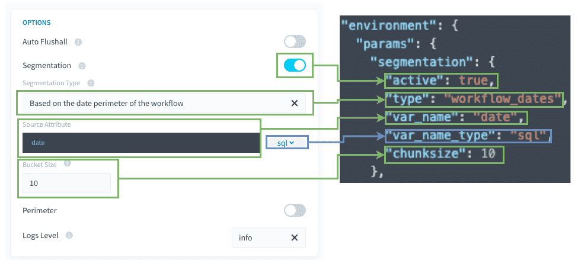

# Discover segmentation based on the date perimeter configured in the workflow

Often, for a daily usage, you will need to ask for your [Data Processing Engine (DPE) actions](/en/product/dpe/actions/index) to manage data corresponding to the X last days until today. 

Some other times, you will need your actions to act only on a historical set of dates. 
This segmentation type basically works like the [“Segmentation over the values of an attribute of a table.”](/en/getting-further/segmentation/dwh-attributes), except that the values comes from the dates you set in the [workflow configuration](/en/product/dpe/actions/settings/perimeter), rather than coming from a [Lakehouse Manager table](/en/product/lakehouse-manager/tables/index). 

### Concrete examples of usage 
-	Get data from a source only from X days ago to today.  (daily relative dates usage)
-	Get data from a source between 2 precise dates (get historical data, oneshoot usage)
-	Recalculate an aggregate table only between 2 dates (daily relative dates usage or oneshoot usage )

If your source data contains a date attribute, it is possible to split the action in separate processes which will individually address a specific date or a group of dates. 
In this case, each task will apply a filter on the date that it needs to extract.

> You can find the actual product documentation page for segmentation, detailing the feature's behavior and specifications [on that page](/en/product/dpe/actions/settings/segmentation.md). 

- [Prerequisites](/en/getting-further/segmentation/workflow-dates?id=prerequisites)
- [How to use this type of segmentation](/en/getting-further/segmentation/workflow-dates?id=how-to-use-this-type-of-segmentation)
- [How does it work behind the scenes](/en/getting-further/segmentation/workflow-dates?id=how-does-it-work-behind-the-scenes)


---
## Prerequisites

Before using this segmentation type, some points **must be checked**: 

### 1. Is the `var_name` attribute indexed in the source table?
If not, the extraction query will be much slower.

### 2. Is there enough CPU on the source and destination databases? 
 
* Keep in mind that `select` and `insert` operations are CPU intensive.
* For example, if your database has only 1 CPU, it's probably a bad idea to set 6 workers to select and insert simultaneously against the DBMS instance...

> General Rule: 1 CPU should be available for each worker running simultaneously. 

### 3. Avoid generating too much tasks in the same stage. 

To keep the Data Processing Engine (DPE) performs well, we advice to avoid setting stages of more than 500 tasks. 

This is not a hard limit as it won't bug right after this threshold, but performance degradations can be observed.
In order to reduce the number of tasks, you can set a higher bucket size, so that each task will manage more values. (meaning less tasks at the end).

#### Compatibility

This segmentation option is only compatible with the following actions and sources:

| Action Types | Source Types |
|          ---        |          ---          |
| <ul><li>Load</li><li>Aggregate</li><li>Diff</li><li>Delete_Diff</li><li>Delete</li><li>Custom</li></ul> | <div><ul><li>**Databases**: MySQL, PostgreSQL, SQLServer, Impala, Hive, BiqQuery, ElasticSearch, Cassandra, Redshift, Oracle</li><li>**API**: Facebook, Twitter, Google Analytics, YouTube Private, YouTube Public, HTTP REST</li></ul> |


---
## How to use this type of segmentation?

Here is a quick view between the visible mode and the advanced JSON mode.



**Source's attribute / var_name:** SQL attribute that will be used for the filtering of the source.

**Bucket size / Chunksize:** Number of values to be filtered for each task.


### Other tips

#### 1. You can use SQL formulas 

For `segmentation.var_name` (in the attribute last part), you can use SQL formulas, as long as they are compatible with your DBMS. Please note that the DBMS can change over time and so you might have to recheck and correct those SQL formulas if you decide to use them.

For instance, you may have :
```json
"segmentation": 
{
   "active": true,
   "type": "workflow_dates",
   "var_name": "DATE(datetime)",
   "chunksize": 1
 }
```


---
## How does it work behind the scenes?

This segmentation mode works the same as [segmentation based on an attribute of a Project table](/en/getting-further/segmentation/dwh-attributes?id=how-does-it-work-behind-the-scenes). The only difference is that the values comes from the dates perimeter of the workflow, instead of a Data Manager table attribute, so there is no pre-stage needed.


---
## Need help? 🆘

> If you are logging-in with an OVHcloud account, you can create a ticket to raise an incident or if you need support at the [OVHcloud Help Centre](https://help.ovhcloud.com/csm/fr-home?id=csm_index). Additionally, you can ask for support by reaching out to us on the Data Platform Channel within the [Discord Server](https://discord.com/channels/850031577277792286/1163465539981672559). There is a step-by-step guide in the [support](/en/support/index.md).