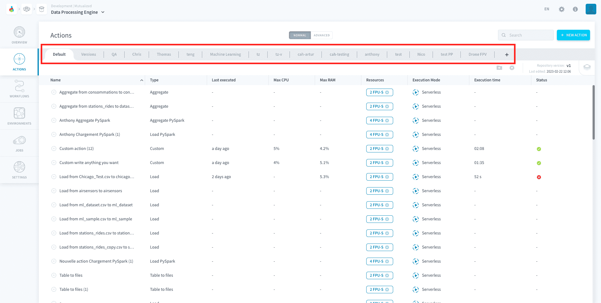
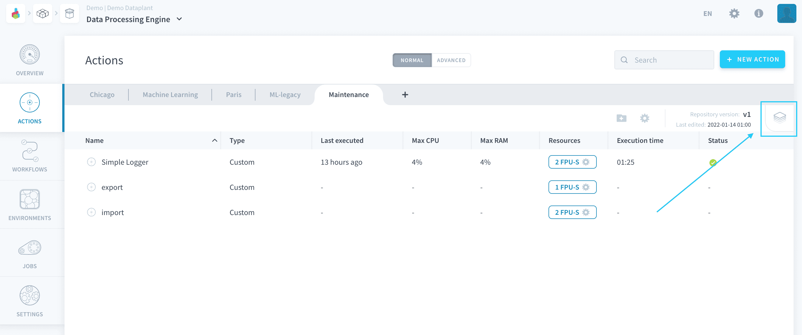
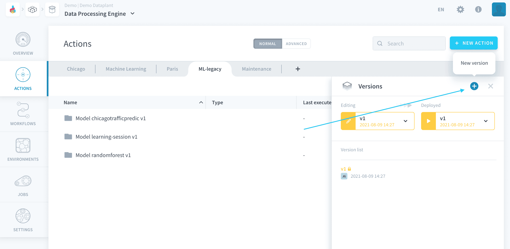
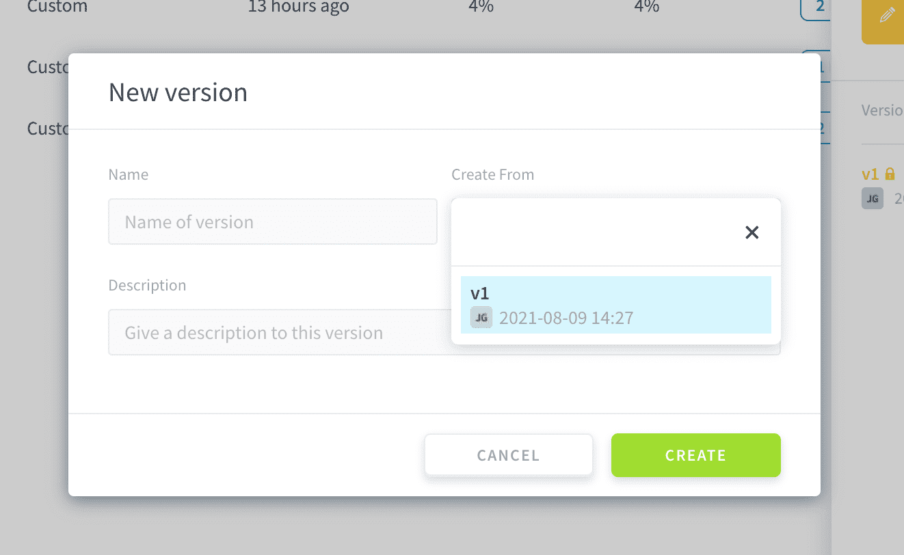
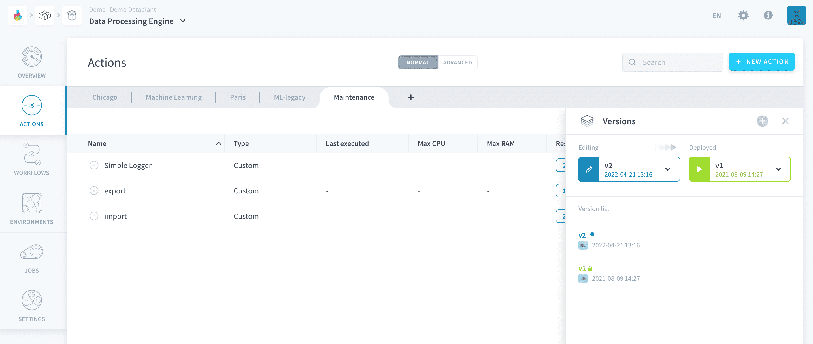
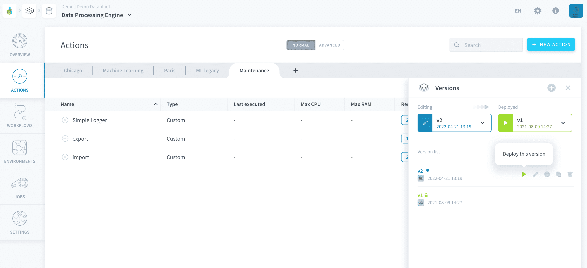
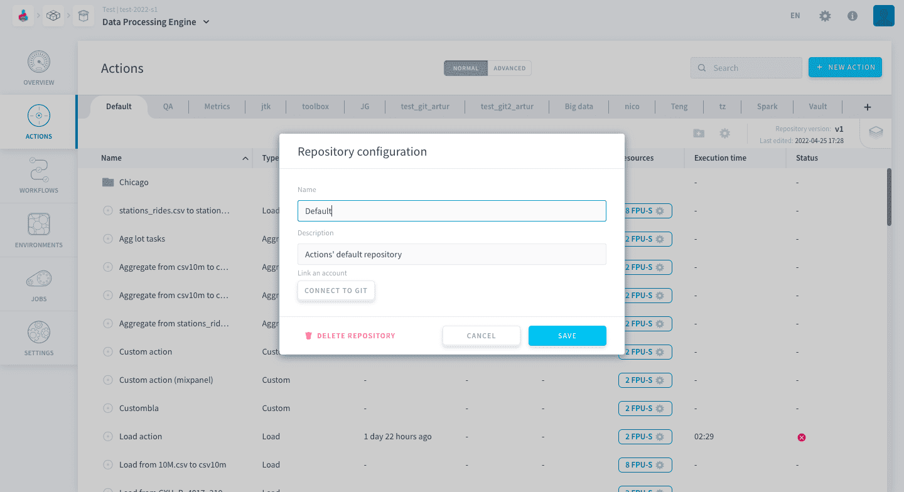
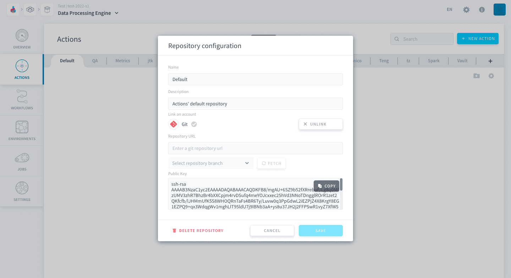
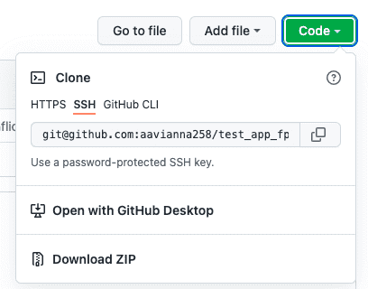
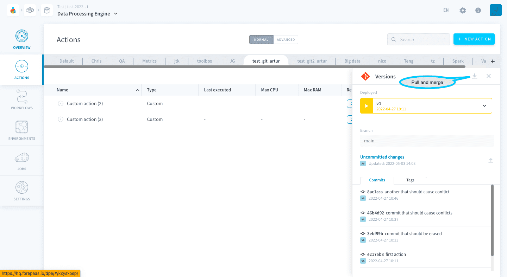

# Learn versioning and repositories basics
This tutorial demonstrates how to use the Platform's native versioning system or how to setup a Git repository to track the changes in your [Data Processing Actions](/en/product/dpe/actions/index.md). 

* [Introduction](#introduction)
  * [Requirements](#requirements)
  * [Concepts overview](#concepts-overview)
* [Use the Platform version control system](#use-the-platform-version-control-system)
* [Use a repository linked to Git](#use-a-repository-linked-to-git)
  * [Linking a repository to Git](#linking-a-repository-to-git)
  * [Commiting and pushing](#committing-and-pushing)
  * [Pulling and merging](#pulling-and-merging)
  
---
## Introduction

### Requirements
To follow this tutorial, you need to be familiar with the [Data Processing Engine](/en/product/dpe/index.md) and you should preferably have done the [Getting Started guide](/en/getting-started/index). The essential is that you know what [Actions](/en/product/dpe/actions/index.md) are for and how to use them.

### Concepts overview

Editing actions is always on autosave mode. When you are trying to iterate on existing actions, it is recommended to create several versions of the actions' code. This lets you incrementally introduce variations to experiment and test your work, while keeping the version in production always intact.

**On the Platform, this versioning happens at the level of the repositories**. The repositories are the tabs you see at the top of the Actions' tree view.

You cannot version an individual action, but rather a whole repository of actions. The versioning panel can be accessed at the top right of the repository header:

There are 2 versioning systems on the Platform:

- [Data Platform version control system](/en/product/dpe/actions/index?id=use-the-platform-version-control-system): the default versioning system on all repositories
- [Git versioning](/en/product/dpe/actions/index?id=use-a-repository-linked-to-git): if you decide to synchronize your repository with Git

Now let's see how all of this works in practice!

---
## Use the Platform version control system

By default, each repository of actions on the platform has an integrated version control system which allows you to manually manage the different versions of the code (i.e. actions) they contain. 

Repositories all have:

- a *deployed version*, which is the version served when [executing the job](/en/product/dpe/jobs/index). 
- an *editing version*, which is the version currently being edited through the editor panel.

?> If your repository only has *one version*, the active version is the same as the deployed version, which means that you are editing your actions in production.  
If your repository has *two versions or more*, the deployed version cannot be edited. It can be viewed in read-only mode.

Versions need to be created manually. To create a new version for the repository, open the versioning panel at the top right and click on the **+** icon.

Choose which version to duplicate to create the new version.

After creating the new version, the *deployed version* will not change. You are able to edit the new version directly.

Click on the **Play** button to set a new version as the deployed version: the version of the code used when actions of the repo are executed.

---
## Use a repository linked to Git

Each repository can be linked to an external Git repository in which case versions are synced with Git commits. This allows you to update & test actions continuously without affecting the version deployed in production.

### Linking a repository to Git

To link your repository on the platform to Git, you must click on the gear icon to edit an existing repository or create a new a one. Either of this actions will open the repository configuration window.

Click on *Connect to Git* to expand the window.

Here the first thing you need to enter is the Repository SSH URL. 

It is generally found on repository cloning options of common Git solutions. On GitHUB, for instance, it can be found on Code > Clone > SSH.

Next click on *FETCH* to get the distant branches and select the branch you desire to use.

Finally, copy the Public SSH key given at the bottom and paste it in the list of SSH keys associated to your account on your Git solution. For GitHUB, you can follow [this tutorial](https://docs.github.com/en/authentication/connecting-to-github-with-ssh/adding-a-new-ssh-key-to-your-github-account).

### Committing and pushing

After changing an object in a repo, your repo will display the uncommitted changes as shown in the image below. You can commit and push them by clicking on the arrow pointing upwards indicated in the image.

?> If there is a conflict when you push, your changes will not be pushed to the branch you configured, instead they will be pushed to a new branch with same name of the current branch and a suffix of *_conflictN*, where N is the number of the conflict. For example, if your branch is named *current-branch* and your push causes a conflict, the new branch will be named *current-branch_conflict1*. If there is a conflict again when you push, the new branch will be named *current-branch_conflict2*.

### Pulling and merging

Pull distant changes by clicking on the arrow pointing downwards indicated in the image, a popup window will prompt you to confirm your decision. All uncommitted changes will be lost and both branches will be merged together.

---
## Need help? 🆘

> If you are logging-in with an OVHcloud account, you can create a ticket to raise an incident or if you need support at the [OVHcloud Help Centre](https://help.ovhcloud.com/csm/fr-home?id=csm_index). Additionally, you can ask for support by reaching out to us on the Data Platform Channel within the [Discord Server](https://discord.com/channels/850031577277792286/1163465539981672559). There is a step-by-step guide in the [support](/en/support/index.md).