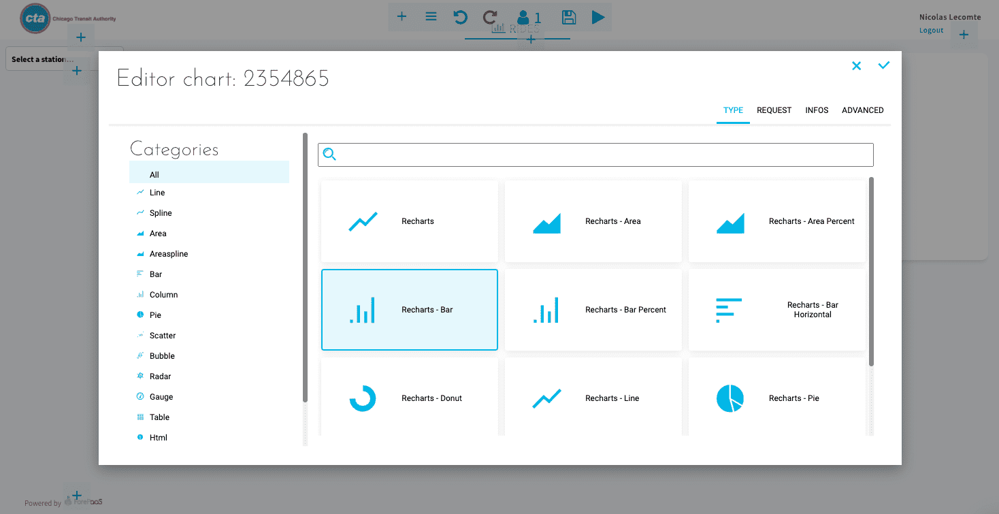
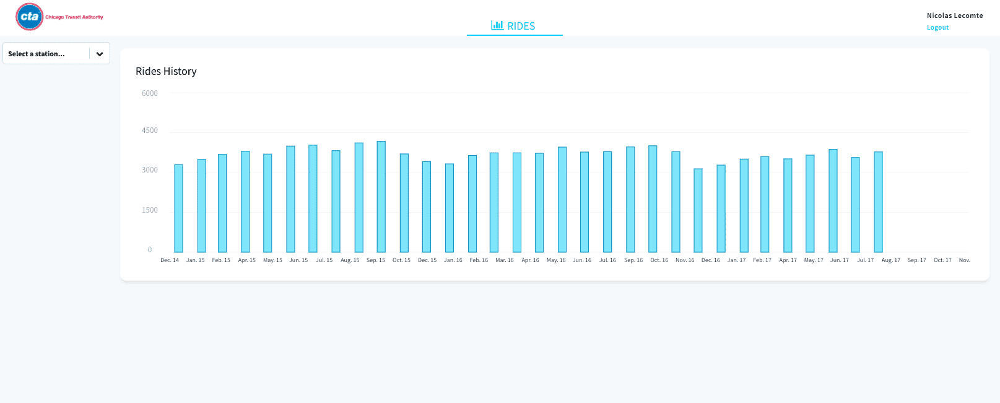

# Build and deploy a front-end application

In this tutorial you'll **learn how to build and deploy your first application**. To make it easier for you, you won't start from scratch. We've prepared a template to accelerate the process, thanks to pre-built graphs.

Initiate your application by clicking on the **+** sign of the App Manager.  

Select the template *ReactJS - Getting Started* from the store. Thanks to this template, you will be able to produce a great-looking BI dashboard in no time!

Fill in the different fields as shown in the screenshot below and press **Confirm**.

Click on **Confirm**, your app will automatically build and deploy. The process should take a couple of minutes ⏳, in the meantime feel free to read through the pre-requisites below.

---

## Prerequisites

Every previous step of the Getting Started guide must have been completed:

- The API is up and running.
- Queries in the Analytics Manager are properly requesting your data warehouse.
- The Lakehouse Manager shows a properly built logical schema. Virtual attributes are created and tables linked.
- Your Data Processing Engine workflow has been correctly run.

This tutorial should take about 5-10 minutes to complete. You will go through the following steps to create and deploy a simple application using the Platforms' visual builder:

- [Set up your canvas](/en/getting-started/app-init/app-manager?id=set-up-your-canvas)
  - [Add a header](/en/getting-started/app-init/app-manager?id=set-up-a-header)
  - [Add a dynamic parameter](/en/getting-started/app-init/app-manager?id=set-up-a-dynamic-parameter)
- [Set up a chart](/en/getting-started/app-init/app-manager?id=set-up-a-chart)
  - [1. Add a panel](/en/getting-started/app-init/app-manager?id=step-1-create-a-panel)
  - [2. Name your figure](/en/getting-started/app-init/app-manager?id=step-2-give-a-title-to-your-chart)
  - [3. Create a chart](/en/getting-started/app-init/app-manager?id=step-3-generate-your-chart)
- [Build and deploy a new version of your app](/en/getting-started/app-init/app-manager?id=build-and-deploy-the-new-version-of-your-app)

Ready to create your first dashboard? Let's go! 🏄🏻

---
## Set up your canvas

Click on the **Dashboard** menu. In the App Manager, dashboards are the pages of an app.  

A first dashboard, *Rides Analytics*, has been added by default when you selected the template at the beginning. It comes with styles and logos!

Click on the **house** icon to set it as the default landing page of your app.

### Set up a header

Head to the **Menus** menu. It is the page where you can define items such as header menus and filters for your whole app. It has already been pre-populated with several pages and items due to the template you used to initiate the app.   

You should land on the header page. This means every item you add here will be embedded in the header of your app (i.e the upper part). You can switch to the sidebar page (to embed items in the left sidebar of your app) at the top right-hand corner.  

Switch back to the header page. Expand **tabs** to see the container's items. Click on *Add an item* to add a tab in your header. Select **link**.

Fill in the fields as shown below. You can also define a logo icon for your app header!

### Set up a dynamic parameter
Dynamic parameters are widgets to **filter your data on your pages**. Here, you will add one dynamic parameter to filter on the date.

Click on **Sidebar** on the top right-hand corner and create a container.

?> If you are unfamiliar with [containers](en/product/app-manager/menu?id=introduction), think of them as folders for items.

Drag the new container on top of the footer (which has to be at the bottom). 

Open the container then add an item: select **Parameters**. 

Pick the _Select box_ one, then head to the **options** of the new parameter.

Fill in the options as shown in the screenshot below.

In the **Infos** tab, give it the following name: *select_stations*, and press Confirm.

?> Note that every dynamic parameter like the date picker and select boxes can be customized. To learn how to do that, head to the technical documentation for application components!  
[Learn more about dynamic parameters](en/technical/sdk/app/dynamic_parameters/index).

Your canvas configuration is now done. ✅ With a menu and a filter, you can now create your first graph.

---
## Set up a chart

Go to the **Dashboard** tab and click on the **Edit** icon on your *Ride Analytics* dashboard.
You can see that the menu and the filter we've just created are well set up here!

#### Step 1. Create a panel

Click on the ➕ icon to create a panel (**Containers > Panel**). 

Once it's created, you can resize it so it spans across the screen.

#### Step 2. Give a title to your chart

**Inside your new panel**, click on the ➕icon and select **Basic UI > HTML**.

Name it *Rides history* and apply the H1 style by clicking on the H button.

#### Step 3. Generate your chart

Inside your panel, click on the ➕icon and select **Chart**. Pick the *Recharts - Bar* type.

Click on **Request**, and select **Query selector** to pick the *rides_per_month* query you've created in the Analytics Manager.

To complete the setup, you have to connect this chart with the filter we've already created. Go to the **Infos** tab, in the **Linked dynamic parameters** section, and add *select_stations*.

You can now test if your filter is properly working. Enter the read-only mode by clicking on the **Play** icon, and modify dates or holiday type to see how your data is changing. Your first chart is done!

?> At this point, you are pretty much done with your first dashboard! But you might want to make it look better 🧑🏼‍🎨. In our *Getting Further guide series*, we have released more tutorials for you to check out: [click here to learn more about the capabilities of the App Manager](/en/getting-further/app-manager/index)!

---
## Build and deploy the new version of your app

You're almost finished! Just one last step! Let's put your dashboard into production. 

First, don't forget to **Save** your dashboard to make sure all your edits are consistently saved (💾 icon in the top middle bar).

Then go back to the **Overview** tab of the Application Manager. 

Changes brought to your application since you first created it **must be builded** in order to be visible by your end-users. You could stop the currently deployed version to build those changes, but the Platform also allows you to do it [without interruption of service](https://en.wikipedia.org/wiki/Blue-green_deployment).  
First, **Copy** the currently deployed 
version of the application.

Then you need to name the new version (*v2* in the screenshot below).

Now, click on **Build**, and then **Deploy**.

> The **build** process usually takes a couple of minutes. If you're curious about what is going on or if the build fails, open the log console by expanding the version panel and inspect the logs. Feel free to send logs to our support team 💁💁‍♂️if you're not sure how to troubleshoot it yourself!

Your app is **live** and can now be accessed online! The link can be obtained in the Overview tab by clicking on **Open**. 

?> The [Identity Access Manager](/en/product/iam/index) lets you configure access rights to your app and your Project administration.

That's it! Your dashboard is live and accessible by your users. Its data is refreshed automatically every day, stored in the cloud and will always be reliable.

---

<b> Congrats! 🎉🎊</b>

**You've completed the Platforms' Getting Started tutorial!** You're now ready to go live on the platform, explore by yourself and take on your own Projects by yourself.

Obviously, you can come back to this tutorial at any time! We encourage you to check out the rest of the documentation to dive deeper into a specific component of the product when needed.

The next step will consist of discover advanced features of the App Manager on the Platform.

{Customize your first app further}(#/en/getting-further/app-manager/index)

---

<b> More! </b>

Also, don't hesitate to **get in touch** if you need anything, our support & product team is dedicated to helping you deliver faster any AI applications you have in mind.

> If you are logging-in with an OVHcloud account, you can create a ticket to raise an incident or if you need support at the [OVHcloud Help Centre](https://help.ovhcloud.com/csm/fr-home?id=csm_index). Additionally, you can ask for support by reaching out to us on the Data Platform Channel within the [Discord Server](https://discord.com/channels/850031577277792286/1163465539981672559). There is a step-by-step guide in the [support](/en/support/index.md).