# Configure data imports and transformations

The Data Processing Engine (DPE) is the component that lets you **create and execute data pipelines outside and within the Platform**. Everything is automated, from the management and deployment to the scalability, to help you focus on the business logic of your data Project rather than its logistics.

While the Lakehouse Manager is where you plan out your data structure at the **conceptual level**, the Data Processing Engine is where you execute actions to **physically impact your data**.

In this tutorial, you will go through the following steps:
* [Actions](#actions)
 * [Create more actions](#create-more-actions)
* [Workflows](#workflows)
* [Jobs](#jobs)

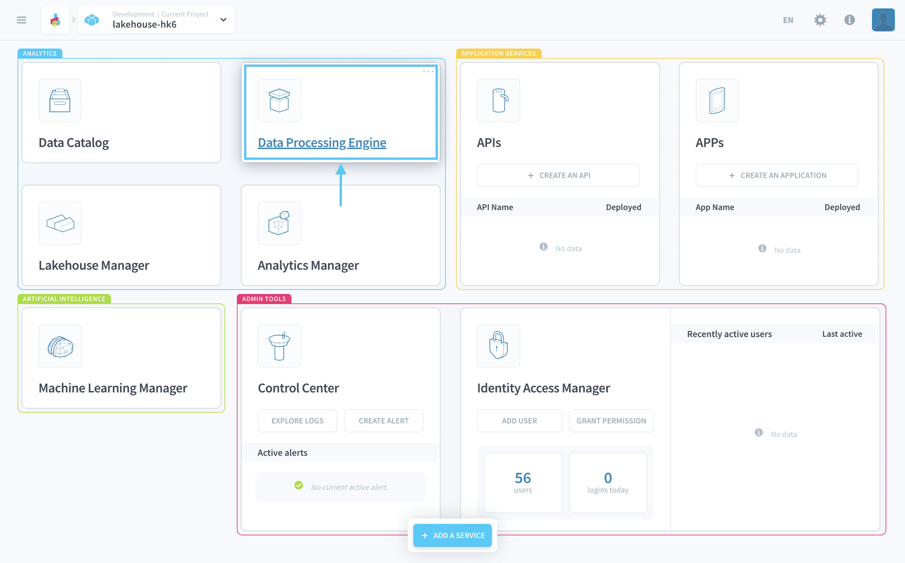

> This tutorial is meant for **Standard Datasets** using the *Lakehouse Manager Engine*. To know how to follow this same step with **External Datasets** click [here](/en/getting-further/data-models-with-external/index?=actions).

---
## Actions
An [action](/en/product/dpe/actions/index) consists of a unitary physical operation on the data. Actions can be organized in stages in order to produce automated data processing pipelines called [workflows](/en/product/dpe/workflows/index).

Click on the **Actions** menu of your Data Processing Engine. You should see the two *Load* actions that were[ automatically generated in the previous step](/en/getting-started/app-init/lhm?id=organize-your-data-in-tables): 

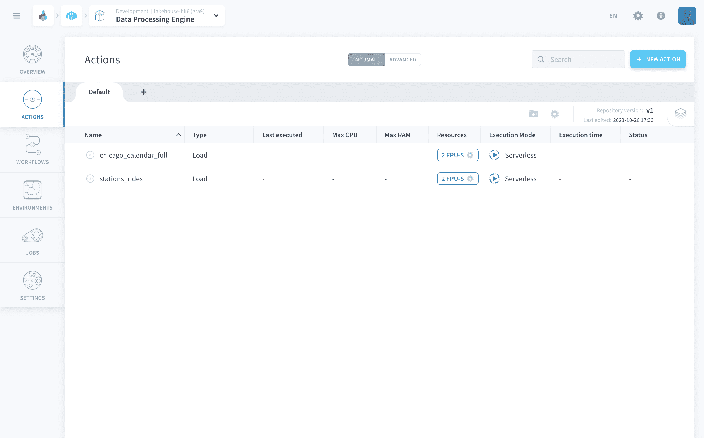

These Load actions will physically extract the data from your sources and load it into your data warehouse, following the schema made in the Lakehouse Manager.

### Create more actions

?> Our Marketplace gives you access to a dozen of curated actions to kick-start your data processing Projects: *load* actions, *aggregate* actions, *delete* actions, etc. If you cannot find what you need in the catalog, you can always resort to a *custom* action that allows you to **run any piece of Python 3+ code** as part of your data pipelines.  
[Learn more about custom actions](/en/product/dpe/actions/custom/index).

For this tutorial, you will create an action used to aggregate your data into the *dataset_history* table you created in the previous part.

Click on **New action** and select the *Aggregate action* template from the Store.

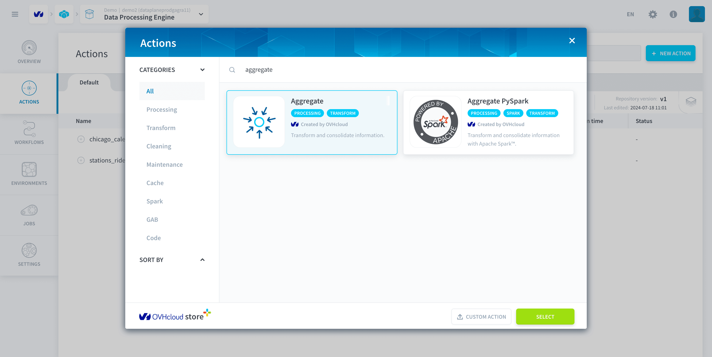

There will be 3 simple steps to configure the aggregate action:
* **(1)** Select the source table : *stations_rides*
* **(2)** Select the destination table: *dataset_history* 
* **(3)** Select the source table : *chicago_calendar_full*

Change the join condition to an *INNER join* using the dropdown menu. This will ensure that you do not have any null fields in the records of your dataset_history table. Also make sure to copy and paste the following sql code to let the aggregate action know how the tables are going to be linked:

```
stations_rides.date = chicago_calendar_full.date
```

!> Note this is required because the concept of *joining tables using primary keys* does not exist for **standard datasets**. If you are using an **external dataset**, then it will be automatically generated.

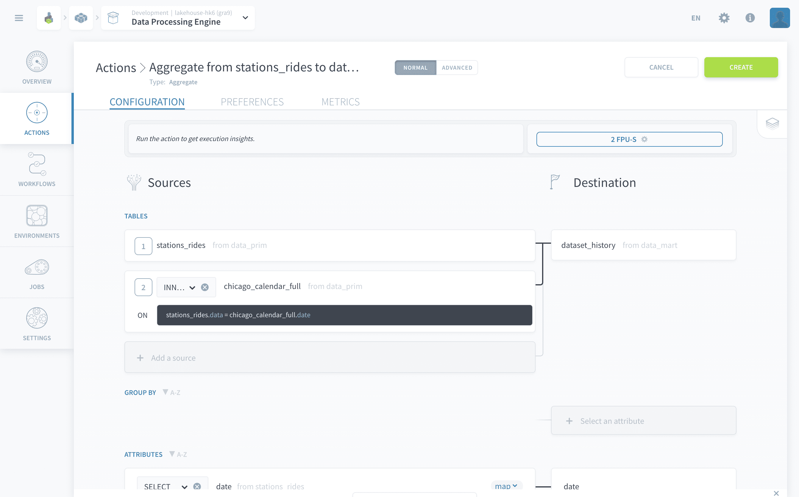

The attributes need to be manually mapped out. Refer the screenshot below and make sure all the attributes are mapped correctly.
Make sure that the all the attribute are in the **SELECT** function. 

!> If you are using an **external dataset**, then the attributes will be automatically mapped out. Only the attribute *rides* needs to be switched to **SUM**.

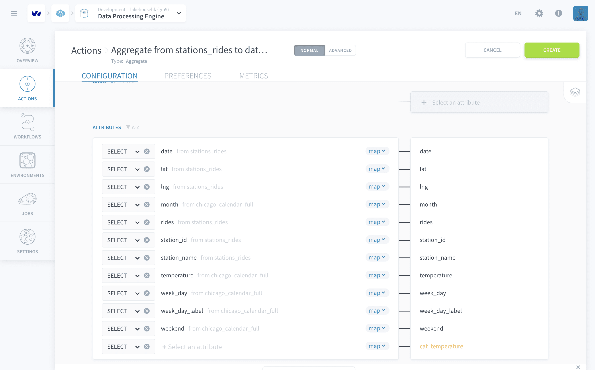

Finally, let's define the categorical attribute *cat_temperature* that you created earlier. Click on the **< map >** (short for "mapping") option in blue option dropdown as shown below and switch it to **< sql >**. 

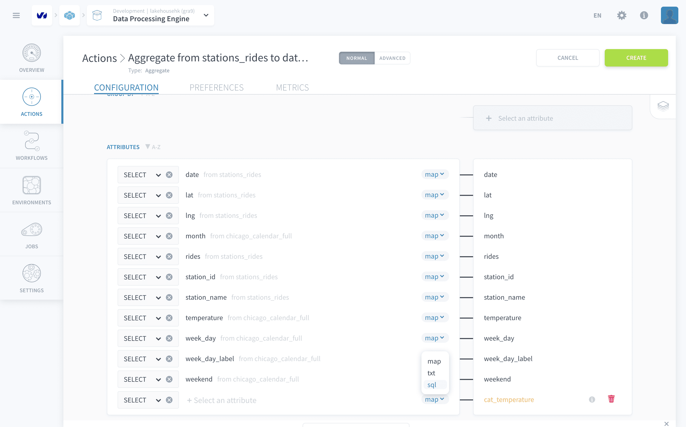

Simply copy-paste the SQL command below:

```
CASE 
    WHEN chicago_calendar_full.temperature < 40 THEN 'very cold'
    WHEN chicago_calendar_full.temperature < 48 THEN 'cold'
    WHEN chicago_calendar_full.temperature < 55 THEN 'medium'
    WHEN chicago_calendar_full.temperature < 62 THEN 'hot'
    ELSE 'very hot'
END

```

!> **Leaving a destination attribute unmapped in the Aggregate action configuration will trigger an error when the action is launched**. If you'd rather leave the destination field empty, make sure to simply remove it from the list of mapped attributes.

{Learn more about Aggregate actions}(#/en/product/dpe/actions/aggregate/index.md)

Click on **Create** at the top-right.

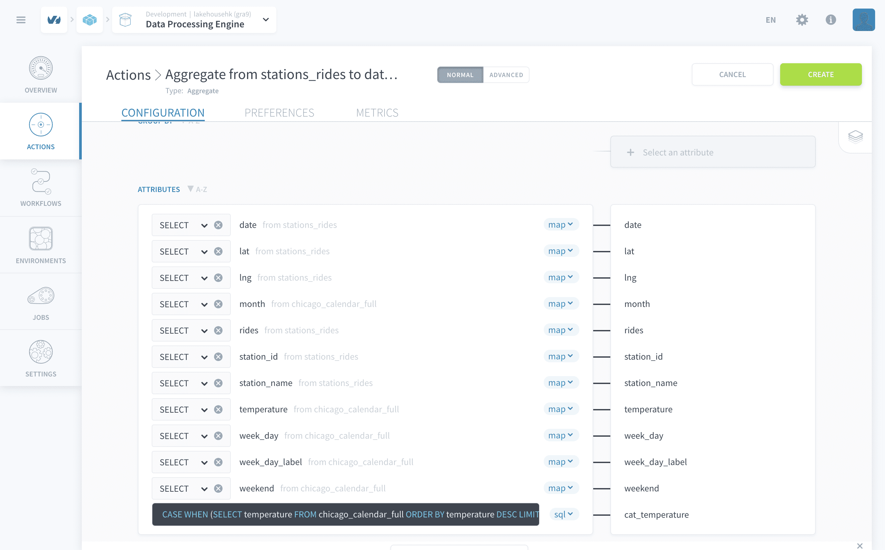

Good job 💪! **You've now successfully generated all the actions** required for this tutorial. 

?> Of course, your real-life Project will probably have more than 3 actions. You can organize your actions in folders and rename them if needed. You can also use more than one repository, especially if you are working in collaboration with teammates. Repositories of actions can be versioned and also synced with external Git repositories. Check-out the [dedicated product documentation](/en/product/dpe/actions/index?id=manage-actions) page to learn more about how to do that!

{Learn more about Actions in the Product Documentation}(#/en/product/dpe/actions/index)

---
## Workflows
Workflows are like a movie script to put your actions into... action. 🎬    

Within a workflow, actions are organized in sequential stages. Within a stage, all actions will be run in parallel while stages will always run one after the other. The same action can be used multiple times in the same workflow. A workflow, just like an action, can either be launched manually, set up to run on a schedule or triggered through an API call.

> Note that it is important to remember that **stages are run one after the other** in the order you planned them while **actions contained in a stage are all run all at the same time** regardless of the order. In short, the order of the actions inside a stage does not matter while the stages’ order inside a workflow does. 

To create your first workflow, you'll need to head to the *Workflow* tab and click on **New Workflow**. Head to preferences or double-click on the header name to set a new name *Import Chicago Data*. 

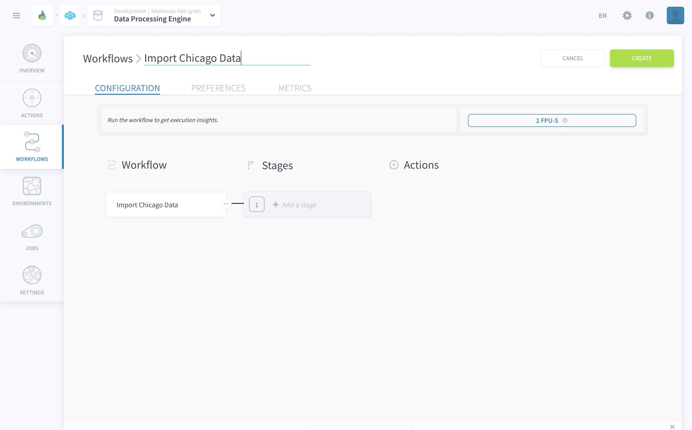

Let's start by defining two different stages by clicking on **Add a stage**. Then, add actions in each stage using the dropdown search selector following the screenshot provided as a guide for each stage.

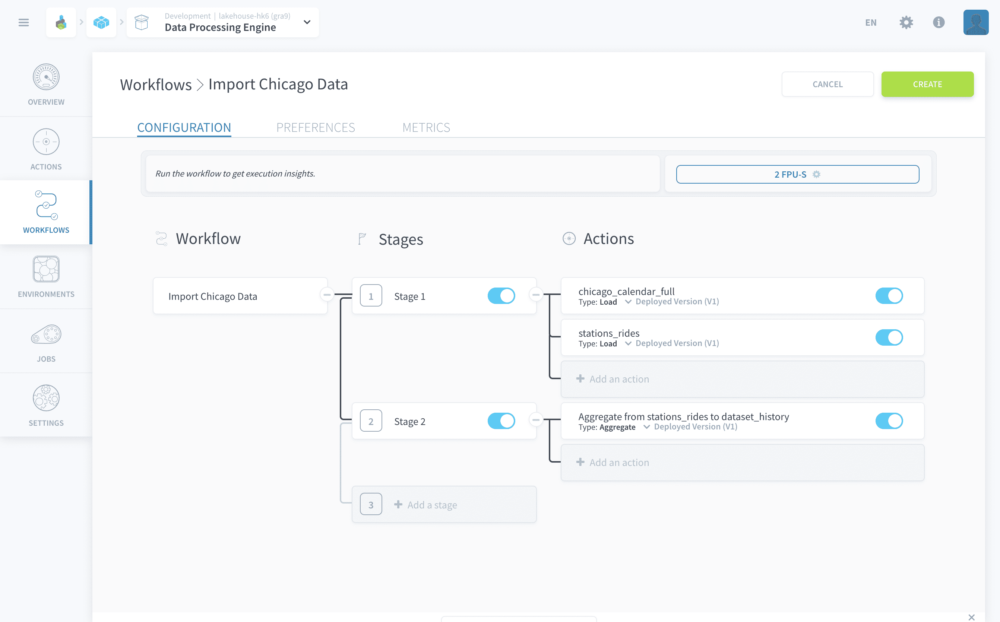

After creating the workflow (**create**), press **Play**.

> Please note that workflows might take a few minutes ⏳ to run when you launch them for the first time. The total time should not exceed 10 minutes - if it does, please reach out to our support team.

While the workflow is running, something you can do is **schedule it to run daily** using a trigger.

Head to the *Preferences* tab of your workflows and scroll to the Triggers widget on the bottom left side. Click **+Add**. 

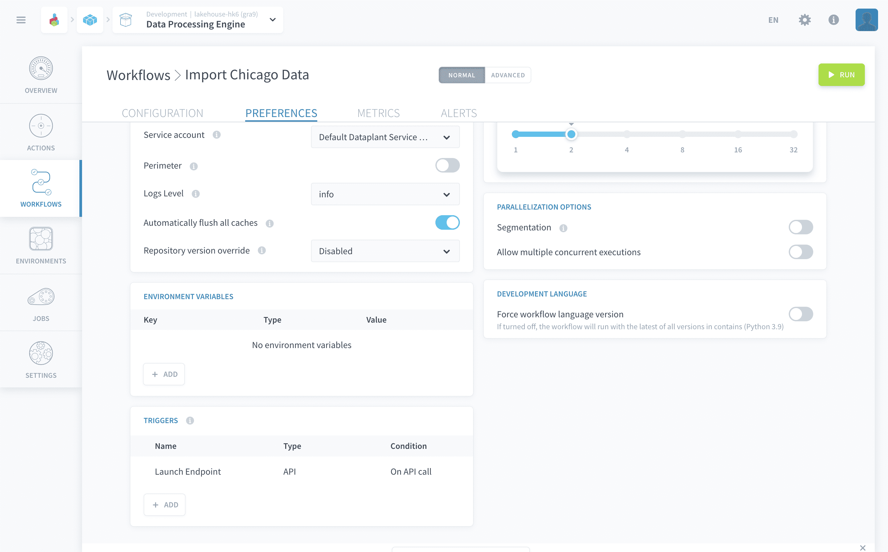

Select the trigger type as *CRON* and mode as *Simple*. Navigate to the **Daily** tab and in the list of options select *Every 1 day(s)* as shown in the picture below:

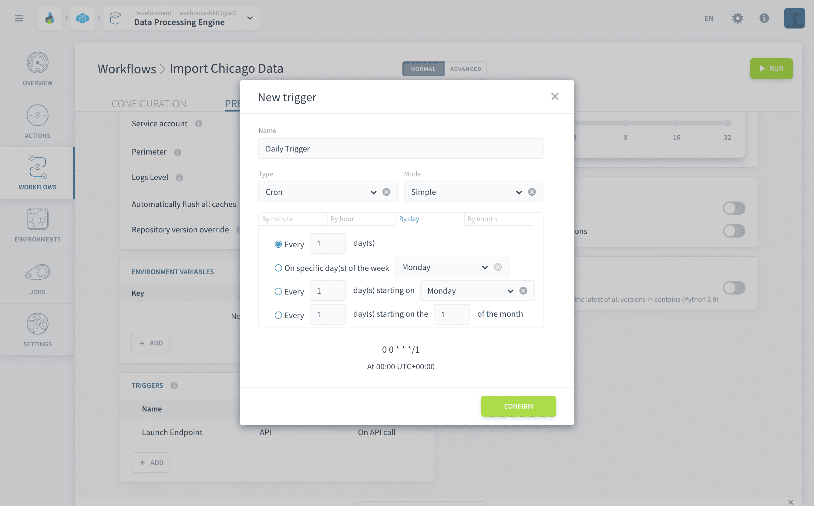

Hit the **Confirm** button to create the new trigger event with the name of your choice and it will append it below the *Launch Endpoint* present by default in the Trigger event table.

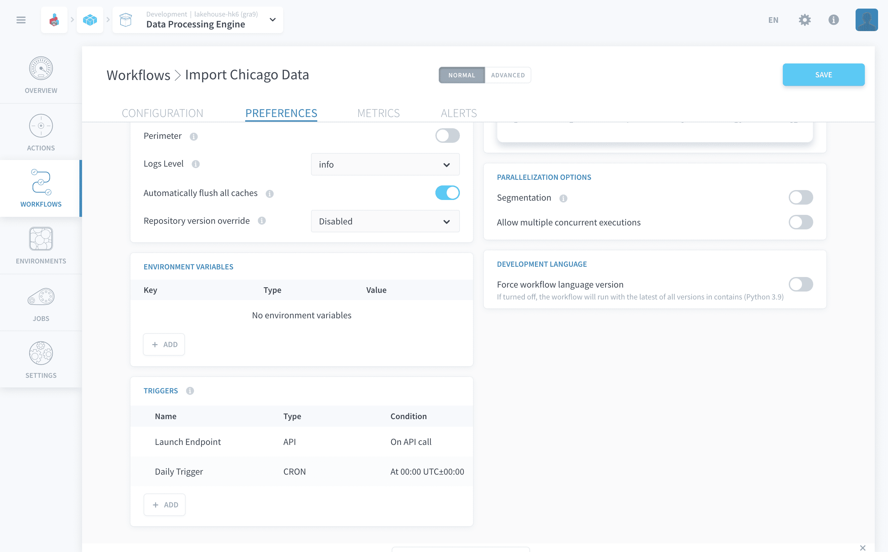

?> There is a lot more you can configure in a workflow's preferences. Namely, you can [scale horizontally and vertically](/en/product/dpe/jobs/resources) any processing job, use [workload segmentation](/en/getting-further/segmentation/index) to accelerate the data processing and even save all these configurations for repeated use thanks to [environments](/en/product/dpe/environments/index).  
[Learn more about configuring the execution preferences.](/en/product/dpe/actions/settings/index)

!> Make sure to click on the **Save** button on the top right of the screen whenever you make a modification to your workflows. Actions are stored in repositories which can be versioned which is not the case for workflows or environments. *Autosave* is therefore disabled for both workflows & environments.


---
## Jobs

To wrap up this section, here are a few words about the last tab of the Data Processing Engine component: jobs.

The Jobs tab summarizes **all executions triggered in the Data Processing Engine** and includes advanced metrics reports. Jobs are listed under three main categories: running, queued and past executions. Having a look at the last jobs executed, you can verify the status of the workflow you just launched. 

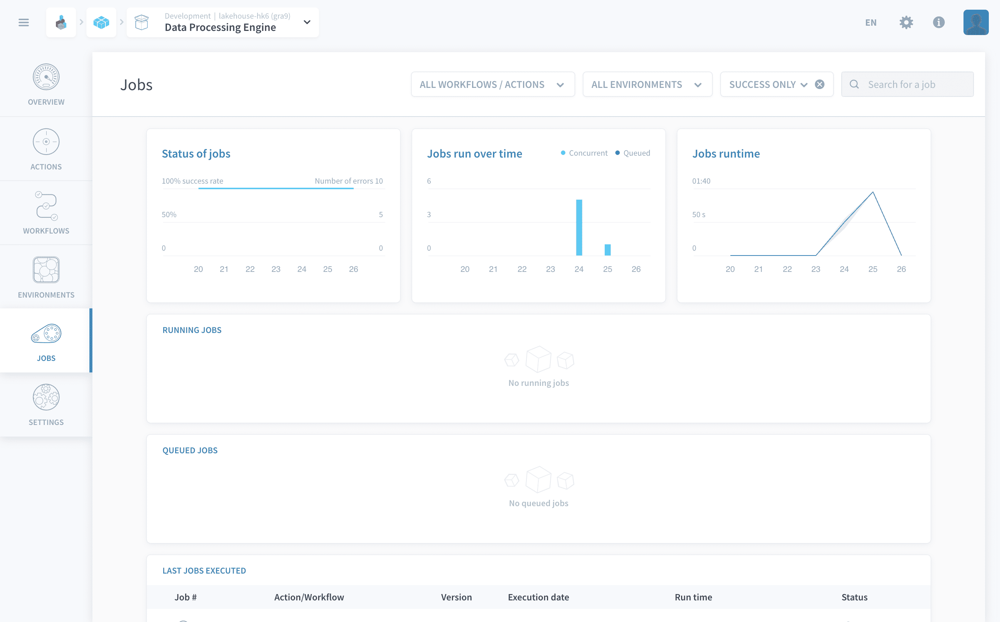

?> Resource allocation on the Platform is done through **proprietary units called [DPU](/en/product/billing/resources/index)**, Data Platform Units. You can change the amount of DPU dedicated to an action or workflow in their [preferences](/en/product/dpe/actions/settings/index).

---

You now have completed the Data Engineering section of the *Getting Started* tutorial 🌟 
 
A good way to make sure your data properly loaded is to go back to the [Lakehouse Manager](en/product/lakehouse-manager/index) and look at the number of rows loaded into the table. Just open the **list view mode** and check the *rows* column, if the field has a number (indicating how many rows have been loaded) then everything worked well.

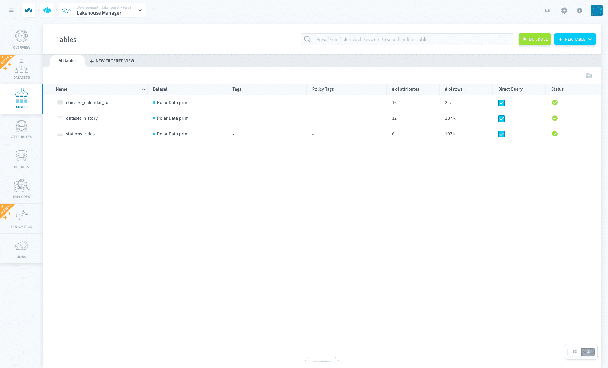

Remember you are setting up a **production-grade system**, hence why you need both a Lakehouse Manager and a Data Processing Engine. Don't hesitate to reach out at the Data Platform Channel within the [Discord Server](https://discord.com/channels/850031577277792286/1163465539981672559) if you're running into any issues or you'd like help to speed up your data pipelines, optimize their performance, adding custom exotic data sources or creating custom scripts!

Now let's move on to the next component in your data system: the Analytics Manager.

{Create insightful queries with the Analytics Manager}(#/en/getting-started/app-init/query-builder)