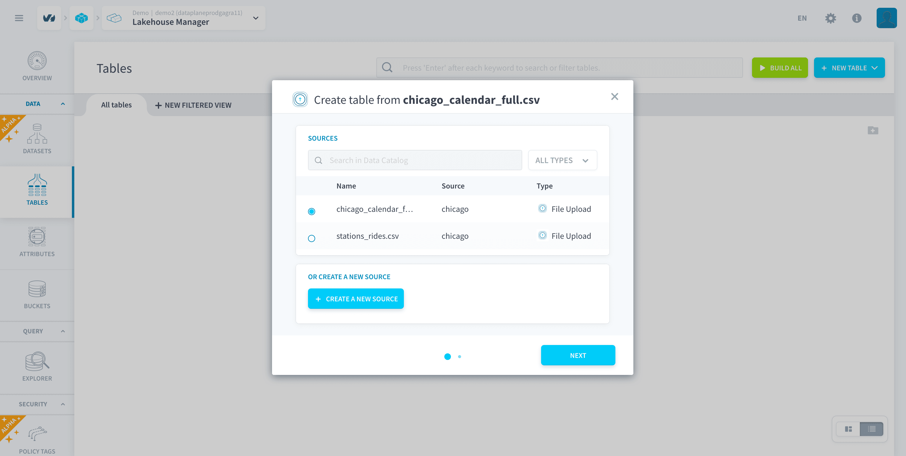
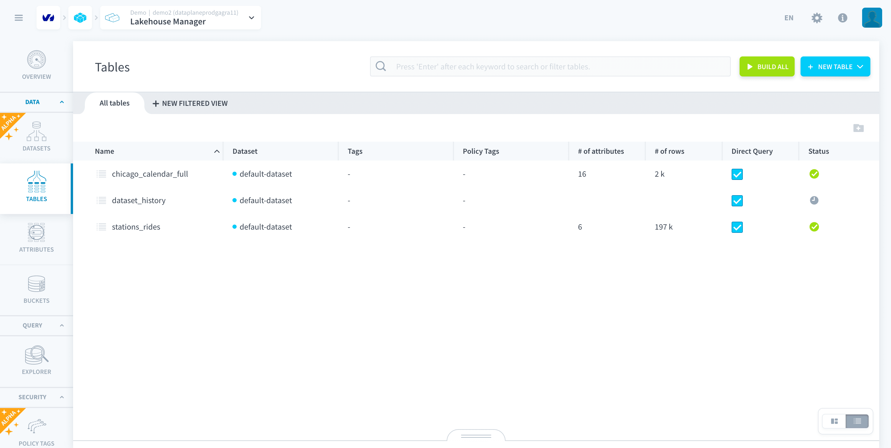

# Create and Build your data models

The **Lakehouse Manager** is the next component you will be using. It is the component that controls:
* Data warehousing
* Policy Tag Management

Using the Lakehouse Manager let us plan out your data structure at the **conceptual level**. This will be done with the help of the *Tables* functionality.

In this tutorial, you will go through the following steps:
* [Organize your data in tables](#organize-your-data-in-tables)
  * [Create your primary schema](#create-your-primary-schema)
  * [Create an aggregate table](#create-your-aggregate-table)
  * [Finalize the build](#finalize-the-build)
  * [Add virtual attributes](#add-relevant-metrics-with-virtual-attributes)  

> This tutorial is meant for **Standard Datasets** using the *Lakehouse Manager Engine*. To know how to follow this same step with **External Datasets** click [here](/en/getting-further/data-models-with-external/index.md).

---
## Organize your data in tables
### Create your primary schema
#### Add tables to the data model

Once that your metadata has been extracted, it's time to head to the Tables dashboard. This is where you will **build a unified and queryable view of all your data**.

The empty Tables page should look like this. 

The *All tables* tab is where you have access to the entirety of your data. The *New View* tab allows you to create views of only a part of your data in order to collaborate better in large teams. Since this is a simple tutorial, you should work in the *All tables* tab.

Now let’s concentrate on creating your primary tables and their attributes.

First, hover your cursor over the blue ➕ **NEW TABLE** button on the right-hand side of the screen. This will reveal the create options :

* Upload a file
* Create from Data Catalog source
* Create an empty tables

> For the purpose of this tutorial, we shall proceed with **Create from a Data Catalog source.** To create a table using upload a file refer to the [create tables](/en/product/lakehouse-manager/tables/canvas-view?id=create-a-new-table) documentation. 

Once you click on *create from a data catalog source*, you will be shown a list of sources from the the previous step. Click on source you want to add and proceed further by clicking on *Next*. No need to change the default settings here.

?> The options *Build the table, load the table once, and generate Load action for later* can be disabled and each step can be done individually as well. This can be explored in detail [here](/en/product/lakehouse-manager/tables/canvas-view.md?id=create-a-new-table)

Press **Create** and proceed to repeat the same with the second table as well.

?> Note that each time you make a change on the Tables page, your visual configuration is **automatically saved**.

At this stage, your Tables page should look like this.

?> Note that the Platform uses the metadata information captured in the Analyzer step to automatically create tables and assign attribute names & types. The source files provided are good to go, however in a real Project you should use the Analyzer to check the data sources, before dragging and dropping them in the Tables page.

### Create your aggregate table 

Now, you will aggregate all important data from the sources (namely rides, dates and temperatures) into one table that will be used in the final application.To create your first *Aggregate* table, click on the blue ➕ icon. Select *Create an empty table*, and you will be shown a new table configuration. Set a name (*dataset_history* for example) and save it.

Now, before you start adding attributes to the new empty table you have created you will need to change the view from list to canvas on the bottom right side of the screen to make the next steps easier.

Move the attributes below by drag and drop to *dataset_history*:

|        Original table           | Attributes to drag-and-drop      |
| :------------------------------: | -------------------------- | 
|    **stations_rides**       |  *date* / *lat* / *lng*  / *rides* / *station_id* / *station_name*   | 
|    **chicago_calendar_full**     |  *month* / *temperature* / *week_day* / *week_day_label* / *weekend* /     |

Finally, you will need to create one new attribute to help translate numerical temperature data into understandable categories (cold, hot, ..).

Start by clicking on the ➕ icon that appears at the top of the table *dataset_history* when you click on it. You can then create or edit an attribute inside a table.

Define the attribute as such:

|                Attribute name               | Type               | Nature                  | 
| :------------------------------: | ----------- | ------------------- |
|  **cat_temperature**            | String                             | Dimension                     |

> For the moment, this attribute is not physically specified but don't worry! It will be done soon in another component: the Data Processing Engine.

[Learn more about Tables](en/product/lakehouse-manager/tables/index)

### Finalize the build

!> One last quick check ✋! Make sure to **double-check that your data model looks exactly like the one in the screenshots** before moving to the next step. If some attributes are missing you will get stuck in later steps of the tutorial.

Now, click on the *Build* icon (under the blue ➕ icon) to effectively create/update the tables and attributes in your [storage engine](/en/product/dataplant/storage-engine/index). This still doesn't load the data into the tables (which will be done in the next article), it simply applies the logical schema to tables and attributes in your underlying storage engine.

?> While the visual logical schema of the data is automatically saved, changes to your tables won't be visible in the rest of the Platform as long as they are not built.

The build task for this tutorial shouldn't take more than a few minutes to run. Once it is done, you can move on.

### Add relevant metrics with Virtual Attributes

Before moving on to the physical processing (ETL/ELT) of the data into this model, let's prepare additional metrics for analytics later on. The final application that you are building following this tutorial includes a chart with the **number of rides per day on a given station**: 

However, you do not have the necessary data to build that chart directly on the primary sources. You will need a metric that gives you the average number of rides per day for a given station and that can be used in queries and dashboards. 

But how do you compute it using the Platform? One way to do this is to create a **virtual attribute**. Virtual attributes allow you to calculate SQL formulas that will be **computed on the fly** and won't be stored in the database. They can be used in a query or a chart in your final dashboard.

> 💡 Adding or editing virtual attributes does not require rebuilding the schema.  

Switch to the **Attributes** page. This page lists all physical and virtual attributes in your data model, and the lineage in your Project.

Click on the *New Attribute* button to create a virtual attribute. 

In the creation window, make sure to select *Virtual* as the realm.

Now add these two attributes and their respective SQL code:

|              Attribute name               | SQL              | 
| :------------------------------: | -------------------------- | 
|           **avg_rides_per_day_per_station**     | SUM(rides)/COUNT(DISTINCT CONCAT(CAST(date AS VARCHAR), CAST(station_id AS VARCHAR)))                |
|             **yearmonth**           | SUBSTR(CAST(date as VARCHAR),1,7) | 

The **yearmonth** attribute gives you the year and month in the format *yyyy-mm*. You will use it later.

?> Notice how you just used two different methods to generate new attributes/metrics from imported data: **adding an attribute to a Aggregate table** and **virtual attributes**.  
🔘 Adding a new physical attribute takes up storage and requires you to physically define them in the Data Processing Engine, but this makes them more rigorous as their specifications can then be edited without changing the whole data model. New physical attributes can also be used as [indexes](/en/product/data-manager/tables/table_interactions?id=labeling-and-indexing).  
🔘 Virtual attributes are a quick win but can become hard to manage if you need to modify them when scaling.  

It's time to head to the Data Processing Engine to see what's next. 

{Prepare your data pipelines with the Data Processing Engine}(#/en/getting-started/app-init/dpe)