# Prepare your data for Machine Learning

You work for the [Chicago Transit Authority](https://www.transitchicago.com/about/) and want to set up an AI system to **predict whether your metro stations are going to be overcrowded** based on temporal and environmental factors in the city. 

*Photo by <a href="https://unsplash.com/fr/@skylargereld?utm_source=unsplash&utm_medium=referral&utm_content=creditCopyText">Skyler Gerald</a> on <a href="https://unsplash.com/fr/photos/jeMnUm2fG8s?utm_source=unsplash&utm_medium=referral&utm_content=creditCopyText">Unsplash</a>*
  

You will go through the following steps, to prepare the data for your AI model:
* [Build your first pipeline](en/getting-started/ml/dataset.md?id=build-your-first-pipeline)
* [Prepare your datasets](en/getting-started/ml/dataset.md?id=prepare-your-datasets)
  * [Define the source tables](en/getting-started/ml/dataset.md?id=define-the-source-tables)
  * [Define the features](en/getting-started/ml/dataset.md?id=define-the-features)
  * [Pre-processing](en/getting-started/ml/dataset.md?id=pre-processing)
  
---
## Pre-requisites

Before going through this tutorial: 

* Download [this zip](https://hq.forepaas.io/getting-started/ml-data-csv.zip) containing the two data files necessary for this guide: *ml_dataset.csv* and *ml_sample.csv*.
* Load the files into your [Data Catalog](/en/product/data-catalog/index):
  * Load them into the **Sources tab** of your Data Catalog.
  * Extract their metadata in the **Analyzer**.
* Build the data models in the [Lakehouse Manager](/en/product/lakehouse-manager/index)
  * Add both tables (respectively naming them *ml_dataset* and *ml_sample*) to your **Tables tab**.
  * Don't forget to enable the corresponding Load actions.
  * Make sure *date* and *station_id* are set as primary keys for both.
  * Save and Build your model by clicking on the **Play** icon
* Process the physical data in your [Data Processing Engine](/en/product/dpe/index) (DPE):
  * Open your DPE and head to the **Workflows tab**.
  * Create a workflow containing both newly created Load actions.
  * Run the workflow and wait a few minutes for the job to be completed.
  * Head back to the Lakehouse Manager, in the list view of the **Tables tab**, and make sure that both tables are filled with data (# of rows is greater than 0).

You're all set! The sample data model you just created will be used by the machine learning model you are about to build.

Ready? Go! 🏃

---
## Build your first pipeline
From your project's home page, open the **Machine Learning Manager**.

Feel free to read through the welcome page, and when you are ready click on **New Project**.

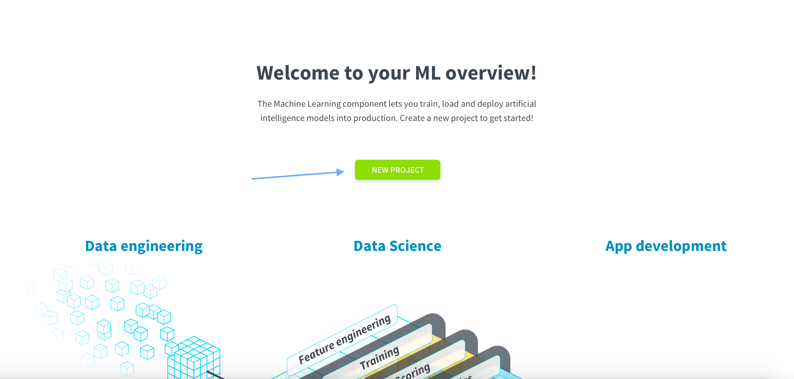

All your AI files will be stored within a ForePaaS repository (called *Default*) to ensure production-grade version control. You have the option to connect your own Git repository. For more details on how to do this, please check out our [Product Guide](/en/product/ml/pipelines/index.md?id=pipeline-repositories).

The ForePaas Platform gives you the option to import your own trained ML model and even use Jupyter Notebooks. Since you’re going to build your own model, click on **Pipeline**, then **Get Started**. 

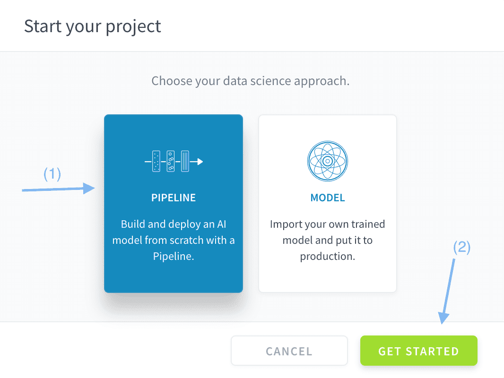

You just created your first ML pipeline on the ForePaaS Platform. Now it's time to configure it! 🔩   

Double-click on the pipeline's name in the header to rename it to *Chicago ML Pipeline*.

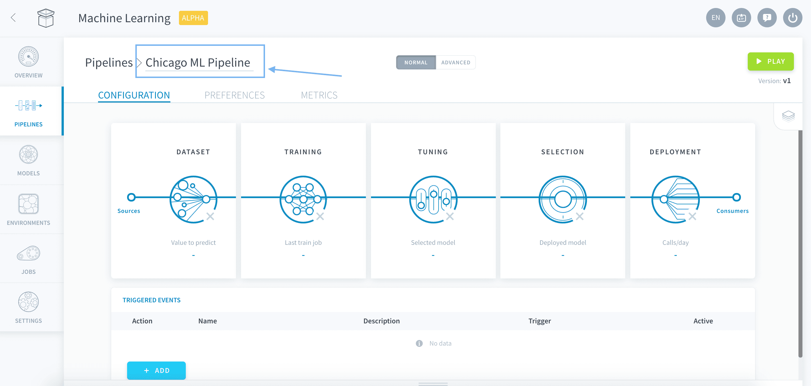

As you can see, a ForePaaS pipeline is made of **five configuration steps** from the data preprocessing to the deployment options. Each guide in this **Getting Started for Machine Learning** series will tackle one of them. You'll be ready to go live in no time!

---
## Prepare your datasets
### Define the source tables
Open the **Dataset** panel.

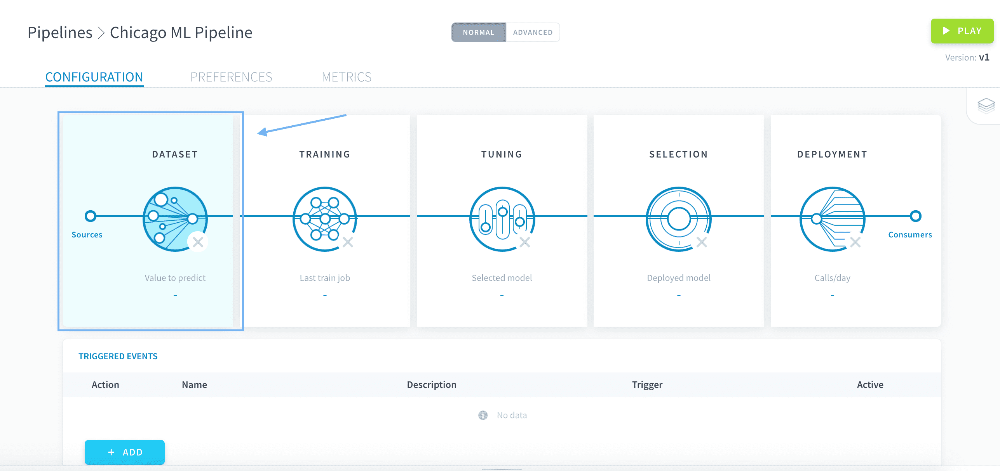

Choose **Tables** as the Input Type, to use the data from the data model you just created in the Lakehouse Manager.

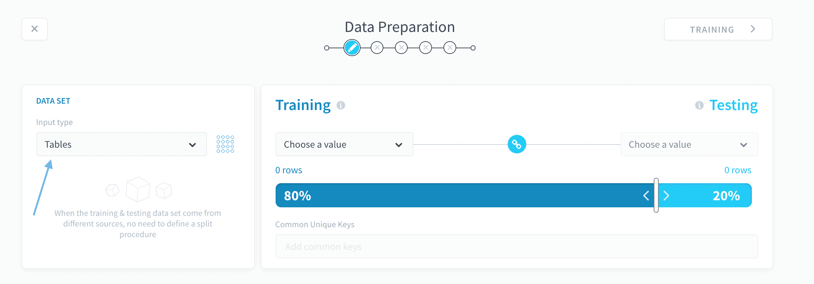

The data used in an AI Project is typically segregated into two subsets: one to train your model, the other to test it. To select your training data, under **Training**, select *ml_dataset*.

Since you want this table to be the source for your testing data too, simply make sure the **link 🔗** icon between Training and Testing is active. You can toggle this on and off by clicking the link icon.

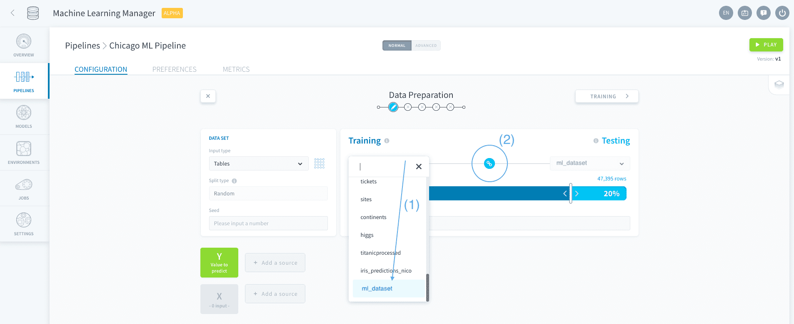

To select how much training vs. testing data to use, move the slide bar to *85%* of the data for **Training** and *15%* of the data for **Testing**.

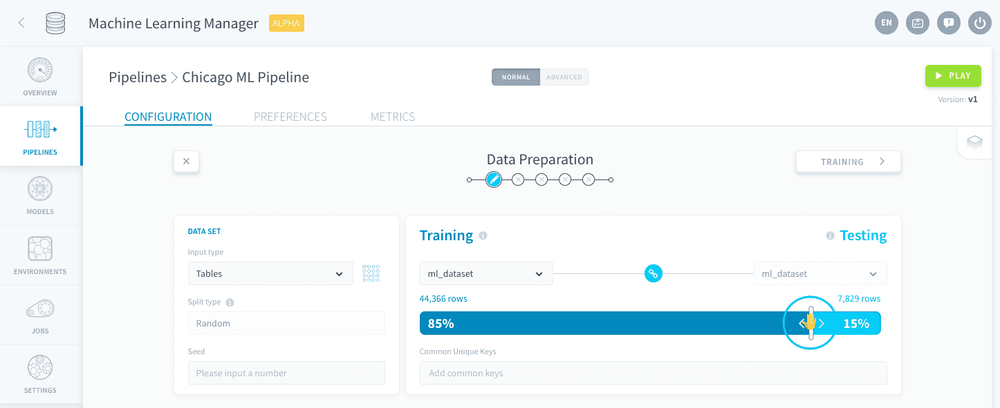

As you can see in the initial panel under *Tables*, the split is made randomly on the rows of the input table. You can control the reproducibility of the split with the **Seed** in order to get the exact same results as this tutorial. Write *27062020* as the seed.

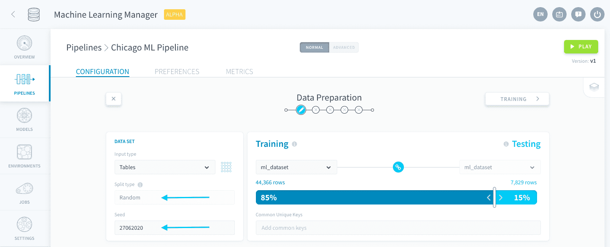

> Note that pipelines autosave 💾! You can exit and come back at any time.

### Define the features
The next step in AI modeling is to choose the X and Y variables. Y is the value to predict, and X is the set of features that influence this prediction. In this case, you want to use the available data to predict whether subway stations in the Chicago metropolitan area will be overcrowded.

Let’s start by adding the Y value, the “overcrowded” outcome. Click on **Add a source** next to Y.

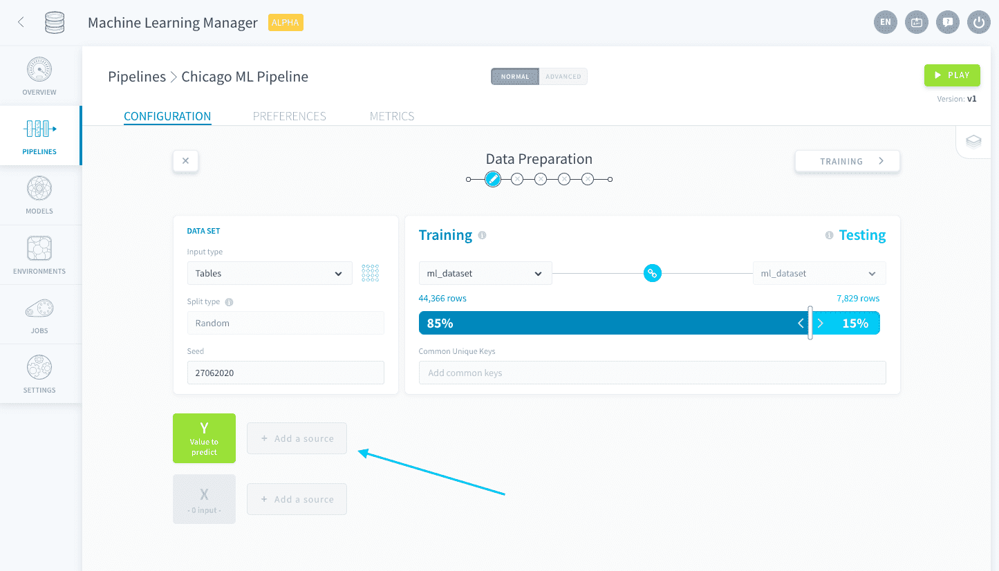

Then select *is_overcrowded from ml_dataset*. The possible values of Y will be 1 if the stations are overcrowded or 0 if they’re not. Add a description to reflect these outcomes then press **Save**. 

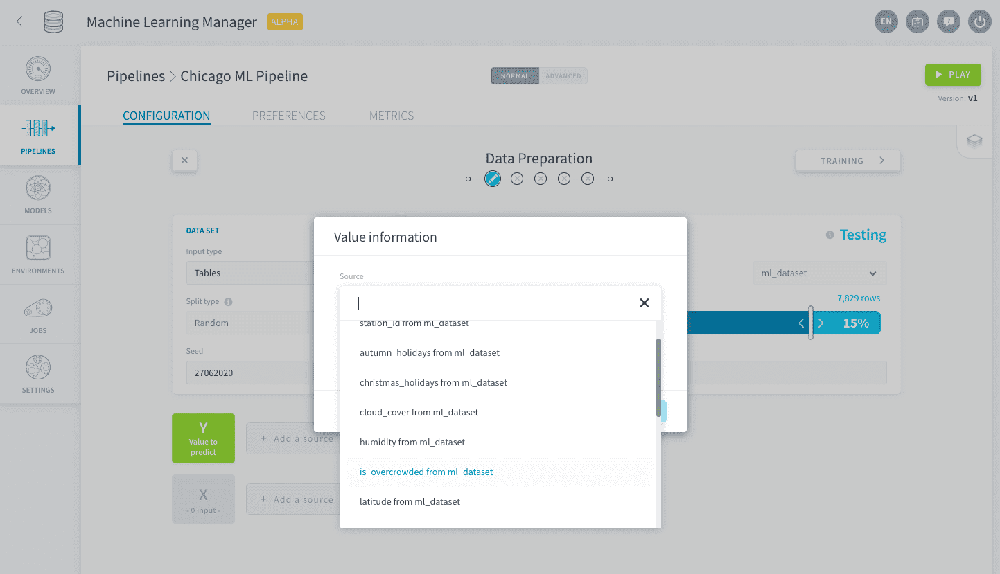

Now let's add the X features. Click on **Add a source** next to X.

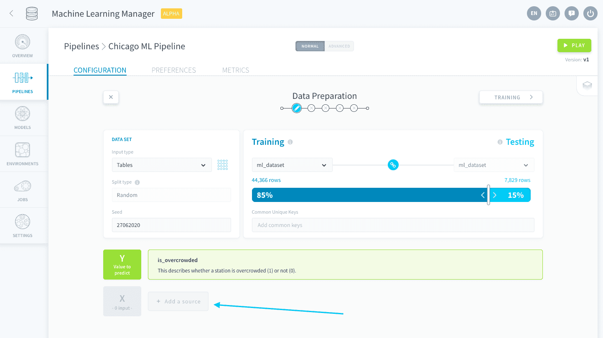

Click on *Add all variables*. Don't worry about duplicates: this option does not add the Y value-to-predict to your X! ✨

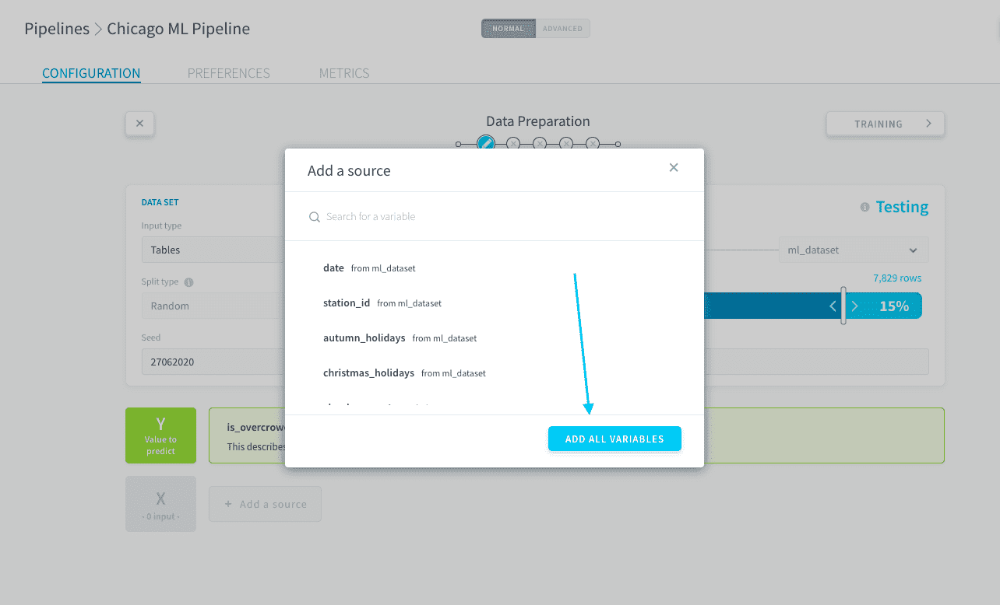

### Pre-processing
In the steps above, you added the X variables in bulk. This is great because you don't have to add each variable one by one, manually. However, since all of the variables were added you should go through each variable and verify if you really need all of them or not. 👀

For example, some of the X variables in your *ml_dataset* are redundant and could thus negatively impact your prediction. To remove a variable, click on the **trash 🗑 icon** on the right-hand side of the variable row. Remove the following variables from your X set:

|                variable                                 | Reason to remove         | 
| :------------------------------: | -------------------------- | 
|             **date**      | Redundant with holidays variables                     | 
|            **latitude**              | Redundant with *station_id*                             | 
|            **longitude**  | Redundant with *station_id*                             |
|            **station_name**               | Redundant with *station_id*                     | 

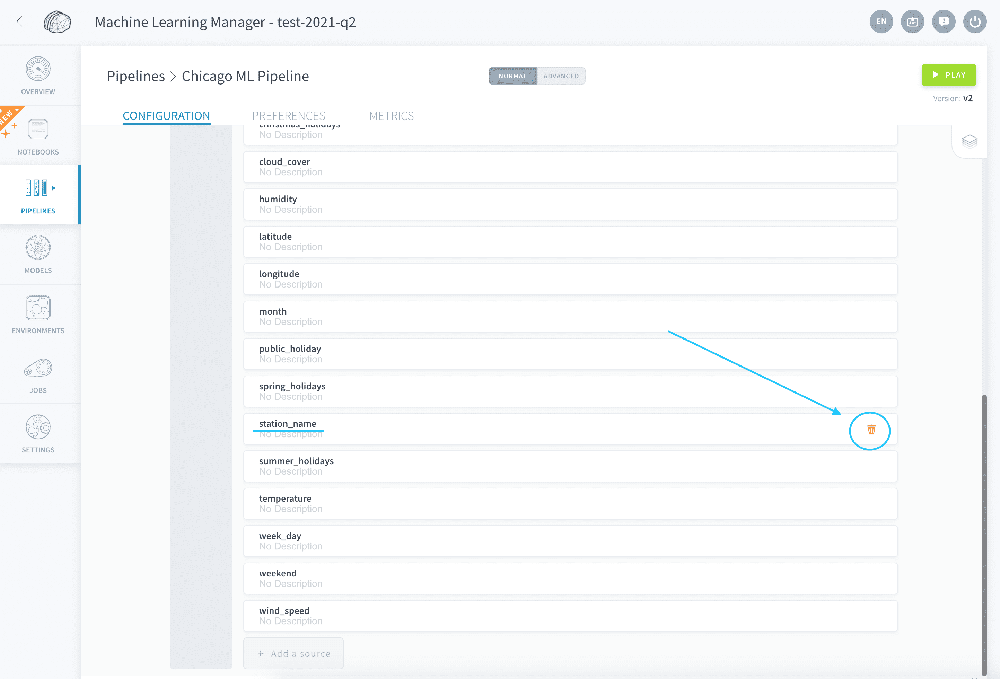

Your datasets are successfully configured and ready to be used for some cool 🤖 machine learning.  
Let's move on to the next step: choosing and configuring a training procedure.

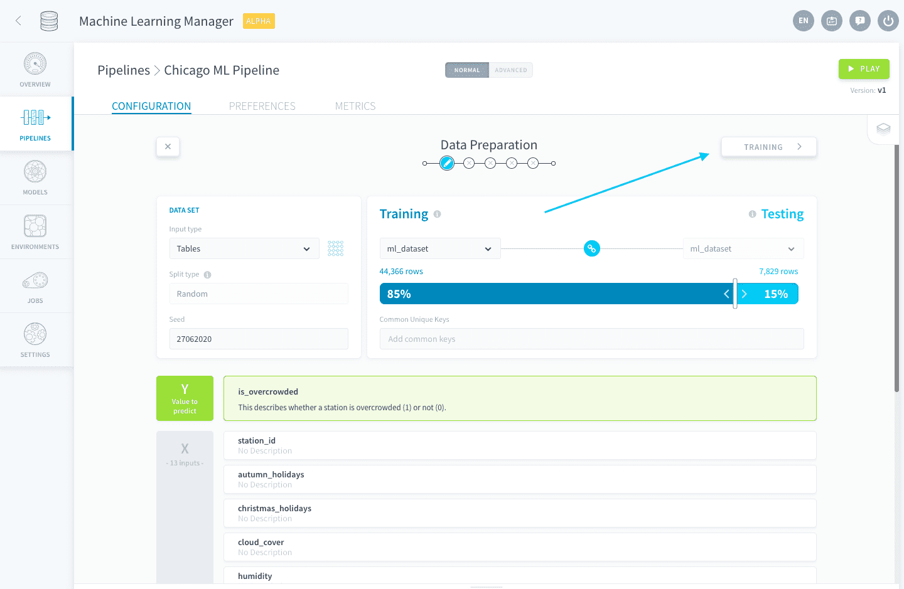

{Step no 2: Training}(#/en/getting-started/ml/training.md)