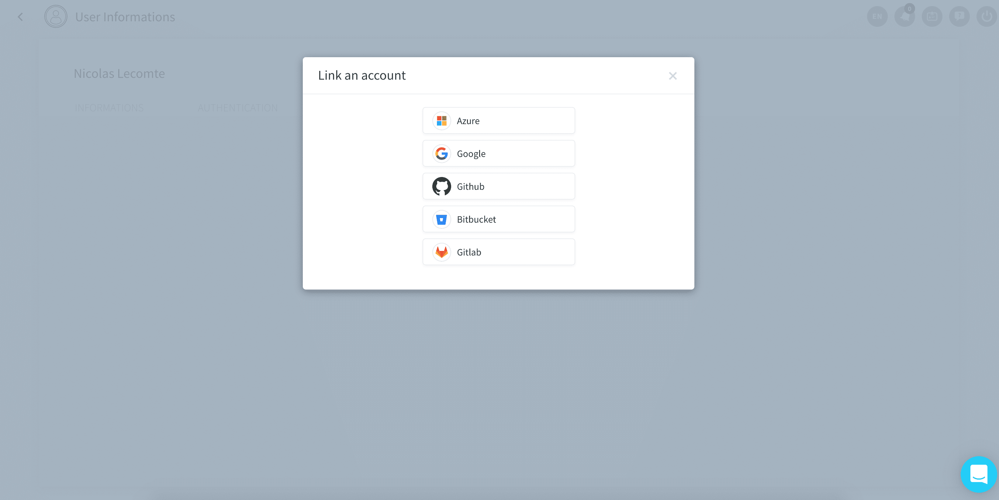

# Edit your ForePaaS account

At any time, you have the possibility to view and edit your user profile from the platform by clicking on [Profile](https://hq.forepaas.io/#/user) at the top right.

### Preferences

The **Preferences** tab lets you edit basic user information on your profile.

You can also see the list of organizations you are part of, as well as organizations where you might have potential teammates based on your email domain. You can request to join those organizations by clicking on the corresponding **Request to join** button. *Admins* of this organization will receive an email and will have to [manually approve your application](/en/product/account-setup/organization-invite-user?id=accept-or-deny-requests-to-join-your-forepaas-organization).

### Security

The **Security** tab lets you change your password, manage multi-factor authentication and track recent logins.

It also enables you to manage *linked accounts*, i.e. the single-sign-on (SSO) accounts which you use to log into ForePaaS.

