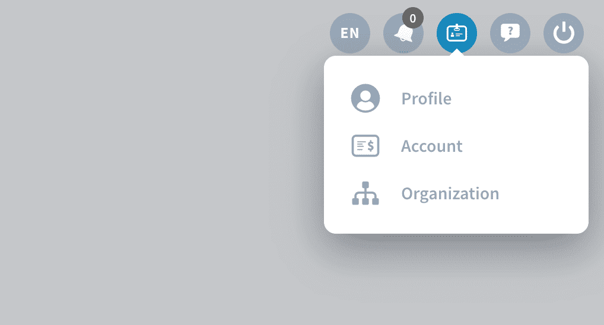

# Profile and organizations

Creating your own user profile is the first necessary step in order to use ForePaaS. It can be done in under 5 minutes and is **completely free**!

You can then create or join an **organization**: it is a workspace shared with your teammates to work on projects. Once you are part of an organization, you can create [Dataplants](/en/product/dataplant/index) which are dedicated environments where you can carry out specific data projects. Each Dataplant usually represents one project.

> 💡 ForePaaS charges at the organization level through the purchase of a subscription plan. 

---
## Create a ForePaaS account
Join your team on ForePaaS by creating yourself an account on the platform. It is completely free!

{Create your ForePaaS profile!}(#/en/product/account-setup/create-account.md)

---
## Create or join an organization

An organization represents a company or a specific business unit. It is where you can add all your teammates to work on multiple data projects.

{Learn more about organizations!}(#/en/product/account-setup/organization-create.md)

---
## Activate a subscription for your organization

**ForePaaS doesn't charge per user or Dataplant, but for an organization's subscription plan and consumption**. You can purchase a subscription for your organization by yourself through your [Billing Account](en/product/billing/account/index).

{Get started with a subscription!}(#/en/product/billing/index.md)

---
## Create your first Dataplant

A Dataplant is like a mini-factory to build AI projects and applications. It contains all the necessary components from raw extraction to restitution. Dataplants individually have a set of dedicated resources that can be allocated freely depending on the needs of your project.

{Create your first Dataplant!}(#/en/product/dataplant/create-dataplant.md)

---
## Help us help you! 🗣️

We cannot stress enough how much you are important in helping us make the product better. Our support & product teams are truly dedicated to making your experience as smooth as possible. For that to happen **don't hesitate to reach out directly** and **don't hold back for sharing feedback** even without filters. We'd rather know what works and what doesn't, it's all about the learning experience!

Below are 2 channels for you to share this information:
* **Got an idea?** 💡 Submit your feature request or any idea on our [product portal](https://hq.forepaas.io/#/features), access it directly from the platform by clicking on *Roadmap* in the top right of the navigation bar.
* **Need help?** 🆘 At any step submit a request on our [support portal](https://support.forepaas.com/hc/en-us/requests) for help, access it directly from the platform by clicking on *Support* in the top right of the navigation bar. You can also send us an email on *support@forepaas.com*.