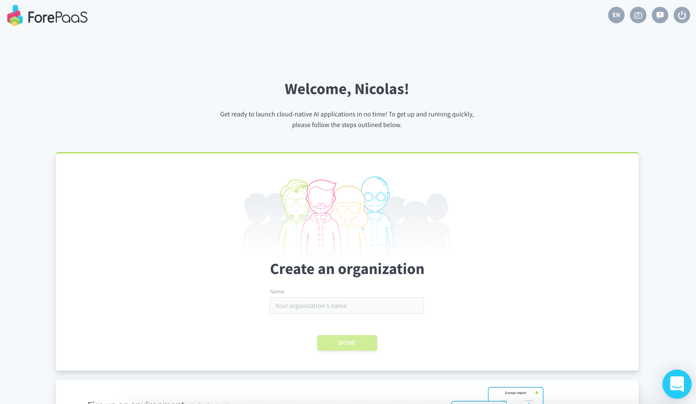
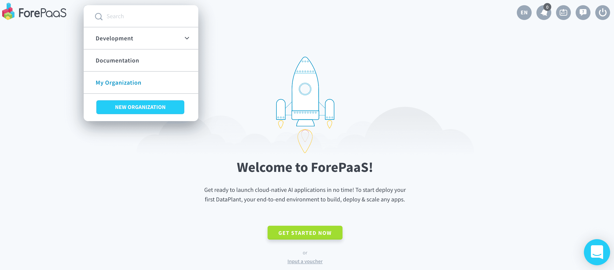
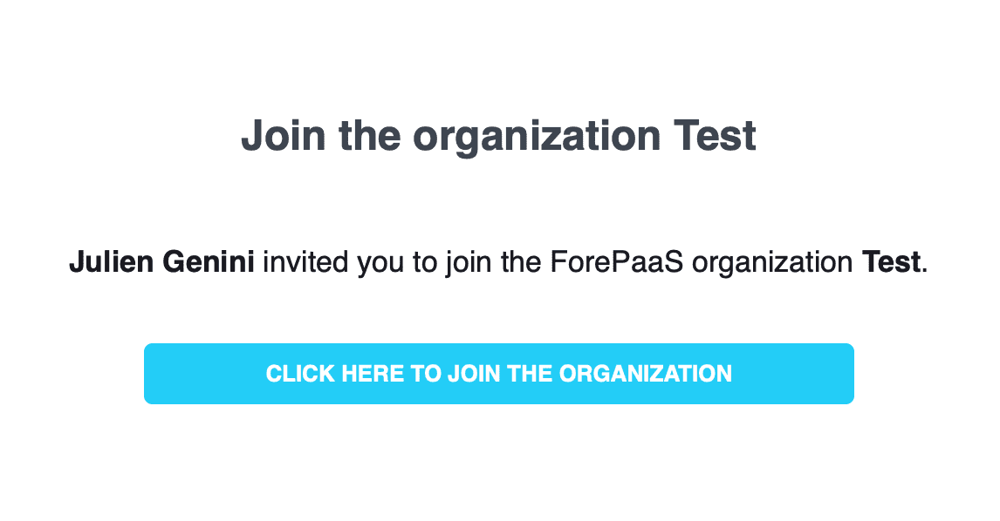
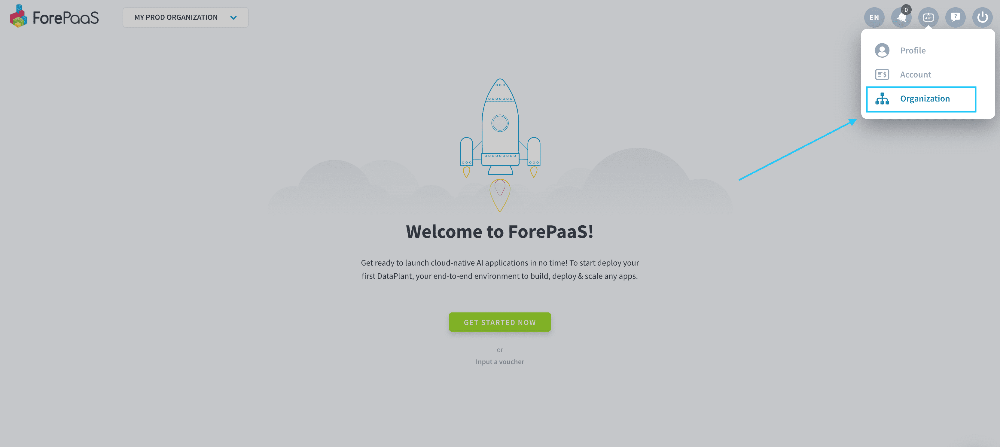

# Create or join an organization
Organizations are the compartmentalized teams that link individual members, Dataplants and plans together. You can have as many teammates in your organization as you want. 

Your organization can work on multiple data projects at the same time. Each project is carried out inside a [Dataplant](/en/product/dataplant/index.md): you can create as many as you want.

> To create or join an organization, make sure that you already have a [ForePaaS user account](/en/product/account-setup/index.md)

---
## Create an organization
Go to [hq.forepaas.io](https://hq.forepaas.io).

### If you are not in an organization
If you are not part of an organization already, you will be able to create a new one:

### If you are already in an organization
If you are already in an organization, click on the drop-down menu located at the top left and then on **New organization**.

Fill in the name and press **Done**. 

---
## Join an existing organization
To join an organization that already exists (if your team already has one, for example), you need to ask someone already on there to invite you.

{Learn how to invite members}(#/en/product/account-setup/organization-invite-user.md)

You will receive an email with a clickable link inviting you to join their organization.

---
## Manage your organization settings

You can manage your organization by opening the drop-down menu at the top right and by clicking on **Organization**.

From there, you will be able to configure:
- Your organization members and permissions
- Your Dataplants
- Your storage engines
- Your billing settings
- Other parameters: Name, description, SSL certificates, domain names, etc.

{Learn how to configure an organization}(#/en/product/account-setup/organization-settings.md)