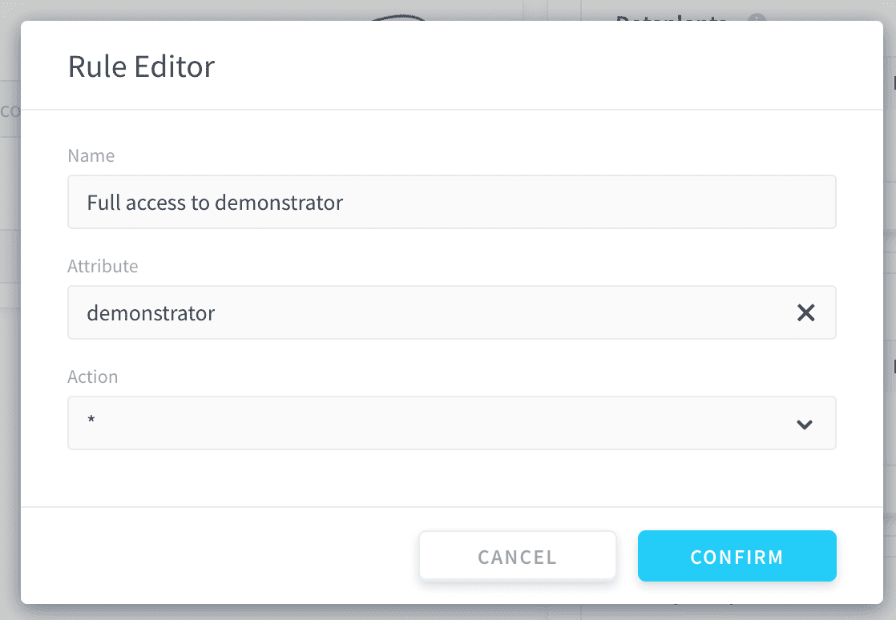
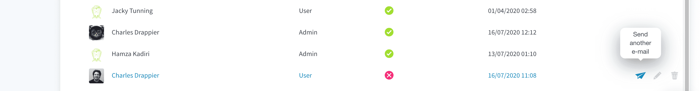

# Add members to an organization

On the ForePaaS Platform, you can have as many people as you want in your organization. Those members can have full or restricted access to the projects (i.e. [Dataplants](/en/product/dataplant/index) and [storage engines](/en/product/dataplant/storage-engine/index)) in the organization.

?> To manage access control to the components or the applications inside a specific Dataplant, you need to use this Dataplant's [Identity Access Manager (IAM)](/en/product/iam/index).

- [How to invite a member in your ForePaaS organization](/en/product/account-setup/organization-invite-user?id=invite-members-in-your-organization)
- [How to accept/deny requests to join your ForePaaS organization](/en/product/account-setup/organization-invite-user?id=accept-or-deny-requests-to-join-your-forepaas-organization)
- [How to manage member permissions](/en/product/account-setup/organization-invite-user?id=manage-member-permissions-in-your-organization)

---

## Invite members in your organization

### Organization member list

Go directly to [ForePaaS](https://hq.forepaas.io) and access the organization for which you want to add members by clicking on the drop-down menu at the top left.

Then open your organization by clicking on **Organization** at the top-right. 

Click on the *Members* tab. You should be able to **see the list of members within the organization** as well as yourself.

Click on *+ Add Member* button to invite a collaborator.

### Fill in member information

Fill in the new user's **email address** regardless of whether this person already has a ForePaaS account:
* If the new collaborator *doesn't have a ForePaaS account*, they will receive an invitation to sign-up and log-in to the platform. They will be automatically added to the organization after signing-up and validating the email.
* If the new collaborator *has a ForePaaS account*, they will simply be prompted to join the organization

> 💡 You can add multiple members with the same permissions in one go by adding multiple addresses in the **email(s)** field

You will need to choose the user's **role**. There are 2 organization roles:
* **Admin**: Admins have **all access & control rights** on all elements of an organization. They can therefore edit, manage or delete Dataplants, organization members or even change the subscription plan of an organization. They will also de-facto have access to all the services of the Dataplants deployed in the organization i.e. the DPE, Data Manager, etc.
* **User**: Users have by default **no access or control rights**. By default, users will not even see Dataplants contained in the organization. They will only be able to access the organization and its details such as its users, plan or quotas. You can assign specific rights to users using [access control rules](/en/product/account-setup/organization-invite-user?id=manage-user-permissions-in-your-organization).

---
## Accept or deny requests to join your ForePaaS organization

It is possible for people with the **same email domain as any existing member** in an organization to request to join this organization when they first sign up. *Admins* of the organization will have to manually accept the person into the organization after they requested to join.

> This feature can be deactivated in your [organization's settings](#/en/product/account-setup/organization-settings) if your [pricing plan](/en/product/billing/plans/add-subscription) is Premium or above.

To manage requests, click on the *Members* tab. At the top of the list of members in your organization, you will see all the people that have requested to join your organization. 

You can accept or deny their request from here. If you accept, they will be added in your organization as simple *users* with no permission. You can then assign specific rights to them using [access control rules](/en/product/account-setup/organization-invite-user?id=manage-user-permissions-in-your-organization).

---

## Manage member permissions in your organization

By default, *Admins* have full access to the organization settings as well as its projects. For simple *Users*, there are 3 main categories of rules that you can manage at the organizational level:

* [Dataplants access rights](en/product/account-setup/organization-invite-user?id=dataplants) - Allow users to get specific control rights to a [Dataplant](/en/product/dataplant/index) or its infrastructure.
* **Storage config. rights** - Allow users to update the default configuration of your [storage engines](/en/product/dataplant/storage-engine/index)
* [Storage Engines rights](en/product/account-setup/organization-invite-user?id=storage-engines) - Allow users to get specific control rights to [storage engines](/en/product/dataplant/storage-engine/index) in your organization

### Creating rules

To create a rule, simply navigate to the category of interest and click *+ Add new rules*. Inside the rule editor window, follow the instructions.  

For instance in the example below, the rule is granting all access & control (Action set to *****, i.e. all) to the Dataplant *demonstrator* (Attribute set to *demonstrator*) to the user.

!> Rules are additive. In other words, they "stack" on top of each other. To give access to 2 Dataplants, you can create 2 separate rules which individually grant access to these Dataplants.

!> The order of rules matters. If two rules overlap (at least one service is affected by both rules), the rule that is processed last wins.    

*Example:* If a rule grants access to all Dataplants (say rule 1) and one blocks access to one of them (say rule 2):
* If rule 1 is listed after rule 2, then rule 1 will be processed last and the user will have access to all Dataplants. 
* If rule 1 is listed before rule 2, then rule 2 will be processed last and the user will have access to all Dataplants but the one restricted by rule 2.

### Dataplants

These permissions are the most important and allow you to define the rights of your user to access your [Dataplants](/en/product/dataplant/index) and your different Custom Domains (if you have any). It is possible to modify these rights per Dataplant.

  - **Read**: See the Dataplant(s) of the organization
  - **Create**: Create a Dataplant
  - **Update**: Change the amount of FPU allocated to the Dataplant(s)
  - **Delete**: Delete the Dataplant(s)
  - **Deploy**: Deploy an application or a worker on the Dataplant(s)
  - **Logs**: Access to the monitoring and logs of the different components (Data Processing Engine, Query Builder, etc.) present in the Dataplant(s).

> These permissions are high-level read/write access to Dataplants and their infrastructure. To manage access control to the applications or the components inside a specific Dataplant, such as data processing pipelines or buckets, you need to use this Dataplant's [Identity Access Manager (IAM)](/en/product/iam/index).

### Storage Engines

These permissions allow you to define the rights of your user to edit your [storage engines](/en/product/dataplant/storage-engine/index).

  - **Create**: Create a storage engine
  - **Read**: See the storage engine(s) of the organization
  - **Update**: Change the amount of FPU allocated to the storage engine(s)
  - **Delete**: Delete the storage engine(s)

### Validation

Once you're satisfied, simply click on **Save** and the user(s) will receive an email invitation to join the organization. It might happen the user does not receive the email or forgets to join, if that's the case you have the option to resent the invitation at any time by clicking on the paper plane icon:

> Note that members who have not accepted your invitation to join an organization will be marked with a **status** ❌. All members who have successfully accepted your invitation and joined will be marked as ✅.

---

Check out the following article to learn how to manage the other aspects of your organization such as its subscription plan, billing information, or quotas.

{Set up your organization}(#/en/product/account-setup/organization-settings)