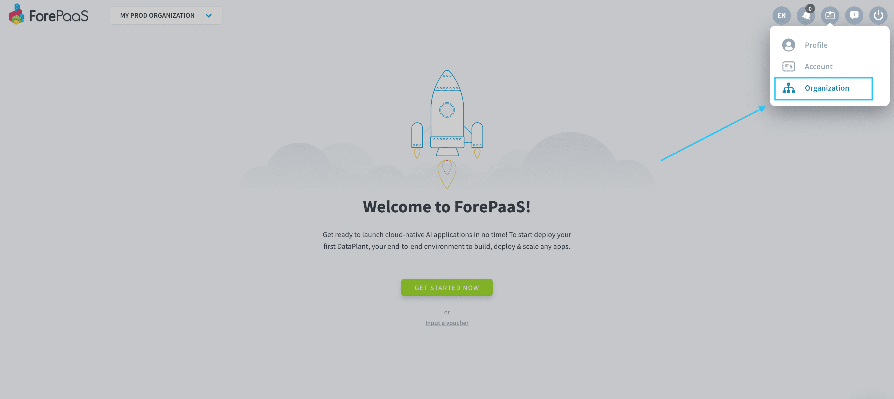

# Edit organization settings

To open the settings of an organization, navigate to the top right of the screen and hover over the **badge 💳 icon**. Click on **Organization**. 

---
## Overview

Landing on your organization dashboard, you have access in the blink of an eye to the main information of your organization on ForePaaS: 
- Number of members and admins
- Dataplants activity
- Resource consumption

You can also see the main metrics usage of your Dataplant(s).

---
## Members

Manage your organization's members, add a new member or edit access rights. 

!> These are your organization's members, which are different from the Dataplant's users you'll find in the Identity Access Manager (IAM). 

{Manage organization members}(#/en/product/account-setup/organization-invite-user.md)

{Manage Dataplant users in the IAM}(#/en/product/iam/users/index.md)

---
## Dataplants
The Dataplants tab gives you an overview and direct access to all the [Dataplants](en/product/dataplant/index) created inside the organization you're currently in. 

---
## Storage
The Storage tab gives you an overview and direct access to all the **storage engines** that have been added in your organization.

{Learn more about storage engines}(/#/en/product/dataplant/storage-engine/index)

---
## Quotas

?> This feature is coming soon!

Quotas are restrictions that are set automatically for all organizations. They constitute safeguards against accidental over-consumption and are imposed by all cloud providers.  
Think of them as an equivalent of the quotas your bank can impose on the maximum withdrawal or payment amount per week.  

> You cannot modify quotas by yourself. To do so, submit your request on the quotas page. A ForePaaS expert will get back to you shortly!

---
## Plan
The Plan tab is where you can **manage your subscription plan**. It shows all the features included in your current plan, as well as the option to upgrade it.  

- In *Billing*, you can get the details of your next invoice with a breakdown of the month-to-date balance per cost category.
- In *Receipts*, you can download past invoices as PDFs.

{Learn more about billing and pricing}(#/en/product/billing/index.md)

---
## Settings

The Settings tab is the place where you'll manage:
- **basic information** about your organization: name, description, multi-factor authentication requirements, and plan cancellation. This is also where you can manage the option to let users with the same email domain as people in your organization to request to join it.
- **infrastructure** options: domain name and certificates. You can customize domain names for your applications deployed on ForePaaS, and create SSH certificates to access your secure domain names.
Adding your certificate, you'll need a server certificate (.crt file) or key (.key).

