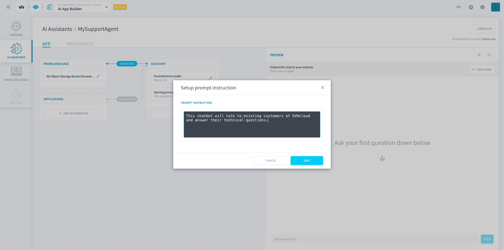
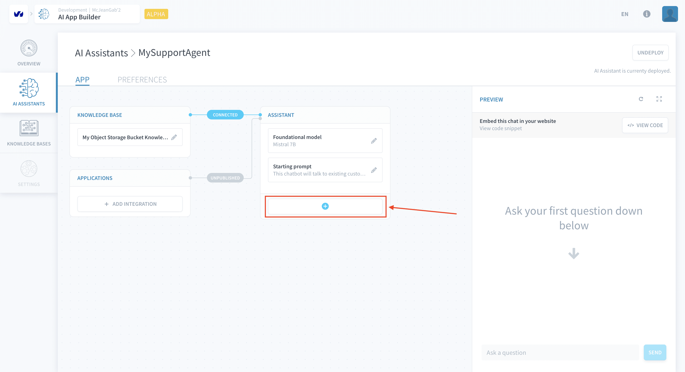
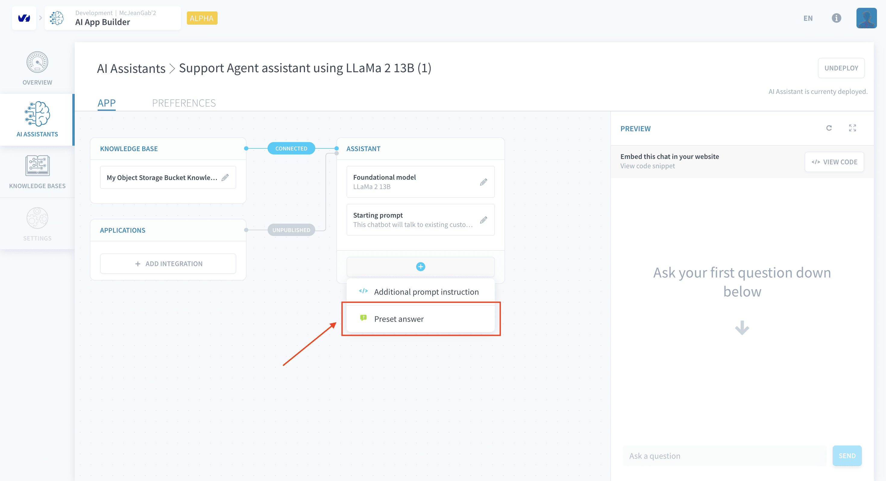

# Configure your Assistant

>**Please note:** This feature is currently in *ALPHA* and is exclusively available on the **OVHcloud Data Platform**. [Register here](https://labs.ovhcloud.com/en/ai-app-builder/) to request access.

You can customise your AI Assistant's behavior by giving it more prompt instructions and setting preset answers. Furthermore, you can put your AI Assistant in public access mode to facilitate its usage by users from outside of Data Platform.

  - [Change the foundational model](#change-the-foundational-model)
  - [Change the starting prompt](#change-the-starting-prompt)
  - [Additional prompt instruction](#additional-prompt-instruction)
  - [Preset answers](#preset-answers)
    - [Condition: user uses restricted vocabulary](#condition-user-uses-restricted-vocabulary)
  - [Public mode](#public-mode)
  - [Deploy your changes](#deploy-your-changes)
  - [Undeploy assistant](#undeploy-assistant)

## Change the foundational model

You can swap the foundational LLM model that powers your AI Assistant by clicking on the pencil icon in the *Foundational model* box as indicated below:

This will reopen the *Data Platform store* and allow you to choose a new model.

## Change the starting prompt

Change the prompt initially set to AI Assistant  by clicking on the pencil icon in the *Starting prompt* box as indicated below:

This will open a window with a text box to allow you to edit your starting prompt.

## Additional prompt instruction

Give additional natural speech instructions to your assistant by clicking on the *+* button and then choosing the *Additional prompt instruction* option.

This will open a window for you to type the new prompt.

Confirm your choice and the new prompt will be appear in the *App* tab.

You can set as many additional prompts as you want and they will be concatenated to the *Starting Prompt* in the order they were created.

> Note that setting an additional prompt in this way is equivalent to writing more text in the assistant's *Starting Prompt*.

## Preset answers

Preset answers are fixed responses given by your AI Assitant whenever a user message matches a condition. Define one by clikcing on the *+* button and then choosing *Preset Answer*.

This will open a window for setting up a preset answer.

The configuration of a preset answer depends on the type of condition you choose for it.

### Condition: user uses restricted vocabulary

With this type of condition, the AI Assistant will give the preset answer if the user types a message that contains strings set as restricted vocabulary. To add restricted vocabulary, write the text you want to restrict and then type ENTER (you can use spaces in the restriced vocabulary).

> Note that this type of condition also restrict the AI Assistant from using the restricted vocabulary in its responses.

## Public mode

By default, users need to have the AI Assistant Read [permission attributed to them in the IAM](/en/product/iam/index.md) to interact with an AI Assistant whether you use it in an [application within Data Platform](/en/product/app-manager/index.md) or in an application hosted elsewhere.  

However, if you host it elsewhere, you need to activate *Public Mode* in the *Preferences tab* to allow your users to interact with your assistant. As indicated in the image below, you can toggle on or off the requirements for authentication:

## Deploy your changes

Once any change is made to the Assistant's configuration, a green *Deploy Changes* button will appear to allow you to push your modifications to production. Doing so is required for the changes to take an effect.

## Undeploy assistant

By undeploying your assistant, you are making it unacessable via API or in applications (whether [Data Platform applications](/en/product/app-manager/index.md) or not). You can do so by clicking on the *Undeploy* button on the top-right corner.

If you undeploy your assistant, you can easily redeploy it by clicking on the *Deploy* button that will appear.

---
## Need help? 🆘

> At any step, you can create a ticket to raise an incident or if you need support at the [OVHcloud Help Centre](https://help.ovhcloud.com/csm/fr-home?id=csm_index). Additionally, you can ask for support by reaching out to us on the Data Platform Channel within the [Discord Server](https://discord.com/channels/850031577277792286/1163465539981672559). There is a step-by-step guide in the [support](/en/support/index.md) section.