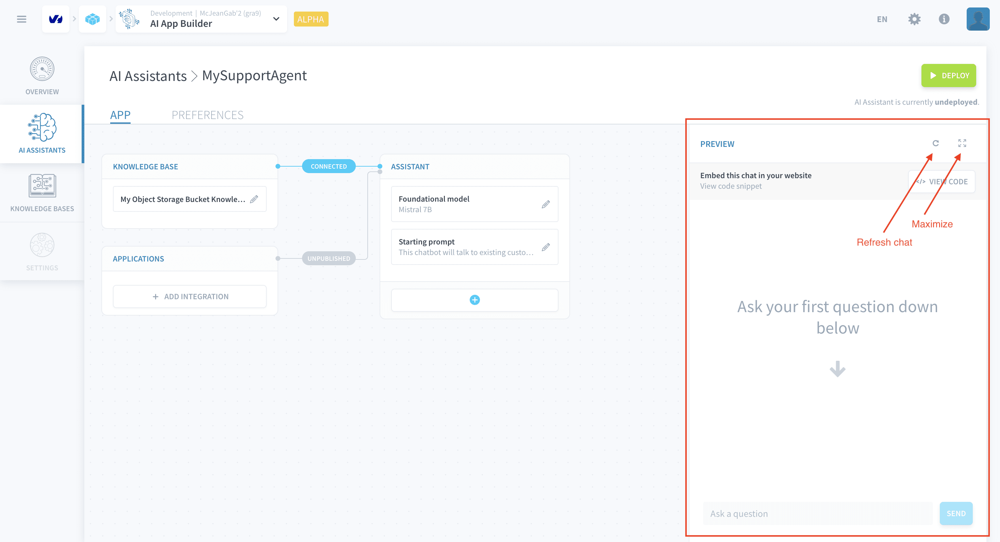
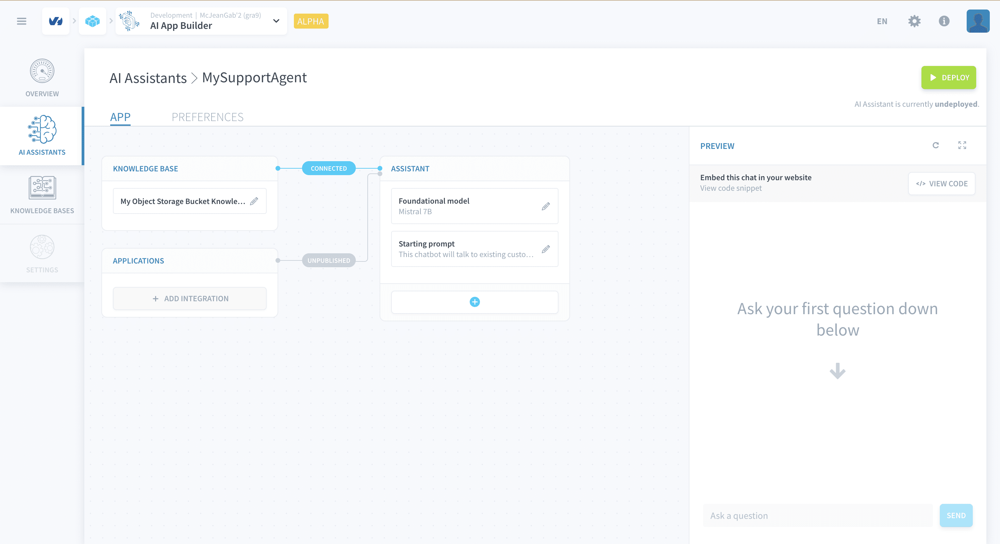
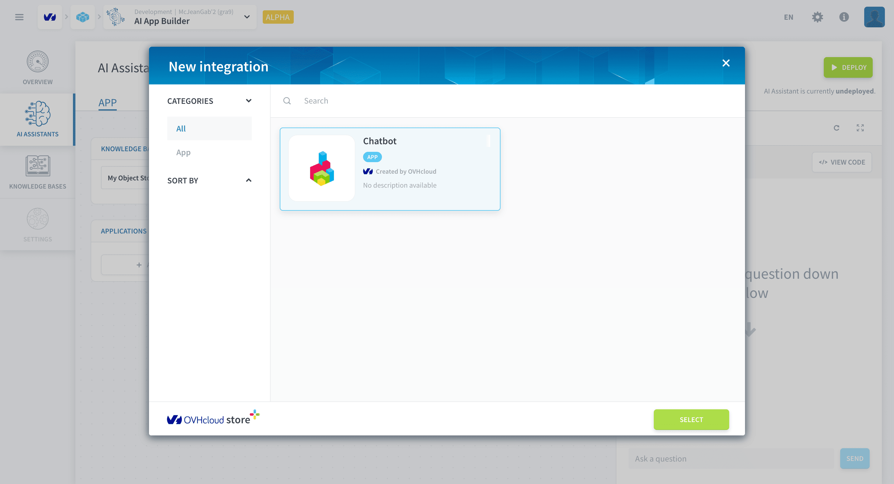
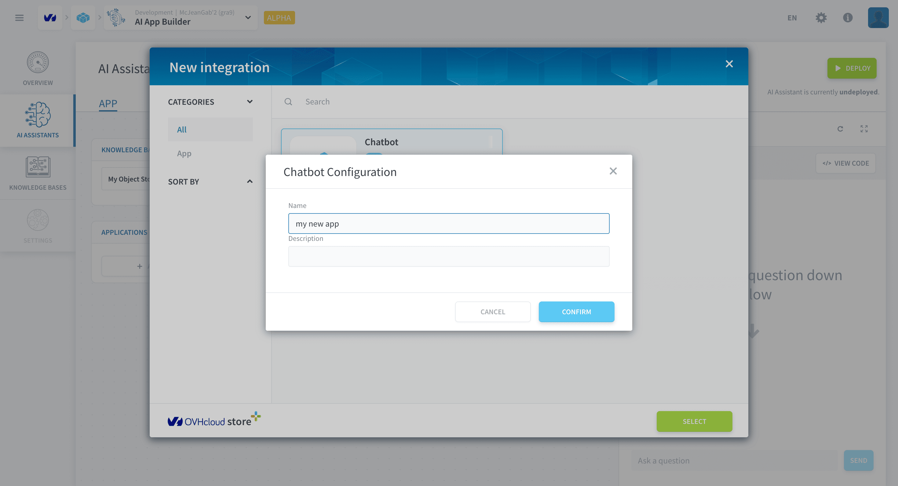
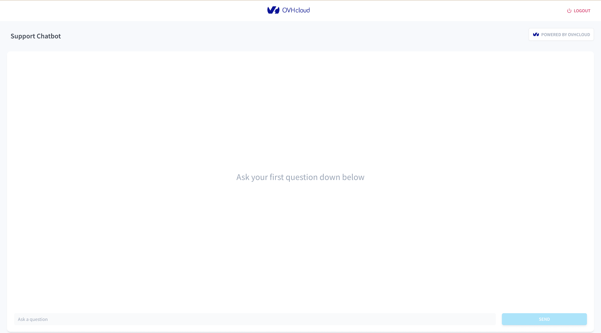
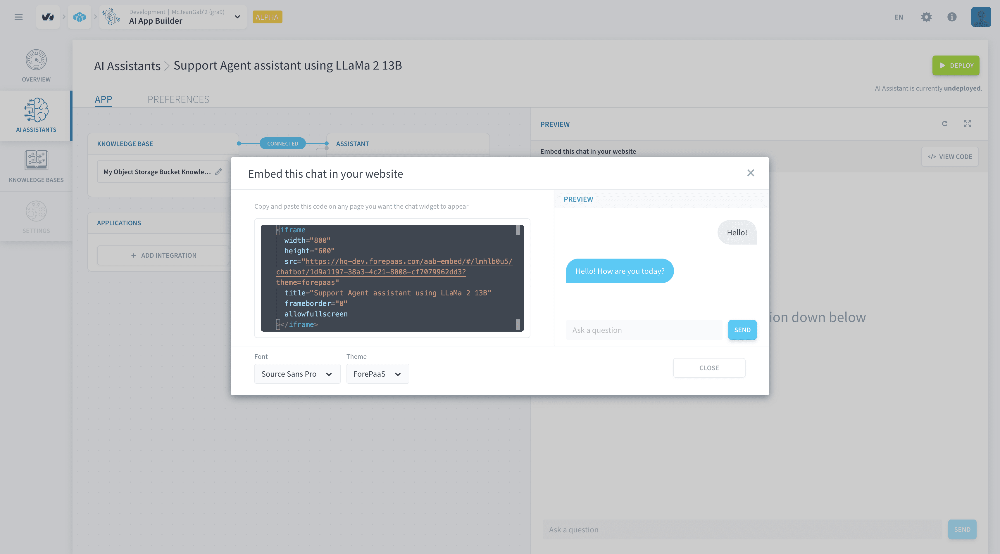

# Test and publish your assistant

>**Please note:** This feature is currently in *ALPHA* and is exclusively available on the **OVHcloud Data Platform**. [Register here](https://labs.ovhcloud.com/en/ai-app-builder/) to request access.

This article explains how to test an assistant and how to publish it to an application.

  - [Testing in the Preview chat](#testing-in-the-preview-chat)
  - [Publishing the Assistant](#publishing-the-assistant)
    - [Data Platform Applications](#data-platform-applications)
    - [Embedded iframe code-snippet](#embedded-iframe-code-snippet)

## Testing in the Preview chat

You can use the Preview chat to test the deployed version of your assistant and make sure that it works as intended. The chat panel can also be maximized and old emptied via the maximize and refresh buttons (indicated below).

> Note that  undeployed changes will NOT impact the assistant's messages in the Preview chat.

## Publishing the Assistant

You have two quick options to integrate your AI Assistant in a web application.

- **Data Platform Applications:** deploy assitants in an application hosted in the platform.
- **Embedded iframe code-snippet:** copy-and-paste an HTML iframe into an existing website outside the platform.

> Note that, in addittion to the options listed above, you can always make HTTP calls to the Assistant's API and include those calls in your applications.

### Data Platform Applications

Creating and deploying a [Data Platform application](/en/product/app-manager/index.md) with a production-ready assistant can be done in under 5 minutes. Firstly, click on the *+ Add Integration* button (indicated in the image below).

This will open the *Data Platform Store* with the available integrations. Pick one and click on *Select*.

Next, name your application and give it a description (optional). Click on *Create* and the application will be deployed in the [Application Service](/en/product/app-manager/index.md).

The deployment may take a few minutes and the application won't be accessible while the application is beinf deployed. Once, it is deployed it will appear under the Applications panel. 

You can view what your application looks like by clicking on the *Open in a new tab* button that appears once you hover over it in the Applications panel.

 

> The integrated application has been created on the [Application Service](/en/product/app-manager/index.md). You can check all details of this application and customise it in that service.

### Embedded iframe code-snippet

You can also include your assistant in a website that isn't hosted in *Data Platform* as an HTML iframe. To do it click on the *View Code* button in the Preview chat panel.

This will open a window with a code-snippet that can be copied and pasted into your website HTML. You can also change the font and the color theme of the component before copying the HTML. The embedded component will appear as displayed in the *Preview* section of the window as a ready-to-go chat bubble that queries your AI Assistant whenever messages are sent on its chatbar. 

> It is necessary to activate the [public mode](/en/product/ai-app-builder/assistant/config-assistant.md?id=Public-Mode) to allow users from outside Data Platform to interact with your assistant.

---
## Need help? 🆘

> At any step, you can create a ticket to raise an incident or if you need support at the [OVHcloud Help Centre](https://help.ovhcloud.com/csm/fr-home?id=csm_index). Additionally, you can ask for support by reaching out to us on the Data Platform Channel within the [Discord Server](https://discord.com/channels/850031577277792286/1163465539981672559). There is a step-by-step guide in the [support](/en/support/index.md) section.