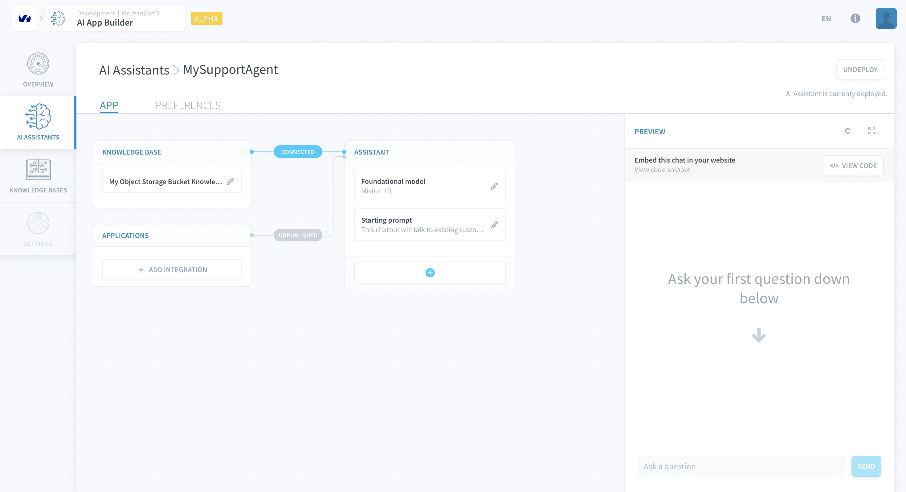
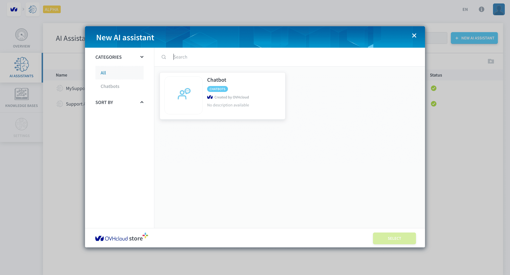
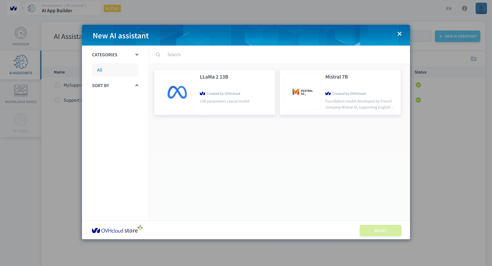
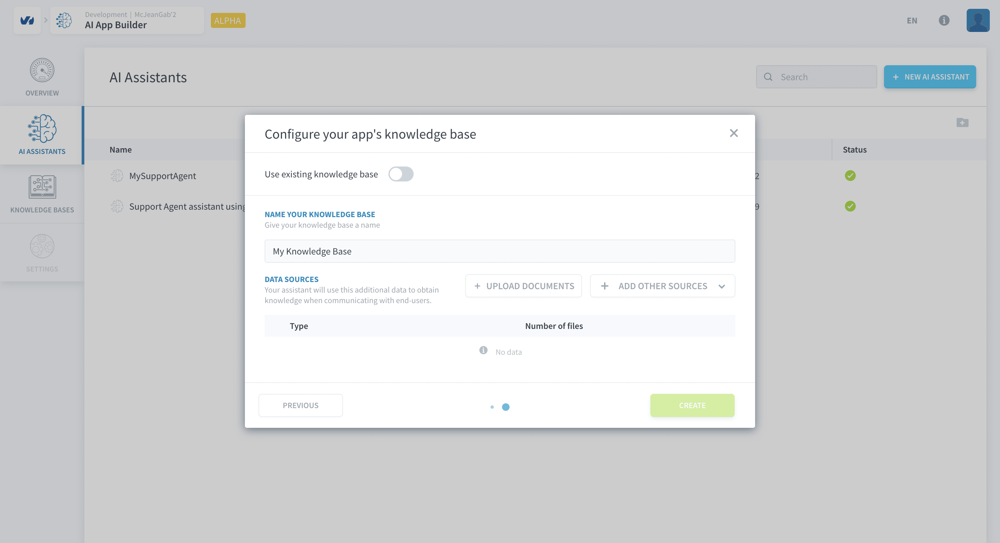

# AI Assistants

>**Please note:** This feature is currently in *ALPHA* and is exclusively available on the **OVHcloud Data Platform**. [Register here](https://labs.ovhcloud.com/en/ai-app-builder/) to request access.

AI Assistants are LLM-powered chatbots that use the data in your [Knowledge Base](/en/product/ai-app-builder/knowledge-base/index.md) to answer the questions of the chatbot's users. They can be configured via a natural speech prompt and exposed to the outside world via API or in an [application in deployed in the platform](/en/product/ai-app-builder/expose-assistant.md?data-platform-applications). 

  - [Create and deploy an assistant](#create-and-deploy-an-assistant)
    - [Choose a template](#choose-a-template)
    - [Configure base parameters](#configure-base-parameters)
    - [Configure Knowledge Base](#configure-knowledge-base)
    - [Deploy your AI Assistant](#deploy-your-ai-assistant)

---
## Create and deploy an assistant

You can create an assistant by clicking on the **+ New AI Assistant button** either in the Overview tab or in the AI Assistants tab. 

### Choose a template

This will open the *Data Platform store* and allow you to pick a template to start with. Don't worry if the template doesn't match your exact use case as the parameters can later be changed. Click on you choice and then on the green *Select* button.

### Configure base parameters

In the next step, you can configure the following assistant's proprieties:

- **Name**
- **Starting Prompt:** a natural speech instruction to your assistant.
- **Foundational Model:** the LLM that will power your assistant.

Clicking on *Choose another model* will open the *Data Platform store* to allow you to choose from one of the Foundational Models available.

### Configure Knowledge Base

The final step is to set a Knowledge Base to feed information to your AI Assistant. You can use an existing [Knowledge Base](/en/product/ai-app-builder/knowledge-base/index.md) or [configure a new Knowledge Base](/en/product/ai-app-builder/knowledge-base/index.md).

Click on *Create* and your assistant will be created in a few seconds.

### Deploy your AI Assistant

Click on the green *Deploy* button to deploy your assistant. This will allow you to test it in the [Preview panel](/en/product/ai-app-builder/update-and-test-assistant.md?=chat-preview) and to put it in an application.

---
## Need help? 🆘

> At any step, you can create a ticket to raise an incident or if you need support at the [OVHcloud Help Centre](https://help.ovhcloud.com/csm/fr-home?id=csm_index). Additionally, you can ask for support by reaching out to us on the Data Platform Channel within the [Discord Server](https://discord.com/channels/850031577277792286/1163465539981672559). There is a step-by-step guide in the [support](/en/support/index.md) section.