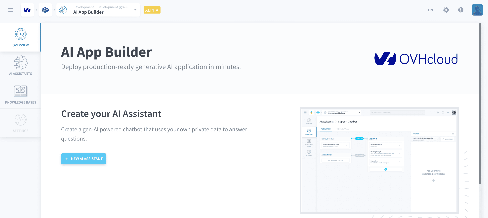

# AI App Builder

>**Please note:** This feature is currently in *ALPHA* and is exclusively available on the **OVHcloud Data Platform**. [Register here](https://labs.ovhcloud.com/en/ai-app-builder/) to request access.

With AI App Builder, in **under 5 minutes** you can deploy generative AI applications that use your own private data. Whether you are a Web Developer or a Software Engineer, you are not required to manage any infrastructure to have an application based on the latest Large Language Models (LLMs) in production. You do not even have to write a single line of code to make it happen!

Configure your assistant via simple natural speech instructions and set restrictions on its behavior. Use data from local files or from buckets and let your [AI Assistant](/en/product/assistant/index.md) leverage it as a [Knowledge Base](/en/product/ai-app-builder/knowledge-base/index.md) to chat with your users with minimal hallucinations. Furthermore, you can also [easily embbed your assistant in a website](/en/product/ai-app-builder/assistant/expose-assistant?embedded-iframe-code-snippet) that isn't hosted on the platform. 

Find out more about how it works in the articles of this section.

- [AI Assistants](en/product/ai-app-builder/assistant/index.md)
- [Knowledge Bases](en/product/ai-app-builder/knowledge-base/index.md)

---
###  Need help? 🆘

> At any step, you can create a ticket to raise an incident or if you need support at the [OVHcloud Help Centre](https://help.ovhcloud.com/csm/fr-home?id=csm_index). Additionally, you can ask for support by reaching out to us on the Data Platform Channel within the [Discord Server](https://discord.com/channels/850031577277792286/1163465539981672559). There is a step-by-step guide in the [support](/en/support/index.md) section.