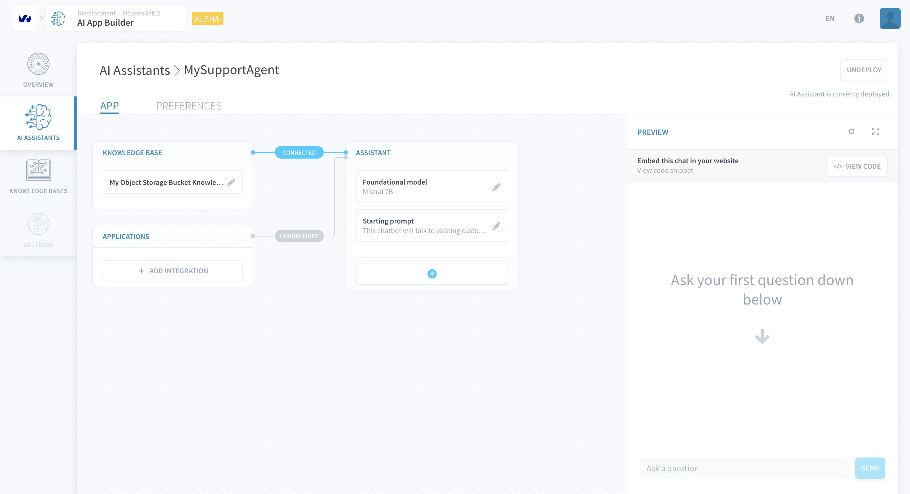
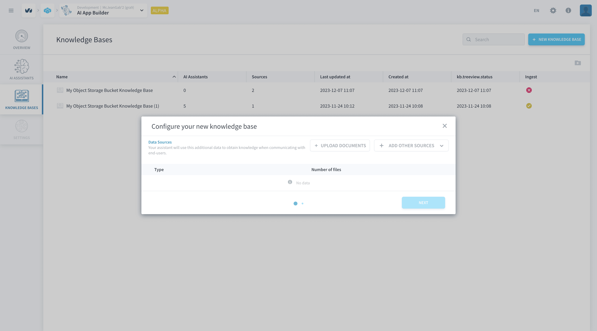
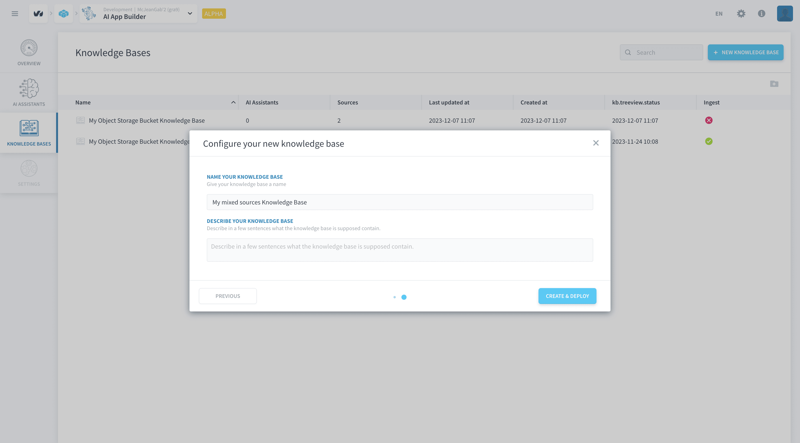
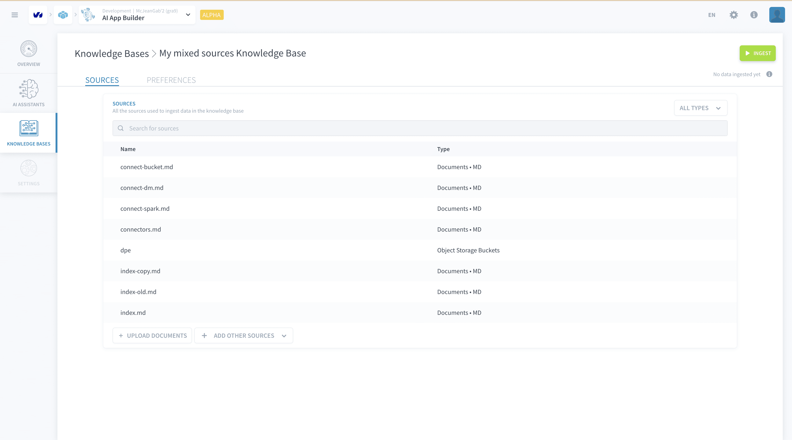
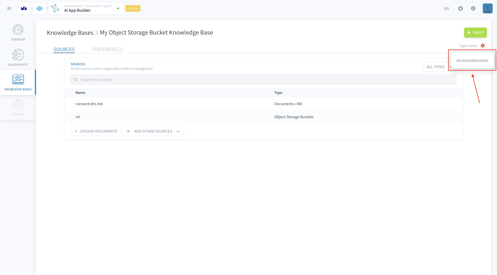

# Knowledge Bases

>**Please note:** This feature is currently in *ALPHA* and is exclusively available on the **OVHcloud Data Platform**. [Register here](https://labs.ovhcloud.com/en/ai-app-builder/) to request access.

Knowledge Bases are vector-based databases that effectively work as a knowledge repository for your assistant. Once a knowledge base is loaded with information from your sources, the associated AI Assistant will query the base everytime it receives a message. The Knowledge Base will then send the information stored that is most relevant to the message the assistant received and the assistant will use that to reply. 

This architecture minimises hallucinations and ensures that your assistant is going to answer the messages with the information relevant to it. 

> The **data quality** of the information sources is very important to ensure that the assistant can use it to answer message. Sources that contain a many non-encoded characters between words are not going to be optimally used by the knowledge base.

  - [Create and load a knowledge base](#create-and-load-a-knowledge-base)
    - [Set information sources](#set-information-sources)
    - [Ingest data](#ingest-data)
  - [Ingest job failed](#ingest-job-failed)

---
## Create and load a knowledge base

You can create knowledge base by clicking on the **+ New Knowledge Base button** either in the in the Knowledge Bases tab. 

### Set information sources

Configure your knowledge base by setting its information sources. You can use the following types of files as information sources for your knowledge bases:

- TXT files (or files that can be interpreted as TXT)
- MD files

These information sources can either be uploaded from your computer or put in a [Lakehouse bucket](/en/product/lakehouse-manager/buckets/index) (under *+ ADD OTHER SOURCES* in the screenshot below). Click on *Next* to proceed.

Name your knowledge base and click on *Create & Deploy* to put your knowledge base live.

### Ingest data

At this point your knowledge base is live but empty. Ingest the data by clicking on the green *Ingest* button. This will trigger a job execution that may take a while to run.

Once it is finished running, all information in the knowledge base is ready to be used by an [AI Assistant](/en/product/ai-app-builder/assistant/index.md).

## Ingest job failed

All data ingestion jobs are managed and created by [Actions](/en/product/dpe/actions/index.md) in the [Data Processing Engine](/en/product/dpe/index.md). So if a data ingestion job has failed, you can see why that happened there.

The first step is to find the action that created your knowledge base's ingestion job. First, hover over the text *Ingest failed* text that appear under the *Ingest* button to display a *See associated action* link (indicated in the image below) and click on the link to be redirected to the action.

Finally, with the action name you can go to the *Jobs* tab and find the logs of the ingestion job to discover why the ingestion failed.

---
## Need help? 🆘

> At any step, you can create a ticket to raise an incident or if you need support at the [OVHcloud Help Centre](https://help.ovhcloud.com/csm/fr-home?id=csm_index). Additionally, you can ask for support by reaching out to us on the Data Platform Channel within the [Discord Server](https://discord.com/channels/850031577277792286/1163465539981672559). There is a step-by-step guide in the [support](/en/support/index.md) section.