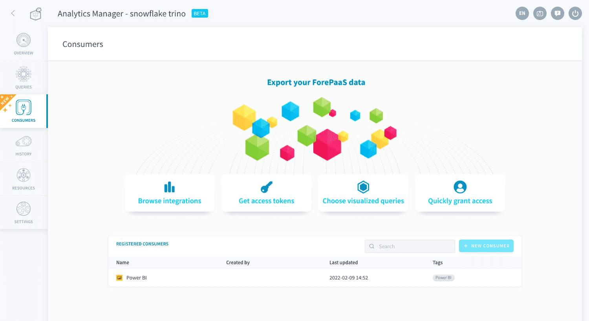
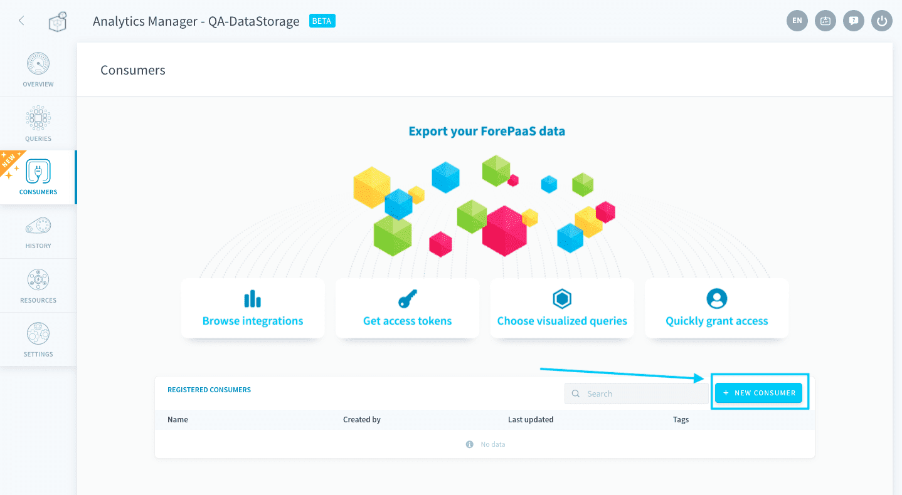
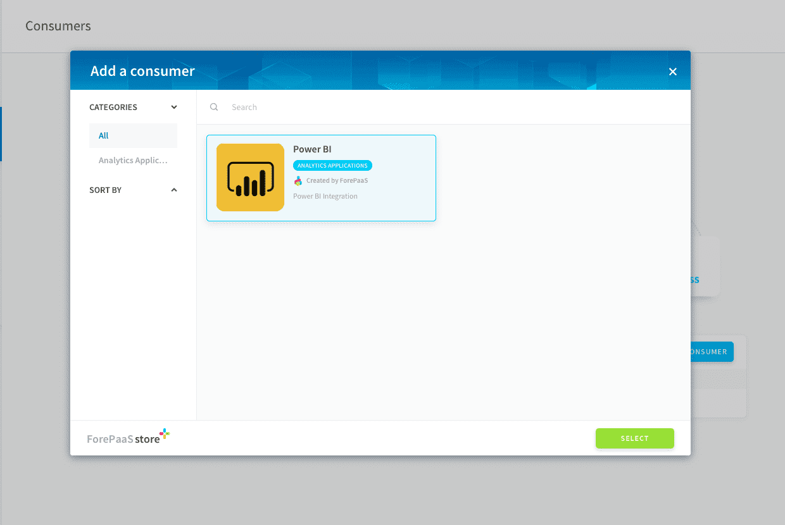
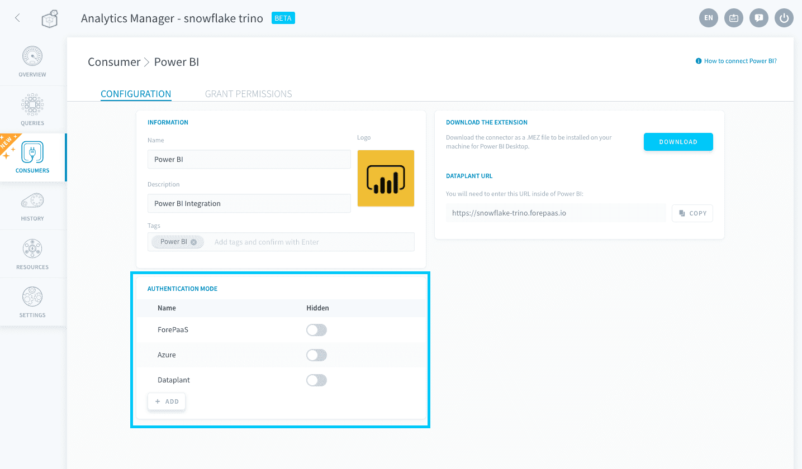
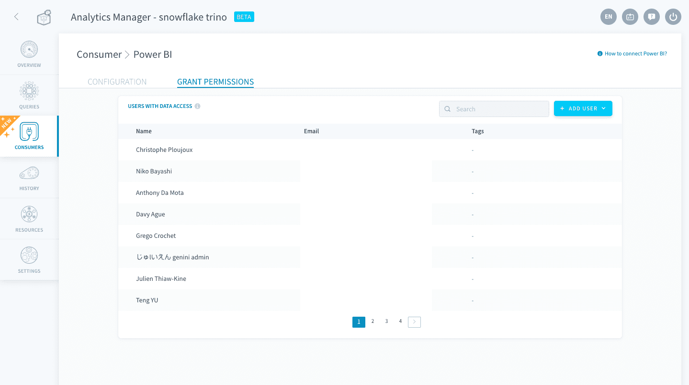
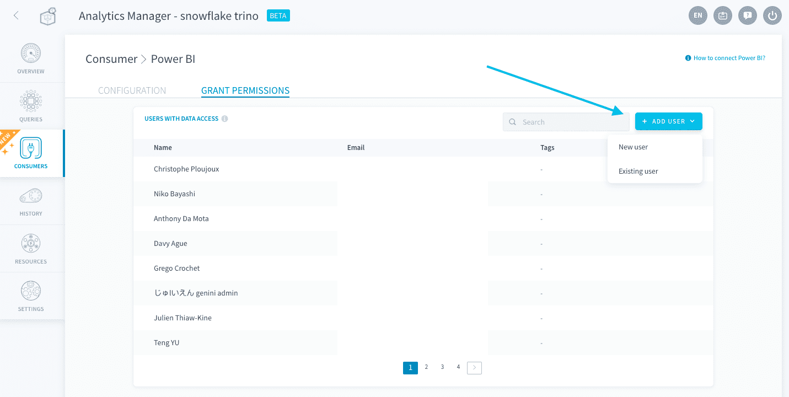
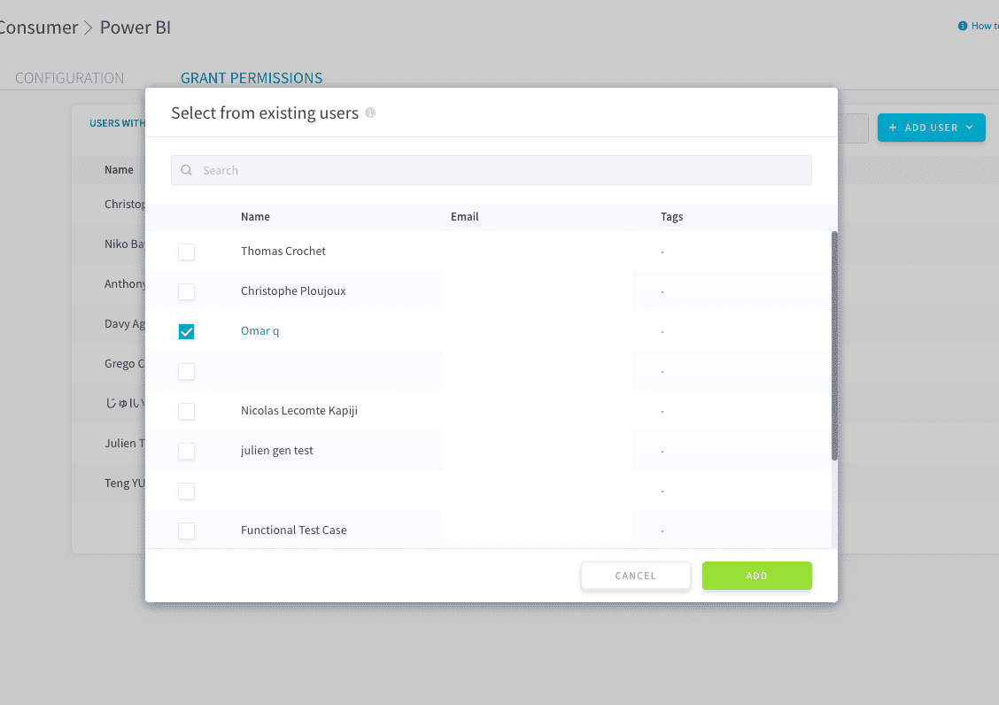
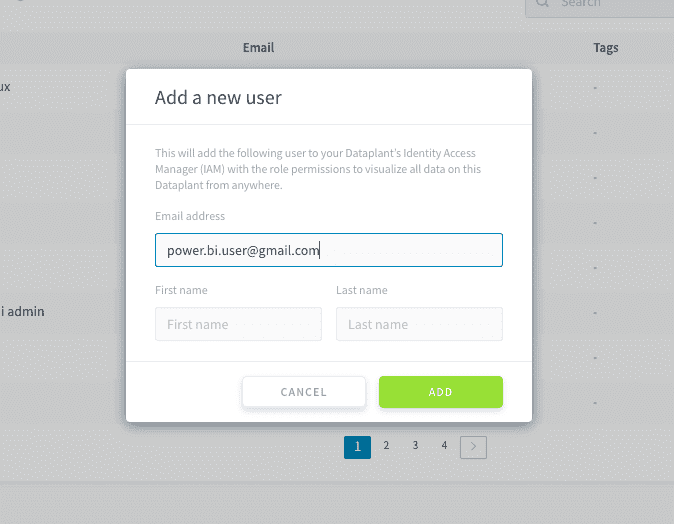

# Consumers

In the Analytics Manager, you can connect **external analytics consumers** to be able to create rich data visualization reports on top of your Platform data using your own favorite BI tool.

Users connecting from the external analytics tool will be authenticated through your [Project's Identity Access Manager (IAM)](/en/product/iam/index) and allowed to access only the parts of your data system (tables or queries) that they have [IAM permissions](/en/product/iam/users/roles) on. The imported data will be processed and sent by your Project's [query engine](/en/product/am/resources).

> It is necessary to activate a [query engine](/en/product/am/resources) in order to connect and use a consumer.

- [Create a consumer](#create-a-consumer)
- [Manage permissions for a consumer's users](#manage-permissions-for-a-consumer39s-users)

---
## Create a consumer

To create a consumer, click on **New consumer**. 

Choose the consumer that you want to connect.

?> For the moment, you can only connect each type of consumer once.

Upon confirming, the new consumer will be added as a new [IAM application](/en/product/iam/project-iam/application/index) in your Project, with the OAuth redirect URLs and secrets automatically pre-configured for the connector to work.

This means that you can manage the same aspects as an IAM application for an analytics consumer, including the [authentication mode(s)](/en/product/iam/project-iam/application/index?id=authentication-mode).

 

{Connect a Power BI consumer}(#/en/product/am/consumers/power-bi/index)

---
## Manage permissions for a consumer's users

The consumer's users are the people that will be using the external BI tool and connect to the Platform Project to read its data.  

By default, you can easily give them **full access** to queries, tables and data from the Analytics Manager interface - but you can also manage more **fine-grained** permissions for each user in the [Identity Access Manager (IAM)](/en/product/iam/index).

!> All users that will use the Platform as the source of data, even if they are external to the Platform, will have to be registered in a Project's IAM in order to access its data. They will only access the data associated to their [roles and groups](/en/product/iam/users/index).

 

The *Grant permissions* section shows all the users from the Identity Access Manager that have either one of these roles: ***Admin*** or ***Analytics Consumer***. Those users have **access to the Project's data from any external consumer**.

!> It is impossible to restrict access to only one consumer. In other words, if a user has the permissions to access tables and data (typically through the IAM role *Analytics Manager*), they will be able to access it from any external consumer.

You can give access to new or existing users from the *Grant permissions* tab. Click on **New user** and choose between *New user* and *Existing user*.

 

Selecting existing users from the Identity Access Manager will give them the role *Analytics Consumer*. They will have full access to the Project's entire data from any external consumer. 

 

Adding a new user will add them in the Identity Access Manager with the role *Analytics Consumer*, and automatically generate credentials for them (see details below). They will have full access to the Project's entire data from any external consumer.

?> You can also manage more **fine-grained** access control for each user in the [Identity Access Manager (IAM)](/en/product/iam/index).

 

Since those users are usually external BI users and not the Platform users, they are likely to not need the Platform account. Instead,the Platform automatically generates a simple login and password for them through the **Project IAM's own authentication method** (called [**Project**](https://docs.forepaas.io/#/en/product/iam/auth-provider/index?id=dataplant)). 

With these credentials, automatically shared with them by email, they will be able to authenticate from the external tool's interface and access the data matching the role permissions that were attributed to them.

---
###  Need help? 🆘

> At any step, you can create a ticket to raise an incident or if you need support at the [OVHcloud Help Centre](https://help.ovhcloud.com/csm/fr-home?id=csm_index). Additionally, you can ask for support by reaching out to us on the Data Platform Channel within the [Discord Server](https://discord.com/channels/850031577277792286/1163465539981672559). There is a step-by-step guide in the [support](/en/support/index.md) section.