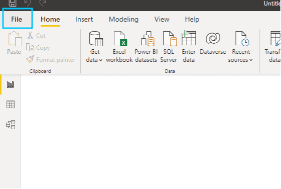

# Plug Power BI to your ForePaaS

Are you or your teammates already proficient with [Microsoft Power BI](https://powerbi.microsoft.com/en-us/getting-started-with-power-bi/)? If you want to use it as your analytics solution on top your ForePaaS data system, this guide is for you.


!> The PowerBI connector requires a [query engine to be activated](/en/product/am/resources) on your Project.

The configuration is done in two parts. First you need to [configure the consumer on ForePaaS](/en/product/am/consumers/power-bi/index?id=configuration-on-forepaas) and then [configure the connector on Power BI Desktop](/en/product/am/consumers/power-bi/index?id=configuration-on-power-bi).

---
## Configuration on ForePaaS

If you haven't done so already, [add a new](/en/product/am/consumers/index?id=create-a-consumer) *Power BI* consumer in the Analytics Manager. Else, just edit it.

Since the ForePaaS connector for Power BI is still in beta release and not yet certified by Microsoft, you have to **download the extension**, either manually from [this link](https://hq.forepaas.io/am/consumers/power_bi/ForePaaS.mez) or from the interface shown below.


?> If you are interested in having the ForePaaS connector certified by Microsoft, please upvote the [idea on the Power BI Ideas page](https://ideas.powerbi.com/ideas/idea/?ideaid=c643dd77-1484-ec11-b820-501ac50a6ef7)!

Power BI users will have to be registered in a Project's Identity Access Manager (IAM) in order to access its data. They will only access the data associated to their [roles and groups](/en/product/iam/users/index).

You can **easily grant full access to a new Power BI user**, by going to [the *Grant permissions* section in the consumer options](/en/product/am/consumers/index?id=manage-permissions-for-a-consumer39s-users). 

For more fine-grained permissions, you can set specific [roles in the IAM](/en/product/iam/users/roles). The Power BI connector requires the following permissions:
- *Data Manager | Source | Read* and *Data Manager | Table | Read*: to import a table's data inside Power BI
- *Analytics Manager | Repository | Read*: to list queries
- *Analytics Manager | Query | ** : to import a query's results inside Power BI
- *Advanced Data Access Control | Read* : to access the data inside the Project

---
## Configuration on Power BI

Once you have [downloaded](https://hq.forepaas.io/am/consumers/power_bi/ForePaaS.mez) the connector *.MEZ* file, follow this procedure to use it on **Power BI Desktop**. 


### Allow your Power BI Desktop to use a custom connector

?> If you are interested in having the ForePaaS connector certified by Microsoft, please upvote the [idea on the Power BI Ideas page](https://ideas.powerbi.com/ideas/idea/?ideaid=c643dd77-1484-ec11-b820-501ac50a6ef7)!

Open *Power BI Desktop*. Click on **File** in the header.



Open the **Options and settings** section, then select **Options**.


Find the **Global > Security** section, then activate the following option: *(Not Recommended) Allow any extension to load without validation or warning*.


This will allow you to get data from a source not yet certified by Microsoft, in this case ForePaaS.

Now, **close Power BI Desktop** for the changes to be applied.


### Install the connector

Create this folder in your user directory:

```
C:\Users\[Your_Windows_User_Name]\Documents\Microsoft Power BI Desktop\Custom Connectors
```

If the *Microsoft Power BI Desktop\Custom Connectors* folders don't exist, create them.

!> Make sure that the folders have exactly the same names as above, or you won't be able to find the ForePaaS connector inside Power BI Desktop.

Copy the connector *.MEZ* file that you have previously downloaded into this new directory. 


You can now restart Power BI Desktop.


### Import your first data from ForePaaS

Click on **Get Data**.


Search for *ForePaaS*, and select the connector.


You now have to enter the [URL of the ForePaaS Project](en/product/dataplant/config-ids) you want to connect to. You can easily find this URL on the page of the consumer on the ForePaaS Platform.


If you are not yet authenticated to this ForePaaS Project, you will be asked to authenticate at this step. 


Use one of the [authentication methods](/en/product/iam/auth-provider/index) activated for Power BI on your ForePaaS Project to sign in.

When you are successfully authenticated, press **connect** to continue.


At the moment, it is only possible to use the *Import* mode from Power BI - i.e. to import the data locally into your Power BI file before running queries (as opposed to the *DirectQuery* mode). The connector lets you import either:
- [tables from the Data Manager](/en/product/data-manager/tables/index)
- [queries from the Analytics Manager](/en/product/am/queries/index)

Choose one or multiple tables or queries to be imported into Power BI. 

> We recommend you offload as much of the data processing to ForePaaS as it was engineered for this very purpose from the start, and heavy pre-processing can cause significant slowdowns in Power BI. Only the final aggregated tables or queries should be used in Power BI.

!> Make sure a [query engine](/en/product/am/resources) is activated on your ForePaaS Project or you won't be able to preview and import data from ForePaaS.


You can now create your first visualizations on your ForePaaS data using Power BI Desktop. 

> If the data is updated on ForePaaS, graphs can be manually refreshed with the latest data by pressing the refresh button in the Power BI header. 


---
## Struggling to set it up by yourself❓

That's fine, tell us how we can help. Get in touch on our support portal or reach out at support@forepaas.com.
