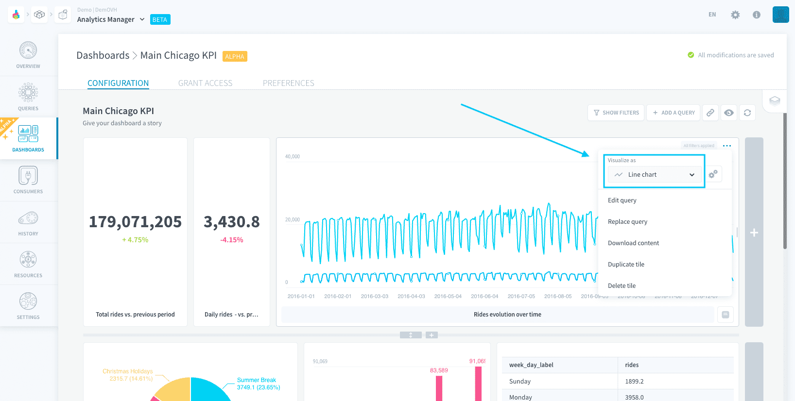

# Add content to a dashboard

Dashboards are made up of the following elements:

- A title and description
- Filters
- Chart tiles

You can add as many tiles and filters as you want to a dashboard. 

- [Arrange tiles](#arrange-tiles)
  - [Resize a tile](#resize-a-tile)
  - [Change a tile's visualization settings](#change-a-tile39s-visualization-settings)
  - [Add data stories](#add-data-stories)
- [Create filters](#create-filters)
  - [Add and use a filter](#add-and-use-a-filter)
  - [Force tiles to ignore a filter](#force-tiles-to-ignore-a-filter)
  - [Edit advanced filter options](#edit-advanced-filter-options)
- [Drill down on the dashboard](#drill-down-on-the-dashboard)
- [Override visual aspects of the dashboard](#override-visual-aspects-of-the-dashboard)
  - [Color palette](#color-palette)
- [Share dashboard](#share-dashboard)
  - [Share a link](#share-a-link)
  - [Send a dashboard by email](#send-a-dashboard-by-email)

---
## Arrange tiles

Tiles are the main constituting elements of dashboards. Each tile contains a chart saved as a [query](/en/product/am/queries/index), along with a title and a story.

Tiles can be moved around by dragging and dropping them. They are naturally positioned in successive rows. There cannot be more than 8 charts on the same row.

### Resize a tile

Tiles can be resized horizontally by drag-dropping the little handles on the right and left.

Tiles can be resized vertically by drag-dropping the main handle under each row. Note that this resizes the whole row.

### Change a tile's visualization settings

Tiles are linked to a saved query which gives:
- the result of the query
- a [default visualization type](/en/product/am/queries/charts) and its settings

However, it is sometimes useful to bind two different tiles to the same query, using two different visualization modes.

The visualization type can be overridden in each tile by clicking on the corresponding chart type in the tile's settings.

This will use the visualization options (such as axis or label settings, etc.) [set at the query level](/en/product/am/queries/charts?id=visualize-a-query-as-a-chart). You can edit them here by clicking on the **gears** icon.

### Add data stories

Stories allow you to add a summary, conclusion, special observations to note, or simply comments about a chart.

Future users can hover over the **story** icon to read it. Click on the icon to edit the story.

---
## Create filters

You will probably experience a situation where you need to create multiple versions of the same dashboard, but with only one variable changed.

For example, you may have a retail report which you need to show for multiple store IDs. Rather than creating dozens of copies of the dashboard, you can add filters to allow users to filter the queries in the tiles within a single dashboard.

### Add and use a filter

Adding a variable to filter on makes it available in the [live dashboard](/en/product/am/dashboards/publish). Users accessing the live dashboard will be able to change the variable of the filter (but not remove or add a new variable to filter on).

?> Filters can take up various formats: dropdown menus, date pickers, etc... This is managed in the [advanced filters options](#edit-advanced-filter-options).

The default value of the filter in the live dashboard is the **value saved in the edition mode** of the dashboard.

Filters set on a dashboard are applied on top of the [filters set at the query level](/en/product/am/queries/visual?id=configure-the-field-filter).  

For example, a chart which is filtered on `country is in [Japan, USA]` at the query level, and which is added to a dashboard containing the filter `country is not Japan` will be displayed filtered on the country USA only. 

!> Exception: Filters set on the **same attribute and using same operator but with a different value** in the query and the dashboard are the only situation where the dashboard filter overrides and replaces the query filter. 

### Force tiles to ignore a filter
By default, new filters are applied on all queries (i.e. charts) of the dashboard, except on queries which are written in custom SQL - which cannot be filtered as of now.

It is possible to force a tile to ignore a filter, either from the filter [advanced options](#edit-advanced-filter-options) or from the tile itself.

> Filters can be detected as *irrelevant* for a tile's query, meaning that filtering on any value for this filter will return *no data* for the query. They are flagged as such in the interface and it is recommended to ignore the filter at the tile's level.

### Edit advanced filter options

The advanced filter options allow you to:
- Set the type of filter: dropdown menu, date picker, etc.
- Manage the tiles which [ignore](#force-tiles-to-ignore-a-filter) this filter. 
- Check the page for the [attribute](/en/product/lakehouse-manager/attributes/index) of the filter

Click on the **gear icon** in a filter's header to open its advanced options.

By default, the type of a filter is automatically inferred when it is created.

- **Categorical**: choose among the possible values for the attribute. The possible values for each filter are rendered by a query saved automatically in a subfolder in the *Queries* tab.
- **Date**: use a datepicker to select a date range. This type is automatically set when the attribute appears as a *Date* in the [Lakehouse Manager](/en/product/lakehouse-manager/index).
- **Date & Time**: use a timepicker to select a date and/or time range. This type is automatically set when the attribute appears as a *Datetime* in the Lakehouse Manager.
- **Boolean**: choose between True/False. This type is automatically set when the attribute appears as a *Boolean* in the Lakehouse Manager.

---
## Drill down on the dashboard

**Click on a part of a chart** to reveal a range of options letting you explore your data further, such as dynamically filtering all the other charts on a value.

- **Filter out**: sets a filter on the whole dashboard to *exclude* the value that was clicked on
- **Filter on this**: sets a filter on the whole dashboard to *show only* the value that was clicked on
- **Show these values**: opens up a new query listing all values (as a SELECT) constituting the part of the graph that was clicked on
- **Breakdown further**: opens up a new query showing the data point that was clicked on, to let you try out more filters and break down options.

---
## Override visual aspects of the dashboard

### Color palette

The colors of the dashboard are templated in the color palette of the dashboard, in the Preferences page.

---
## Share dashboard

Dashboards are designed to be shared with end-users. In addition to the edition mode, reachable by default from the *Dashboards* tab, they also all possess a **live version**, rendered when the dashboard [is published](/en/product/am/dashboards/publish).

### Share a link

Click on the **link** icon to copy the live dashboard link to the clipboard.

### Send a dashboard by email

?> This feature is coming soon!

{Discover how to publish a dashboard}(#/en/product/am/dashboards/publish)

---
###  Need help? 🆘

> At any step, you can create a ticket to raise an incident or if you need support at the [OVHcloud Help Centre](https://help.ovhcloud.com/csm/fr-home?id=csm_index). Additionally, you can ask for support by reaching out to us on the Data Platform Channel within the [Discord Server](https://discord.com/channels/850031577277792286/1163465539981672559). There is a step-by-step guide in the [support](/en/support/index.md) section.

