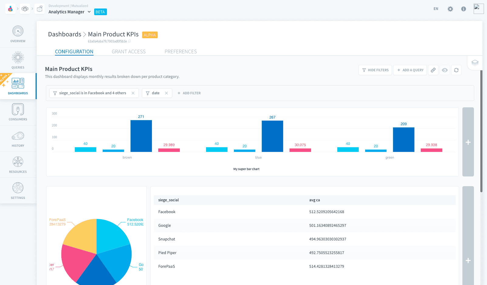
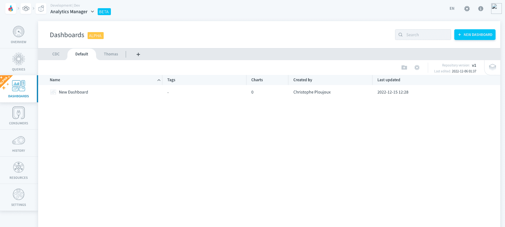
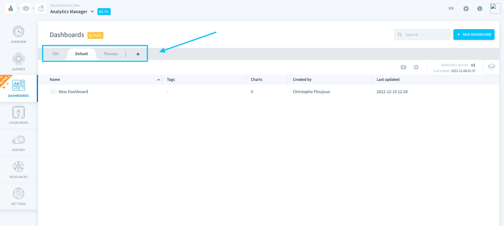

# Dashboards

Dashboards let you arrange charts on a single page to visualize and monitor your data in real-time. 

You can combine various data sources and display them in a variety of formats, including charts and tables. Add interactive filters to update all charts at once, click on specific parts of charts to further drill down on them, and add notes to tell stories about your data visualization.

Share your dashboard with your teammates by publishing it, and manage versions to make sure everyone always get the validated KPIs.

?> Dashboards come with a limited set of customization options, making it a perfect tool for Data Analysts. The Platform also makes it possible for developers to build and deploy fully custom applications in the [App Manager](/en/product/app-manager/index).

> It is necessary to activate a [query engine](/en/product/am/resources) in order to create and view dashboards in the Analytics Manager.

- [Manage dashboards](#manage-dashboards)
- [Add content to a dashboard](#add-content-to-a-dashboard)
- [Publish a dashboard](#publish-a-dashboard)

---
## Manage dashboards

Dashboards are managed in the *Dashboards* tab of the Analytics Manager.

All your dashboards are stored in repositories, the [same as for queries](/en/product/am/queries/index?id=versioning-queries). Each chart in a dashboard corresponds to a [query](/en/product/am/queries/index) from the *Queries* tab. In a dashboard, you can **only display queries stored in the same repository** as the dashboard.

---
## Add content to a dashboard

Dashboards are made of tiles which contain charts. Each chart is powered by a [query](/en/product/am/queries/index) saved in the *Queries* tab.

It is possible to customize your dashboard layout and appearance. You can rearrange tiles by dragging and dropping them, resize them by dragging the edges, and change the color palette to match your branding.

{Add content to a dashboard}(#/en/product/am/dashboards/edit)

---
## Publish a dashboard

Each dashboard has a deployed version which is hosted on a separate URL, allowing you to share a dashboard with other people without giving them the possibility to edit the dashboard.

{Publish a dashboard}(#/en/product/am/dashboards/publish)

---
###  Need help? 🆘

> At any step, you can create a ticket to raise an incident or if you need support at the [OVHcloud Help Centre](https://help.ovhcloud.com/csm/fr-home?id=csm_index). Additionally, you can ask for support by reaching out to us on the Data Platform Channel within the [Discord Server](https://discord.com/channels/850031577277792286/1163465539981672559). There is a step-by-step guide in the [support](/en/support/index.md) section.
