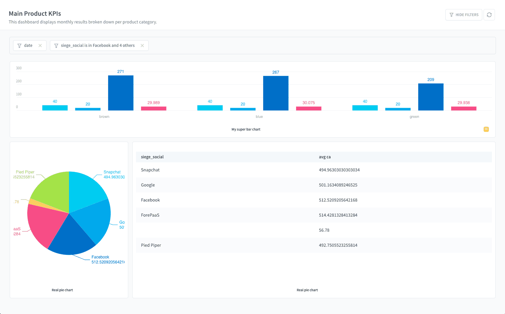
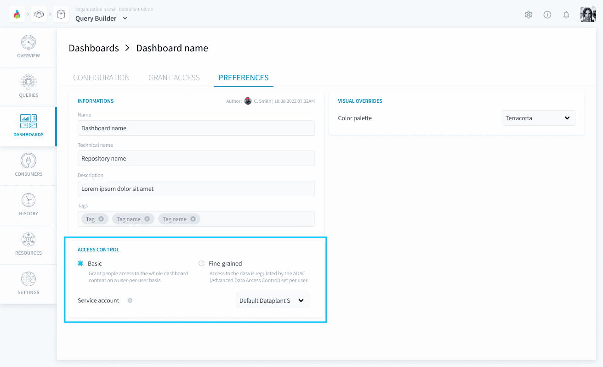
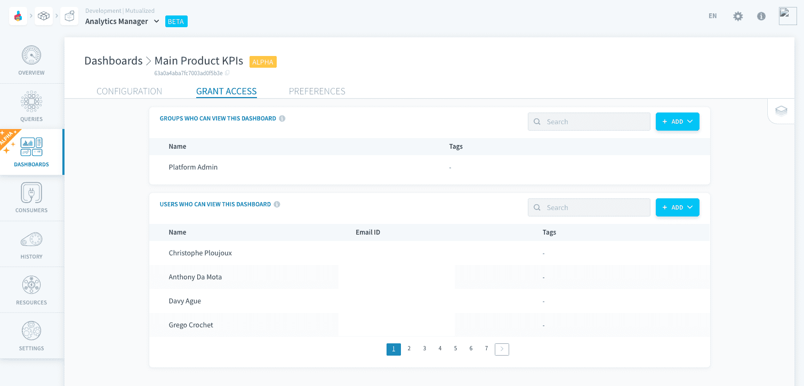
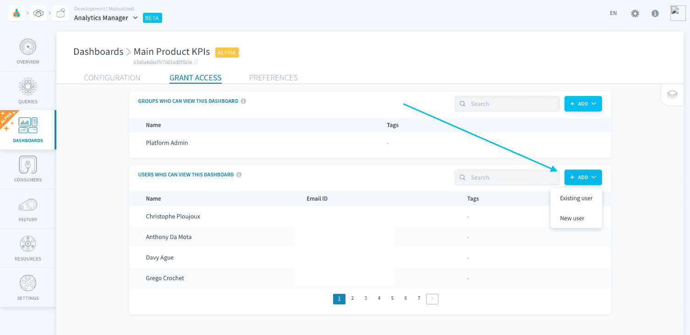
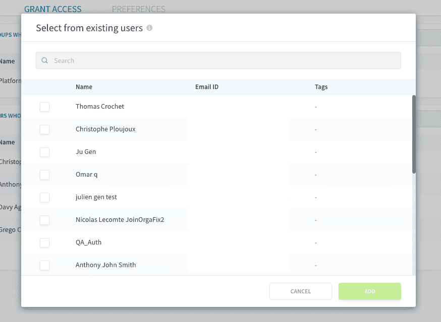
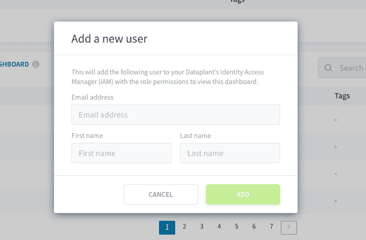

# Publish a dashboard

Dashboards are designed to be shared with the rest of your team. This is why each dashboard can be opened as a **live published version**.

- [Publish a dashboard live](#publish-a-dashboard-live)
  - [How to publish a version?](#how-to-publish-a-version)
    - [If your dashboard repository has only one version
](#if-your-dashboard-repository-has-only-one-version)
    - [If your dashboard repository has two or more versions](#if-your-dashboard-repository-has-two-or-more-versions)
- [Grant access to the dashboard](#grant-access-to-the-dashboard)
  - [Basic access control](#basic-access-control)
  - [Fine-grained access control](#fine-grained-access-control)

---
## Publish a dashboard live

Each dashboard created in the Analytics Manager can be opened in either:

- the **editing interface**: users can edit the [whole configuration and preferences of the dashboard](/en/product/am/dashboards/edit), such as adding charts, filters, stories, etc. 
- the **live interface**: users can view the dashboard and interact with the filters to refresh the charts, but they cannot edit it

  
*Example of a live dashboard*

  
*Example of the edition interface of the same dashboard*

Each mode **has its respective URL**. The editing mode URL depends on the [version](/en/product/am/queries/index?id=versioning-queries) currently being edited. The live mode URL always stays the same, referencing the *shared_id* of the dashboard which stays the same across versions.

?> All URLs require to be [authenticated in the Project IAM and granted access to the dashboard](#grant-access-to-the-dashboard) to open them.

### How to publish a version?

A live version of a dashboard is published automatically based on the [deployed version of the repository](/en/product/am/queries/index?id=versioning-queries) containing the dashboard and its queries (i.e. charts). 

#### If your dashboard repository has only one version

The dashboard is published **automatically at each modification**. 

This means that all modifications made by editors will be visible in real-time in the live dashboard.

?> Updates may take up to a few minutes to be visible in the live dashboard.

#### If your dashboard repository has two or more versions

The dashboard is **published automatically when a new version of the repository is deployed**. The live dashboard always corresponds to the version in the deployed repository. 

This means that the editors can work on one version of the dashboard, while the viewers accessing the live dashboard will not see the modifications until the new version is deployed by the editor.

---
## Grant access to the dashboard

Multiple viewers can be granted access to the live dashboard easily, without granting them the right to edit it.

> First, note that both dashboard editors and viewers, will have to be registered in a Project's IAM in order to access it, even if they are external to the Platform. They will only access the data/dashboards associated to their [roles and groups](/en/product/iam/users/index).

The rest of this page aims to explain how to give read access to a live dashboard for your end-users. There are **two usual modes** for access control to a live dashboard.

### Basic access control

By default, you can easily give end-users **full read access** to dashboards (the charts, tables and data they contain) - without giving any direct querying rights on the underlying databases.

This is due to the *Basic* access control mode which is set by default in the dashboard's preferences.

 
With this mode, you give individual access to users or groups to the live dashboard as a whole. This means that **all data contained in the charts and filters will be visible to people who are granted access**, only from the live dashboard.

The *Grant access* section shows all the users/groups from the [Identity Access Manager](/en/product/iam/index) that have either one of these roles: ***Admin***, or ***Dashboard Viewer*** set with a condition on the dashboard name. Those users can open and view the live dashboard.

You can give access to new or existing users/groups from the *Grant access* tab. Click on **New user/group** and choose between *New user/group* and *Existing user/group*.

!> Please note that you must have `write` permissions on [IAM users](/en/product/iam/users/users) / [IAM groups](/en/product/iam/users/groups) to use this feature.

 

Selecting existing users will give them the [IAM role](/en/product/iam/users/roles) *Dashboard Viewer*, with a [condition](/en/product/iam/users/roles?id=set-up-a-condition-on-a-role-binding) set on this specific dashboard. They will get access to the whole dashboard's data **only from the live dashboard**.

 

Adding a new user will add them in the Identity Access Manager with the role *Dashboard Viewer* (with a condition set on this specific dashboard) and automatically generate credentials for them (see details below). They will get access to the whole dashboard's data only from the live dashboard.

 

Since those users are usually external BI users and not the Platform users, they are likely to not need the Platform account. Instead,the Platform automatically generates a simple login and password for them through the **Project IAM's own authentication method** (called [**Project**](/en/product/iam/auth-provider/index?id=dataplant)). 

With these credentials, automatically shared with them by email, they will be able to authenticate to the live dashboard's URL and view the dashboard.

### Fine-grained access control

?> This feature is coming soon!

---
###  Need help? 🆘

> At any step, you can create a ticket to raise an incident or if you need support at the [OVHcloud Help Centre](https://help.ovhcloud.com/csm/fr-home?id=csm_index). Additionally, you can ask for support by reaching out to us on the Data Platform Channel within the [Discord Server](https://discord.com/channels/850031577277792286/1163465539981672559). There is a step-by-step guide in the [support](/en/support/index.md) section.