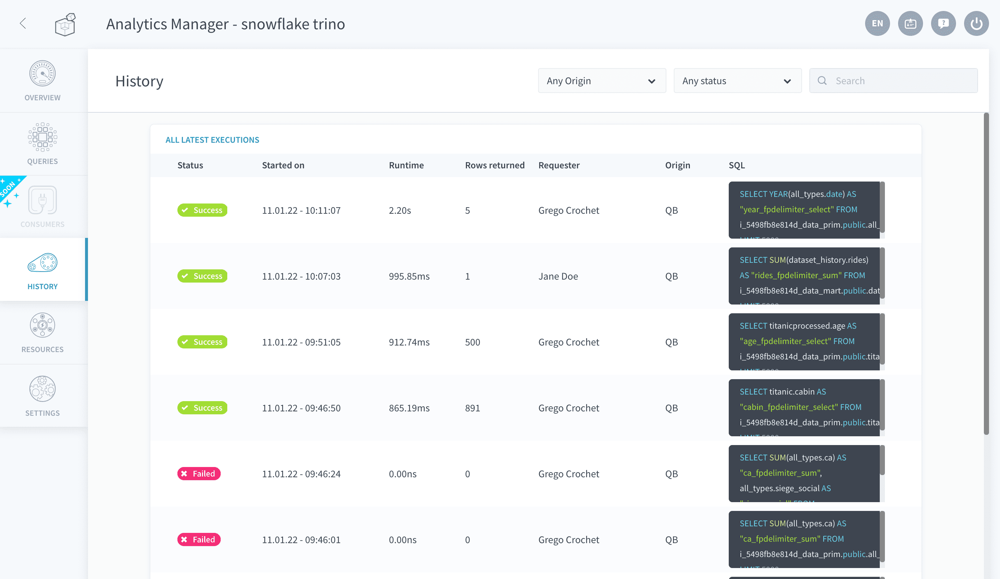

# History

The history tab allows you to see the list of the latest query executions such as:
- queries ran from the Analytics Manager interface
- queries passed on from an [API](/en/product/api-manager/index) (or an [application](/en/product/app-manager/index))
- queries executed on the fly in the [Lakehouse Manager Explorer](/en/product/lakehouse-manager/explorer/index)

A *SQL* column is displayed to show the **actual query string executed by the Analytics Manager** behind the scenes. This query is automatically converted from the original query written by the user (either in [SQL](/en/product/am/queries/sql?id=write-queries-in-the-sql-editor) or using the [visual builder](/en/product/am/queries/visual)) which usually has a much simpler syntax. Typically, the Analytics Manager will automatically:
- append engine/database/schema information when necessary to route the query to the correct [data source](/en/product/data-catalog/sources/index) or [storage engine](/en/product/project/storage-engine/index) 
- replace the [virtual attributes](/en/product/lakehouse-manager/attributes/index?id=virtual-attributes) with their corresponding SQL definition

> It is necessary to activate a [query engine](/en/product/am/resources) in order to see the query history.

---
###  Need help? 🆘

> At any step, you can create a ticket to raise an incident or if you need support at the [OVHcloud Help Centre](https://help.ovhcloud.com/csm/fr-home?id=csm_index). Additionally, you can ask for support by reaching out to us on the Data Platform Channel within the [Discord Server](https://discord.com/channels/850031577277792286/1163465539981672559). There is a step-by-step guide in the [support](/en/support/index.md) section.