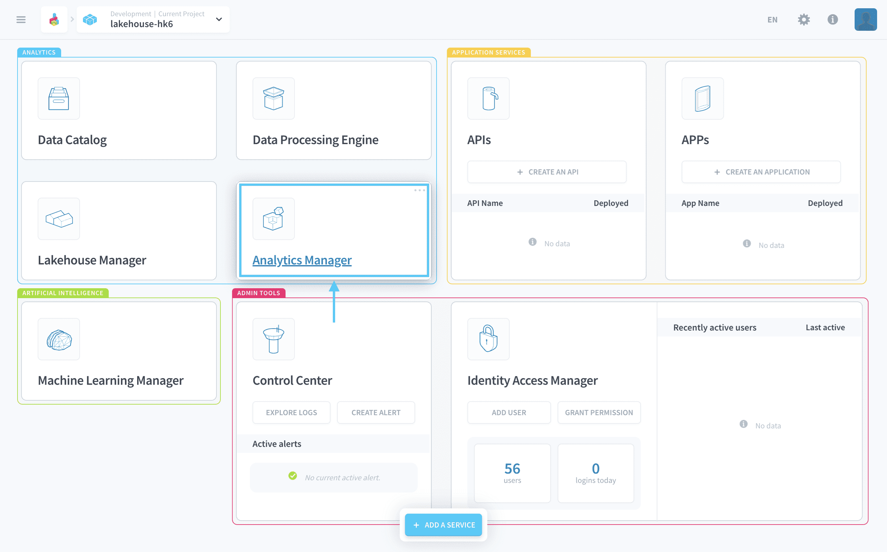

# Analytics Manager

The Analytics Manager is a **modern and fast center for data visualization** in your Project, using state-of-the-art cloud native engines made for Big Data. Easily query your [tables](/en/product/lakehouse-manager/tables/index) and visualize them into graphs and analytics, using either a no-code builder or a SQL editor.

---
## Component Overview

The Analytics Manager acts as a central keystone of your Project where data engineers and scientists meet analysts and front-end developers. 

It's the center point where you typically:
* [Query data from the Lakehouse Manager](/en/product/am/queries/index) by abstracting the schema and the query language
* Explore and visualize through [dashboards](/en/product/am/dashboards/index), or plugged-in [external consumers](/en/product/am/consumers/index) like Power BI.
* Expose the queried data through live API endpoints, thanks to the direct integration with the [API manager](/en/product/api-manager/index)
* View [complete execution log history](/en/product/am/history) of query executions, and [scale resources](/en/product/am/resources) linked to their queries for enhanced performances

### Manage queries
Queries are the base building blocks of your analytics system. On the platform, you can save and version queries to visualize insights from your data. 

{Learn how to manage queries}(#/en/product/am/queries/index)

### Manage dashboards
Dashboards are the a fast and flexible data visualization tool. Assemble saved queries on a single page to report on your key metrics to your end-users.

{Learn how to create dashboards}(#/en/product/am/dashboards/index)

### Monitor history
Monitor closely your queries executions and their performances thanks to the query history and metrics.

{Learn how to monitor the query history}(#/en/product/am/history)

### Connect external BI consumers
Consumers allow you to connect external analytics tools to your Project and build reports and dashboards using softwares that you are familiar with. 

{Learn how to manage consumers}(#/en/product/am/consumers/index)

### Manage resources
The Analytics Manager is powered by a query engine, which you can choose to activate or not. The query engine can be scaled horizontally and vertically to accelerate your queries and analytics. 

{Learn how to manage querying resources}(#/en/product/am/resources)

### Manage other settings
Manage your repositories and the cache of the Analytics Manager from the settings page.

{Discover the other settings}(#/en/product/am/settings)

---
###  Need help? 🆘

> At any step, you can create a ticket to raise an incident or if you need support at the [OVHcloud Help Centre](https://help.ovhcloud.com/csm/fr-home?id=csm_index). Additionally, you can ask for support by reaching out to us on the Data Platform Channel within the [Discord Server](https://discord.com/channels/850031577277792286/1163465539981672559). There is a step-by-step guide in the [support](/en/support/index.md) section.

---
## What's next?

If you feel ready to start developing your front-end application, check-out the API & APP managers!

{Configure APIs for your analytics application}(#/en/product/api-manager/index.md)