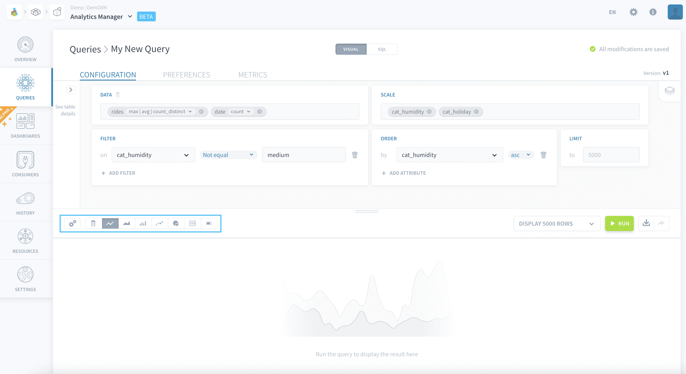
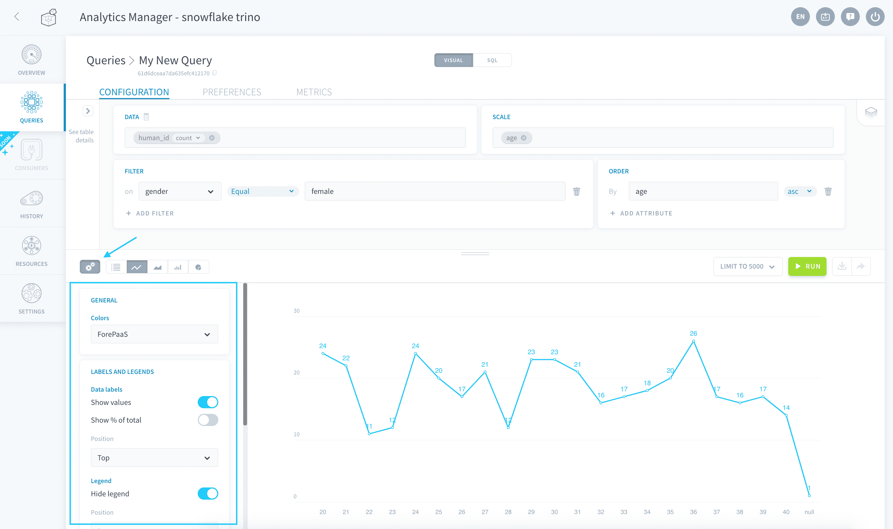
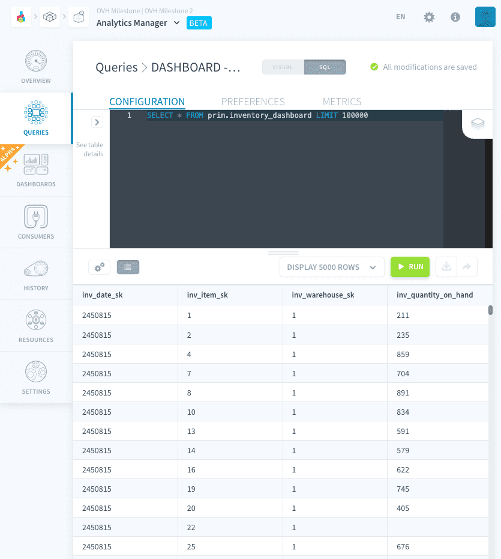
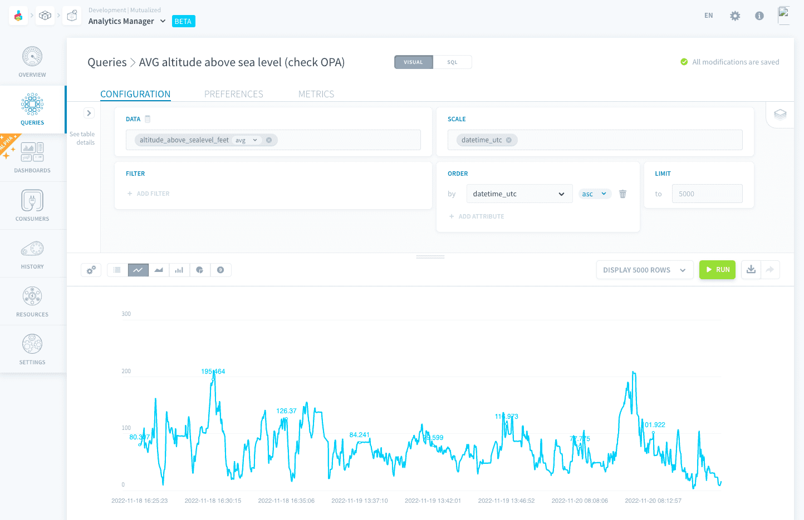
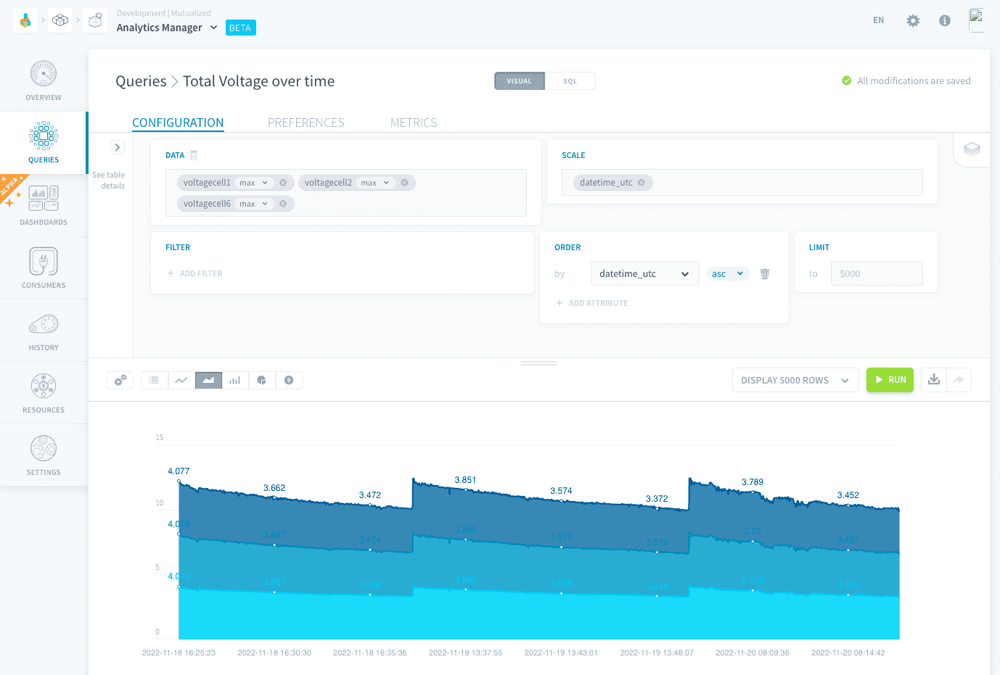
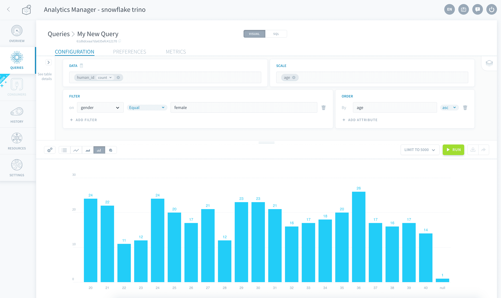
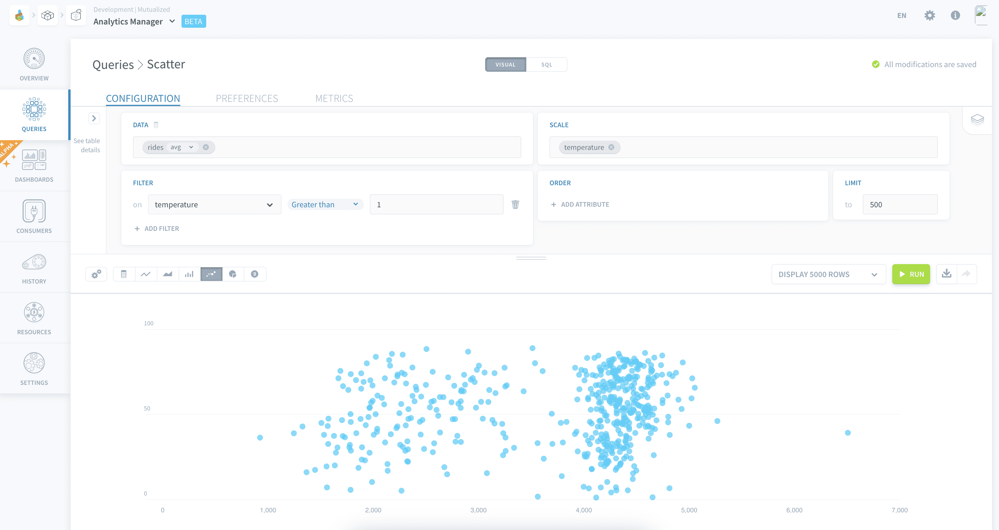
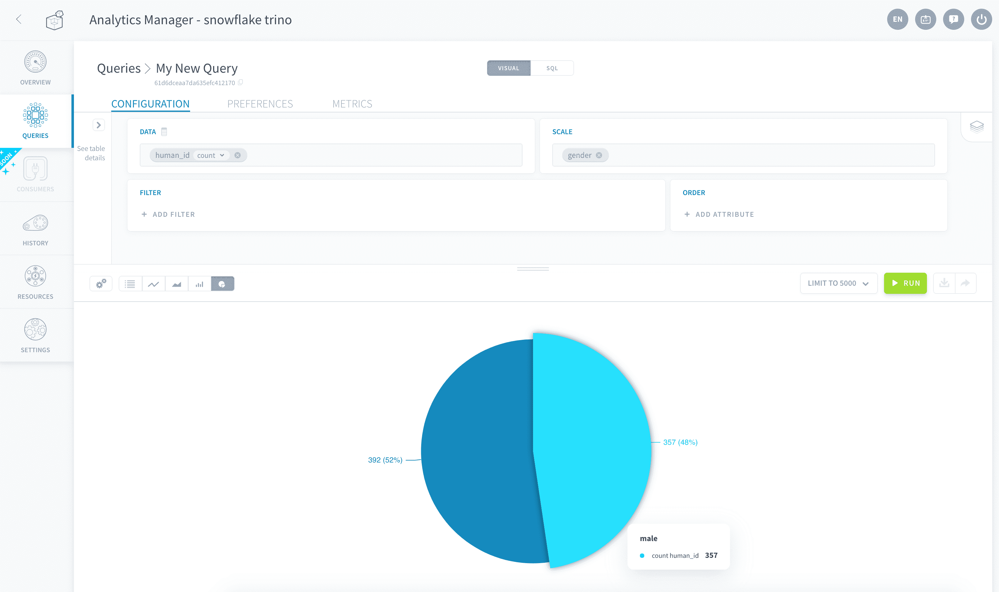
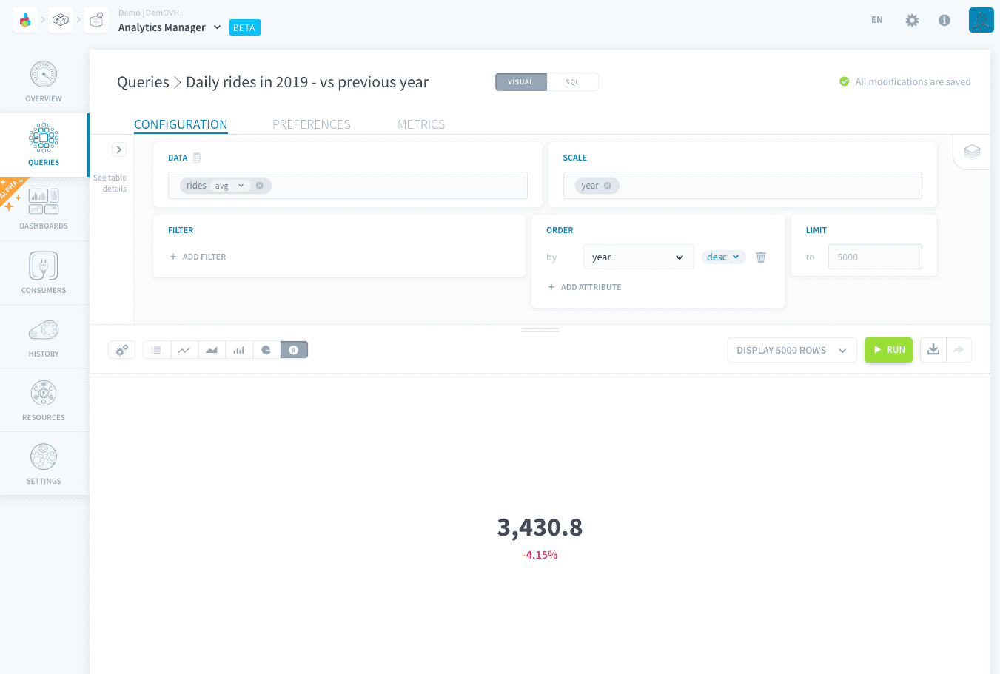
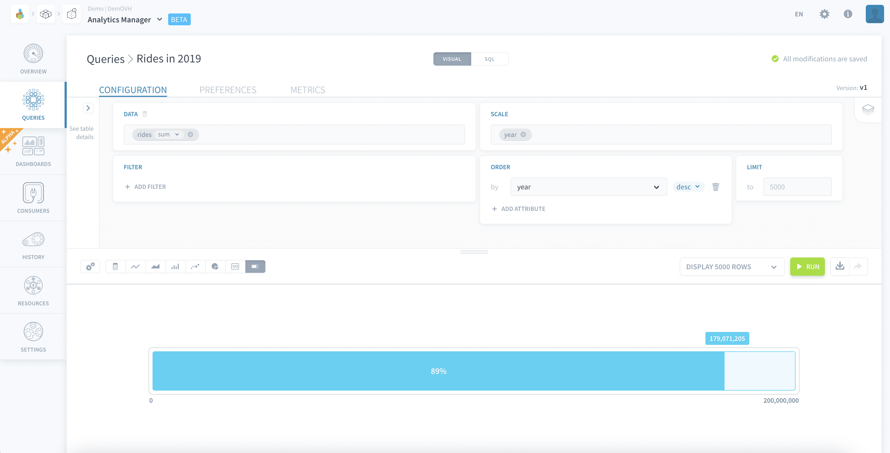

# Visualize a query as a chart

By default, all queries that are executed are displayed in the interface in a table format. However, the Analytics Manager is able to **render it in a wide variety of chart types** to help you visualize trends and insights in your data. 

!> At the moment, only queries executed through the [visual mode](/en/product/am/queries/visual) can be viewed as charts. Queries executed through the [SQL mode](/en/product/am/queries/sql) can only return results in table format.

> All queries that are executed through the [visual mode](/en/product/am/queries/visual) return the results as a DBMS-agnostic JSON object. 

Choose the type of chart you want to use in the bottom part of the interface.

The visual aspects of all charts can be configured by clicking on the **gear icon**. 

Each chart can be individually rendered using a specific color scheme set in the chart settings. However, a chart rendered in a dashboard will use the dashboard's color palette.

The following charts are available for visualization:
- [Table](#use-a-table)
- [Line chart](#use-a-line-chart)
- [Area chart](#use-an-area-chart)
- [Bar chart](#use-a-bar-chart)
- [Scatterplot](#use-a-scatterplot)
- [Pie chart](#use-a-pie-chart)
- [Metric](#use-a-metric)
- [Gauge chart](#use-a-gauge-chart)

---
## Use a table

Table is the default visualization mode for queries. It allows to get a complete view of the data results at once and easily compare figures. Create one by clicking the **table icon**.

---
## Use a line chart

Line charts are great to visualize trends over time in your data. Create one by clicking the **line icon**.

### Chart settings
#### Labels and legends
- **Show values**: display the raw value for each data point on the graph
- **Show % of total**: display the percentage share of each data point's value compared to the line's total
- **Data labels position**: the position of each data point's label
- **Hide legend**: hide the legend from the chart
- **Legend position**: position of the legend on the chart

#### Axis
- **Regroup by**: choose which attributes from the query to regroup the X-axis by (e.g. regroup values first by year, then by month -- or vice-versa). If multiple attributes are selected, it will use combinations of X values 
- **X-axis/Y-axis scale**: choose an option among:
  - Category: the axis will assume its values are categorical
  - Time: the axis will assume it is a time series (requires *Datetime*-type attributes)
  - Linear: the axis will be linear (requires *Numeric*-type attributes). You can override the automatically-detected minimum and maximum.
  - Logarithmic: the axis will be logarithmic (requires *Numeric*-type attributes). You can override the automatically-detected minimum and maximum.
- **Show grid values**: show the grid labels for this axis

---
## Use an area chart

Area charts are perfect to compare trends of multiple related metrics over time. Create one by clicking the **area icon**.

### Chart settings
#### General
- **Display stacked**: if multiple area charts are plotted, display them stacked instead of overlapping

#### Labels and legends
- The options are identical to that of the [line chart](#use-a-line-chart).

#### Axis
- The options are identical to that of the [line chart](#use-a-line-chart).

---
## Use a bar chart

Use bar charts to visualize categorical or nominal data easily. Create one by clicking the **bar icon**.

### Chart settings
#### General
- **Display stacked**: if multiple bar charts are plotted, display them stacked instead of next to each other.
- **Orientation**: display the bars oriented either vertically or horizontally

#### Labels and legends
- The options are identical to that of the [line chart](#use-a-line-chart).

#### Axis
- The options are identical to that of the [line chart](#use-a-line-chart).

---
## Use a scatterplot

Use scatterplots to visualize the correlation between two metrics, each represented on an axis. Create one by clicking the **scatterplot icon**.

Each row in your result table will be plotted as a dot at the intersection of the two dimensions which have been assigned to each axis. 

### Chart settings
#### General
- **Display trend line**: plots a linear regression for each of the scatterplots displayed

#### Labels and legends
- The options are identical to that of the [line chart](#use-a-line-chart).

#### Axis
- **X-axis / Y-axis attribute**: choose the query's attribute to be represented on the X and Y axes. 
- **Display axis name**: display the name of the attribute represented on this axis
- The other axis options are identical to that of the [line chart](#use-a-line-chart).

---
## Use a pie chart

Pie charts work best to show relative proportions and percentages of categorical data, especially when the number of categories doesn't exceed 5-6. Create one by clicking the **pie icon**.

It is only possible to display one single [Data](/en/product/am/queries/visual?id=configure-the-field-data) attribute on a pie chart. If you query has multiple *Data* attributes, only the first one will be plotted.

If your query has multiple [Scale](/en/product/am/queries/visual?id=configure-the-field-scale) attributes, each slice of the pie chart will represent one combination of *Scale* attributes' values.

### Chart settings
#### General
- **Display as a donut**: displays the chart as a donut chart instead of a whole pie chart

#### Labels and legends
- The options are identical to that of the [line chart](#use-a-line-chart).

---
## Use a metric

Metrics displayed as single big numbers are handy if you want to display multiple KPIs in a dashboard. Create one by clicking the **number icon**.

Only the first cell (first row of first column) **among the [Data](/en/product/am/queries/visual?id=configure-the-field-data) attributes** of your results table will be displayed as the big metric.  
If your query returns more than one row or one column, those will be ignored unless you want to display the metric's evolutions or dimensions (see chart settings below).

### Chart settings
#### General
- **Compare**: displays the evolution of the metric vs. the second row of data (of first *Data* attribute still), i.e. the cell right below the metric in the results table
  - **Display as a percentage**: displays this evolution as a percentage rather than the raw number
  - **Switch colors for positive/negative evolutions**: if activated, positive evolutions will now be displayed in red and negative evolutions will be displayed in green
- **Display dimensions**: this will display the corresponding values of the first [Scale](/en/product/am/queries/visual?id=configure-the-field-scale) attribute, if present in your query. If your query has multiple *Scale* attributes, the others will be ignored

---
## Use a gauge chart

Visualize KPIs as a gauge chart if you want to see how far they are from reaching a specified target. Create one by clicking the **gauge icon**.

The metric displayed has identical requirements to that of the [Metric](#use-a-metric) chart type: only the first cell (first row of first column) **among the [Data](/en/product/am/queries/visual?id=configure-the-field-data) attributes** of your results table will be displayed as the big metric.  

This value must be a numeric for the gauge chart to work.

### Chart settings
#### General
- **Target**: enter the target for the gauge chart

---
###  Need help? 🆘

> At any step, you can create a ticket to raise an incident or if you need support at the [OVHcloud Help Centre](https://help.ovhcloud.com/csm/fr-home?id=csm_index). Additionally, you can ask for support by reaching out to us on the Data Platform Channel within the [Discord Server](https://discord.com/channels/850031577277792286/1163465539981672559). There is a step-by-step guide in the [support](/en/support/index.md) section.