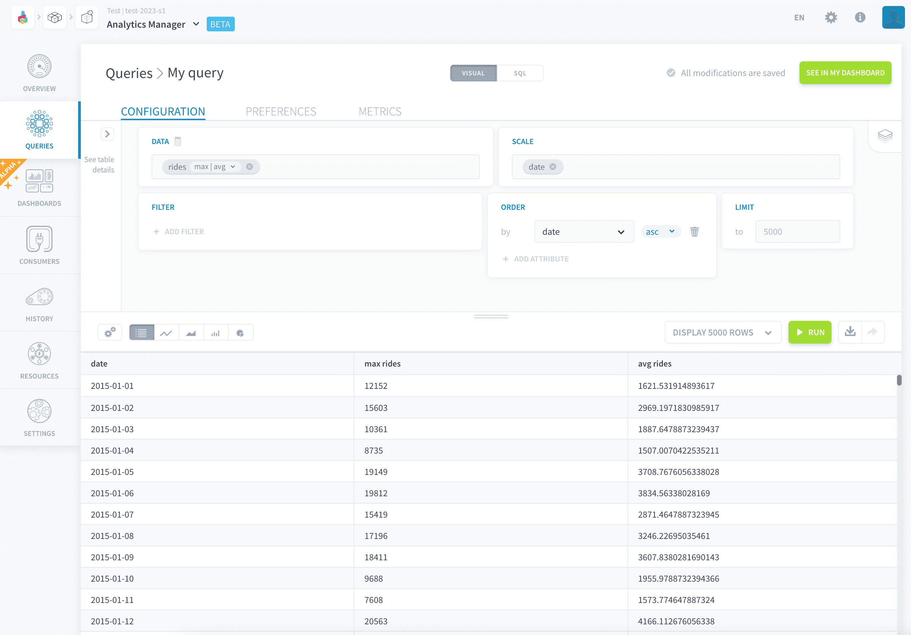
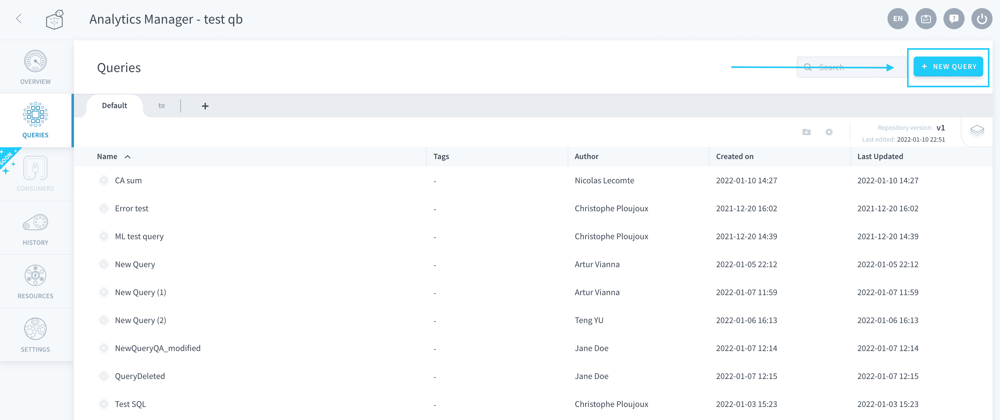
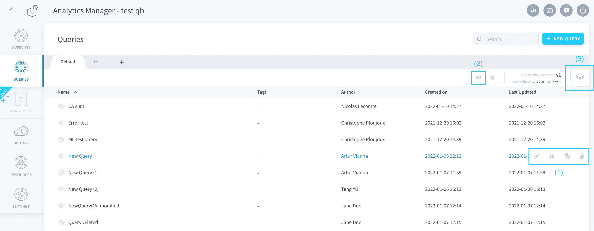

# Queries

The core feature of the Analytics Manager is to provide versioned queries, which can be **run on the fly or used in** [**dashboards**](/en/product/am/dashboards/index) **or** [**front-end applications**](/en/product/app-manager/index). Queries thus constitute the first step of structuring your data and displaying it to the outside world.

You can create, view, organize or execute queries and manage which [versions](/en/product/am/queries/index.md?id=manage-existing-queries)
to deploy. Queries are stored and organized into *repositories*. 

You can drill down on **execution performance metrics and KPI** for your queries, to easily optimize your analytics system. Further, **create API endpoints** to expose the data to the Platform apps or external applications in one click.

- [Create queries](#create-queries)
- [Manage existing queries](#manage-existing-queries)
 - [Versioning queries](#versioning-queries) 
- [Discover the design philosophy behind queries](#discover-the-design-philosophy-behind-queries)

---
## Create queries
In the Analytics Manager, there are several interfaces to create and execute queries.

* The [visual builder](/en/product/am/queries/visual) lets you discover insights through an array of data visualizations in a simple point-and-click environment.
* The [SQL editor](/en/product/am/queries/sql) lets you write ANSI SQL queries to explore your data freely.

Click on **New query** to create a new query. It will be using the *visual builder* interface by default.

 

{Learn how to do a query with the no-code builder}(#/en/product/am/queries/visual)

---
## Manage existing queries
From the queries tab you can:
* Create, delete or edit (1) queries 
* Duplicate (1) queries 
* Organize (2) your queries in folders 
* Manage the [version](/en/product/am/queries/index?id=versioning-queries) (3) of the repository 

 

### Versioning queries

When you are trying to iterate on existing queries, it is best to create several **versions** of the query. This lets you incrementally introduce variations to experiment and test your work, while **keeping the version in production always intact**.

This versioning happens through **repositories**, which regroup both queries and [dashboards](/en/product/am/dashboards/index). Each repository can have multiple versions of the code (queries + dashboards) they contain:
- For queries it is the query parameters (or SQL), as well as default visualization options
- For dashboards it is just their layout, filters and other minor overrides (like the color palette)

Repositories all have a *deployed version*, which is the version served when one of the queries is called in any downstream process (API, apps, etc.), or opened via a dashboard.

They also have an *active version*, which is the version currently being edited through the editor panel.
* If your repository only has one version, the active version is the same as the deployed version, which means that you are editing your queries in production.
* If your repository has two versions or more, the deployed version cannot be edited. It can be viewed in read-only mode.

> It is no longer possible to version an individual query directly. All versions are now at the level of the repository.

?> Repositories allow compartmentalizing your queries into different sections, but more than this, they can be linked to a Git repository *(coming soon!)* 💡

---
## Discover the design philosophy behind queries

Since the release of its first version on the Platform, the query builder - the component behind the Analytics Manager which orchestrates the query execution - has kept a simple design philosophy: **where flexibility meets automation**.

### Need of flexible data models

The more complex a BI Project becomes, the more important it is to understand the data schema and each of its attributes. 

A data lake / data warehouse in the [Lakehouse Manager](/en/product/lakehouse-manager/index) may change over time, which could be because of:
* Addition of new data sources (resulting in new business KPIs)
* Changes and optimizations made to the data schemas
* Addition, deletion, or modification of aggregate tables or repositories

The Lakehouse Manager (in charge of the schema structure containing the attributes, thus defines where and how to execute the queries, so that the people in charge of developing restitution interfaces (front-end) and APIs do not have to worry about it. ⭐

### Automated multi-base query engine
To meet the above needs, the Analytics Manager leverages an [agnostic multi-base engine](/en/product/am/resources), which can request your data model in SQL no matter the underlying storage engine or schema. 

When you create a query using the visual point-and-click interface, you don't have to specify the table names.The Platform will **automatically choose the most suitable table** by performing those steps:

1. Check all the attributes needed to perform your query (and translate the virtual attributes into required attributes as well to append to this required list).
2. Check all candidate tables that possess all required attributes (excluding the non-queryable tables).
3. Select the table that has fewer rows.

?> While the Platform provides you the above flexibility, you can always override the automatically-chosen tables and force the table to query.

---
###  Need help? 🆘

> At any step, you can create a ticket to raise an incident or if you need support at the [OVHcloud Help Centre](https://help.ovhcloud.com/csm/fr-home?id=csm_index). Additionally, you can ask for support by reaching out to us on the Data Platform Channel within the [Discord Server](https://discord.com/channels/850031577277792286/1163465539981672559). There is a step-by-step guide in the [support](/en/support/index.md) section.
