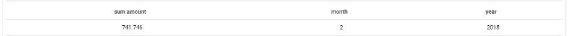

# 'Filter' query parameter

This parameter is used to apply filters to the selected values that the query is expected to return. Filters are particularly useful to prevent nulls or unlabeled values to be displayed or taken into account.

## List of filter options

Below is the list of all filter options available:
* *in* - Value contained in reference list.
* *not_in* - Value not contained in reference list.
* *between* - Value is between 2 extrema. 
* *not_between* - Value is not between 2 extrema. 
* *equal* - Value is equal to reference. 
* *not_equal*  - Value is not equal to reference. 
* *like*  - Substring of value is contained in another reference value. 
* *not_like*  - Substring of value is not contained in another reference value.
* *is_null* - Value is null. 
* *is_not_null*  - Value is not null.
* *gt* (>) - Value is greater than a reference.
* *gte* (> =) - Value is greater than & equal to a reference value.
* *lt* (>)  - Value is lower than a reference value.
* *lte* (<=) - Value is lower than & equal to a reference value.

## Simple example

Let's assume that we are now looking to display the turnover only on the month of January of the year 2018.

```json
 {
  "data": {
    "fields": {
      "amount": [
        "sum"
      ]
    }
  },
  "scale": {
    "fields": []
  },
  "filter": {
    "month": [
      1
    ],
    "year": [
      2018
    ]
  },
  "order": {}
}
```

> To apply filters on numerical values, just fill the JSON without the quotes. For non-numeric values, you will need to use "" around the value. For instance, "filter": {"date": ["2018-01-01"]}.

If we were looking to display the total revenue between 2 dates say February 1st and February 28th, we would simply use a between filter:

```json
 {
  "data": {
    "fields": {
      "amount": [
        "sum"
      ],
      "month": [
        "select"
      ],
      "year": [
        "select"
      ]
    }
  },
  "scale": {
    "fields": []
  },
  "filter": {
    "date": {
      "between": [
        "2018-02-01",
        "2018-02-28"
      ]
    }
  },
  "order": {}
}
```


---

{Discover all other parameters}(#/en/product/query-builder/queries/parameters/others.md)