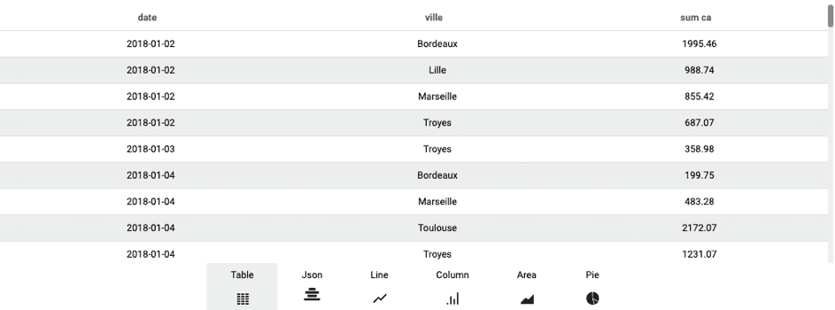
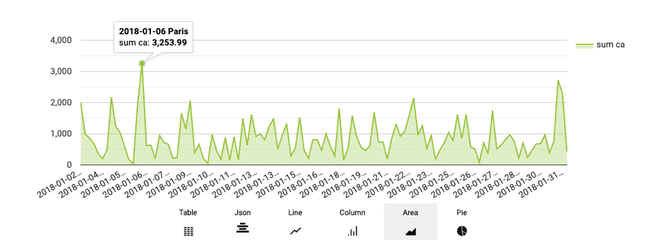
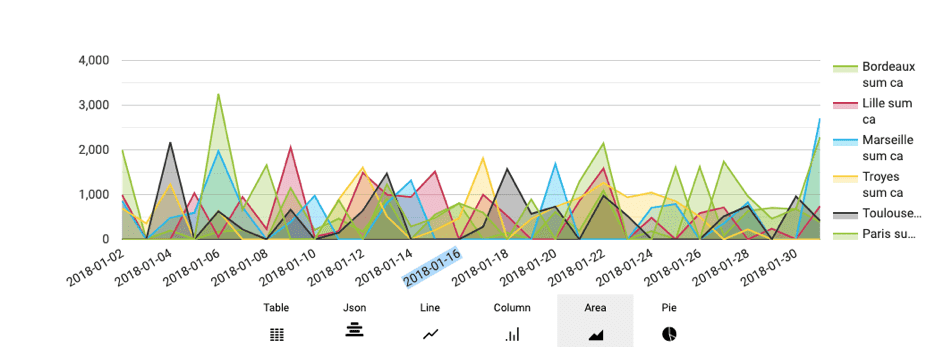

# 'Scale' query parameter

Many **query parameters can be fine tuned using sub-parameters**. In this article we will see the main usage of the *scale* parameter and then explore how to leverage the 'scales' using the *axis* sub-parameter.

---

## Using the 'scale' parameter

This parameter is used to regroup the values of an attribute ("measure") according to another attribute ("dimension"). 

For instance displaying the revenue amount per month or the revenue amount per store. You can simply add as much scale as possible by adding attributes in the scale parameters. 

Let's assume that we are trying to calculate the total revenue per month. The corresponding JSON is:

```json
 {
  "data": {
    "fields": {
      "amount": [
        "sum"
      ]
    }
  },
  "scale": {
    "fields": [
      "month"
    ]
  },
  "filter": {},
  "order": {}
}
```
> Note that the query will display one line per combination of unique values of the attributes used as scale, and therefore can rapidly increase the weight of the query's output value. Using 5 scales with each 5 different values, will yield 3125 combinations.

---

## Using the 'axis' sub-parameter 

When you make a query split on different dimensions, some graphics will not have the desired rendering.

Let's take for example this query:

```json
 {
  "data": {
    "fields": {
      "ca": [
        "sum"
      ]
    }
  },
  "scale": {
    "fields": [
      "date",
      "city"
    ]
  }
}
```

From the "Editor" screen of your Query Builder, you'll get different renderings:


The "Table" one looks good, but when you go to "Area":

 
The chart creates a bar for each "city - date" combination, which is the default mode. This graph, and most of the default graphs provided by ForePaaS, offer a cutout via an "axis" system, allowing to cut out this rendering differently.

Take the query again and add the field "scale.axis":

```json
 {
  "data": {
    "fields": {
      "ca": [
        "sum"
      ]
    }
  },
  "scale": {
    "fields": [
      "date",
      "city"
    ],
    "axis":{
        "x":["date"],
        "y":["city"]
    }
  }
}
```

The "x" axis will always correspond to the default field.
The "y" axis differs according to the type of graph and the library used, in the most common case, it will cut the data into separate series.

This gives you a new rendering: 


---

{Apply filters to your queries}(#/en/product/query-builder/queries/parameters/filter.md)