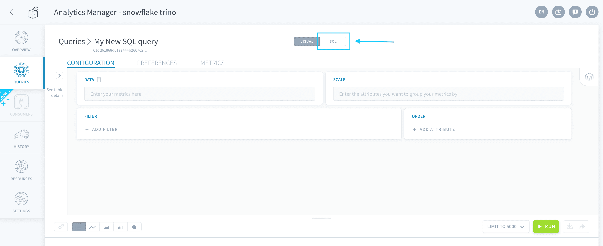
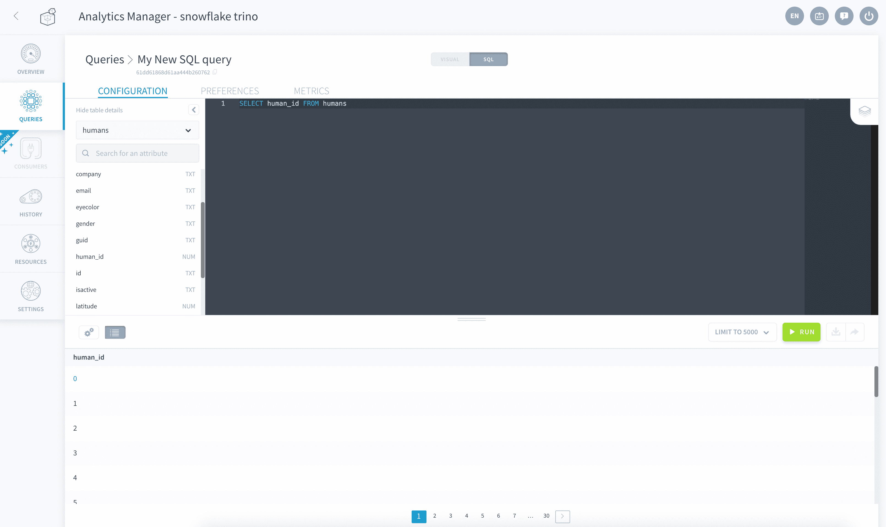
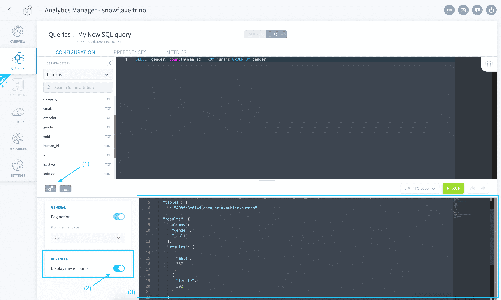

# Use the SQL editor

The Analytics Manager SQL editor lets you use [SQL](https://en.wikipedia.org/wiki/SQL) to write query statements on either your databases, or [directly on sources](#query-data-sources-directly). SQL queries can join data located on multiple different [storage engines](/en/product/project/storage-engine/index) or [sources](/en/product/data-catalog/sources/index).

To use the SQL editor, click on **SQL** in the header of a query.

!> After you switch a query to the SQL mode, it is impossible to switch it back to the visual mode.

> It is necessary to activate a [query engine](/en/product/am/resources) in order to create and run SQL queries in the Analytics Manager.



At the moment, SQL editor can only return results in table format. It cannot be used for charts.

* [Write queries in the SQL editor](#write-queries-in-the-sql-editor)
  * [Query stored databases](#query-stored-databases)
  * [Query data sources directly](#query-data-sources-directly)
* [Discover the response format](#discover-the-response-format)

---
## Write queries in the SQL editor

The SQL editor only supports statements written in ANSI-compliant SQL syntax, that start with a *SELECT* clause.



### Query stored databases

To query data stored in your Project's tables, use standard SQL statements to refer to the attributes and tables you want to select:

To reference **a table**, simply use its name as entered in the [Lakehouse Manager](/en/product/lakehouse-manager/tables/index). 

```sql
SELECT * FROM my_table
```

To reference **an attribute**, simply use its name as entered in the [Lakehouse Manager](/en/product/lakehouse-manager/attributes/index).

```sql
SELECT my_attribute FROM my_table
```

You can use the widget on the left of the screen to find and copy the exact name of tables and attributes.

### Query data sources directly

The Analytics Manager can execute queries on your connected data sources [with Direct Query mode activated](/en/product/data-catalog/sources/index?id=make-your-data-source-directly-queryable), without importing the data on ForePaaS.

To reference **a table** from a source, use the *technical name* of the source as entered in the [Data Catalog](/en/product/data-catalog/sources/index) preceded by `db_{projectID}_` and followed by a dot, followed by the *schema* for this data source (usually the schema name or database name from your connector), followed by a dot, followed by the *name of the table/object* at it is in the source. 

```sql
SELECT * FROM  db_lcibesgk_my_mongodb_source.database_name.my_table
```

To reference **an attribute**, simply use the name it has in the source object.

```sql
SELECT my_attribute FROM db_lcibesgk_my_mongodb_source.database_name.my_table
```

?> If the source object's name doesn't also exist in the [Lakehouse Manager Tables](/en/product/lakehouse-manager/tables/index), **you can simply reference it by name** (as if it was stored in the Platform database). However, if there is a table with the same name in the platform, it is necessary to write the *source technical name* and the *schema* as explained.

---
## Discover the response format

When a query is executed through the SQL mode, the results are returned using the following compact format.

```
[
      [
        "Google",
        501.16340892465297
      ],
      [
        "Facebook",
        512.5209205642168
      ],
      [
        "Snapchat",
        494.96303030302937
      ],
      [
        "Pied Piper",
        492.7505523255817
      ]
]

```


To view the raw response sent by the Analytics Manager when your query is executed, click on the **gear icon** and activate *Display raw response*.



---
## Need help? 🆘

> At any step, you can create a ticket to raise an incident or if you need support at the [OVHcloud Help Centre](https://help.ovhcloud.com/csm/fr-home?id=csm_index). Additionally, you can ask for support by reaching out to us on the Data Platform Channel within the [Discord Server](https://discord.com/channels/850031577277792286/1163465539981672559). There is a step-by-step guide in the [support](/en/support/index.md) section.