# Use the visual builder

The visual builder offers a **generic way to query stored information** using a specific proprietary framework built on top of open-source [query engines](/en/product/am/resources). 

Queries are created by populating the 4 following fields with **attributes** from your [Lakehouse Manager](/en/product/lakehouse-manager/index):
- [Data](#configure-the-field-data): the measures that you want to aggregate
- [Scale](#configure-the-field-scale): the dimensions by which you want to group your data
- [Filter](#configure-the-field-filter): to filter the results of your query
- [Order](#configure-the-field-order): to sort the results of your query

In addition, you can set a *limit* to the number of rows returned by the interface by using the widget next to the Run button. This limit will not be saved in the query for downstream processes (APIs and apps).

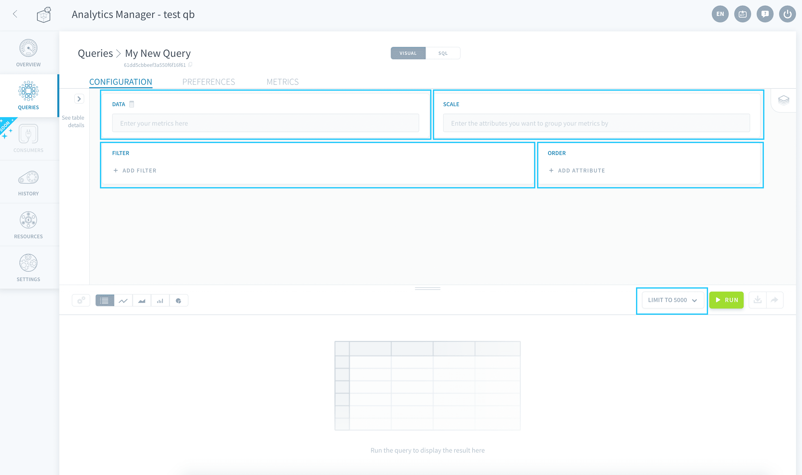

{Learn how to configure a query}(#configure-the-field-data)


### How does it work?

Let's assume for instance that the people in charge of developing visualization dashboards want to display a turnover curve (attribute: *income*) by date (attribute: *date*).

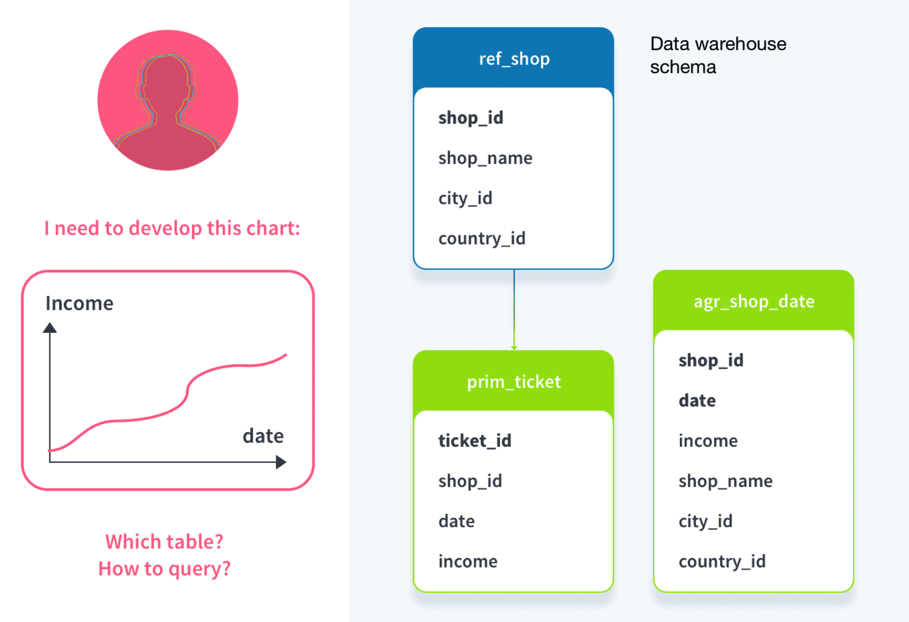

1. The visual builder interface can be used to specify the data to display (***data***: *income*), and the metric with which to group this data by (***scale***: *date*).  
2. At this point the builder automatically determines which table is the most appropriate for the query - the **smallest to contain all required attributes**. In the example, "agr_shop_date", which is a table with income data aggregated by dates, will be selected and queried.

?> The visual builder does not ask you to specify a table. This ensures that your Project can scale easily in time as the storage system you use for your data varies (nature, amount of information stored, data warehouse schema, etc.)

3. Finally the results are sent back to the user as a [light-weight, DBMS-agnostic JSON object](#discover-the-response-format).

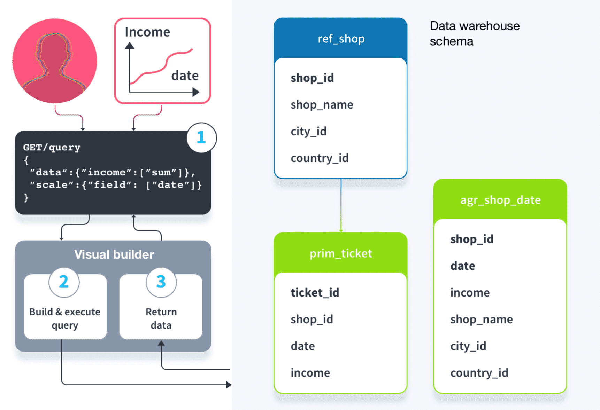


---
## Configure the field Data

In the field *Data* enter the **attributes that you want to display**. It is possible to aggregate the data to display, using [simple aggregation functions](#aggregation-functions). 

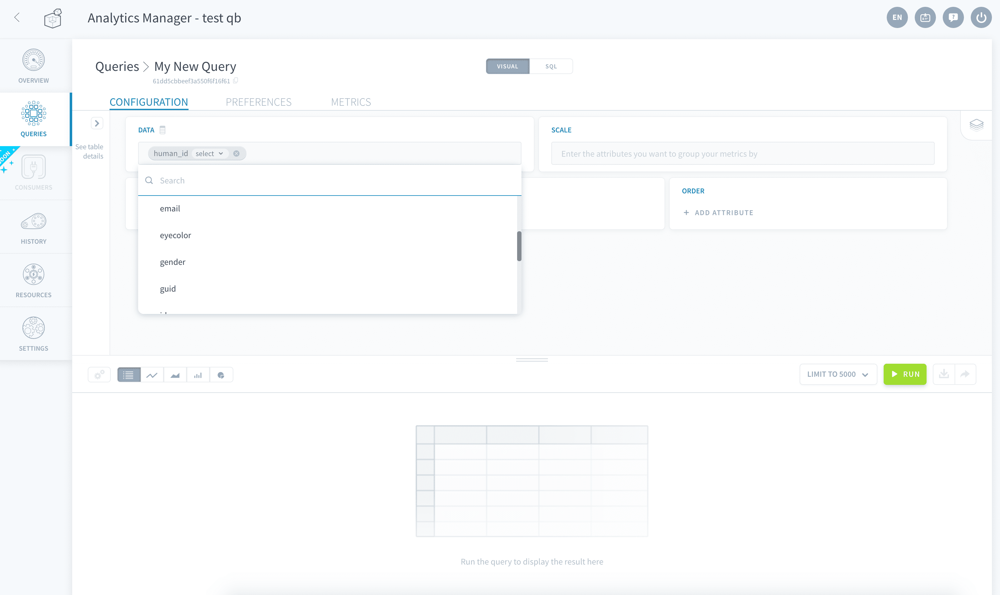

You can add as many attributes as you want as long as they exist in the same table, otherwise an error will be returned. The list of available attributes in the interface is automatically filtered to only display the other available attributes.

You [don't need to specify the table](#choice-of-table). Use the widget to the left of the screen to get metadata about the tables and attributes you want to query.

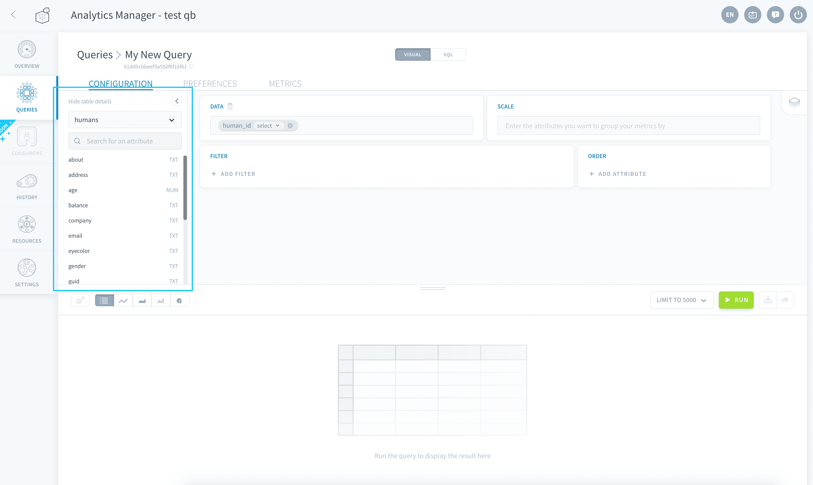


### Aggregation functions

- **SELECT**: The *SELECT* function simply displays the value of the selected attribute. It will select the first value of the list if several values are returned. 
- **SUM**: The *SUM* function is used to calculate the total sum of the values of an attribute. 
- **COUNT**: The *COUNT* function is used to count the number of occurrences returned by the query. 
- **COUNT DISTINCT**: The *COUNT DISTINCT* function is used to count the unique different values of an attribute.
- **MIN & MAX**: The *MIN* & *MAX* functions are used to display the minimum and maximum values of an attribute. 
- **SELECT DISTINCT**: The *SELECT DISTINCT* function is used to display the unique different values of an attribute.
- **AVG**: The *AVG* function is used to calculate the arithmetic average of an attribute.


### Choice of table

The visual builder does not ask you to specify a table. By default,the Platform determines the table that is the most fit for the query: it is the table containing all attributes in the data, scale, filter and order fields which has the least amount of rows.

If you want the query to be forced on a specific table, you can always override the system-automatically-chosen tables and select your own by clicking the **table icon** next to *Data*. 

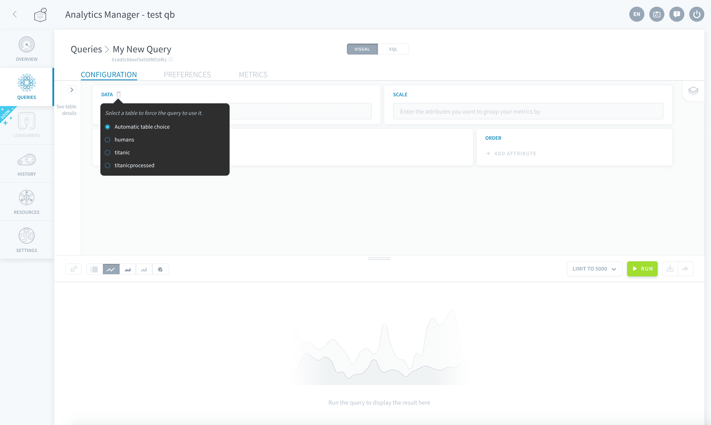

> Forcing the queried table can come in handy when certain attribute names (such as "date") are common to a large number of tables. However, it is not a good practice as the Analytics Manager is designed to fetch the data using an optimal path to reduce runtime.

---
## Configure the field Scale

In the field *Scale*, enter the attributes (usually dimensions) that you want to **group your [Data](#configure-the-field-data) attributes (usually measures) by**. 

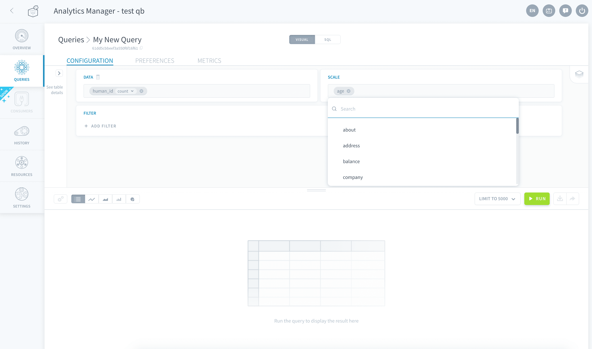

> An example of use case is if the query needs to return the revenue amount per month or the revenue amount per store. 

You can add as many attributes as you want as long as they exist in the same table, otherwise an error will be returned. The list of available attributes in the interface is automatically filtered to only display the other available attributes.

---
## Configure the field Filter

This parameter is used to apply filters to the values that the query is expected to return. 

> Filters are particularly useful to prevent nulls or unlabeled values to be displayed or taken into account.

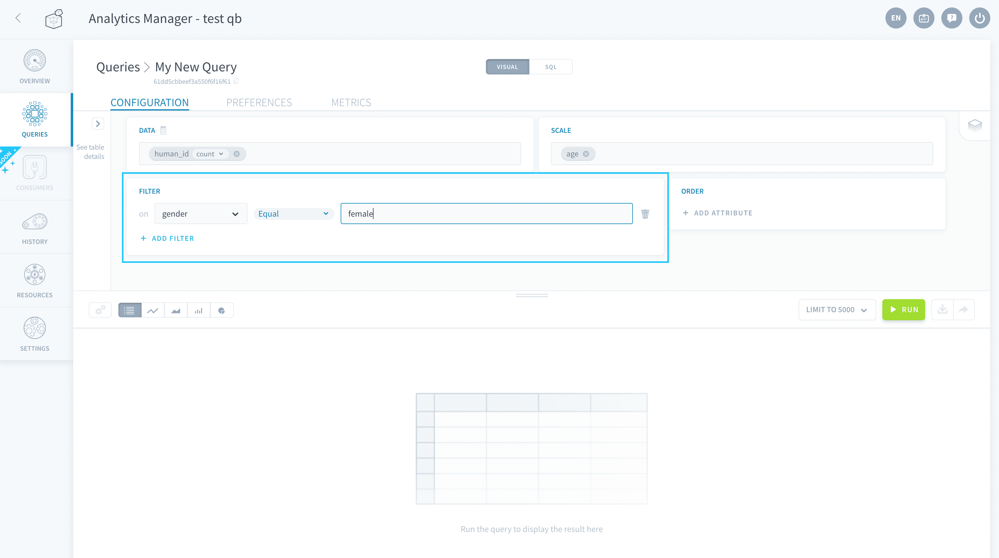

Enter the reference values for **string-datatype** filters as is, without the _" "_ around the string. Enter the reference values for **numeric-datatype** filters as is too.

?> Use the widget panel _"See table details"_ to the left of the screen to check the type of the attributes to use as filters.

Below is the list of all filter options available:
* *Equal* - Value is equal to reference. 
* *Not equal*  - Value is not equal to reference. 
* *In* - Value contained in reference list (press Enter to add a value to the list).
* *Not In* - Value not contained in reference list (press Enter to add a value to the list).
* *Greater than* (>) - Value is greater than a reference.
* *Greater than equal* (> =) - Value is greater than or equal to a reference value.
* *Lower than* (>)  - Value is lower than a reference value.
* *Lower than equal* (<=) - Value is lower than or equal to a reference value.
* *Between* - Value is between 2 values. 
* *Not between* - Value is not between 2 values. 
* *Null* - Value is null. 
* *Not null*  - Value is not null.
* *Like*  - Substring of value is contained in reference value (formatted using [SQL LIKE syntax](https://sql.sh/cours/where/like)).
* *Not like*  - Substring of value is not contained in another reference value (formatted using [SQL LIKE syntax](https://sql.sh/cours/where/like)).


---
## Configure the field Order

This parameter is used to order the results returned by the query based on the order of values of one or more fields, in ascending or descending order.

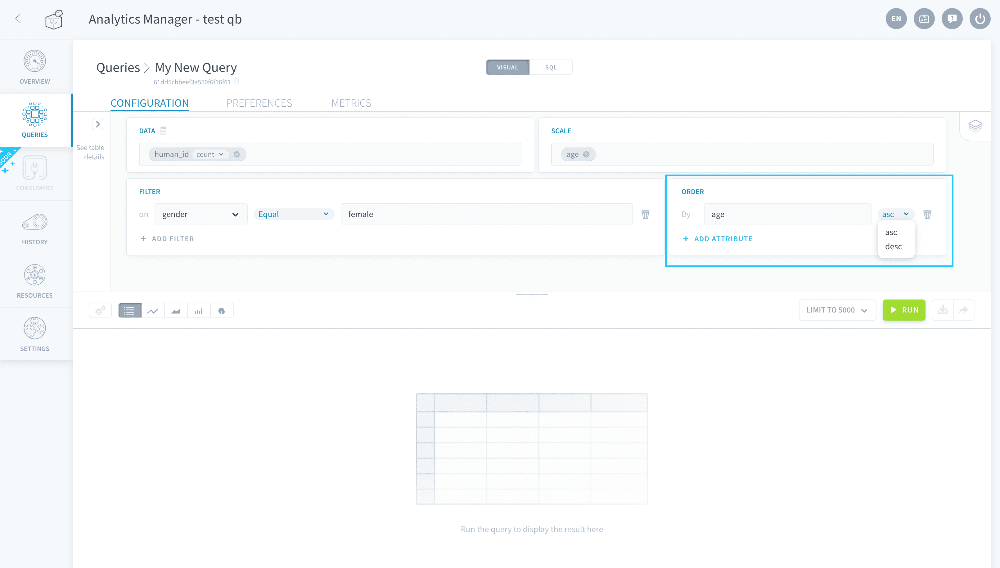

?> Attributes in the [Scale](#configure-the-field-scale) field are not added to the *Order* field by default, in order to optimize runtimes.


---
## Discover the response format

When a query is executed through the visual mode, the results are returned using the following format.

```json
[
    {
      "scales": {
        "company": "Snapchat"
      },
      "data": {
        "sales": {
          "avg": [
            {
              "company": "Snapchat",
              "value": 494.96303030302937
            }
          ]
        }
      }
    },
    {
      "scales": {
        "company": "Pied Piper"
      },
      "data": {
        "sales": {
          "avg": [
            {
              "company": "Pied Piper",
              "value": 492.7505523255817
            }
          ]
        }
      }
    },
    {
      "scales": {
        "company": "Google"
      },
      "data": {
        "sales": {
          "avg": [
            {
              "company": "Google",
              "value": 501.16340892465297
            }
          ]
        }
      }
    },
    {
      "scales": {
        "company": "Facebook"
      },
      "data": {
        "sales": {
          "avg": [
            {
              "company": "Facebook",
              "value": 512.5209205642168
            }
          ]
        }
      }
    }
]
```


To view the raw response sent by the Analytics Manager when your query is executed, visualize the results as a table. Then click on the **gear icon** and activate *Display raw response*.

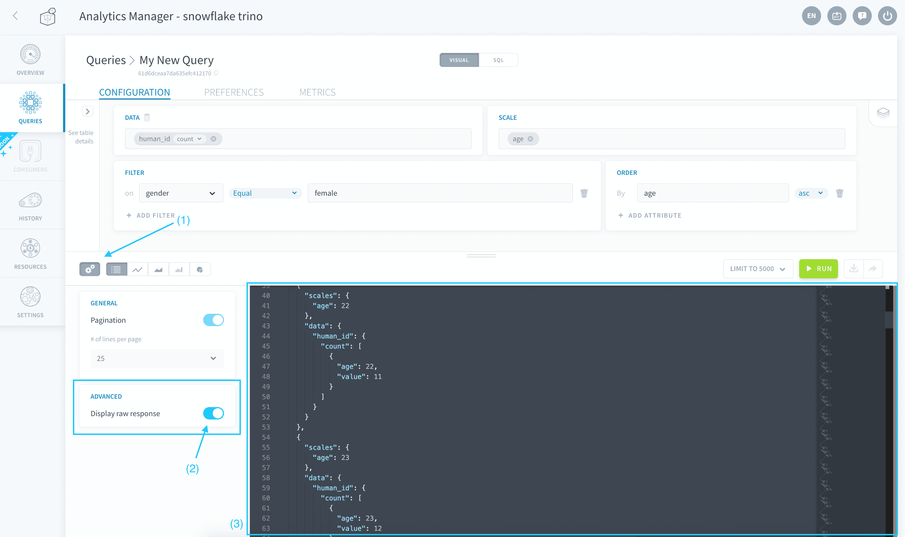

Finally, it is possible to export the query results in various different formats (such as a .csv, copying tab-separated values, etc.) by clicking on the **Download** button next to the Run button.

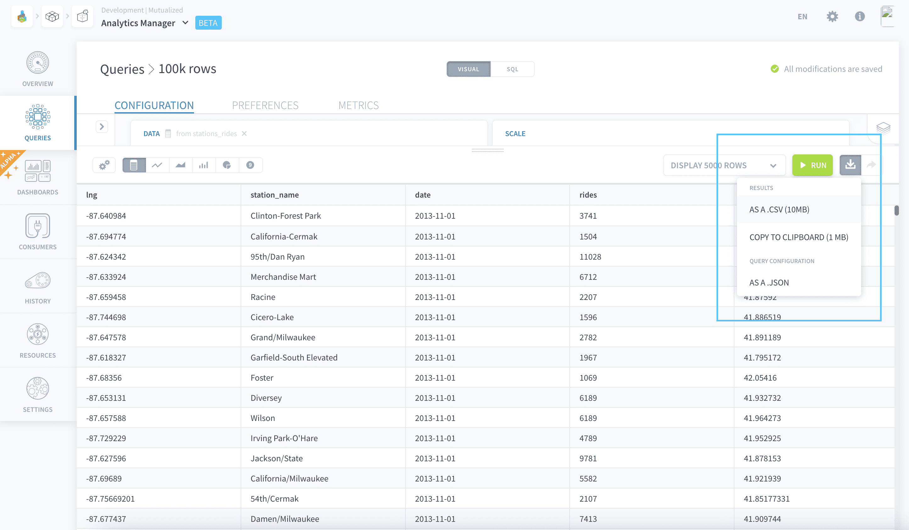


---
## Need help? 🆘

> At any step, you can create a ticket to raise an incident or if you need support at the [OVHcloud Help Centre](https://help.ovhcloud.com/csm/fr-home?id=csm_index). Additionally, you can ask for support by reaching out to us on the Data Platform Channel within the [Discord Server](https://discord.com/channels/850031577277792286/1163465539981672559). There is a step-by-step guide in the [support](/en/support/index.md) section.