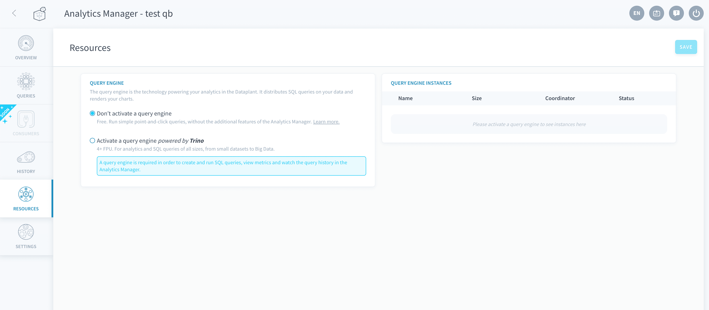
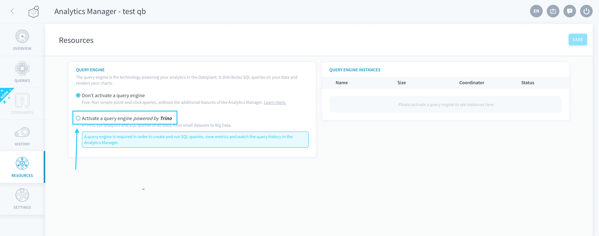
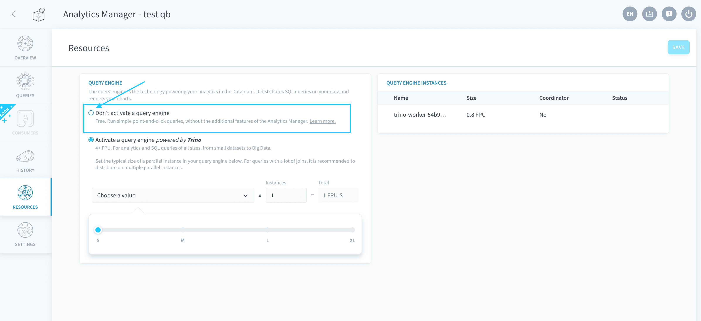
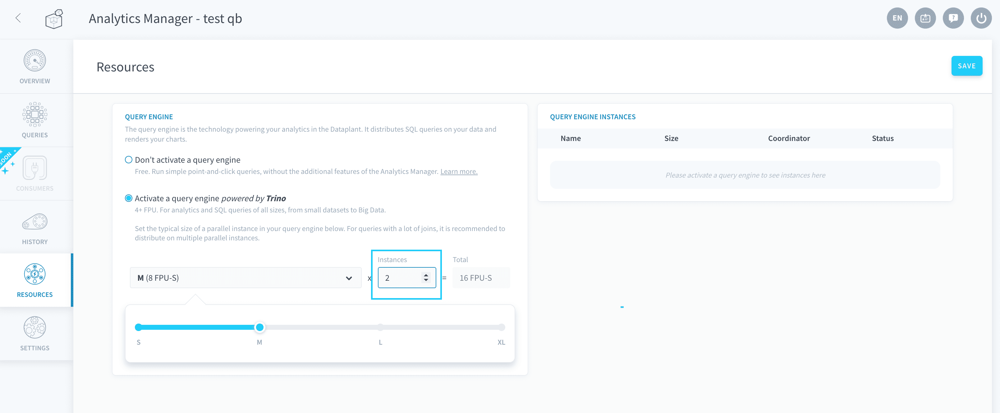
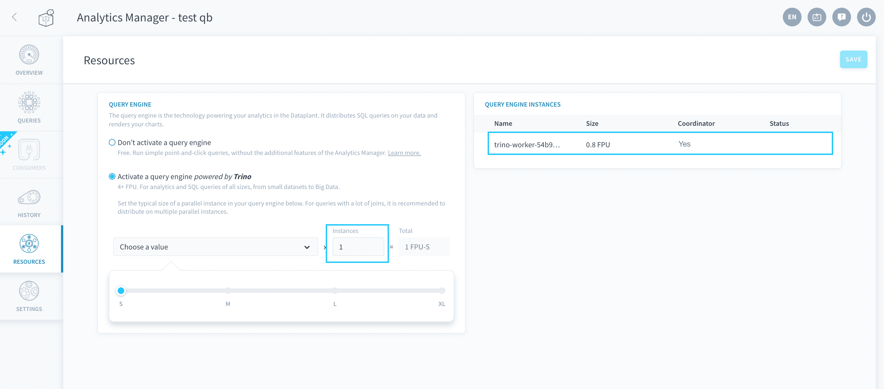
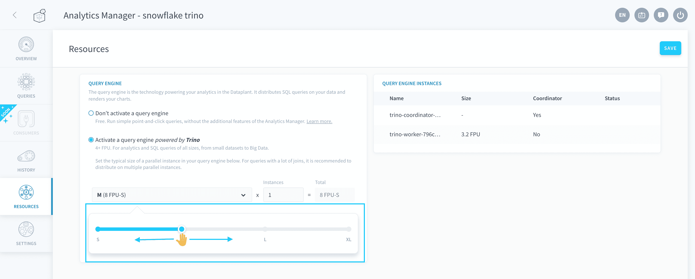
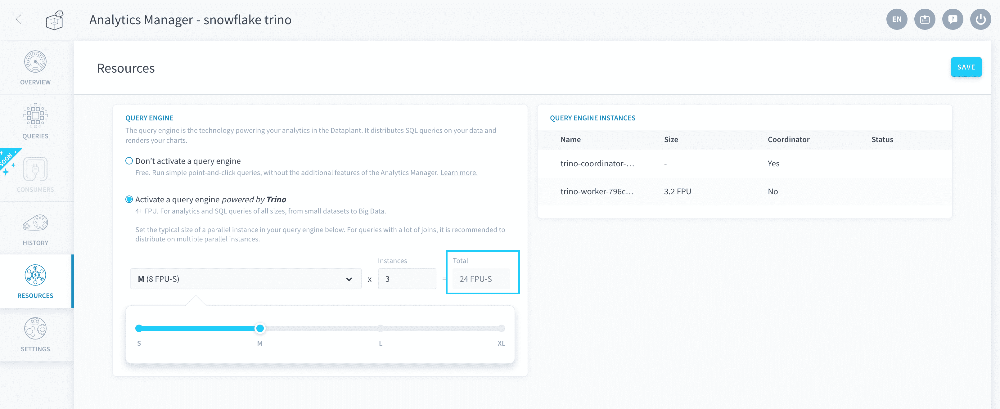

# Resources

The resources tab allows you to manage the **query engine** of your Project, i.e. the technology powering SQL analytics in the Project. 

It executes queries on one or several [storage engines](/en/product/project/storage-engine/index), and is able to distribute the query processing on multiple worker instances. 

You can activate one query engine per Project, in order to use the advanced features of the Analytics Manager.

- [Manage the query engine](#manage-the-query-engine)
 - [No query engine](#no-query-engine)
 - [Activate a query engine](#activate-a-query-engine)
 - [Deactivate a query engine](#deactivate-a-query-engine)
- [Manage instances](#manage-instances)

---
## Manage the query engine

### No query engine

By default, newly created Projects have **no query engine activated**. You can activate it manually on the resources page.

Without a query engine activated, you can still do the following:
- Create and run queries using the [visual mode](/en/product/am/queries/visual), on a single [storage engine](/en/product/project/storage-engine/index)
- Deploy and use [applications in the App Manager](/en/product/app-manager/index)
- [Connect](/en/technical/sdk/dpe/index?id=the-connect-module) to your data from a [Data Processing Engine](/en/product/dpe/index) action.
- Connect to the [storage engine](/en/product/project/storage-engine/index) directly from outside the Project  - *coming soon!* 

However, it is impossible to do the following without a query engine:
- Create and run queries using the [SQL mode](/en/product/am/queries/sql) 
- Query (and join) data spread on multiple [storage engines](/en/product/project/storage-engine/index), or even on [directly queryable sources](/en/product/data-catalog/sources/index?id=make-your-data-source-directly-queryable)
- Create [dashboards](/en/product/am/dashboards/index)
- View the query [history](/en/product/am/history) and detailed query execution metrics
- Implement fine-grained [permissions](/en/product/iam/users/roles) on the tables and access to the data they contain - *coming soon!*

### Activate a query engine

You can manually activate a query engine in your Project by selecting *Activate a query engine*. The activation generally takes a few seconds.

A query engine on the Platform is a [Trino](https://trino.io/) cluster that provides the flexibility of working with multiple storage engines, and further gives you much-improved efficiency while working with large datasets thanks to query parallelization. 

### Deactivate a query engine

!> It is strongly advised **not** to deactivate the query engine if you have deployed applications or if you have any queries running in production. 

You can manually deactivate a query engine in your Project by selecting *Don't activate a query engine*.

Your query engine will be shutdown gracefully within a few minutes and you will no longer be able to use the [features](/en/product/am/resources?id=no-query-engine) that come with it. 

---
## Manage instances

You can manage the number of parallel worker instances within a Trino cluster. There will also always be a coordinator, which distributes queries in the cluster.

If you only have one instance in your cluster, the coordinator will also be a worker.

You can also scale your query engine vertically and allocate **more computing power** to it by increasing the number of [the platform Units](/en/product/billing/resources/index) (DPU) of each instance. The DPU is a unit of general processing capability, representing access to approximately *1 CPU* and *2 GB of RAM*, based on hardware availability. 

> A Trino query engine cannot be smaller than 4 DPU.

Use the slider to set the desired DPU size of each parallel worker instance. 

?> If your queries use a lot of joins, it is recommended to distribute them on multiple parallel instances - and if your datasets are really big, it is recommended to scale up the number of DPU vertically.

The final total amount of DPU allocated to a Trino cluster is the number of parallel worker instances times the DPU size of each.

> You do not need to manage the size of the coordinator as it is done automatically by the Platform based on the number of instances. You are not invoiced for the computing power usage of the coordinator, only the usage of workers is invoiced.

---

###  Need help? 🆘

> At any step, you can create a ticket to raise an incident or if you need support at the [OVHcloud Help Centre](https://help.ovhcloud.com/csm/fr-home?id=csm_index). Additionally, you can ask for support by reaching out to us on the Data Platform Channel within the [Discord Server](https://discord.com/channels/850031577277792286/1163465539981672559). There is a step-by-step guide in the [support](/en/support/index.md) section.
