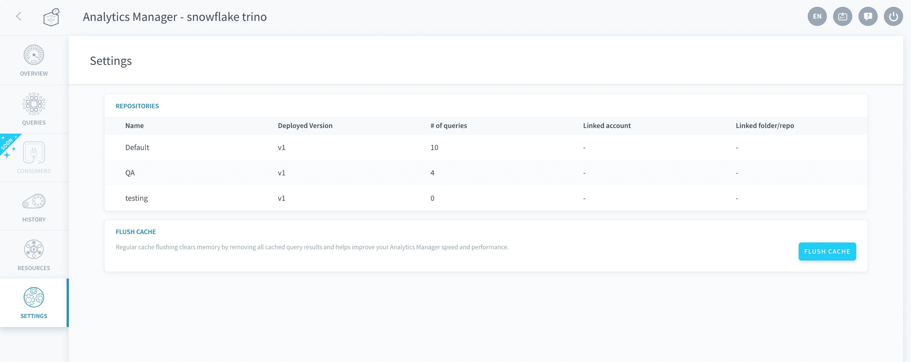

# Settings

The settings tab allows you to manage your Analytics Manager [repositories](/en/product/am/settings?id=repositories) and [cache](/en/product/am/settings?id=flush-cache).

---
## Repositories

The *Repositories* panel gives a broad overview of each of your query repositories, allowing not only a quick overview of each one, but also the means to edit each repository such as changing the linked Git account *(coming soon!)*.

---
## Flush Cache

The Analytics Manager has a cache on executed queries. 

The *flush cache* button provides you the simplicity of getting rid of unnecessary blocked memory because of various queries results or cache metadata and lets you work with improved speed and performance.

